# 哲学基础理论 (Philosophical Foundation)

## 🎯 **概述**

哲学基础理论是形式科学体系的理论根基，为整个知识体系提供认识论、本体论、方法论和价值论的基础支撑。

## 📋 **目录结构**

### 1. 认识论基础 (Epistemological Foundation)

- **1.1_Knowledge_Theory/**
  - 1.1.1 知识本质论
  - 1.1.2 知识来源论
  - 1.1.3 知识确证论
  - 1.1.4 知识结构论
  - 1.1.5 知识界限论

### 2. 本体论基础 (Ontological Foundation)

- **1.2_Ontological_Foundation/**
  - 1.2.1 存在本质论
  - 1.2.2 实体属性论
  - 1.2.3 关系结构论
  - 1.2.4 模态存在论
  - 1.2.5 信息本体论

### 3. 方法论基础 (Methodological Foundation)

- **1.3_Methodological_Foundation/**
  - 1.3.1 理性方法论
  - 1.3.2 经验方法论
  - 1.3.3 形式化方法
  - 1.3.4 系统方法论
  - 1.3.5 批判方法论

### 4. 价值论基础 (Axiological Foundation)

- **1.4_Axiological_Foundation/**
  - 1.4.1 价值本质论
  - 1.4.2 价值类型论
  - 1.4.3 价值判断论
  - 1.4.4 价值冲突论
  - 1.4.5 价值实现论

### 5. 科学哲学基础 (Philosophy of Science Foundation)

- **1.5_Philosophy_of_Science/**
  - 1.5.1 科学本质论
  - 1.5.2 科学方法论
  - 1.5.3 科学实在论
  - 1.5.4 科学解释论
  - 1.5.5 科学进步论

## 🔗 **快速导航**

### 按主题分类

- [认识论基础](1.1_Knowledge_Theory/README.md)
- [本体论基础](1.2_Ontological_Foundation/README.md)
- [方法论基础](1.3_Methodological_Foundation/README.md)
- [价值论基础](1.4_Axiological_Foundation/README.md)
- [科学哲学基础](1.5_Philosophy_of_Science/README.md)

### 按层次分类

- **基础层**: 认识论、本体论
- **方法层**: 方法论、科学哲学
- **价值层**: 价值论、伦理基础

## 📊 **哲学基础理论图谱**

```mermaid
graph TB
    A[哲学基础理论] --> B[认识论基础]
    A --> C[本体论基础]
    A --> D[方法论基础]
    A --> E[价值论基础]
    A --> F[科学哲学基础]
    
    B --> B1[知识本质论]
    B --> B2[知识来源论]
    B --> B3[知识确证论]
    B --> B4[知识结构论]
    B --> B5[知识界限论]
    
    C --> C1[存在本质论]
    C --> C2[实体属性论]
    C --> C3[关系结构论]
    C --> C4[模态存在论]
    C --> C5[信息本体论]
    
    D --> D1[理性方法论]
    D --> D2[经验方法论]
    D --> D3[形式化方法]
    D --> D4[系统方法论]
    D --> D5[批判方法论]
    
    E --> E1[价值本质论]
    E --> E2[价值类型论]
    E --> E3[价值判断论]
    E --> E4[价值冲突论]
    E --> E5[价值实现论]
    
    F --> F1[科学本质论]
    F --> F2[科学方法论]
    F --> F3[科学实在论]
    F --> F4[科学解释论]
    F --> F5[科学进步论]
```

## 🎯 **重构原则**

### 1. 形式化规范

- 严格的逻辑符号和公式
- 完整的论证过程
- 规范的定理定义

### 2. 多表征方式

- 文字描述
- 逻辑公式
- 图表说明
- 代码示例

### 3. 一致性保证

- 术语一致性
- 符号一致性
- 逻辑一致性
- 引用一致性

### 4. 系统性组织

- 层次化结构
- 模块化设计
- 交叉引用
- 索引导航

## 📈 **进度跟踪**

### 已完成模块

- [x] 目录结构设计
- [x] 导航系统构建
- [x] 理论框架建立

### 进行中模块

- [ ] 认识论基础重构
- [ ] 本体论基础重构
- [ ] 方法论基础重构

### 待完成模块

- [ ] 价值论基础重构
- [ ] 科学哲学基础重构

## 🔄 **持续更新**

本文档将持续更新，反映哲学基础理论重构的进度和发展。

**最后更新时间**: 2024-12-20
**版本**: v1.0.0
**状态**: 进行中
