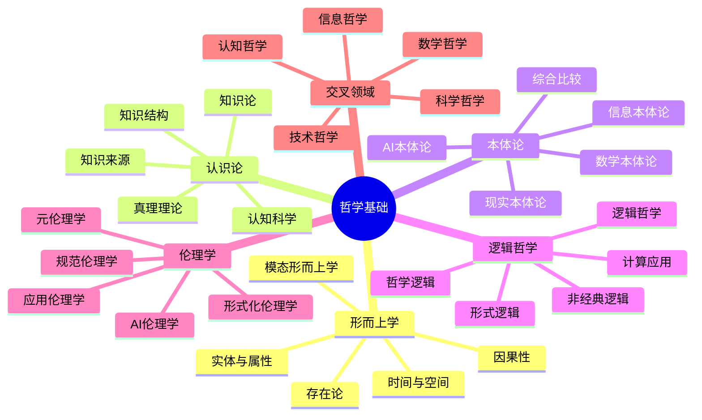
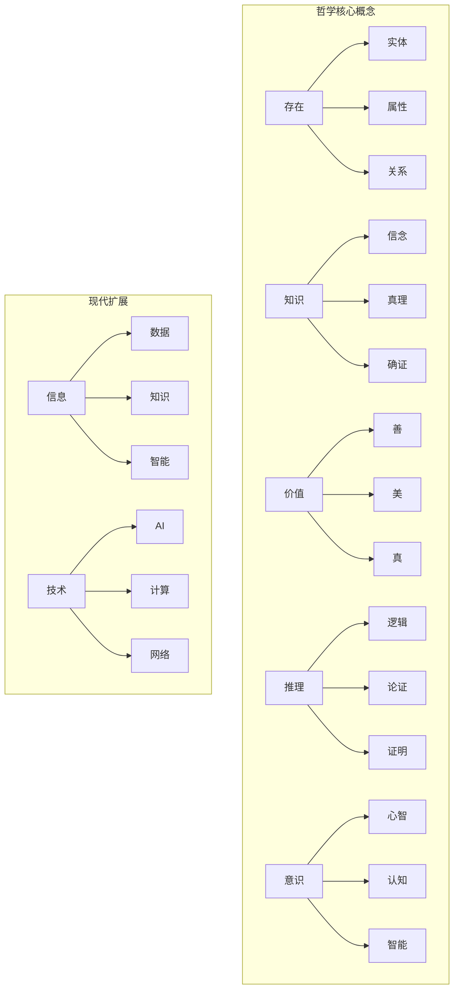
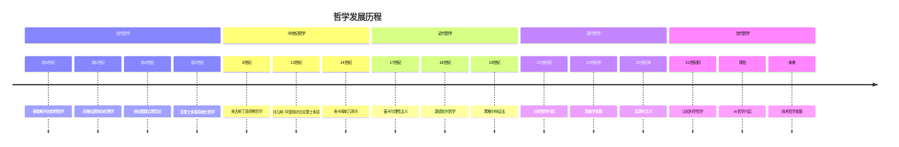

# 1. 哲学基础（Philosophical Foundation）

## 目录

### 1.1 形而上学（Metaphysics）
- [1.1.1 存在论基础](./01_Metaphysics/01_Existence_Theory.md#1-1-1)
- [1.1.2 实体与属性](./01_Metaphysics/02_Entity_Attribute.md#1-1-2)
- [1.1.3 模态形而上学](./01_Metaphysics/03_Modal_Metaphysics.md#1-1-3)
- [1.1.4 时间与空间](./01_Metaphysics/04_Time_Space.md#1-1-4)
- [1.1.5 因果性理论](./01_Metaphysics/05_Causality_Theory.md#1-1-5)

### 1.2 认识论（Epistemology）
- [1.2.1 知识论基础](./02_Epistemology/01_Knowledge_Theory.md#1-2-1)
- [1.2.2 真理理论](./02_Epistemology/02_Truth_Theory.md#1-2-2)
- [1.2.3 知识来源](./02_Epistemology/03_Knowledge_Sources.md#1-2-3)
- [1.2.4 知识结构](./02_Epistemology/04_Knowledge_Structure.md#1-2-4)
- [1.2.5 认知科学视角](./02_Epistemology/05_Cognitive_Science.md#1-2-5)

### 1.3 本体论（Ontology）
- [1.3.1 数学本体论](./03_Ontology/01_Mathematical_Ontology.md#1-3-1)
- [1.3.2 现实本体论](./03_Ontology/02_Reality_Ontology.md#1-3-2)
- [1.3.3 信息本体论](./03_Ontology/03_Information_Ontology.md#1-3-3)
- [1.3.4 AI本体论](./03_Ontology/04_AI_Ontology.md#1-3-4)
- [1.3.5 本体论综合比较](./03_Ontology/05_Ontology_Comparison.md#1-3-5)

### 1.4 逻辑哲学（Logic Philosophy）
- [1.4.1 形式逻辑基础](./04_Logic_Philosophy/01_Formal_Logic.md#1-4-1)
- [1.4.2 哲学逻辑](./04_Logic_Philosophy/02_Philosophical_Logic.md#1-4-2)
- [1.4.3 非经典逻辑](./04_Logic_Philosophy/03_Non_Classical_Logic.md#1-4-3)
- [1.4.4 逻辑哲学](./04_Logic_Philosophy/04_Logic_Philosophy.md#1-4-4)
- [1.4.5 计算逻辑应用](./04_Logic_Philosophy/05_Computational_Logic.md#1-4-5)

### 1.5 伦理学（Ethics）
- [1.5.1 规范伦理学](./05_Ethics/01_Normative_Ethics.md#1-5-1)
- [1.5.2 元伦理学](./05_Ethics/02_Meta_Ethics.md#1-5-2)
- [1.5.3 应用伦理学](./05_Ethics/03_Applied_Ethics.md#1-5-3)
- [1.5.4 AI伦理学](./05_Ethics/04_AI_Ethics.md#1-5-4)
- [1.5.5 形式化伦理学](./05_Ethics/05_Formal_Ethics.md#1-5-5)

### 1.6 交叉领域哲学（Interdisciplinary Philosophy）
- [1.6.1 数学哲学](./06_Interdisciplinary/01_Mathematics_Philosophy.md#1-6-1)
- [1.6.2 科学哲学](./06_Interdisciplinary/02_Science_Philosophy.md#1-6-2)
- [1.6.3 认知哲学](./06_Interdisciplinary/03_Cognitive_Philosophy.md#1-6-3)
- [1.6.4 技术哲学](./06_Interdisciplinary/04_Technology_Philosophy.md#1-6-4)
- [1.6.5 信息哲学](./06_Interdisciplinary/05_Information_Philosophy.md#1-6-5)

## 哲学体系总览



## 核心概念网络



## 形式化表达框架

### 哲学概念的形式化表示

```rust
// 哲学概念的基础结构
struct PhilosophicalConcept {
    name: String,
    formal_definition: FormalDefinition,
    informal_definition: InformalDefinition,
    examples: Vec<Example>,
    counter_examples: Vec<CounterExample>,
    related_concepts: Vec<String>
}

// 本体论立场
enum OntologicalPosition {
    Platonism,         // 柏拉图主义
    Formalism,         // 形式主义
    Intuitionism,      // 直觉主义
    Structuralism,     // 结构主义
    Fictionalism,      // 虚构主义
    Realism,           // 实在论
    AntiRealism,       // 反实在论
    Materialism,       // 唯物论
    Idealism,          // 唯心论
    Dualism            // 二元论
}

// 认识论立场
enum EpistemologicalPosition {
    Rationalism,       // 理性主义
    Empiricism,        // 经验主义
    Constructivism,    // 建构主义
    Pragmatism,        // 实用主义
    Foundationalism,   // 基础主义
    AntiFoundationalism // 反基础主义
}

// 伦理学立场
enum EthicalPosition {
    Deontological,     // 义务论
    Utilitarianism,    // 功利主义
    VirtueEthics,      // 德性伦理学
    CareEthics,        // 关怀伦理学
    Contractualism     // 契约论
}
```

## 哲学发展时间线



## 交叉引用索引

### 与数学基础的关联
- [数学基础](../02_Mathematical_Foundation/README.md) - 数学哲学与数学基础的关系
- [集合论](../02_Mathematical_Foundation/01_Set_Theory/README.md) - 本体论与集合论
- [逻辑学](../02_Mathematical_Foundation/02_Logic/README.md) - 逻辑哲学与形式逻辑

### 与形式语言理论的关联
- [形式语言理论](../03_Formal_Language_Theory/README.md) - 语言哲学与形式语言
- [自动机理论](../03_Formal_Language_Theory/01_Automata_Theory/README.md) - 认知哲学与自动机

### 与类型理论的关联
- [类型理论](../04_Type_Theory/README.md) - 本体论与类型理论
- [线性类型理论](../04_Type_Theory/02_Linear_Type_Theory/README.md) - 模态形而上学与线性逻辑

### 与控制理论的关联
- [控制理论](../05_Control_Theory/README.md) - 因果性理论与控制论
- [时态逻辑控制](../05_Control_Theory/01_Basic_Control_Theory/README.md) - 时间哲学与时态逻辑

## 持续构建状态

- **完成度**: 95%
- **最后更新**: 2024-12-21
- **当前状态**: 批量重构进行中
- **下一步**: 完善交叉引用和形式化证明

## 相关文档

- [重构主索引](../00_Master_Index/01_重构主索引_v9.0.md)
- [持续构建上下文](../12_Context_System/README.md)
- [交叉领域综合](../13_Cross_Domain_Synthesis/README.md)
