# 哲学基础总览

**文档编号**: `PHIL-00-OVERVIEW`  
**创建时间**: 2024-12-21  
**最后更新**: 2024-12-21  
**版本**: 1.0  

## 目录

### 1. [本体论基础](./01_Ontology/)

- 1.1 [数学本体论](./01_Ontology/01_Mathematical_Ontology.md)
- 1.2 [现实本体论](./01_Ontology/02_Reality_Ontology.md)
- 1.3 [信息本体论](./01_Ontology/03_Information_Ontology.md)
- 1.4 [AI本体论](./01_Ontology/04_AI_Ontology.md)
- 1.5 [本体论比较分析](./01_Ontology/05_Ontology_Comparison.md)

### 2. [认识论基础](./02_Epistemology/)

- 2.1 [知识理论](./02_Epistemology/01_Knowledge_Theory.md)
- 2.2 [真理理论](./02_Epistemology/02_Truth_Theory.md)
- 2.3 [知识来源](./02_Epistemology/03_Sources_of_Knowledge.md)
- 2.4 [知识结构](./02_Epistemology/04_Structure_of_Knowledge.md)
- 2.5 [AI认识论](./02_Epistemology/05_AI_Epistemology.md)

### 3. [伦理学基础](./03_Ethics/)

- 3.1 [规范伦理学](./03_Ethics/01_Normative_Ethics.md)
- 3.2 [元伦理学](./03_Ethics/02_Meta_Ethics.md)
- 3.3 [应用伦理学](./03_Ethics/03_Applied_Ethics.md)
- 3.4 [形式化伦理学](./03_Ethics/04_Formal_Ethics.md)
- 3.5 [AI伦理学](./03_Ethics/05_AI_Ethics.md)

### 4. [逻辑学基础](./04_Logic/)

- 4.1 [形式逻辑](./04_Logic/01_Formal_Logic.md)
- 4.2 [哲学逻辑](./04_Logic/02_Philosophical_Logic.md)
- 4.3 [非经典逻辑](./04_Logic/03_Non_Classical_Logic.md)
- 4.4 [逻辑哲学](./04_Logic/04_Philosophy_of_Logic.md)
- 4.5 [逻辑与计算](./04_Logic/05_Logic_and_Computation.md)

### 5. [形而上学基础](./05_Metaphysics/)

- 5.1 [存在论](./05_Metaphysics/01_Ontology_of_Being.md)
- 5.2 [模态形而上学](./05_Metaphysics/02_Modal_Metaphysics.md)
- 5.3 [时间与空间](./05_Metaphysics/03_Time_and_Space.md)
- 5.4 [因果性理论](./05_Metaphysics/04_Causality_Theory.md)
- 5.5 [形而上学与科学](./05_Metaphysics/05_Metaphysics_and_Science.md)

### 6. [交叉领域](./06_Interdisciplinary/)

- 6.1 [数学哲学](./06_Interdisciplinary/01_Philosophy_of_Mathematics.md)
- 6.2 [科学哲学](./06_Interdisciplinary/02_Philosophy_of_Science.md)
- 6.3 [认知哲学](./06_Interdisciplinary/03_Philosophy_of_Mind.md)
- 6.4 [技术哲学](./06_Interdisciplinary/04_Philosophy_of_Technology.md)
- 6.5 [语言哲学](./06_Interdisciplinary/05_Philosophy_of_Language.md)

## 哲学体系总览图

```mermaid
graph TD
    A[哲学基础] --> B[本体论]
    A --> C[认识论]
    A --> D[伦理学]
    A --> E[逻辑学]
    A --> F[形而上学]
    A --> G[交叉领域]
    
    B --> B1[数学本体论]
    B --> B2[现实本体论]
    B --> B3[信息本体论]
    B --> B4[AI本体论]
    
    C --> C1[知识理论]
    C --> C2[真理理论]
    C --> C3[知识来源]
    C --> C4[知识结构]
    C --> C5[AI认识论]
    
    D --> D1[规范伦理学]
    D --> D2[元伦理学]
    D --> D3[应用伦理学]
    D --> D4[形式化伦理学]
    D --> D5[AI伦理学]
    
    E --> E1[形式逻辑]
    E --> E2[哲学逻辑]
    E --> E3[非经典逻辑]
    E --> E4[逻辑哲学]
    E --> E5[逻辑与计算]
    
    F --> F1[存在论]
    F --> F2[模态形而上学]
    F --> F3[时间与空间]
    F --> F4[因果性理论]
    F --> F5[形而上学与科学]
    
    G --> G1[数学哲学]
    G --> G2[科学哲学]
    G --> G3[认知哲学]
    G --> G4[技术哲学]
    G --> G5[语言哲学]
```

## 形式化表示

### 哲学基础公理系统

**公理 1** (存在性公理): $\exists x \text{ } \text{Being}(x)$

**公理 2** (知识公理): $\forall x \text{ } \text{Being}(x) \rightarrow \text{Knowable}(x)$

**公理 3** (逻辑公理): $\forall p \text{ } \text{Proposition}(p) \rightarrow (\text{True}(p) \lor \text{False}(p))$

**公理 4** (伦理公理): $\forall a \text{ } \text{Action}(a) \rightarrow \text{Evaluable}(a)$

**公理 5** (形而上学公理): $\forall x \text{ } \text{Being}(x) \rightarrow \text{Modal}(x)$

### 哲学分支关系函数

定义哲学分支关系函数 $R: \text{Philosophy} \times \text{Philosophy} \rightarrow \text{Relation}$

其中 $\text{Relation} = \{\text{Foundation}, \text{Application}, \text{Conflict}, \text{Support}\}$

### 知识结构映射

$K: \text{Domain} \rightarrow \mathcal{P}(\text{Concept}) \times \mathcal{P}(\text{Method}) \times \mathcal{P}(\text{Proof})$

其中：

- $\text{Domain}$ 为哲学分支域
- $\text{Concept}$ 为概念集
- $\text{Method}$ 为方法论集
- $\text{Proof}$ 为证明集

## 持续构建上下文

**当前进度**: 哲学基础总览完成，开始本体论分支构建

**下一步计划**:

1. 创建本体论子目录结构
2. 输出数学本体论详细文档
3. 建立跨分支引用关系
4. 实现形式化证明系统

**中断恢复点**: 哲学基础总览已完成，可从中断点继续本体论分支构建

---

**文档状态**: ✅ 已完成  
**引用关系**: 已建立与所有子分支的本地跳转链接  
**形式化程度**: 高 (包含公理系统、函数定义、关系映射)  
**学术规范**: 符合数学和哲学学术标准
