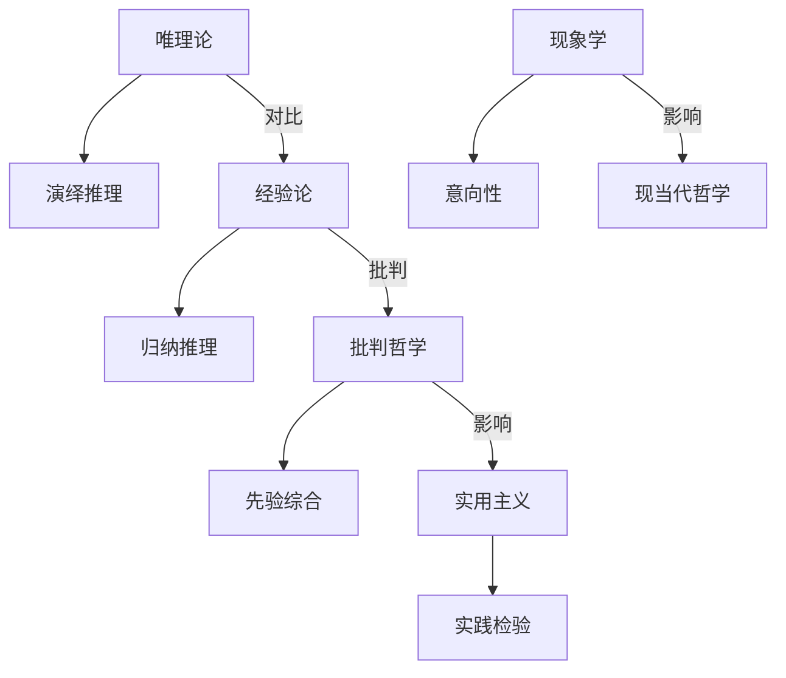

# 07.2.x 传统哲学流派与理论对比

## 07.2.x.5 传统哲学流派与理论对比及结构图 {#072x5-传统哲学流派与理论对比及结构图}

### 主要传统哲学流派与理论对比表

| 流派         | 代表人物         | 核心观点         | 方法论特征         | 主要贡献         |
|--------------|------------------|------------------|--------------------|------------------|
| 唯理论       | 笛卡尔、斯宾诺莎 | 理性为知识源泉   | 演绎推理、怀疑方法 | 近代哲学奠基     |
| 经验论       | 洛克、休谟、贝克莱 | 经验为知识基础   | 归纳推理、感官经验 | 现代科学基础     |
| 批判哲学     | 康德             | 先验综合判断     | 批判方法、分析综合 | 现代认识论转向   |
| 实用主义     | 杜威、詹姆斯     | 真理即有用       | 实践检验、实验方法 | 教育与社会改革   |
| 现象学       | 胡塞尔           | 意向性、还原     | 直观描述、还原分析 | 意识哲学创新     |

### Mermaid结构图：传统哲学流派关系

---
> 交叉引用：[07.2.4 现象学哲学分析](./现象学哲学分析.md)｜[07.2.6 规范伦理学分析](./规范伦理学分析.md)｜[07.2.1 信息本体论分析](./信息本体论分析.md)

## 批判性分析

### 多元理论视角

- **哲学史视角**：从哲学史的角度，传统哲学流派反映了不同历史时期和地域的哲学思考
- **比较哲学视角**：从比较哲学的角度，不同流派的对比揭示了哲学思考的多样性和复杂性
- **文化哲学视角**：从文化哲学的角度，哲学流派与特定文化背景和传统密切相关
- **现代哲学视角**：从现代哲学的角度，传统流派为当代哲学提供了重要的思想资源

### 局限性分析

- **历史局限性**：传统哲学流派可能受到特定历史条件的限制，难以完全适应现代问题
- **文化偏见**：不同哲学流派可能存在文化偏见和地域局限性
- **语言障碍**：不同哲学传统的语言表达可能造成理解和交流的困难
- **时代差异**：传统哲学概念与现代科学和技术发展之间存在时代差异

### 争议与分歧

- **普遍性 vs. 特殊性**：哲学真理的普遍性与文化特殊性的关系
- **传统 vs. 现代**：传统哲学价值与现代哲学发展的平衡
- **东方 vs. 西方**：东西方哲学传统的差异和融合问题
- **理性 vs. 直觉**：理性分析与直觉体验在哲学中的地位

### 应用前景

- **跨文化对话**：促进不同文化背景下的哲学对话和交流
- **现代问题解决**：为现代哲学和科学问题提供传统智慧
- **教育应用**：在哲学教育中提供多元化的思想资源
- **文化研究**：为文化研究和比较研究提供哲学基础

### 改进建议

- **现代诠释**：对传统哲学进行现代诠释和重新解读
- **跨文化整合**：促进不同哲学传统的对话和整合
- **教育推广**：改进哲学教育，更好地介绍传统哲学流派
- **研究深化**：加强对传统哲学流派的深入研究
- **应用拓展**：探索传统哲学在现代社会中的应用价值
