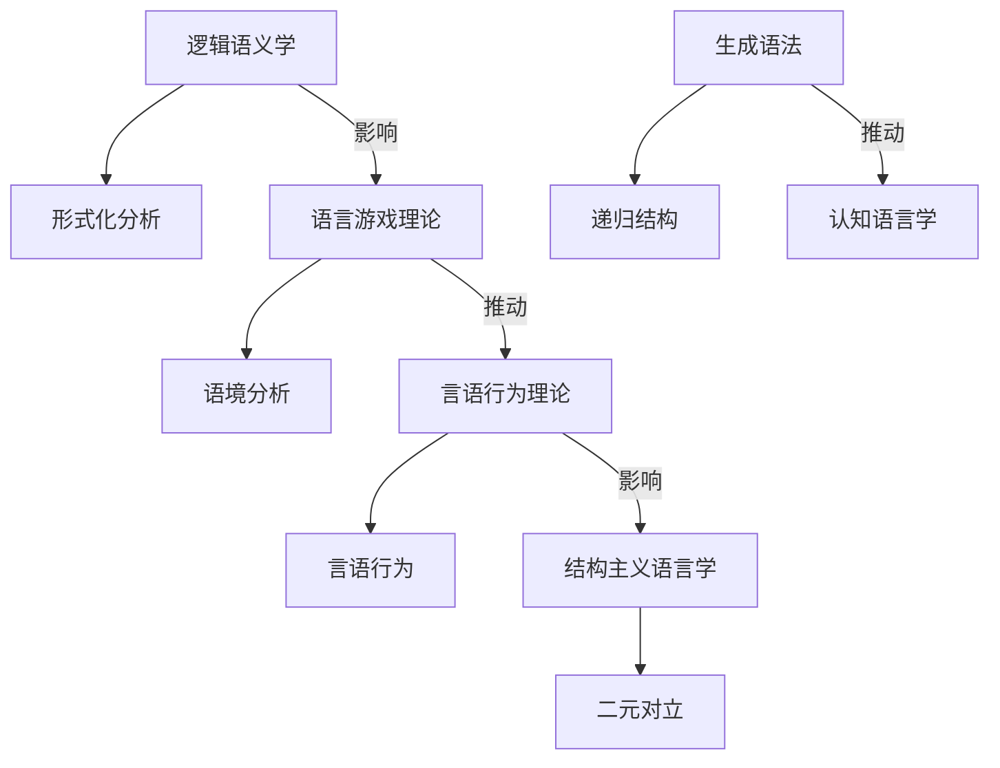

# 07.2.x.5 语言哲学流派与理论对比

## 07.2.x.5 语言哲学流派与理论对比及结构图 {#072x5-语言哲学流派与理论对比及结构图}

### 主要语言哲学流派与理论对比表

| 流派         | 代表人物         | 核心观点         | 方法论特征         | 主要贡献         |
|--------------|------------------|------------------|--------------------|------------------|
| 逻辑语义学   | 弗雷格、罗素     | 语言表达逻辑结构 | 形式化、命题分析   | 现代逻辑奠基     |
| 语言游戏理论 | 维特根斯坦       | 语言用法决定意义 | 语境分析、用法多样 | 语用学发展       |
| 言语行为理论 | 奥斯汀、塞尔     | 语言即行动       | 言语行为、语境分析 | 语用学与社会性   |
| 结构主义语言学 | 索绪尔、雅各布森 | 语言结构系统性   | 二元对立、结构分析 | 现代语言学基础   |
| 生成语法     | 乔姆斯基         | 语言能力先天性   | 形式语法、递归结构 | 认知语言学推进   |

### Mermaid结构图：语言哲学流派关系

---
> 交叉引用：[07.2.4 现象学哲学分析](./现象学哲学分析.md)｜[07.2.6 规范伦理学分析](./规范伦理学分析.md)｜[07.2.1 信息本体论分析](./信息本体论分析.md)
