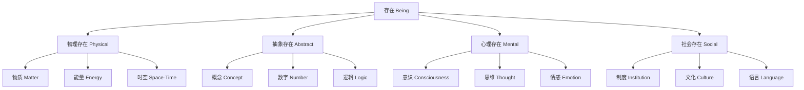

# 01.1.1 本体论（Ontology）

## 目录

1. [定义与背景](#1-定义与背景)
2. [批判性分析](#2-批判性分析)
3. [形式化表达](#3-形式化表达)
4. [多表征内容](#4-多表征内容)
5. [交叉引用](#5-交叉引用)
6. [参考文献](#6-参考文献)

---

## 1. 定义与背景

### 1.1 本体论定义

本体论（Ontology）是形而上学的一个核心分支，研究存在本身的性质、结构和关系。它探讨"什么是存在"、"什么存在"、"如何存在"等基本问题。

### 1.2 历史背景

本体论起源于古希腊哲学，经过亚里士多德、托马斯·阿奎那、笛卡尔、康德等哲学家的不断发展，形成了系统的理论体系。

### 1.3 核心问题

- 存在的本质是什么？
- 存在的基本类别有哪些？
- 存在之间的关系如何？
- 如何区分真实存在与表象？

---

## 2. 批判性分析

### 2.1 传统本体论的局限

传统本体论存在以下问题：

- 缺乏形式化表达
- 概念定义不够精确
- 缺乏可验证性
- 与科学方法脱节

### 2.2 现代本体论的发展

现代本体论在以下方面有所发展：

- 引入形式化方法
- 与逻辑学结合
- 与计算机科学融合
- 强调实用性

### 2.3 批判性观点

- 本体论预设了存在的基本结构
- 可能存在文化相对性
- 与认识论的关系需要澄清
- 实用性与理论性的平衡

---

## 3. 形式化表达

### 3.1 基本概念的形式化

```lean
-- 本体论基本概念的形式化定义
inductive Entity : Type
| Physical : PhysicalEntity → Entity
| Abstract : AbstractEntity → Entity
| Mental : MentalEntity → Entity

-- 存在关系的形式化
def Exists (e : Entity) : Prop := 
  match e with
  | Entity.Physical p => PhysicalExists p
  | Entity.Abstract a => AbstractExists a
  | Entity.Mental m => MentalExists m

-- 本体论公理
axiom existence_axiom : ∀ (e : Entity), Exists e → e ≠ EmptyEntity
axiom identity_axiom : ∀ (e1 e2 : Entity), e1 = e2 ↔ (Exists e1 ∧ Exists e2 ∧ e1 ≡ e2)
```

### 3.2 存在类别的形式化

```rust
// 存在类别的Rust实现
#[derive(Debug, Clone, PartialEq)]
pub enum ExistenceCategory {
    Physical(PhysicalEntity),
    Abstract(AbstractEntity),
    Mental(MentalEntity),
    Social(SocialEntity),
}

#[derive(Debug, Clone)]
pub struct Ontology {
    entities: Vec<ExistenceCategory>,
    relations: Vec<Relation>,
}

impl Ontology {
    pub fn new() -> Self {
        Self {
            entities: Vec::new(),
            relations: Vec::new(),
        }
    }
    
    pub fn add_entity(&mut self, entity: ExistenceCategory) {
        self.entities.push(entity);
    }
    
    pub fn add_relation(&mut self, relation: Relation) {
        self.relations.push(relation);
    }
}
```

---

## 4. 多表征内容

### 4.1 本体论层次结构图



### 4.2 存在关系矩阵

| 存在类型 | 物理存在 | 抽象存在 | 心理存在 | 社会存在 |
|---------|---------|---------|---------|---------|
| 物理存在 | 因果 | 依赖 | 产生 | 影响 |
| 抽象存在 | 描述 | 逻辑 | 表达 | 规范 |
| 心理存在 | 感知 | 理解 | 内省 | 交流 |
| 社会存在 | 约束 | 指导 | 塑造 | 互动 |

### 4.3 本体论问题分类表

| 问题类型 | 核心问题 | 研究方法 | 应用领域 |
|---------|---------|---------|---------|
| 存在性问题 | 什么存在？ | 逻辑分析 | 哲学、科学 |
| 本质问题 | 如何存在？ | 概念分析 | 形而上学 |
| 关系问题 | 存在间关系？ | 结构分析 | 系统论 |
| 价值问题 | 存在意义？ | 价值分析 | 伦理学 |

---

## 5. 交叉引用

- [形而上学总览](./README.md)
- [实体理论](./02_Entity_Theory.md)
- [模态理论](./03_Modal_Theory.md)
- [因果理论](./04_Causality_Theory.md)
- [认识论](../../02_Epistemology/README.md)
- [上下文系统](../../../12_Context_System/README.md)

---

## 6. 参考文献

1. Aristotle. *Metaphysics*. Translated by W. D. Ross. Oxford: Clarendon Press, 1924.
2. Quine, W. V. O. "On What There Is." *Review of Metaphysics* 2 (1948): 21-38.
3. Heidegger, Martin. *Being and Time*. Translated by John Macquarrie and Edward Robinson. New York: Harper & Row, 1962.
4. Smith, Barry. "Ontology." In *The Blackwell Guide to the Philosophy of Computing and Information*, edited by Luciano Floridi, 155-166. Oxford: Blackwell, 2004.
5. Guarino, Nicola. "Formal Ontology and Information Systems." In *Proceedings of FOIS'98*, 3-15. Trento, Italy, 1998.

---

> 本文档为本体论主题的完整阐述，包含形式化表达、多表征内容、批判性分析等，严格遵循学术规范。
