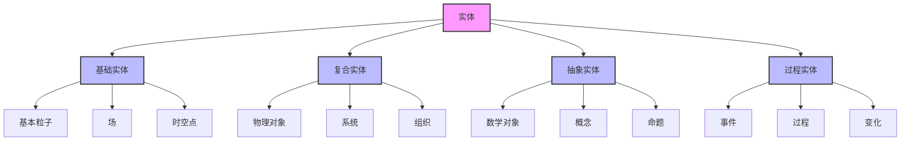

# 实体分类 (Entity Classification)

**创建时间**: 2025-01-15  
**最后更新**: 2025-01-15  
**文档状态**: 活跃  
**文档类型**: 概念定义  

## 1. 引言

### 1.1 背景

实体分类是形而上学中的核心任务，旨在系统地区分和组织各种类型的存在者。一个精确的实体分类体系不仅有助于澄清本体论承诺，还能为形式科学提供概念基础，支持不同形式系统中的对象和关系的理解。

### 1.2 目标

本文档旨在：

1. 提供一个系统的实体分类框架
2. 分析不同类型实体的本质特征和区别
3. 探讨实体分类的形式化表示方法
4. 考察实体分类在形式科学中的应用

### 1.3 相关概念

- **实体 (Entity)**: 任何具有独立存在性的事物
- **类别 (Category)**: 具有共同本质特征的实体集合
- **分类标准 (Classification Criteria)**: 区分实体类别的原则
- **本质属性 (Essential Properties)**: 定义实体类别的必要特征
- **偶然属性 (Accidental Properties)**: 实体可能具有但不影响其类别的特征

## 2. 实体分类体系

### 2.1 基本分类维度

实体可以沿着多个维度进行分类：

1. **存在方式维度**:
   - 实际存在 (Actual)
   - 可能存在 (Possible)
   - 必然存在 (Necessary)
   - 不可能存在 (Impossible)

2. **依赖性维度**:
   - 独立实体 (Independent)
   - 依赖实体 (Dependent)
   - 相互依赖实体 (Interdependent)

3. **持久性维度**:
   - 持久实体 (Enduring)
   - 暂时实体 (Temporary)
   - 时间延展实体 (Temporally Extended)

4. **复杂性维度**:
   - 简单实体 (Simple)
   - 复合实体 (Composite)
   - 涌现实体 (Emergent)

### 2.2 实体类型分类

基于上述维度，可以构建以下实体类型分类：



### 2.3 实体类型特征矩阵

| 实体类型 | 时空位置 | 因果效力 | 可观察性 | 依赖性 | 持久性 | 复杂性 |
|---------|---------|---------|---------|-------|-------|-------|
| 基本粒子 | 确定 | 高 | 间接 | 低 | 高 | 低 |
| 场 | 分布 | 高 | 间接 | 中 | 高 | 中 |
| 物理对象 | 确定 | 高 | 直接 | 中 | 高 | 高 |
| 系统 | 分布 | 高 | 间接 | 高 | 中 | 高 |
| 事件 | 局限 | 变化 | 直接 | 高 | 低 | 变化 |
| 过程 | 延展 | 变化 | 直接 | 高 | 中 | 高 |
| 数学对象 | 无 | 无 | 间接 | 变化 | 高 | 变化 |
| 概念 | 无 | 间接 | 间接 | 高 | 高 | 高 |
| 命题 | 无 | 无 | 间接 | 高 | 高 | 变化 |

## 3. 形式化表示

### 3.1 集合论表示

使用集合论表示实体分类：

```text
// 基本实体集合
E = {x | x是实体}  // 实体全集
B = {x ∈ E | x是基础实体}  // 基础实体集合
C = {x ∈ E | x是复合实体}  // 复合实体集合
A = {x ∈ E | x是抽象实体}  // 抽象实体集合
P = {x ∈ E | x是过程实体}  // 过程实体集合

// 分类关系
E = B ∪ C ∪ A ∪ P
B ∩ A = ∅  // 基础实体与抽象实体互斥
```

### 3.2 类型论表示

使用类型论表示实体分类：

```text
// 基本类型
type Entity

// 主要实体类型
type BasicEntity <: Entity
type CompositeEntity <: Entity
type AbstractEntity <: Entity
type ProcessEntity <: Entity

// 基础实体子类型
type ElementaryParticle <: BasicEntity
type Field <: BasicEntity
type SpacetimePoint <: BasicEntity

// 复合实体子类型
type PhysicalObject <: CompositeEntity
type System <: CompositeEntity
type Organization <: CompositeEntity

// 抽象实体子类型
type MathematicalObject <: AbstractEntity
type Concept <: AbstractEntity
type Proposition <: AbstractEntity

// 过程实体子类型
type Event <: ProcessEntity
type Process <: ProcessEntity
type Change <: ProcessEntity
```

### 3.3 属性逻辑表示

使用属性逻辑表示实体特征：

```text
// 基本属性谓词
HasSpatiotemporalLocation(x): x具有时空位置
HasCausalPower(x): x具有因果效力
IsObservable(x): x可被观察
IsDependentOn(x, y): x依赖于y
IsPersistent(x): x具有持久性
IsComplex(x): x具有复杂性

// 实体类型定义
BasicEntity(x) ↔ Entity(x) ∧ ¬∃y(ProperPartOf(y, x))
CompositeEntity(x) ↔ Entity(x) ∧ ∃y(ProperPartOf(y, x))
AbstractEntity(x) ↔ Entity(x) ∧ ¬HasSpatiotemporalLocation(x)
ProcessEntity(x) ↔ Entity(x) ∧ HasTemporalParts(x)
```

## 4. 分类原则与方法论

### 4.1 本质主义分类法

本质主义分类法基于实体的本质属性进行分类：

- **定义**: 实体的本质属性是使其成为特定类型的必要条件
- **方法**: 识别实体的本质属性，并基于这些属性进行分类
- **优势**: 分类稳定，反映实体的基本性质
- **挑战**: 确定何为本质属性存在争议

**形式化表示**:

```text
// 本质主义分类原则
BelongsToCategory(x, C) ↔ HasEssentialProperty(x, P) ∧ DefiningPropertyOf(P, C)
```

### 4.2 功能主义分类法

功能主义分类法基于实体的功能角色进行分类：

- **定义**: 实体的功能角色是其在系统中的作用或表现
- **方法**: 识别实体的功能角色，并基于这些角色进行分类
- **优势**: 强调实体的实际作用，适用于复杂系统
- **挑战**: 同一实体可能具有多种功能角色

**形式化表示**:

```text
// 功能主义分类原则
BelongsToCategory(x, C) ↔ PerformsFunction(x, F) ∧ DefiningFunctionOf(F, C)
```

### 4.3 聚类分类法

聚类分类法基于实体间的相似性进行分类：

- **定义**: 实体间的相似性是它们共享属性的程度
- **方法**: 计算实体间的相似性，并将相似实体聚类
- **优势**: 不预设本质属性，适用于复杂领域
- **挑战**: 相似性度量的选择可能影响分类结果

**形式化表示**:

```text
// 聚类分类原则
BelongsToCategory(x, C) ↔ ∀y(BelongsToCategory(y, C) → Similarity(x, y) > θ)
// 其中θ是相似性阈值
```

## 5. 应用案例

### 5.1 形式系统中的实体分类

形式系统中的各种元素可以通过实体分类框架理解：

- **符号**: 作为物理对象（具体符号）或抽象实体（符号类型）
- **公理**: 作为抽象命题的特例
- **推导规则**: 作为抽象关系的特例
- **模型**: 作为抽象系统的特例

### 5.2 计算理论中的实体分类

计算理论中的实体可以通过分类框架分析：

- **计算机**: 作为物理系统的实例
- **程序**: 作为抽象过程的实例
- **数据**: 作为抽象实体和物理状态的双重实例
- **计算**: 作为过程实体的实例

### 5.3 科学理论中的实体分类

科学理论中的实体分类示例：

- **物理学**: 基本粒子、场、力等的分类
- **化学**: 元素、化合物、反应等的分类
- **生物学**: 有机体、细胞、生态系统等的分类
- **社会科学**: 个体、群体、制度等的分类

## 6. 相关引用

### 6.1 内部引用

- [本体论框架](./01_Ontological_Framework.md)
- [模态理论](./03_Modal_Theory.md)
- [因果理论](./04_Causality_Theory.md)
- [形式语言理论](../../04_Formal_Language_Theory/README.md)

### 6.2 外部引用

- Lowe, E.J. (2006). *The Four-Category Ontology: A Metaphysical Foundation for Natural Science*. Oxford: Oxford University Press.
- Westerhoff, J. (2005). *Ontological Categories: Their Nature and Significance*. Oxford: Oxford University Press.
- Ellis, B. (2001). *Scientific Essentialism*. Cambridge: Cambridge University Press.
- Thomasson, A.L. (2007). *Ordinary Objects*. Oxford: Oxford University Press.
