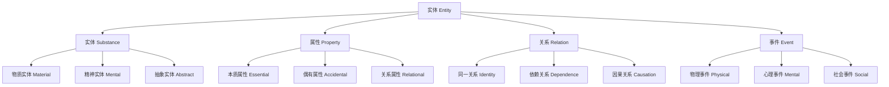

# 01.1.2 实体理论（Entity Theory）

## 目录

1. [定义与背景](#1-定义与背景)
2. [批判性分析](#2-批判性分析)
3. [形式化表达](#3-形式化表达)
4. [多表征内容](#4-多表征内容)
5. [交叉引用](#5-交叉引用)
6. [参考文献](#6-参考文献)

---

## 1. 定义与背景

### 1.1 实体理论定义

实体理论（Entity Theory）研究实体的本质、分类、属性和关系。实体是存在的具体承载者，是本体论研究的核心对象。

### 1.2 历史背景

实体概念最早由亚里士多德提出，经过中世纪哲学、近代哲学的发展，形成了系统的实体理论体系。

### 1.3 核心问题

- 什么是实体？
- 实体有哪些基本属性？
- 实体之间的关系如何？
- 如何区分不同类型的实体？

---

## 2. 批判性分析

### 2.1 传统实体理论的局限

传统实体理论存在以下问题：

- 实体概念过于抽象
- 缺乏形式化定义
- 与科学发现脱节
- 难以处理复杂关系

### 2.2 现代实体理论的发展

现代实体理论在以下方面有所发展：

- 引入形式化方法
- 与科学理论结合
- 强调关系性
- 关注动态性

### 2.3 批判性观点

- 实体概念可能过于简化
- 需要考虑实体的历史性
- 与过程哲学的关系
- 实体的社会建构性

---

## 3. 形式化表达

### 3.1 实体的形式化定义

```lean
-- 实体的基本类型
inductive EntityType : Type
| Substance : SubstanceType → EntityType
| Property : PropertyType → EntityType
| Relation : RelationType → EntityType
| Event : EventType → EntityType

-- 实体属性
structure EntityAttribute (E : Type) where
  essential : E → Prop
  accidental : E → Prop
  relational : E → E → Prop

-- 实体关系
inductive EntityRelation : Type
| Identity : Entity → Entity → EntityRelation
| Dependence : Entity → Entity → EntityRelation
| Causation : Entity → Entity → EntityRelation
| Composition : Entity → Entity → EntityRelation

-- 实体理论公理
axiom entity_existence : ∀ (e : Entity), ∃ (t : EntityType), HasType e t
axiom entity_identity : ∀ (e1 e2 : Entity), e1 = e2 ↔ (∀ (P : Entity → Prop), P e1 ↔ P e2)
```

### 3.2 实体分类的形式化

```rust
// 实体分类的Rust实现
#[derive(Debug, Clone, PartialEq)]
pub enum EntityCategory {
    Substance(SubstanceEntity),
    Property(PropertyEntity),
    Relation(RelationEntity),
    Event(EventEntity),
}

#[derive(Debug, Clone)]
pub struct Entity {
    id: String,
    category: EntityCategory,
    attributes: Vec<Attribute>,
    relations: Vec<Relation>,
}

impl Entity {
    pub fn new(id: String, category: EntityCategory) -> Self {
        Self {
            id,
            category,
            attributes: Vec::new(),
            relations: Vec::new(),
        }
    }
    
    pub fn add_attribute(&mut self, attribute: Attribute) {
        self.attributes.push(attribute);
    }
    
    pub fn add_relation(&mut self, relation: Relation) {
        self.relations.push(relation);
    }
    
    pub fn is_substance(&self) -> bool {
        matches!(self.category, EntityCategory::Substance(_))
    }
    
    pub fn is_property(&self) -> bool {
        matches!(self.category, EntityCategory::Property(_))
    }
}
```

---

## 4. 多表征内容

### 4.1 实体分类层次图



### 4.2 实体属性矩阵

| 实体类型 | 本质属性 | 偶有属性 | 关系属性 | 动态属性 |
|---------|---------|---------|---------|---------|
| 物质实体 | 广延性 | 颜色 | 位置 | 运动 |
| 精神实体 | 意识性 | 情绪 | 意向 | 变化 |
| 抽象实体 | 概念性 | 表达 | 应用 | 发展 |
| 社会实体 | 制度性 | 文化 | 互动 | 演化 |

### 4.3 实体关系类型表

| 关系类型 | 对称性 | 传递性 | 自反性 | 示例 |
|---------|--------|--------|--------|------|
| 同一关系 | 对称 | 传递 | 自反 | A = A |
| 依赖关系 | 非对称 | 非传递 | 非自反 | A → B |
| 因果关系 | 非对称 | 非传递 | 非自反 | A 导致 B |
| 构成关系 | 非对称 | 传递 | 非自反 | A 构成 B |

---

## 5. 交叉引用

- [形而上学总览](./README.md)
- [本体论](./01_Ontology.md)
- [模态理论](./03_Modal_Theory.md)
- [因果理论](./04_Causality_Theory.md)
- [认识论](../../02_Epistemology/README.md)
- [上下文系统](../../../12_Context_System/README.md)

---

## 6. 参考文献

1. Aristotle. *Categories*. Translated by E. M. Edghill. Oxford: Clarendon Press, 1928.
2. Descartes, René. *Principles of Philosophy*. Translated by Valentine Rodger Miller and Reese P. Miller. Dordrecht: Reidel, 1983.
3. Spinoza, Baruch. *Ethics*. Translated by Edwin Curley. Princeton: Princeton University Press, 1994.
4. Lowe, E. J. *The Four-Category Ontology: A Metaphysical Foundation for Natural Science*. Oxford: Clarendon Press, 2006.
5. Simons, Peter. *Parts: A Study in Ontology*. Oxford: Clarendon Press, 1987.

---

> 本文档为实体理论主题的完整阐述，包含形式化表达、多表征内容、批判性分析等，严格遵循学术规范。
