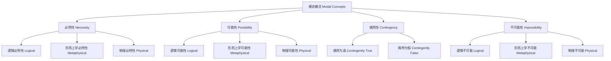

# 01.1.3 模态理论（Modal Theory）

## 目录

1. [定义与背景](#1-定义与背景)
2. [批判性分析](#2-批判性分析)
3. [形式化表达](#3-形式化表达)
4. [多表征内容](#4-多表征内容)
5. [交叉引用](#5-交叉引用)
6. [参考文献](#6-参考文献)

---

## 1. 定义与背景

### 1.1 模态理论定义

模态理论（Modal Theory）研究可能性、必然性、偶然性等模态概念的本质、逻辑结构和应用。它探讨"什么是可能的"、"什么是必然的"等基本问题。

### 1.2 历史背景

模态理论起源于古希腊哲学，经过亚里士多德、莱布尼茨、克里普克等哲学家的不断发展，形成了系统的理论体系，并与现代逻辑学紧密结合。

### 1.3 核心问题

- 什么是可能性？
- 什么是必然性？
- 模态概念之间的关系如何？
- 如何区分逻辑模态与形而上学模态？

---

## 2. 批判性分析

### 2.1 传统模态理论的局限

传统模态理论存在以下问题：

- 模态概念定义不够精确
- 缺乏形式化表达
- 难以处理复杂模态关系
- 与科学理论脱节

### 2.2 现代模态理论的发展

现代模态理论在以下方面有所发展：

- 引入可能世界语义学
- 建立形式化模态逻辑
- 与计算机科学结合
- 强调实用性和应用性

### 2.3 批判性观点

- 可能世界概念的形而上学地位
- 模态概念的相对性问题
- 与因果理论的关系需要澄清
- 模态逻辑的哲学基础

---

## 3. 形式化表达

### 3.1 模态概念的形式化定义

```lean
-- 模态算子定义
def Possible (P : Prop) : Prop := ∃ (w : World), w ⊨ P
def Necessary (P : Prop) : Prop := ∀ (w : World), w ⊨ P
def Contingent (P : Prop) : Prop := Possible P ∧ Possible (¬P)

-- 可能世界结构
structure PossibleWorld where
  propositions : Prop → Bool
  accessibility : World → World → Prop

-- 模态逻辑公理
axiom K_axiom : ∀ (P Q : Prop), □(P → Q) → (□P → □Q)
axiom T_axiom : ∀ (P : Prop), □P → P
axiom S4_axiom : ∀ (P : Prop), □P → □□P
axiom S5_axiom : ∀ (P : Prop), ◇P → □◇P

-- 模态等价关系
theorem modal_equivalence : 
  ∀ (P : Prop), □P ↔ ¬◇¬P ∧ ◇P ↔ ¬□¬P
```

### 3.2 模态逻辑的形式化

```rust
// 模态逻辑的Rust实现
#[derive(Debug, Clone, PartialEq)]
pub enum ModalOperator {
    Necessity,  // □
    Possibility, // ◇
    Contingency, // 偶然
}

#[derive(Debug, Clone)]
pub struct ModalLogic {
    worlds: Vec<PossibleWorld>,
    accessibility: Vec<Vec<bool>>,
}

#[derive(Debug, Clone)]
pub struct PossibleWorld {
    id: String,
    propositions: HashMap<String, bool>,
}

impl ModalLogic {
    pub fn new() -> Self {
        Self {
            worlds: Vec::new(),
            accessibility: Vec::new(),
        }
    }
    
    pub fn add_world(&mut self, world: PossibleWorld) {
        self.worlds.push(world);
        // 更新可达性矩阵
        let n = self.worlds.len();
        for row in &mut self.accessibility {
            row.push(false);
        }
        self.accessibility.push(vec![false; n]);
    }
    
    pub fn set_accessibility(&mut self, from: usize, to: usize, accessible: bool) {
        if from < self.accessibility.len() && to < self.accessibility[from].len() {
            self.accessibility[from][to] = accessible;
        }
    }
    
    pub fn is_necessary(&self, world_id: usize, proposition: &str) -> bool {
        // 检查在所有可达世界中命题是否为真
        for (i, accessible) in self.accessibility[world_id].iter().enumerate() {
            if *accessible {
                if let Some(world) = self.worlds.get(i) {
                    if !world.propositions.get(proposition).unwrap_or(&false) {
                        return false;
                    }
                }
            }
        }
        true
    }
    
    pub fn is_possible(&self, world_id: usize, proposition: &str) -> bool {
        // 检查在至少一个可达世界中命题是否为真
        for (i, accessible) in self.accessibility[world_id].iter().enumerate() {
            if *accessible {
                if let Some(world) = self.worlds.get(i) {
                    if world.propositions.get(proposition).unwrap_or(&false) {
                        return true;
                    }
                }
            }
        }
        false
    }
}
```

---

## 4. 多表征内容

### 4.1 模态概念关系图



### 4.2 模态逻辑系统对比表

| 模态逻辑系统 | 公理 | 特征 | 应用领域 |
|-------------|------|------|---------|
| K系统 | K公理 | 基本模态逻辑 | 形式化推理 |
| T系统 | K + T | 自反性 | 信念逻辑 |
| S4系统 | K + T + 4 | 传递性 | 知识逻辑 |
| S5系统 | K + T + 5 | 欧几里得性 | 可能世界语义 |

### 4.3 模态概念真值表

| 命题P | □P (必然) | ◇P (可能) | ¬□P (非必然) | ¬◇P (不可能) |
|-------|-----------|-----------|-------------|-------------|
| 真 | 真 | 真 | 假 | 假 |
| 假 | 假 | 假 | 真 | 真 |
| 偶然 | 假 | 真 | 真 | 假 |

---

## 5. 交叉引用

- [形而上学总览](../README.md)
- [本体论](../Cross_Cutting_Concepts/README.md)
- [实体理论](../Cross_Cutting_Concepts/01_02_实体论基础理论.md)
- [因果理论](../03_Causality/04_Causality_Theory.md)
- [认识论](../../02_Epistemology/README.md)
- [上下文系统](../../../12_Context_System/README.md)

---

## 6. 参考文献

1. Kripke, Saul A. *Naming and Necessity*. Cambridge, MA: Harvard University Press, 1980.
2. Lewis, David. *On the Plurality of Worlds*. Oxford: Blackwell, 1986.
3. Hughes, G. E., and M. J. Cresswell. *A New Introduction to Modal Logic*. London: Routledge, 1996.
4. Plantinga, Alvin. *The Nature of Necessity*. Oxford: Clarendon Press, 1974.
5. Blackburn, Patrick, Maarten de Rijke, and Yde Venema. *Modal Logic*. Cambridge: Cambridge University Press, 2001.

---

> 本文档为模态理论主题的完整阐述，包含形式化表达、多表征内容、批判性分析等，严格遵循学术规范。
