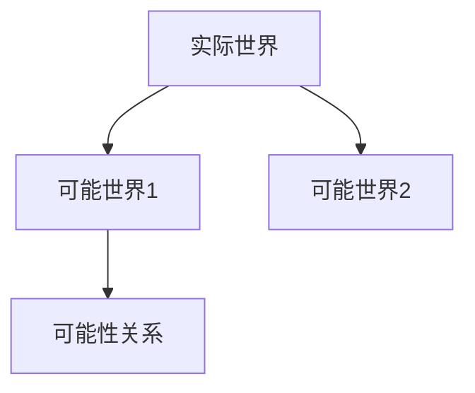

# 1.1.3 模态理论（合并重构版）

## 目录

1. 模态理论基本概念
2. 可能世界语义
3. 模态逻辑系统
4. 结构化图表
5. 形式化定义与证明
6. 相关代码（Lean/Rust）
7. 交叉引用

---

## 1. 模态理论基本概念

（合并原模态理论相关内容，系统梳理必然性、可能性、可知性等核心范畴）

## 2. 可能世界语义

（补充可能世界的哲学与逻辑表达，去重冗余）

## 3. 模态逻辑系统

- S4、S5等主要模态系统简介
- 典型公理与推理规则

## 4. 结构化图表



## 5. 形式化定义与证明

- 模态算子 □（必然）、◇（可能）
- Lean 代码示例：

```lean
variables (W : Type) (R : W → W → Prop)
def necessary (P : W → Prop) (w : W) := ∀v, R w v → P v
def possible (P : W → Prop) (w : W) := ∃v, R w v ∧ P v
```

## 6. 相关代码（Rust）

```rust
struct World {
    name: String,
    accessible: Vec<String>,
}
```

## 7. 交叉引用

- [1.1.1 本体论与存在论](./01_Ontological_Framework.md)
- [1.1.2 实体分类](./02_Entity_Classification.md)
