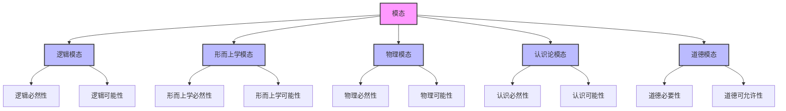

# 模态理论 (Modal Theory)

**创建时间**: 2025-01-15  
**最后更新**: 2025-01-15  
**文档状态**: 活跃  
**文档类型**: 概念定义  

## 1. 引言

### 1.1 背景

模态理论研究可能性、必然性和偶然性等模态概念，是形而上学的重要分支。模态概念在形式科学中扮演着关键角色，为理解逻辑系统、形式语言和计算理论提供了基础框架。模态思维允许我们超越实际世界，考虑可能世界和必然真理，从而丰富了我们的概念工具箱。

### 1.2 目标

本文档旨在：

1. 系统阐述模态理论的核心概念和原则
2. 探索模态概念的形式化表示方法
3. 分析不同模态立场及其哲学基础
4. 考察模态理论在形式科学中的应用

### 1.3 相关概念

- **模态 (Modality)**: 关于事物如何可能或必然的方式
- **可能性 (Possibility)**: 可以是真的状态
- **必然性 (Necessity)**: 不可能不是真的状态
- **偶然性 (Contingency)**: 既可能是真又可能是假的状态
- **可能世界 (Possible World)**: 事物可能是的一种方式

## 2. 模态概念体系

### 2.1 基本模态算子

模态理论引入了以下基本算子：

1. **必然算子 (□)**: □p 表示"p是必然的"
2. **可能算子 (◇)**: ◇p 表示"p是可能的"
3. **偶然算子 (△)**: △p 表示"p是偶然的"
4. **不可能算子 (¬◇)**: ¬◇p 表示"p是不可能的"

### 2.2 模态算子间关系

模态算子之间存在以下基本关系：

```text
□p ↔ ¬◇¬p      // 必然性等价于不可能为假
◇p ↔ ¬□¬p      // 可能性等价于不必然为假
△p ↔ ◇p ∧ ◇¬p  // 偶然性等价于可能为真且可能为假
```

### 2.3 模态类型分类

模态可以分为多种类型：

1. **逻辑模态 (Logical Modality)**
   - 关注逻辑必然性和可能性
   - 基于逻辑规则和形式系统

2. **形而上学模态 (Metaphysical Modality)**
   - 关注事物本质上的必然性和可能性
   - 基于事物的本质和形而上学规律

3. **物理模态 (Physical Modality)**
   - 关注物理上的必然性和可能性
   - 基于自然规律和物理条件

4. **认识论模态 (Epistemic Modality)**
   - 关注认识上的必然性和可能性
   - 基于认知主体的知识状态

5. **道德模态 (Deontic Modality)**
   - 关注道德上的必要性和可允许性
   - 基于道德规范和价值系统

### 2.4 模态关系图



## 3. 形式化表示

### 3.1 模态逻辑表示

模态概念可以通过模态逻辑进行形式化表示：

#### 3.1.1 基本模态逻辑系统

```text
// 系统K（最基本的模态逻辑系统）
1. 所有经典命题逻辑的公理和规则
2. 分配公理：□(p → q) → (□p → □q)
3. 必然化规则：如果⊢p，则⊢□p

// 系统T（反身模态逻辑）
系统K + □p → p

// 系统S4（传递模态逻辑）
系统T + □p → □□p

// 系统S5（等价关系模态逻辑）
系统S4 + ◇p → □◇p
```

#### 3.1.2 模态逻辑语义

```text
// 克里普克语义
M = <W, R, V>，其中：
W: 可能世界集合
R: 可及关系，R ⊆ W × W
V: 赋值函数，将命题变项映射到世界集合

// 真值条件
M, w ⊨ □p 当且仅当 对所有v∈W，如果wRv，则M, v ⊨ p
M, w ⊨ ◇p 当且仅当 存在v∈W，使得wRv且M, v ⊨ p
```

### 3.2 可能世界语义

使用可能世界语义表示模态概念：

```text
// 可能性定义
◇p 为真 ⟺ 存在至少一个可能世界w，使得p在w中为真

// 必然性定义
□p 为真 ⟺ 在所有可能世界w中，p都为真

// 偶然性定义
△p 为真 ⟺ 存在至少一个可能世界w1，使得p在w1中为真，
         且存在至少一个可能世界w2，使得p在w2中为假
```

### 3.3 模态类型理论表示

使用模态类型理论表示模态概念：

```text
// 基本类型
type Prop           // 命题类型
type World          // 世界类型
type Accessibility  // 可及关系类型

// 模态算子类型
type Box = Prop → Prop    // 必然算子类型
type Diamond = Prop → Prop // 可能算子类型

// 模态算子定义
def box(p: Prop): Prop = λw: World. ∀v: World. access(w, v) → p(v)
def diamond(p: Prop): Prop = λw: World. ∃v: World. access(w, v) ∧ p(v)

// 不同模态系统的可及关系特性
def reflexive(R: Accessibility): Prop = ∀w: World. R(w, w)
def transitive(R: Accessibility): Prop = ∀w,v,u: World. (R(w, v) ∧ R(v, u)) → R(w, u)
def symmetric(R: Accessibility): Prop = ∀w,v: World. R(w, v) → R(v, w)
```

## 4. 模态理论立场

### 4.1 模态实在论 (Modal Realism)

模态实在论主张可能世界是真实存在的具体实体：

- **大卫·刘易斯的模态实在论**: 所有可能世界都像我们的世界一样真实存在
- **优势**: 为模态真理提供了明确的形而上学基础
- **挑战**: 需要接受无数具体世界的存在

**形式化表示**:

```text
// 模态实在论核心主张
∀w(PossibleWorld(w) → ConcreteEntity(w))
```

### 4.2 模态虚构论 (Modal Fictionalism)

模态虚构论主张可能世界是有用的虚构，而非真实存在：

- **可能世界作为理论虚构**: 可能世界类似于数学模型
- **优势**: 避免了对大量具体世界的本体论承诺
- **挑战**: 需要解释模态真理的基础

**形式化表示**:

```text
// 模态虚构论核心主张
∀w(PossibleWorld(w) → FictionalEntity(w))
```

### 4.3 模态组合论 (Modal Combinatorialism)

模态组合论主张可能世界是由实际世界的重组构成：

- **可能世界作为组合可能性**: 通过重组实际世界的元素构造可能世界
- **优势**: 为可能世界提供了基于实际世界的基础
- **挑战**: 需要解释某些可能世界的复杂性

**形式化表示**:

```text
// 模态组合论核心主张
∀w(PossibleWorld(w) → ∃C(Combination(C) ∧ ConstructedFrom(w, C)))
```

### 4.4 模态本质主义 (Modal Essentialism)

模态本质主义主张必然性源于事物的本质：

- **本质作为模态根源**: 事物的本质决定了其必然属性
- **优势**: 将模态根植于事物的本质特征
- **挑战**: 需要清晰界定本质概念

**形式化表示**:

```text
// 模态本质主义核心主张
∀x∀P(□P(x) ↔ EssentialProperty(P, x))
```

## 5. 应用案例

### 5.1 逻辑系统中的模态应用

模态概念在逻辑系统中的应用：

- **模态逻辑**: 形式化处理必然性和可能性的逻辑系统
- **时态逻辑**: 将模态概念应用于时间关系
- **道义逻辑**: 将模态概念应用于道德义务和许可

### 5.2 计算理论中的模态应用

模态概念在计算理论中的应用：

- **程序逻辑**: 使用模态逻辑分析程序行为
- **知识表示**: 使用模态逻辑表示认知状态
- **人工智能**: 使用模态框架处理不确定性和可能性推理

### 5.3 形式语言中的模态应用

模态概念在形式语言中的应用：

- **可能世界语义**: 为自然语言和形式语言提供语义框架
- **强度理论**: 使用模态概念分析语言表达的强度
- **情境语义学**: 将模态概念应用于语言的情境依赖性分析

## 6. 相关引用

### 6.1 内部引用

- [本体论框架](./01_Ontological_Framework.md)
- [实体分类](./02_Entity_Classification.md)
- [逻辑理论](../../03_Logic_Theory/README.md)
- [形式语言理论](../../04_Formal_Language_Theory/README.md)

### 6.2 外部引用

- Lewis, D. (1986). *On the Plurality of Worlds*. Oxford: Blackwell.
- Kripke, S. (1980). *Naming and Necessity*. Cambridge, MA: Harvard University Press.
- Fine, K. (1994). "Essence and Modality". *Philosophical Perspectives*, 8, 1-16.
- Stalnaker, R. (2003). *Ways a World Might Be: Metaphysical and Anti-Metaphysical Essays*. Oxford: Oxford University Press.
