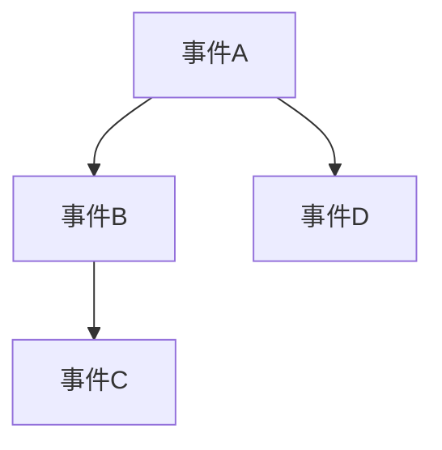

# 1.1.4 因果理论（合并重构版）

## 目录

1. 因果关系基本概念
2. 因果模型与类型
3. 结构化图表
4. 形式化定义与证明
5. 相关代码（Rust/Lean）
6. 交叉引用

---

## 1. 因果关系基本概念

（合并原因果理论相关内容，系统梳理因果性、充分条件、必要条件、因果链等核心范畴）

## 2. 因果模型与类型

- 机械论、概率论、反事实因果等主要模型
- 典型因果推理方法

## 3. 结构化图表



## 4. 形式化定义与证明

- 因果关系的逻辑表达：C(A, B) 表示A是B的原因
- Lean 代码示例：

```lean
variables {Event : Type}
def cause (A B : Event) : Prop := ∃C, (C = A) ∧ (C → B)
```

## 5. 相关代码（Rust）

```rust
struct Event {
    name: String,
    causes: Vec<String>,
}
```

## 6. 交叉引用

- [1.1.1 本体论与存在论](./01_Ontological_Framework.md)
- [1.1.2 实体分类](./02_Entity_Classification.md)
- [1.1.3 模态理论](./03_Modal_Theory.md)
