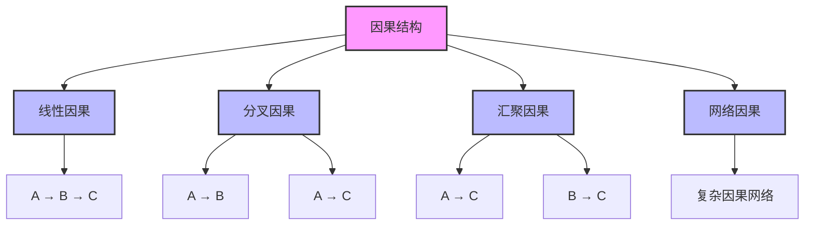

# 因果理论 (Causality Theory)

**创建时间**: 2025-01-15  
**最后更新**: 2025-01-15  
**文档状态**: 活跃  
**文档类型**: 概念定义  

## 1. 引言

### 1.1 背景

因果理论研究因果关系的本质、结构和特征，是形而上学的核心议题之一。因果概念在科学解释、预测和控制中扮演着关键角色，同时也是形式科学中多种理论框架的基础。理解因果关系不仅有助于解释世界的运作方式，还能为形式系统中的依赖关系提供哲学基础。

### 1.2 目标

本文档旨在：

1. 系统阐述因果理论的核心概念和原则
2. 分析不同因果模型及其哲学基础
3. 探索因果关系的形式化表示方法
4. 考察因果理论在形式科学中的应用

### 1.3 相关概念

- **因果关系 (Causal Relation)**: 事件之间的产生或影响关系
- **原因 (Cause)**: 导致或产生结果的事件或状态
- **结果 (Effect)**: 由原因导致或产生的事件或状态
- **因果链 (Causal Chain)**: 连续的因果关系序列
- **干预 (Intervention)**: 改变系统中变量值的外部操作

## 2. 因果概念体系

### 2.1 因果关系类型

因果关系可以分为以下主要类型：

1. **决定性因果 (Deterministic Causation)**
   - 原因必然导致结果
   - 在相同条件下，相同原因总是产生相同结果

2. **概率性因果 (Probabilistic Causation)**
   - 原因增加结果发生的概率
   - 原因与结果之间存在统计相关性

3. **必要因果 (Necessary Causation)**
   - 若无原因，则无结果
   - 原因是结果发生的必要条件

4. **充分因果 (Sufficient Causation)**
   - 有原因必有结果
   - 原因是结果发生的充分条件

5. **INUS因果 (INUS Causation)**
   - 原因是结果的不充分但必要部分的充分但非必要条件
   - 复杂系统中的典型因果关系

### 2.2 因果结构

因果关系可以组织为以下结构：



### 2.3 因果关系特征

| 特征 | 描述 | 形式化表示 |
|------|------|----------|
| 不对称性 | 如果A导致B，通常B不导致A | A → B ⇏ B → A |
| 传递性 | 如果A导致B且B导致C，则A导致C | (A → B) ∧ (B → C) ⇒ (A → C) |
| 局部性 | 因果关系通常在时空上局部发生 | Cause(e₁, e₂) ⇒ LocallyConnected(e₁, e₂) |
| 时间先后 | 原因通常先于结果发生 | Cause(e₁, e₂) ⇒ Time(e₁) < Time(e₂) |
| 反事实依赖 | 如果原因未发生，结果也不会发生 | Cause(c, e) ⇒ (¬c □→ ¬e) |

## 3. 因果理论模型

### 3.1 反事实模型

反事实模型基于"如果原因未发生，结果也不会发生"的反事实条件句：

```text
// 反事实因果定义
Cause(c, e) ↔ Occurs(c) ∧ Occurs(e) ∧ (¬Occurs(c) □→ ¬Occurs(e))

// 其中：
// Occurs(x): 事件x发生
// □→: 反事实条件句连接词（如果...就会...）
```

**主要特点**:

- 强调原因与结果之间的依赖关系
- 使用可能世界语义分析反事实条件
- 面临前置阻断和过度确定问题

### 3.2 操作干预模型

操作干预模型基于"通过干预原因可以改变结果"的原则：

```text
// 操作干预因果定义
Cause(X, Y) ↔ ∃v(P(Y|do(X=v)) ≠ P(Y))

// 其中：
// P(Y|do(X=v)): 在干预X=v后Y的概率分布
// do(): 干预算子，表示外部设置变量值
```

**主要特点**:

- 强调通过干预检验因果关系
- 区分相关性和因果性
- 提供因果推断的实用框架

### 3.3 机制模型

机制模型强调原因通过物理机制或过程产生结果：

```text
// 机制因果定义
Cause(c, e) ↔ ∃m(Mechanism(m) ∧ Connects(m, c, e) ∧ Transmits(m, c, e))

// 其中：
// Mechanism(m): m是一个机制
// Connects(m, c, e): 机制m连接事件c和e
// Transmits(m, c, e): 机制m传递从c到e的因果影响
```

**主要特点**:

- 强调因果关系的物理基础
- 关注因果过程和机制
- 适合分析复杂系统中的因果关系

### 3.4 结构方程模型

结构方程模型使用方程系统表示变量间的依赖关系：

```text
// 结构方程表示
Y = f(X, U)

// 其中：
// Y: 结果变量
// X: 原因变量
// U: 外生变量（误差项）
// f: 函数关系
```

**主要特点**:

- 提供因果关系的数学表示
- 支持复杂因果网络的分析
- 结合图形表示和代数表示

## 4. 形式化表示

### 4.1 因果图表示

使用有向图表示因果关系：

```text
// 因果图定义
G = (V, E)，其中：
V: 变量集合
E: 有向边集合，表示因果关系

// 路径定义
Path(X, Y): X到Y的有向路径
```

**图形属性**:

- **d-分离 (d-separation)**: 表示条件独立性的图形标准
- **马尔可夫性质**: 节点在给定其父节点条件下与非后代独立
- **因果马尔可夫条件**: 变量在给定其直接原因条件下与非结果独立

### 4.2 概率因果表示

使用概率理论表示因果关系：

```text
// 概率提升定义
Cause(C, E) ↔ P(E|C) > P(E|¬C)

// 条件概率提升定义
Cause(C, E|Z) ↔ P(E|C,Z) > P(E|¬C,Z)

// 因果贝叶斯网络
P(X₁,...,Xₙ) = ∏ᵢ P(Xᵢ|Pa(Xᵢ))
// 其中Pa(Xᵢ)是Xᵢ的父节点集合
```

### 4.3 逻辑因果表示

使用因果逻辑表示因果关系：

```text
// 因果必然性
□(C → E)  // C必然导致E

// 因果可能性
◇(C → E)  // C可能导致E

// 反事实因果
C □→ E  // 如果C发生，E就会发生
¬C □→ ¬E  // 如果C不发生，E就不会发生
```

### 4.4 类型论表示

使用依赖类型理论表示因果关系：

```text
// 基本类型
type Event
type Cause <: Event
type Effect <: Event

// 因果关系类型
type CausalRelation = Cause → Effect

// 因果函数
def causes(c: Cause, e: Effect): Bool = ...

// 因果依赖类型
type CausalDependency(c: Cause) = Σ(e: Effect) causes(c, e)
```

## 5. 因果理论立场

### 5.1 规律性理论 (Regularity Theory)

规律性理论将因果关系理解为事件之间的规律性连接：

- **休谟的规律性理论**: 因果关系是事件类型之间的恒常连接
- **优势**: 避免了形而上学上的神秘因果力概念
- **挑战**: 难以区分真正的因果关系和偶然的规律性

**形式化表示**:

```text
// 规律性理论核心主张
Cause(C, E) ↔ Occurs(C) ∧ Occurs(E) ∧ ∀x(Similar(x, C) → ∃y(Similar(y, E) ∧ Follows(y, x)))
```

### 5.2 反事实理论 (Counterfactual Theory)

反事实理论将因果关系理解为反事实依赖关系：

- **刘易斯的反事实理论**: 如果C未发生，E也不会发生
- **优势**: 捕捉了因果关系的依赖性质
- **挑战**: 需要可能世界语义和相似性度量

**形式化表示**:

```text
// 反事实理论核心主张
Cause(C, E) ↔ Occurs(C) ∧ Occurs(E) ∧ (¬Occurs(C) □→ ¬Occurs(E))
```

### 5.3 操作干预理论 (Manipulationist Theory)

操作干预理论将因果关系理解为通过干预可以改变的关系：

- **伍德沃德的干预理论**: 如果干预C会改变E，则C是E的原因
- **优势**: 提供了检验因果关系的实用方法
- **挑战**: 某些因果关系可能无法通过干预检验

**形式化表示**:

```text
// 操作干预理论核心主张
Cause(X, Y) ↔ ∃I(Intervention(I, X) ∧ Changes(I, Y))
```

### 5.4 机制理论 (Process Theory)

机制理论将因果关系理解为通过物理过程或机制传递的关系：

- **萨尔蒙的过程理论**: 因果关系是通过因果过程传递的标记
- **优势**: 强调因果关系的物理基础
- **挑战**: 难以应用于抽象或高级概念

**形式化表示**:

```text
// 机制理论核心主张
Cause(C, E) ↔ ∃P(Process(P) ∧ Connects(P, C, E) ∧ TransmitsMarks(P))
```

## 6. 应用案例

### 6.1 科学解释中的因果应用

因果理论在科学解释中的应用：

- **因果解释模型**: 通过因果关系解释现象
- **因果机制识别**: 识别现象背后的因果机制
- **反事实解释**: 使用反事实条件分析解释力

### 6.2 计算理论中的因果应用

因果理论在计算理论中的应用：

- **程序依赖分析**: 使用因果概念分析程序中的依赖关系
- **分布式系统因果**: 分析分布式系统中的事件因果关系
- **因果一致性模型**: 为分布式系统提供因果一致性保证

### 6.3 人工智能中的因果应用

因果理论在人工智能中的应用：

- **因果推理**: 开发基于因果模型的推理系统
- **因果发现**: 从数据中自动发现因果关系
- **因果强化学习**: 使用因果知识改进强化学习

## 7. 相关引用

### 7.1 内部引用

- [本体论框架](./01_Ontological_Framework.md)
- [实体分类](./02_Entity_Classification.md)
- [模态理论](./03_Modal_Theory.md)
- [科学哲学](../04_Philosophy_of_Science/README.md)

### 7.2 外部引用

- Hume, D. (1748). *An Enquiry Concerning Human Understanding*. London.
- Lewis, D. (1973). "Causation". *Journal of Philosophy*, 70, 556-567.
- Pearl, J. (2000). *Causality: Models, Reasoning, and Inference*. Cambridge: Cambridge University Press.
- Woodward, J. (2003). *Making Things Happen: A Theory of Causal Explanation*. Oxford: Oxford University Press.
