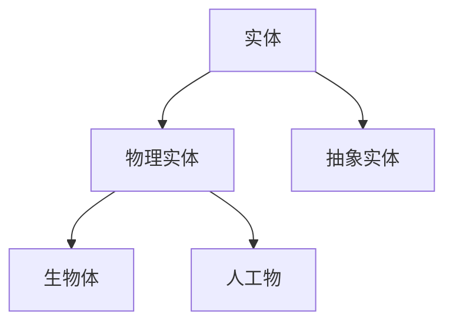

# 1.1.2 实体分类（合并重构版）

## 目录

1. 实体的基本类型
2. 分类标准与方法
3. 结构化图表
4. 形式化定义
5. 交叉引用

---

## 1. 实体的基本类型

（合并原实体分类相关内容，系统梳理实体的哲学类型与形式化表达）

## 2. 分类标准与方法

（归纳哲学与科学中的实体分类标准，补充多表征）

## 3. 结构化图表

## 4. 形式化定义

- 实体分类的集合论表达

## 5. 交叉引用

- [1.1.1 本体论与存在论](./01_Ontological_Framework.md)
- [2.1.1 知识理论](../02_Epistemology/01_Knowledge_Theory.md)
