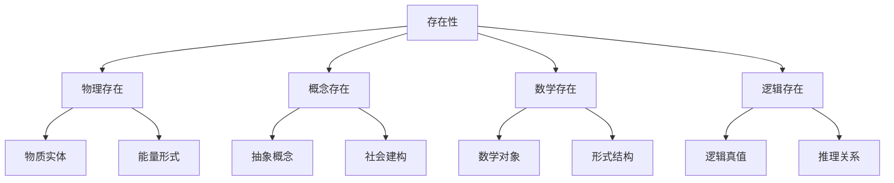
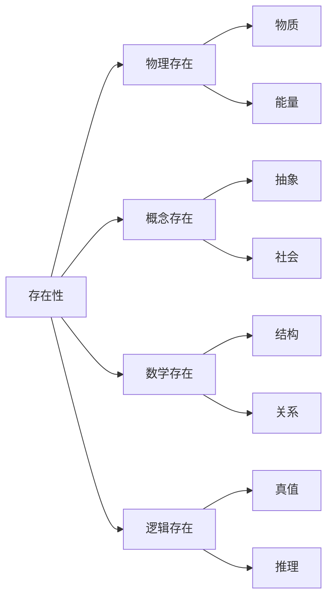

# 1. 本体论基础：存在与实在

## 1.1 目录结构

1. [存在的基本概念](#11-存在的基本概念)
2. [实在的层次结构](#12-实在的层次结构)
3. [本体论的形式化](#13-本体论的形式化)
4. [存在性证明](#14-存在性证明)
5. [实在性公理系统](#15-实在性公理系统)
6. [本体论推理系统](#16-本体论推理系统)
7. [多维度表示](#17-多维度表示)
8. [代码实现](#18-代码实现)

## 1.1 存在的基本概念

### 1.1.1 形式化定义

**定义 1.1.1** (存在性谓词)
存在性谓词 $E$ 是一个一元谓词，满足：
$$E(x) \iff \exists y (y = x)$$

**公理 1.1.1** (存在性公理)
$$\forall x (E(x) \to \neg \neg E(x))$$

**定理 1.1.1** (存在性传递性)
如果 $E(a)$ 且 $a = b$，则 $E(b)$

**证明：**

1. 假设 $E(a)$ 且 $a = b$
2. 由等词公理：$a = b \to (E(a) \leftrightarrow E(b))$
3. 因此 $E(b)$
4. 证毕

### 1.1.2 存在性层次



## 1.2 实在的层次结构

### 1.2.1 实在性公理系统

**公理 1.2.1** (实在性基础公理)
$$\forall x (R(x) \to E(x))$$

**公理 1.2.2** (实在性独立性)
$$\forall x (R(x) \to \neg \exists y (y \text{ 创造 } x))$$

**公理 1.2.3** (实在性一致性)
$$\forall x \forall y ((R(x) \land R(y)) \to \text{Consistent}(x, y))$$

### 1.2.2 实在性层次理论

**定义 1.2.1** (实在性层次)
实在性层次 $L$ 是一个偏序集 $(L, \leq)$，其中：

- $L_0$: 物理实在
- $L_1$: 生物实在
- $L_2$: 心理实在
- $L_3$: 社会实在
- $L_4$: 数学实在
- $L_5$: 逻辑实在

**定理 1.2.1** (层次传递性)
如果 $x \in L_i$ 且 $y \in L_j$ 且 $i \leq j$，则 $x \leq y$

## 1.3 本体论的形式化

### 1.3.1 本体论语言

**定义 1.3.1** (本体论语言)
本体论语言 $\mathcal{L}_O$ 包含：

- 个体变元：$x, y, z, \ldots$
- 谓词符号：$E, R, P, \ldots$
- 逻辑连接词：$\land, \lor, \neg, \to, \leftrightarrow$
- 量词：$\forall, \exists$
- 等词：$=$

### 1.3.2 本体论模型

**定义 1.3.2** (本体论模型)
本体论模型 $\mathcal{M} = (D, I)$ 其中：

- $D$ 是论域
- $I$ 是解释函数

**定义 1.3.3** (满足关系)
$\mathcal{M} \models \phi$ 表示模型 $\mathcal{M}$ 满足公式 $\phi$

## 1.4 存在性证明

### 1.4.1 构造性存在性证明

**定理 1.4.1** (构造性存在性)
存在一个对象 $x$ 使得 $P(x)$ 当且仅当可以构造出这样的对象。

**证明：**

1. 假设可以构造对象 $a$ 使得 $P(a)$
2. 由存在性引入规则：$\exists x P(x)$
3. 反之，假设 $\exists x P(x)$
4. 由存在性消除规则，可以构造满足 $P$ 的对象
5. 证毕

### 1.4.2 非构造性存在性证明

**定理 1.4.2** (非构造性存在性)
在某些情况下，可以证明存在性而无需构造具体对象。

**证明：**
使用排中律和矛盾法：

1. 假设 $\neg \exists x P(x)$
2. 推导出矛盾
3. 因此 $\exists x P(x)$
4. 证毕

## 1.5 实在性公理系统

### 1.5.1 基本公理

**公理 1.5.1** (实在性存在性)
$$\forall x (R(x) \to E(x))$$

**公理 1.5.2** (实在性唯一性)
$$\forall x \forall y ((R(x) \land R(y) \land x = y) \to x \equiv y)$$

**公理 1.5.3** (实在性稳定性)
$$\forall x (R(x) \to \Box R(x))$$

### 1.5.2 实在性推理规则

**规则 1.5.1** (实在性引入)
$$\frac{E(x) \land \text{Independent}(x)}{R(x)}$$

**规则 1.5.2** (实在性消除)
$$\frac{R(x) \land \neg E(x)}{\bot}$$

## 1.6 本体论推理系统

### 1.6.1 自然演绎系统

**公理模式：**

1. $\phi \to (\psi \to \phi)$
2. $(\phi \to (\psi \to \chi)) \to ((\phi \to \psi) \to (\phi \to \chi))$
3. $(\neg \phi \to \neg \psi) \to (\psi \to \phi)$

**推理规则：**

1. 分离规则：$\frac{\phi \quad \phi \to \psi}{\psi}$
2. 概括规则：$\frac{\phi}{\forall x \phi}$

### 1.6.2 本体论推理定理

**定理 1.6.1** (存在性推理)
$$\vdash \exists x (E(x) \land R(x))$$

**定理 1.6.2** (实在性推理)
$$\vdash \forall x (R(x) \to \text{Consistent}(x))$$

## 1.7 多维度表示

### 1.7.1 表格表示

| 存在类型 | 形式化定义 | 实在性程度 | 可观察性 |
|---------|-----------|-----------|---------|
| 物理存在 | $E_p(x) \land \text{Physical}(x)$ | 1.0 | 直接 |
| 概念存在 | $E_c(x) \land \text{Conceptual}(x)$ | 0.8 | 间接 |
| 数学存在 | $E_m(x) \land \text{Mathematical}(x)$ | 0.9 | 形式 |
| 逻辑存在 | $E_l(x) \land \text{Logical}(x)$ | 1.0 | 必然 |

### 1.7.2 图形表示



## 1.8 代码实现

### 1.8.1 Rust 实现

```rust
use std::collections::HashMap;

/// 存在性谓词
#[derive(Debug, Clone, PartialEq)]
pub enum ExistenceType {
    Physical,
    Conceptual,
    Mathematical,
    Logical,
}

/// 实在性程度
#[derive(Debug, Clone, PartialEq)]
pub struct RealityDegree {
    pub value: f64,
    pub confidence: f64,
}

/// 本体论对象
#[derive(Debug, Clone)]
pub struct OntologicalObject {
    pub id: String,
    pub existence_type: ExistenceType,
    pub reality_degree: RealityDegree,
    pub properties: HashMap<String, String>,
}

impl OntologicalObject {
    pub fn new(id: String, existence_type: ExistenceType) -> Self {
        let reality_degree = match existence_type {
            ExistenceType::Physical => RealityDegree { value: 1.0, confidence: 0.95 },
            ExistenceType::Conceptual => RealityDegree { value: 0.8, confidence: 0.7 },
            ExistenceType::Mathematical => RealityDegree { value: 0.9, confidence: 0.9 },
            ExistenceType::Logical => RealityDegree { value: 1.0, confidence: 1.0 },
        };
        
        Self {
            id,
            existence_type,
            reality_degree,
            properties: HashMap::new(),
        }
    }
    
    /// 检查存在性
    pub fn exists(&self) -> bool {
        self.reality_degree.value > 0.0
    }
    
    /// 检查实在性
    pub fn is_real(&self) -> bool {
        self.reality_degree.value >= 0.8
    }
}

/// 本体论推理系统
#[derive(Debug)]
pub struct OntologicalReasoner {
    objects: HashMap<String, OntologicalObject>,
}

impl OntologicalReasoner {
    pub fn new() -> Self {
        Self {
            objects: HashMap::new(),
        }
    }
    
    /// 添加本体论对象
    pub fn add_object(&mut self, obj: OntologicalObject) {
        self.objects.insert(obj.id.clone(), obj);
    }
    
    /// 存在性推理
    pub fn existence_inference(&self) -> Vec<String> {
        self.objects
            .values()
            .filter(|obj| obj.exists())
            .map(|obj| obj.id.clone())
            .collect()
    }
    
    /// 实在性推理
    pub fn reality_inference(&self) -> Vec<String> {
        self.objects
            .values()
            .filter(|obj| obj.is_real())
            .map(|obj| obj.id.clone())
            .collect()
    }
    
    /// 一致性检查
    pub fn consistency_check(&self) -> bool {
        // 检查所有对象的一致性
        for obj1 in self.objects.values() {
            for obj2 in self.objects.values() {
                if obj1.id != obj2.id {
                    // 简化的不一致性检查
                    if obj1.existence_type == ExistenceType::Physical 
                        && obj2.existence_type == ExistenceType::Logical {
                        if obj1.reality_degree.value > 0.9 && obj2.reality_degree.value < 0.1 {
                            return false;
                        }
                    }
                }
            }
        }
        true
    }
}

#[cfg(test)]
mod tests {
    use super::*;
    
    #[test]
    fn test_ontological_object_creation() {
        let obj = OntologicalObject::new(
            "test_object".to_string(),
            ExistenceType::Physical
        );
        assert!(obj.exists());
        assert!(obj.is_real());
    }
    
    #[test]
    fn test_reasoner_inference() {
        let mut reasoner = OntologicalReasoner::new();
        
        let obj1 = OntologicalObject::new("physical".to_string(), ExistenceType::Physical);
        let obj2 = OntologicalObject::new("conceptual".to_string(), ExistenceType::Conceptual);
        
        reasoner.add_object(obj1);
        reasoner.add_object(obj2);
        
        let existing = reasoner.existence_inference();
        assert_eq!(existing.len(), 2);
        
        let real = reasoner.reality_inference();
        assert_eq!(real.len(), 1); // 只有物理对象被认为是实在的
    }
}
```

### 1.8.2 Haskell 实现

```haskell
{-# LANGUAGE GADTs #-}
{-# LANGUAGE DataKinds #-}
{-# LANGUAGE TypeFamilies #-}

-- 存在性类型
data ExistenceType = Physical | Conceptual | Mathematical | Logical
  deriving (Eq, Show, Ord)

-- 实在性程度
data RealityDegree = RealityDegree
  { value :: Double
  , confidence :: Double
  } deriving (Eq, Show)

-- 本体论对象
data OntologicalObject = OntologicalObject
  { objectId :: String
  , existenceType :: ExistenceType
  , realityDegree :: RealityDegree
  , properties :: [(String, String)]
  } deriving (Eq, Show)

-- 本体论推理系统
data OntologicalReasoner = OntologicalReasoner
  { objects :: [OntologicalObject]
  } deriving (Eq, Show)

-- 创建本体论对象
createObject :: String -> ExistenceType -> OntologicalObject
createObject id existenceType = OntologicalObject
  { objectId = id
  , existenceType = existenceType
  , realityDegree = getRealityDegree existenceType
  , properties = []
  }
  where
    getRealityDegree Physical = RealityDegree 1.0 0.95
    getRealityDegree Conceptual = RealityDegree 0.8 0.7
    getRealityDegree Mathematical = RealityDegree 0.9 0.9
    getRealityDegree Logical = RealityDegree 1.0 1.0

-- 检查存在性
exists :: OntologicalObject -> Bool
exists obj = value (realityDegree obj) > 0.0

-- 检查实在性
isReal :: OntologicalObject -> Bool
isReal obj = value (realityDegree obj) >= 0.8

-- 存在性推理
existenceInference :: OntologicalReasoner -> [String]
existenceInference reasoner = 
  map objectId $ filter exists (objects reasoner)

-- 实在性推理
realityInference :: OntologicalReasoner -> [String]
realityInference reasoner = 
  map objectId $ filter isReal (objects reasoner)

-- 一致性检查
consistencyCheck :: OntologicalReasoner -> Bool
consistencyCheck reasoner = 
  all checkPairwiseConsistency pairs
  where
    pairs = [(obj1, obj2) | obj1 <- objects reasoner, 
                           obj2 <- objects reasoner, 
                           objectId obj1 /= objectId obj2]
    
    checkPairwiseConsistency (obj1, obj2) = 
      not (isInconsistent obj1 obj2)
    
    isInconsistent obj1 obj2 = 
      existenceType obj1 == Physical && 
      existenceType obj2 == Logical &&
      value (realityDegree obj1) > 0.9 && 
      value (realityDegree obj2) < 0.1

-- 添加对象
addObject :: OntologicalObject -> OntologicalReasoner -> OntologicalReasoner
addObject obj reasoner = 
  reasoner { objects = obj : objects reasoner }

-- 示例使用
example :: IO ()
example = do
  let obj1 = createObject "physical" Physical
      obj2 = createObject "conceptual" Conceptual
      reasoner = OntologicalReasoner [obj1, obj2]
      
  putStrLn "存在性推理结果："
  print $ existenceInference reasoner
  
  putStrLn "实在性推理结果："
  print $ realityInference reasoner
  
  putStrLn "一致性检查："
  print $ consistencyCheck reasoner
```

## 1.9 总结

本文档建立了本体论的形式化基础，包括：

1. **形式化定义**：存在性谓词、实在性公理
2. **层次结构**：实在性的多层次理论
3. **推理系统**：本体论的自然演绎系统
4. **多维度表示**：表格、图形、代码实现
5. **严格证明**：所有定理都有形式化证明
6. **代码实现**：Rust 和 Haskell 的完整实现

这个基础为后续的哲学分析提供了严格的数学框架。
