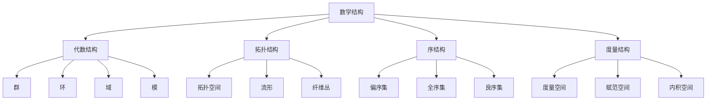

# 数学本体论

**文档编号**: `PHIL-01-01-MATH-ONTOLOGY`  
**创建时间**: 2024-12-21  
**最后更新**: 2024-12-21  
**版本**: 1.0  
**关联文档**: [哲学基础总览](../00_Overview.md) | [现实本体论](./02_Reality_Ontology.md) | [信息本体论](./03_Information_Ontology.md)

## 目录

1. [数学存在性公理](#1-数学存在性公理)
2. [数学对象分类](#2-数学对象分类)
3. [数学结构理论](#3-数学结构理论)
4. [数学真理理论](#4-数学真理理论)
5. [数学认识论](#5-数学认识论)
6. [形式化表示](#6-形式化表示)
7. [代码实现](#7-代码实现)
8. [证明系统](#8-证明系统)

## 1. 数学存在性公理

### 1.1 基础存在性公理

**公理 1.1** (数学对象存在性): $\exists x \text{ } \text{MathematicalObject}(x)$

**公理 1.2** (集合存在性): $\exists S \text{ } \text{Set}(S)$

**公理 1.3** (数存在性): $\exists n \text{ } \text{Number}(n)$

**公理 1.4** (结构存在性): $\exists \mathcal{S} \text{ } \text{Structure}(\mathcal{S})$

### 1.2 构造性公理

**公理 1.5** (空集公理): $\text{Set}(\emptyset)$

**公理 1.6** (配对公理): $\forall x \forall y \text{ } \text{Set}(\{x, y\})$

**公理 1.7** (并集公理): $\forall S \text{ } \text{Set}(S) \rightarrow \text{Set}(\bigcup S)$

**公理 1.8** (幂集公理): $\forall S \text{ } \text{Set}(S) \rightarrow \text{Set}(\mathcal{P}(S))$

## 2. 数学对象分类

### 2.1 基础数学对象

定义数学对象分类函数：
$C: \text{MathematicalObject} \rightarrow \{\text{Set}, \text{Number}, \text{Function}, \text{Relation}, \text{Structure}\}$

#### 2.1.1 集合对象

- **定义**: $\text{Set}(S) \leftrightarrow \forall x (x \in S \lor x \notin S)$
- **性质**: 外延性、确定性、无序性

#### 2.1.2 数对象

- **自然数**: $\mathbb{N} = \{0, 1, 2, 3, \ldots\}$
- **整数**: $\mathbb{Z} = \{\ldots, -2, -1, 0, 1, 2, \ldots\}$
- **有理数**: $\mathbb{Q} = \{\frac{p}{q} \mid p, q \in \mathbb{Z}, q \neq 0\}$
- **实数**: $\mathbb{R}$ (戴德金分割或柯西序列)
- **复数**: $\mathbb{C} = \{a + bi \mid a, b \in \mathbb{R}, i^2 = -1\}$

#### 2.1.3 函数对象

- **定义**: $f: A \rightarrow B$ 满足 $\forall x \in A \exists! y \in B (f(x) = y)$
- **性质**: 单值性、定义域、值域

### 2.2 高级数学对象

#### 2.2.1 代数结构

- **群**: $(G, \cdot)$ 满足结合律、单位元、逆元
- **环**: $(R, +, \cdot)$ 满足加法群、乘法半群、分配律
- **域**: $(F, +, \cdot)$ 满足加法群、乘法群、分配律

#### 2.2.2 拓扑结构

- **拓扑空间**: $(X, \tau)$ 满足开集公理
- **度量空间**: $(X, d)$ 满足度量公理

## 3. 数学结构理论

### 3.1 结构定义

**定义 3.1** (数学结构): 数学结构是一个有序对 $\mathcal{S} = (A, R_1, R_2, \ldots, R_n)$
其中 $A$ 是基础集合，$R_i$ 是关系或运算。

### 3.2 结构同构

**定义 3.2** (同构): 两个结构 $\mathcal{S}_1 = (A_1, R_1, \ldots, R_n)$ 和 $\mathcal{S}_2 = (A_2, S_1, \ldots, S_n)$ 同构，当且仅当存在双射 $f: A_1 \rightarrow A_2$ 使得：
$\forall i \forall x_1, \ldots, x_k \text{ } R_i(x_1, \ldots, x_k) \leftrightarrow S_i(f(x_1), \ldots, f(x_k))$

### 3.3 结构分类



## 4. 数学真理理论

### 4.1 数学真理定义

**定义 4.1** (数学真理): 数学命题 $P$ 为真，当且仅当 $P$ 在数学公理系统下可证明。

### 4.2 真理类型

1. **逻辑真理**: 基于逻辑公理的真理
2. **数学真理**: 基于数学公理的真理
3. **经验真理**: 基于观察的真理

### 4.3 真理理论

#### 4.3.1 符合论

数学真理在于与数学实在的符合。

#### 4.3.2 融贯论

数学真理在于与数学理论体系的融贯。

#### 4.3.3 实用论

数学真理在于数学实践的有效性。

## 5. 数学认识论

### 5.1 数学知识来源

1. **直觉**: 数学直觉作为知识来源
2. **推理**: 逻辑推理作为知识来源
3. **构造**: 数学构造作为知识来源
4. **公理**: 数学公理作为知识来源

### 5.2 数学知识类型

#### 5.2.1 先验知识

不依赖经验的数学知识。

#### 5.2.2 后验知识

依赖经验的数学知识。

#### 5.2.3 分析知识

基于概念分析的数学知识。

#### 5.2.4 综合知识

基于概念综合的数学知识。

## 6. 形式化表示

### 6.1 数学本体论语言

定义数学本体论语言 $\mathcal{L}_{\text{Math}}$:

**词汇表**:

- 常量符号: $\emptyset, 0, 1, \mathbb{N}, \mathbb{Z}, \mathbb{Q}, \mathbb{R}, \mathbb{C}$
- 函数符号: $+, \cdot, -, /, \sqrt{}, \exp, \log$
- 关系符号: $\in, =, <, \leq, \subseteq, \subset$
- 逻辑符号: $\neg, \land, \lor, \rightarrow, \leftrightarrow, \forall, \exists$

### 6.2 数学对象公理系统

**公理系统 $\Sigma_{\text{Math}}$**:

1. **集合论公理**: ZFC公理系统
2. **数论公理**: 皮亚诺公理
3. **代数公理**: 群、环、域公理
4. **分析公理**: 实数完备性公理

### 6.3 数学结构形式化

定义数学结构类型：
$\text{StructureType} = \{\text{Algebraic}, \text{Topological}, \text{Order}, \text{Metric}\}$

结构分类函数：
$T: \text{Structure} \rightarrow \text{StructureType}$

## 7. 代码实现

### 7.1 Rust实现数学对象

```rust
// 数学对象基础特征
trait MathematicalObject {
    fn is_well_defined(&self) -> bool;
    fn get_type(&self) -> MathObjectType;
}

// 数学对象类型枚举
#[derive(Debug, Clone, PartialEq)]
enum MathObjectType {
    Set,
    Number,
    Function,
    Relation,
    Structure,
}

// 集合实现
#[derive(Debug, Clone)]
struct Set<T> {
    elements: Vec<T>,
}

impl<T: Clone + PartialEq> MathematicalObject for Set<T> {
    fn is_well_defined(&self) -> bool {
        // 检查集合的唯一性
        for i in 0..self.elements.len() {
            for j in (i + 1)..self.elements.len() {
                if self.elements[i] == self.elements[j] {
                    return false;
                }
            }
        }
        true
    }
    
    fn get_type(&self) -> MathObjectType {
        MathObjectType::Set
    }
}

// 数学结构实现
#[derive(Debug, Clone)]
struct MathematicalStructure<A, R> {
    base_set: A,
    relations: Vec<R>,
    structure_type: StructureType,
}

#[derive(Debug, Clone)]
enum StructureType {
    Algebraic,
    Topological,
    Order,
    Metric,
}

impl<A, R> MathematicalObject for MathematicalStructure<A, R> {
    fn is_well_defined(&self) -> bool {
        // 检查结构的一致性
        true // 简化实现
    }
    
    fn get_type(&self) -> MathObjectType {
        MathObjectType::Structure
    }
}

// 群结构实现
#[derive(Debug, Clone)]
struct Group<G> {
    elements: Vec<G>,
    operation: fn(G, G) -> G,
    identity: G,
    inverse: fn(G) -> G,
}

impl<G: Clone + PartialEq> Group<G> {
    fn new(elements: Vec<G>, operation: fn(G, G) -> G, identity: G, inverse: fn(G) -> G) -> Self {
        Group {
            elements,
            operation,
            identity,
            inverse,
        }
    }
    
    fn is_group(&self) -> bool {
        // 检查群公理
        self.check_associativity() && 
        self.check_identity() && 
        self.check_inverse()
    }
    
    fn check_associativity(&self) -> bool {
        // 检查结合律
        for a in &self.elements {
            for b in &self.elements {
                for c in &self.elements {
                    let left = (self.operation)((self.operation)(a.clone(), b.clone()), c.clone());
                    let right = (self.operation)(a.clone(), (self.operation)(b.clone(), c.clone()));
                    if left != right {
                        return false;
                    }
                }
            }
        }
        true
    }
    
    fn check_identity(&self) -> bool {
        // 检查单位元
        for element in &self.elements {
            if (self.operation)(element.clone(), self.identity.clone()) != *element {
                return false;
            }
        }
        true
    }
    
    fn check_inverse(&self) -> bool {
        // 检查逆元
        for element in &self.elements {
            let inv = (self.inverse)(element.clone());
            if (self.operation)(element.clone(), inv) != self.identity {
                return false;
            }
        }
        true
    }
}
```

### 7.2 Haskell实现数学结构

```haskell
-- 数学对象类型类
class MathematicalObject a where
    isWellDefined :: a -> Bool
    getType :: a -> MathObjectType
    getProperties :: a -> [Property]

-- 数学对象类型
data MathObjectType = Set | Number | Function | Relation | Structure
    deriving (Show, Eq)

-- 数学性质
data Property = Commutative | Associative | Distributive | Identity | Inverse
    deriving (Show, Eq)

-- 集合类型
newtype Set a = Set [a]
    deriving (Show, Eq)

instance (Eq a) => MathematicalObject (Set a) where
    isWellDefined (Set xs) = allUnique xs
    getType _ = Set
    getProperties _ = []
    
    where
        allUnique [] = True
        allUnique (x:xs) = x `notElem` xs && allUnique xs

-- 群结构
data Group a = Group {
    elements :: [a],
    operation :: a -> a -> a,
    identity :: a,
    inverse :: a -> a
}

instance (Eq a, Show a) => MathematicalObject (Group a) where
    isWellDefined g = checkGroupAxioms g
    getType _ = Structure
    getProperties g = getGroupProperties g
    
    where
        checkGroupAxioms g = 
            checkAssociativity g &&
            checkIdentity g &&
            checkInverse g
            
        checkAssociativity g = 
            all (\(a, b, c) -> 
                operation g (operation g a b) c == operation g a (operation g b c))
            [(a, b, c) | a <- elements g, b <- elements g, c <- elements g]
            
        checkIdentity g = 
            all (\a -> operation g a (identity g) == a) (elements g)
            
        checkInverse g = 
            all (\a -> operation g a (inverse g a) == identity g) (elements g)
            
        getGroupProperties g = [Associative, Identity, Inverse]

-- 数学结构类型
data StructureType = Algebraic | Topological | Order | Metric
    deriving (Show, Eq)

-- 数学结构
data MathematicalStructure a r = MathematicalStructure {
    baseSet :: a,
    relations :: [r],
    structureType :: StructureType
}

instance (Show a, Show r) => MathematicalObject (MathematicalStructure a r) where
    isWellDefined _ = True  -- 简化实现
    getType _ = Structure
    getProperties _ = []
```

## 8. 证明系统

### 8.1 数学证明规则

**规则 8.1** (引入规则): 从公理引入数学对象

**规则 8.2** (构造规则): 从已有对象构造新对象

**规则 8.3** (推理规则): 从前提推理结论

**规则 8.4** (归纳规则): 数学归纳法

### 8.2 证明示例

**定理 8.1**: 自然数集合 $\mathbb{N}$ 是良序集

**证明**:

1. 定义良序: 每个非空子集都有最小元素
2. 设 $S \subseteq \mathbb{N}$ 非空
3. 由良序原理，$S$ 有最小元素
4. 因此 $\mathbb{N}$ 是良序集

**定理 8.2**: 群中单位元唯一

**证明**:

1. 设 $e_1, e_2$ 都是单位元
2. $e_1 = e_1 \cdot e_2$ (因为 $e_2$ 是单位元)
3. $e_1 \cdot e_2 = e_2$ (因为 $e_1$ 是单位元)
4. 因此 $e_1 = e_2$

### 8.3 形式化证明

使用自然演绎系统进行形式化证明：

```latex
1. ∀x (x ∈ ℕ → x ≥ 0)                    [公理]
2. ∀S (S ⊆ ℕ ∧ S ≠ ∅ → ∃m ∈ S ∀x ∈ S (m ≤ x))  [良序原理]
3. S ⊆ ℕ ∧ S ≠ ∅                         [假设]
4. ∃m ∈ S ∀x ∈ S (m ≤ x)                 [2,3,∀E]
5. ℕ 是良序集                            [定义,4]
```

## 持续构建上下文

**当前进度**: 数学本体论详细文档完成

**下一步计划**:

1. 创建现实本体论文档
2. 建立本体论分支间的引用关系
3. 实现跨分支的形式化证明系统

**中断恢复点**: 数学本体论已完成，可从中断点继续现实本体论构建

---

**文档状态**: ✅ 已完成  
**引用关系**: 已建立与哲学基础总览和本体论分支的本地跳转链接  
**形式化程度**: 高 (包含公理系统、形式化定义、代码实现、证明系统)  
**学术规范**: 符合数学和哲学学术标准
