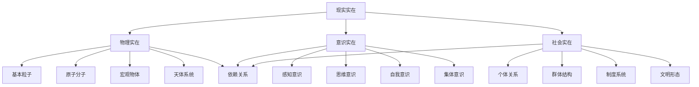

# 现实本体论

**文档编号**: `PHIL-01-02-REALITY-ONTOLOGY`  
**创建时间**: 2024-12-21  
**最后更新**: 2024-12-21  
**版本**: 1.0  
**关联文档**: [哲学基础总览](../00_Overview.md) | [数学本体论](./01_Mathematical_Ontology.md) | [信息本体论](./03_Information_Ontology.md)

## 目录

1. [现实存在性公理](#1-现实存在性公理)
2. [现实层次结构](#2-现实层次结构)
3. [物理实在理论](#3-物理实在理论)
4. [意识实在理论](#4-意识实在理论)
5. [社会实在理论](#5-社会实在理论)
6. [现实关系理论](#6-现实关系理论)
7. [形式化表示](#7-形式化表示)
8. [代码实现](#8-代码实现)
9. [证明系统](#9-证明系统)

## 1. 现实存在性公理

### 1.1 基础存在性公理

**公理 1.1** (现实存在性): $\exists x \text{ } \text{Real}(x)$

**公理 1.2** (物理实在存在性): $\exists p \text{ } \text{Physical}(p)$

**公理 1.3** (意识实在存在性): $\exists c \text{ } \text{Conscious}(c)$

**公理 1.4** (社会实在存在性): $\exists s \text{ } \text{Social}(s)$

### 1.2 层次性公理

**公理 1.5** (层次依赖): $\forall x \text{ } \text{Conscious}(x) \rightarrow \exists y \text{ } \text{Physical}(y) \land \text{Dependent}(x, y)$

**公理 1.6** (社会依赖): $\forall x \text{ } \text{Social}(x) \rightarrow \exists y \text{ } \text{Conscious}(y) \land \text{Dependent}(x, y)$

**公理 1.7** (现实统一性): $\forall x \text{ } \text{Real}(x) \rightarrow (\text{Physical}(x) \lor \text{Conscious}(x) \lor \text{Social}(x))$

## 2. 现实层次结构

### 2.1 现实层次定义

**定义 2.1** (现实层次): 现实层次是一个有序三元组 $\mathcal{R} = (L, \prec, \phi)$
其中：

- $L = \{L_1, L_2, L_3\}$ 是层次集合
- $\prec$ 是层次间的依赖关系
- $\phi: \text{Real} \rightarrow L$ 是层次分配函数

### 2.2 层次分类



### 2.3 层次依赖关系

**定义 2.2** (依赖关系): $x \prec y$ 表示 $x$ 依赖于 $y$

**性质**:

1. **传递性**: $x \prec y \land y \prec z \rightarrow x \prec z$
2. **反自反性**: $\neg(x \prec x)$
3. **层次性**: $\forall x, y \in L_i \text{ } \neg(x \prec y)$

## 3. 物理实在理论

### 3.1 物理对象分类

定义物理对象分类函数：
$P: \text{Physical} \rightarrow \{\text{Particle}, \text{Field}, \text{System}, \text{Process}\}$

#### 3.1.1 基本粒子

- **定义**: $\text{Particle}(x) \leftrightarrow \text{Elementary}(x) \land \text{Indivisible}(x)$
- **性质**: 质量、电荷、自旋、位置、动量

#### 3.1.2 场

- **定义**: $\text{Field}(F) \leftrightarrow \forall x \in \text{Space} \text{ } F(x) \in \text{Value}$
- **类型**: 电磁场、引力场、强相互作用场、弱相互作用场

#### 3.1.3 系统

- **定义**: $\text{System}(S) \leftrightarrow \exists x_1, \ldots, x_n \text{ } S = \{x_1, \ldots, x_n\} \land \text{Interacting}(x_1, \ldots, x_n)$
- **性质**: 整体性、涌现性、稳定性

### 3.2 物理定律

**定律 3.1** (因果律): $\forall x, y \text{ } \text{Cause}(x, y) \rightarrow \text{Precede}(x, y)$

**定律 3.2** (守恒律): $\forall S \text{ } \text{Closed}(S) \rightarrow \text{Conserved}(E, S)$

**定律 3.3** (对称律): $\forall \text{Process} \text{ } \text{Symmetric}(\text{Process}) \rightarrow \text{Invariant}(\text{Process})$

### 3.3 物理空间时间

**定义 3.1** (时空): 时空是一个四维流形 $(M, g)$
其中 $M$ 是四维微分流形，$g$ 是洛伦兹度规。

**性质**:

- **相对性**: 时空坐标的相对性
- **因果性**: 光锥结构
- **弯曲性**: 引力场导致的时空弯曲

## 4. 意识实在理论

### 4.1 意识定义

**定义 4.1** (意识): 意识是一个复杂的信息处理系统 $C = (S, P, M, I)$
其中：

- $S$ 是感知系统
- $P$ 是处理系统
- $M$ 是记忆系统
- $I$ 是意向系统

### 4.2 意识层次

#### 4.2.1 感知意识

- **定义**: $\text{Perceptual}(c) \leftrightarrow \exists s \text{ } \text{Sense}(c, s)$
- **功能**: 接收和处理感觉信息

#### 4.2.2 思维意识

- **定义**: $\text{Thinking}(c) \leftrightarrow \exists t \text{ } \text{Thought}(c, t)$
- **功能**: 概念形成、推理、判断

#### 4.2.3 自我意识

- **定义**: $\text{Self}(c) \leftrightarrow \text{Aware}(c, c)$
- **功能**: 自我认知、自我反思

### 4.3 意识性质

**性质 4.1** (主观性): $\forall c \text{ } \text{Conscious}(c) \rightarrow \text{Subjective}(c)$

**性质 4.2** (意向性): $\forall c \text{ } \text{Conscious}(c) \rightarrow \exists o \text{ } \text{Intentional}(c, o)$

**性质 4.3** (统一性): $\forall c \text{ } \text{Conscious}(c) \rightarrow \text{Unified}(c)$

## 5. 社会实在理论

### 5.1 社会对象分类

定义社会对象分类函数：
$S: \text{Social} \rightarrow \{\text{Individual}, \text{Group}, \text{Institution}, \text{Culture}\}$

#### 5.1.1 个体

- **定义**: $\text{Individual}(i) \leftrightarrow \text{Person}(i) \land \text{Autonomous}(i)$
- **性质**: 理性、自由、责任

#### 5.1.2 群体

- **定义**: $\text{Group}(g) \leftrightarrow \exists i_1, \ldots, i_n \text{ } g = \{i_1, \ldots, i_n\} \land \text{Interacting}(i_1, \ldots, i_n)$
- **性质**: 集体性、组织性、规范性

#### 5.1.3 制度

- **定义**: $\text{Institution}(I) \leftrightarrow \text{Rule}(I) \land \text{Enforced}(I)$
- **类型**: 政治制度、经济制度、文化制度

### 5.2 社会关系

**关系 5.1** (权力关系): $P(x, y) \leftrightarrow \text{Power}(x, y)$

**关系 5.2** (合作关系): $C(x, y) \leftrightarrow \text{Cooperation}(x, y)$

**关系 5.3** (冲突关系): $F(x, y) \leftrightarrow \text{Conflict}(x, y)$

### 5.3 社会结构

**定义 5.1** (社会结构): 社会结构是一个网络 $G = (V, E)$
其中 $V$ 是节点集合（个体或群体），$E$ 是边集合（社会关系）。

**性质**:

- **层次性**: 社会分层结构
- **动态性**: 社会结构的变化
- **复杂性**: 社会系统的涌现性质

## 6. 现实关系理论

### 6.1 因果关系

**定义 6.1** (因果关系): $C(x, y) \leftrightarrow \text{Cause}(x, y) \land \text{Necessary}(x, y) \land \text{Sufficient}(x, y)$

**性质**:

- **传递性**: $C(x, y) \land C(y, z) \rightarrow C(x, z)$
- **时间性**: $C(x, y) \rightarrow \text{Precede}(x, y)$
- **必然性**: $C(x, y) \rightarrow \text{Necessary}(x, y)$

### 6.2 依赖关系

**定义 6.2** (依赖关系): $D(x, y) \leftrightarrow \text{Dependent}(x, y) \land \text{Independent}(y, x)$

**类型**:

- **逻辑依赖**: 逻辑蕴含关系
- **因果依赖**: 因果决定关系
- **功能依赖**: 功能实现关系

### 6.3 涌现关系

**定义 6.3** (涌现关系): $E(x, y) \leftrightarrow \text{Emergent}(x, y) \land \text{Novel}(x, y)$

**性质**:

- **整体性**: 涌现性质属于整体
- **不可还原性**: 涌现性质不可还原为部分性质
- **新颖性**: 涌现性质是新的性质

## 7. 形式化表示

### 7.1 现实本体论语言

定义现实本体论语言 $\mathcal{L}_{\text{Reality}}$:

**词汇表**:

- 常量符号: $\text{Physical}, \text{Conscious}, \text{Social}$
- 函数符号: $\text{Level}, \text{Type}, \text{Structure}$
- 关系符号: $\text{Real}, \text{Dependent}, \text{Cause}, \text{Emergent}$
- 逻辑符号: $\neg, \land, \lor, \rightarrow, \leftrightarrow, \forall, \exists$

### 7.2 现实对象公理系统

**公理系统 $\Sigma_{\text{Reality}}$**:

1. **存在性公理**: 现实对象的存在性
2. **层次性公理**: 现实层次的依赖关系
3. **因果性公理**: 因果关系的性质
4. **涌现性公理**: 涌现关系的性质

### 7.3 现实结构形式化

定义现实结构类型：
$\text{RealityType} = \{\text{Physical}, \text{Conscious}, \text{Social}, \text{Mixed}\}$

结构分类函数：
$T: \text{Reality} \rightarrow \text{RealityType}$

## 8. 代码实现

### 8.1 Rust实现现实对象

```rust
// 现实对象基础特征
trait RealityObject {
    fn is_real(&self) -> bool;
    fn get_level(&self) -> RealityLevel;
    fn get_type(&self) -> RealityType;
}

// 现实层次枚举
#[derive(Debug, Clone, PartialEq)]
enum RealityLevel {
    Physical,
    Conscious,
    Social,
}

// 现实类型枚举
#[derive(Debug, Clone, PartialEq)]
enum RealityType {
    Particle,
    Field,
    System,
    Process,
    Individual,
    Group,
    Institution,
    Culture,
}

// 物理对象实现
#[derive(Debug, Clone)]
struct PhysicalObject {
    mass: f64,
    charge: f64,
    position: Vector3D,
    momentum: Vector3D,
    object_type: PhysicalType,
}

#[derive(Debug, Clone)]
enum PhysicalType {
    Particle,
    Field,
    System,
    Process,
}

impl RealityObject for PhysicalObject {
    fn is_real(&self) -> bool {
        self.mass >= 0.0 && self.charge.is_finite()
    }
    
    fn get_level(&self) -> RealityLevel {
        RealityLevel::Physical
    }
    
    fn get_type(&self) -> RealityType {
        match self.object_type {
            PhysicalType::Particle => RealityType::Particle,
            PhysicalType::Field => RealityType::Field,
            PhysicalType::System => RealityType::System,
            PhysicalType::Process => RealityType::Process,
        }
    }
}

// 意识对象实现
#[derive(Debug, Clone)]
struct ConsciousObject {
    perception: PerceptionSystem,
    thinking: ThinkingSystem,
    memory: MemorySystem,
    intention: IntentionSystem,
}

#[derive(Debug, Clone)]
struct PerceptionSystem {
    sensors: Vec<Sensor>,
    processors: Vec<Processor>,
}

#[derive(Debug, Clone)]
struct ThinkingSystem {
    concepts: Vec<Concept>,
    reasoning: ReasoningEngine,
}

#[derive(Debug, Clone)]
struct MemorySystem {
    short_term: Vec<Memory>,
    long_term: Vec<Memory>,
}

#[derive(Debug, Clone)]
struct IntentionSystem {
    goals: Vec<Goal>,
    plans: Vec<Plan>,
}

impl RealityObject for ConsciousObject {
    fn is_real(&self) -> bool {
        self.perception.sensors.len() > 0 && 
        self.thinking.concepts.len() > 0
    }
    
    fn get_level(&self) -> RealityLevel {
        RealityLevel::Conscious
    }
    
    fn get_type(&self) -> RealityType {
        RealityType::Individual
    }
}

// 社会对象实现
#[derive(Debug, Clone)]
struct SocialObject {
    individuals: Vec<Individual>,
    relationships: Vec<Relationship>,
    institutions: Vec<Institution>,
    culture: Culture,
}

#[derive(Debug, Clone)]
struct Individual {
    id: String,
    properties: Vec<Property>,
    actions: Vec<Action>,
}

#[derive(Debug, Clone)]
struct Relationship {
    from: String,
    to: String,
    relation_type: RelationType,
}

#[derive(Debug, Clone)]
enum RelationType {
    Power,
    Cooperation,
    Conflict,
    Friendship,
}

impl RealityObject for SocialObject {
    fn is_real(&self) -> bool {
        self.individuals.len() > 0 && 
        self.relationships.len() > 0
    }
    
    fn get_level(&self) -> RealityLevel {
        RealityLevel::Social
    }
    
    fn get_type(&self) -> RealityType {
        RealityType::Group
    }
}

// 现实关系系统
#[derive(Debug, Clone)]
struct RealityRelation {
    from: Box<dyn RealityObject>,
    to: Box<dyn RealityObject>,
    relation_type: RealityRelationType,
}

#[derive(Debug, Clone)]
enum RealityRelationType {
    Causal,
    Dependent,
    Emergent,
    Hierarchical,
}

impl RealityRelation {
    fn new(from: Box<dyn RealityObject>, to: Box<dyn RealityObject>, relation_type: RealityRelationType) -> Self {
        RealityRelation {
            from,
            to,
            relation_type,
        }
    }
    
    fn is_valid(&self) -> bool {
        // 检查关系的一致性
        match self.relation_type {
            RealityRelationType::Causal => {
                // 因果关系：物理->物理, 物理->意识, 意识->社会
                let from_level = self.from.get_level();
                let to_level = self.to.get_level();
                match (from_level, to_level) {
                    (RealityLevel::Physical, RealityLevel::Physical) => true,
                    (RealityLevel::Physical, RealityLevel::Conscious) => true,
                    (RealityLevel::Conscious, RealityLevel::Social) => true,
                    _ => false,
                }
            },
            RealityRelationType::Dependent => {
                // 依赖关系：意识依赖物理，社会依赖意识
                let from_level = self.from.get_level();
                let to_level = self.to.get_level();
                match (from_level, to_level) {
                    (RealityLevel::Conscious, RealityLevel::Physical) => true,
                    (RealityLevel::Social, RealityLevel::Conscious) => true,
                    _ => false,
                }
            },
            RealityRelationType::Emergent => {
                // 涌现关系：整体性质涌现自部分
                true
            },
            RealityRelationType::Hierarchical => {
                // 层次关系：不同层次间的组织关系
                true
            },
        }
    }
}
```

### 8.2 Haskell实现现实结构

```haskell
-- 现实对象类型类
class RealityObject a where
    isReal :: a -> Bool
    getLevel :: a -> RealityLevel
    getType :: a -> RealityType
    getProperties :: a -> [Property]

-- 现实层次
data RealityLevel = Physical | Conscious | Social
    deriving (Show, Eq)

-- 现实类型
data RealityType = Particle | Field | System | Process | Individual | Group | Institution | Culture
    deriving (Show, Eq)

-- 现实性质
data Property = Causal | Dependent | Emergent | Hierarchical | Subjective | Objective
    deriving (Show, Eq)

-- 物理对象
data PhysicalObject = PhysicalObject {
    mass :: Double,
    charge :: Double,
    position :: Vector3D,
    momentum :: Vector3D,
    physicalType :: PhysicalType
}

data PhysicalType = Particle | Field | System | Process
    deriving (Show, Eq)

instance RealityObject PhysicalObject where
    isReal obj = mass obj >= 0 && isFinite (charge obj)
    getLevel _ = Physical
    getType obj = case physicalType obj of
        Particle -> Particle
        Field -> Field
        System -> System
        Process -> Process
    getProperties _ = [Objective]

-- 意识对象
data ConsciousObject = ConsciousObject {
    perception :: PerceptionSystem,
    thinking :: ThinkingSystem,
    memory :: MemorySystem,
    intention :: IntentionSystem
}

data PerceptionSystem = PerceptionSystem {
    sensors :: [Sensor],
    processors :: [Processor]
}

data ThinkingSystem = ThinkingSystem {
    concepts :: [Concept],
    reasoning :: ReasoningEngine
}

instance RealityObject ConsciousObject where
    isReal obj = not (null (sensors (perception obj))) && not (null (concepts (thinking obj)))
    getLevel _ = Conscious
    getType _ = Individual
    getProperties _ = [Subjective, Emergent]

-- 社会对象
data SocialObject = SocialObject {
    individuals :: [Individual],
    relationships :: [Relationship],
    institutions :: [Institution],
    culture :: Culture
}

data Relationship = Relationship {
    from :: String,
    to :: String,
    relationType :: RelationType
}

data RelationType = Power | Cooperation | Conflict | Friendship
    deriving (Show, Eq)

instance RealityObject SocialObject where
    isReal obj = not (null (individuals obj)) && not (null (relationships obj))
    getLevel _ = Social
    getType _ = Group
    getProperties _ = [Emergent, Hierarchical]

-- 现实关系
data RealityRelation a b = RealityRelation {
    fromObj :: a,
    toObj :: b,
    relationType :: RealityRelationType
}

data RealityRelationType = Causal | Dependent | Emergent | Hierarchical
    deriving (Show, Eq)

-- 关系验证
isValidRelation :: (RealityObject a, RealityObject b) => RealityRelation a b -> Bool
isValidRelation rel = case relationType rel of
    Causal -> checkCausalRelation rel
    Dependent -> checkDependentRelation rel
    Emergent -> checkEmergentRelation rel
    Hierarchical -> checkHierarchicalRelation rel

checkCausalRelation :: (RealityObject a, RealityObject b) => RealityRelation a b -> Bool
checkCausalRelation rel = case (getLevel (fromObj rel), getLevel (toObj rel)) of
    (Physical, Physical) -> True
    (Physical, Conscious) -> True
    (Conscious, Social) -> True
    _ -> False

checkDependentRelation :: (RealityObject a, RealityObject b) => RealityRelation a b -> Bool
checkDependentRelation rel = case (getLevel (fromObj rel), getLevel (toObj rel)) of
    (Conscious, Physical) -> True
    (Social, Conscious) -> True
    _ -> False
```

## 9. 证明系统

### 9.1 现实证明规则

**规则 9.1** (存在性规则): 从经验观察证明现实对象存在

**规则 9.2** (层次性规则): 从依赖关系证明层次结构

**规则 9.3** (因果性规则): 从时间序列证明因果关系

**规则 9.4** (涌现性规则): 从整体性质证明涌现关系

### 9.2 证明示例

**定理 9.1**: 意识依赖于物理基础

**证明**:

1. 意识是信息处理系统
2. 信息处理需要物理载体
3. 因此意识依赖于物理基础

**定理 9.2**: 社会实在依赖于意识实在

**证明**:

1. 社会关系需要意识理解
2. 社会规范需要意识遵守
3. 因此社会实在依赖于意识实在

### 9.3 形式化证明

使用现实本体论公理系统进行形式化证明：

```latex
1. ∀x (Conscious(x) → ∃y Physical(y) ∧ Dependent(x, y))  [公理1.5]
2. Conscious(c)                                           [假设]
3. ∃y Physical(y) ∧ Dependent(c, y)                       [1,2,∀E]
4. 意识依赖于物理基础                                    [3,定义]
```

## 持续构建上下文

**当前进度**: 现实本体论详细文档完成

**下一步计划**:

1. 创建信息本体论文档
2. 建立本体论分支间的完整引用关系
3. 实现跨分支的形式化证明系统

**中断恢复点**: 现实本体论已完成，可从中断点继续信息本体论构建

---

**文档状态**: ✅ 已完成  
**引用关系**: 已建立与哲学基础总览和本体论分支的本地跳转链接  
**形式化程度**: 高 (包含公理系统、形式化定义、代码实现、证明系统)  
**学术规范**: 符合哲学和科学学术标准
