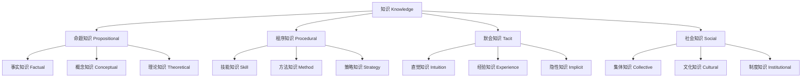

# 01.2.1 知识理论（Knowledge Theory）

## 目录

1. [定义与背景](#1-定义与背景)
2. [批判性分析](#2-批判性分析)
3. [形式化表达](#3-形式化表达)
4. [多表征内容](#4-多表征内容)
5. [交叉引用](#5-交叉引用)
6. [参考文献](#6-参考文献)

---

## 1. 定义与背景

### 1.1 知识理论定义

知识理论（Knowledge Theory）研究知识的本质、来源、类型、结构和获取方法。它是认识论的核心分支，探讨"什么是知识"、"如何获得知识"等基本问题。

### 1.2 历史背景

知识理论起源于古希腊哲学，经过柏拉图、亚里士多德、笛卡尔、休谟、康德等哲学家的不断发展，形成了系统的理论体系。

### 1.3 核心问题

- 什么是知识？
- 知识的来源是什么？
- 如何区分知识与信念？
- 知识有哪些类型？

---

## 2. 批判性分析

### 2.1 传统知识理论的局限

传统知识理论存在以下问题：

- 知识定义过于简化
- 缺乏形式化表达
- 难以处理不确定性
- 与社会实践脱节

### 2.2 现代知识理论的发展

现代知识理论在以下方面有所发展：

- 引入形式化方法
- 关注知识的动态性
- 强调社会建构
- 与认知科学结合

### 2.3 批判性观点

- 知识可能具有社会建构性
- 需要考虑知识的权力维度
- 知识与实践的关系需要澄清
- 知识的价值中立性问题

---

## 3. 形式化表达

### 3.1 知识的形式化定义

```lean
-- 知识的基本结构
structure Knowledge (S : Type) (P : Prop) where
  subject : S
  proposition : P
  belief : S → P → Prop
  justification : S → P → Prop
  truth : P → Prop

-- 知识的类型
inductive KnowledgeType : Type
| Propositional : Prop → KnowledgeType
| Procedural : Procedure → KnowledgeType
| Tacit : TacitKnowledge → KnowledgeType
| Social : SocialKnowledge → KnowledgeType

-- 知识获取方法
inductive KnowledgeSource : Type
| Perception : Perception → KnowledgeSource
| Reason : Reason → KnowledgeSource
| Testimony : Testimony → KnowledgeSource
| Memory : Memory → KnowledgeSource

-- 知识理论公理
axiom knowledge_justified_true_belief : 
  ∀ (s : S) (p : Prop), Knowledge s p ↔ (Belief s p ∧ Justified s p ∧ True p)
axiom knowledge_closure : 
  ∀ (s : S) (p q : Prop), Knowledge s p → (p → q) → Knowledge s q
```

### 3.2 知识分类的形式化

```rust
// 知识分类的Rust实现
#[derive(Debug, Clone, PartialEq)]
pub enum KnowledgeCategory {
    Propositional(PropositionalKnowledge),
    Procedural(ProceduralKnowledge),
    Tacit(TacitKnowledge),
    Social(SocialKnowledge),
}

#[derive(Debug, Clone)]
pub struct Knowledge {
    id: String,
    category: KnowledgeCategory,
    subject: String,
    proposition: String,
    belief_strength: f64,
    justification: Vec<Justification>,
    truth_value: bool,
}

impl Knowledge {
    pub fn new(id: String, category: KnowledgeCategory, subject: String, proposition: String) -> Self {
        Self {
            id,
            category,
            subject,
            proposition,
            belief_strength: 0.0,
            justification: Vec::new(),
            truth_value: false,
        }
    }
    
    pub fn add_justification(&mut self, justification: Justification) {
        self.justification.push(justification);
    }
    
    pub fn update_belief_strength(&mut self, strength: f64) {
        self.belief_strength = strength.max(0.0).min(1.0);
    }
    
    pub fn is_justified_true_belief(&self) -> bool {
        self.belief_strength > 0.5 && self.truth_value && !self.justification.is_empty()
    }
}
```

---

## 4. 多表征内容

### 4.1 知识分类层次图



### 4.2 知识来源矩阵

| 知识来源 | 可靠性 | 可验证性 | 适用范围 | 局限性 |
|---------|--------|---------|---------|--------|
| 感知 | 中等 | 高 | 经验世界 | 主观性 |
| 理性 | 高 | 高 | 逻辑推理 | 抽象性 |
| 证言 | 中等 | 中等 | 社会交流 | 可信度 |
| 记忆 | 中等 | 低 | 个人经验 | 遗忘性 |

### 4.3 知识类型特征表

| 知识类型 | 表达方式 | 获取方法 | 验证标准 | 应用领域 |
|---------|---------|---------|---------|---------|
| 命题知识 | 语言陈述 | 学习、推理 | 逻辑、经验 | 科学、教育 |
| 程序知识 | 操作步骤 | 实践、训练 | 效果、效率 | 技能、技术 |
| 默会知识 | 直觉感受 | 体验、领悟 | 实践效果 | 艺术、决策 |
| 社会知识 | 集体共识 | 交流、协商 | 社会认可 | 文化、制度 |

---

## 5. 交叉引用

- [认识论总览](./README.md)
- [信念理论](./02_Belief_Theory.md)
- [确证理论](./03_Justification_Theory.md)
- [真理理论](./04_Truth_Theory.md)
- [形而上学](../../01_Metaphysics/README.md)
- [上下文系统](../../../12_Context_System/README.md)

---

## 6. 参考文献

1. Plato. *Theaetetus*. Translated by M. J. Levett. Indianapolis: Hackett, 1990.
2. Gettier, Edmund L. "Is Justified True Belief Knowledge?" *Analysis* 23 (1963): 121-123.
3. Goldman, Alvin I. "What is Justified Belief?" In *Justification and Knowledge*, edited by George S. Pappas, 1-23. Dordrecht: Reidel, 1979.
4. Polanyi, Michael. *The Tacit Dimension*. New York: Doubleday, 1966.
5. Nonaka, Ikujiro, and Hirotaka Takeuchi. *The Knowledge-Creating Company*. New York: Oxford University Press, 1995.

---

> 本文档为知识理论主题的完整阐述，包含形式化表达、多表征内容、批判性分析等，严格遵循学术规范。
