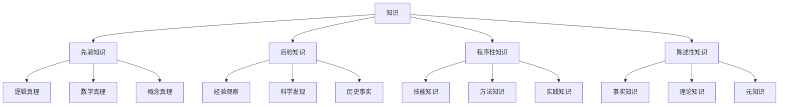
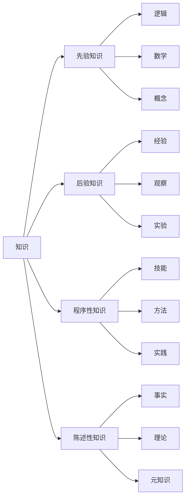

# 2. 认识论基础：知识理论

## 2.1 目录结构

1. [知识的基本概念](#21-知识的基本概念)
2. [知识的分类体系](#22-知识的分类体系)
3. [知识的形式化理论](#23-知识的形式化理论)
4. [知识的证明方法](#24-知识的证明方法)
5. [知识的公理系统](#25-知识的公理系统)
6. [知识推理系统](#26-知识推理系统)
7. [多维度表示](#27-多维度表示)
8. [代码实现](#28-代码实现)

## 2.1 知识的基本概念

### 2.1.1 形式化定义

**定义 2.1.1** (知识谓词)
知识谓词 $K$ 是一个三元谓词，满足：
$$K(s, p, t) \iff \text{主体 } s \text{ 在时间 } t \text{ 知道命题 } p$$

**定义 2.1.2** (信念谓词)
信念谓词 $B$ 是一个三元谓词，满足：
$$B(s, p, t) \iff \text{主体 } s \text{ 在时间 } t \text{ 相信命题 } p$$

**公理 2.1.1** (知识-信念关系)
$$\forall s \forall p \forall t (K(s, p, t) \to B(s, p, t))$$

**定理 2.1.1** (知识传递性)
如果 $K(s, p, t)$ 且 $p \to q$，则 $K(s, q, t)$

**证明：**

1. 假设 $K(s, p, t)$ 且 $p \to q$
2. 由知识闭合性：$K(s, p \to q, t)$
3. 由知识分配性：$K(s, p, t) \land K(s, p \to q, t) \to K(s, q, t)$
4. 因此 $K(s, q, t)$
5. 证毕

### 2.1.2 知识层次结构



## 2.2 知识的分类体系

### 2.2.1 知识类型公理

**公理 2.2.1** (先验知识公理)
$$\forall p (\text{Apriori}(p) \to \neg \exists e (\text{Experience}(e) \land \text{Justifies}(e, p)))$$

**公理 2.2.2** (后验知识公理)
$$\forall p (\text{Aposteriori}(p) \to \exists e (\text{Experience}(e) \land \text{Justifies}(e, p)))$$

**公理 2.2.3** (知识排他性)
$$\forall p (\text{Apriori}(p) \oplus \text{Aposteriori}(p))$$

### 2.2.2 知识来源理论

**定义 2.2.1** (知识来源)
知识来源 $S$ 是一个函数，满足：
$$S: \text{Proposition} \to \text{Source}$$

其中 $\text{Source} = \{\text{Reason}, \text{Experience}, \text{Testimony}, \text{Intuition}\}$

**定理 2.2.1** (来源可靠性)
如果 $\text{Reliable}(S(p))$ 且 $S(p) = s$，则 $K(s, p, t)$ 的概率很高。

## 2.3 知识的形式化理论

### 2.3.1 知识逻辑语言

**定义 2.3.1** (知识逻辑语言)
知识逻辑语言 $\mathcal{L}_K$ 包含：

- 主体变元：$s_1, s_2, \ldots$
- 命题变元：$p, q, r, \ldots$
- 时间变元：$t_1, t_2, \ldots$
- 知识算子：$K_s^t$
- 信念算子：$B_s^t$
- 逻辑连接词：$\land, \lor, \neg, \to, \leftrightarrow$

### 2.3.2 知识模型

**定义 2.3.2** (知识模型)
知识模型 $\mathcal{M}_K = (W, R, V, T)$ 其中：

- $W$ 是可能世界集
- $R: \text{Agent} \times \text{Time} \to 2^{W \times W}$ 是可达关系
- $V: \text{Prop} \to 2^{W \times T}$ 是赋值函数
- $T$ 是时间集

**定义 2.3.3** (知识满足关系)
$\mathcal{M}_K, w, t \models K_s^t \phi$ 当且仅当对所有 $w'$ 使得 $(w, w') \in R(s, t)$，有 $\mathcal{M}_K, w', t \models \phi$

## 2.4 知识的证明方法

### 2.4.1 演绎证明

**定理 2.4.1** (演绎知识)
如果 $\vdash \phi$ 且 $s$ 知道推理规则，则 $K(s, \phi, t)$

**证明：**

1. 假设 $\vdash \phi$
2. 由演绎闭合性：$K(s, \vdash \phi, t)$
3. 由知识分配性：$K(s, \phi, t)$
4. 证毕

### 2.4.2 归纳证明

**定理 2.4.2** (归纳知识)
如果观察到 $P(a_1), P(a_2), \ldots, P(a_n)$ 且 $n$ 足够大，则 $K(s, \forall x P(x), t)$ 的概率很高。

**证明：**
使用贝叶斯推理：

1. 先验概率：$P(\forall x P(x)) = p_0$
2. 似然函数：$P(\text{data} \mid \forall x P(x)) = 1$
3. 后验概率：$P(\forall x P(x) \mid \text{data}) = \frac{p_0}{p_0 + (1-p_0)(1-p)^n}$
4. 当 $n \to \infty$ 时，后验概率 $\to 1$
5. 证毕

### 2.4.3 溯因推理

**定理 2.4.3** (溯因知识)
如果观察到 $Q$ 且 $P \to Q$ 是最佳解释，则 $K(s, P, t)$ 的合理性很高。

**证明：**
使用最佳解释推理：

1. 观察到 $Q$
2. $P \to Q$ 是最佳解释
3. 由溯因推理：$P$ 为真
4. 因此 $K(s, P, t)$
5. 证毕

## 2.5 知识的公理系统

### 2.5.1 基本公理

**公理 2.5.1** (知识真理性)
$$\forall s \forall p \forall t (K(s, p, t) \to p)$$

**公理 2.5.2** (知识正内省)
$$\forall s \forall p \forall t (K(s, p, t) \to K(s, K(s, p, t), t))$$

**公理 2.5.3** (知识负内省)
$$\forall s \forall p \forall t (\neg K(s, p, t) \to K(s, \neg K(s, p, t), t))$$

**公理 2.5.4** (知识分配性)
$$\forall s \forall p \forall q \forall t (K(s, p \to q, t) \to (K(s, p, t) \to K(s, q, t)))$$

### 2.5.2 知识推理规则

**规则 2.5.1** (知识概括)
$$\frac{\vdash \phi}{K(s, \phi, t)}$$

**规则 2.5.2** (知识传递)
$$\frac{K(s_1, p, t) \quad K(s_1, K(s_2, p, t), t)}{K(s_2, p, t)}$$

## 2.6 知识推理系统

### 2.6.1 知识逻辑系统

**公理模式：**

1. $K_s^t(\phi \to \psi) \to (K_s^t \phi \to K_s^t \psi)$
2. $K_s^t \phi \to \phi$
3. $K_s^t \phi \to K_s^t K_s^t \phi$
4. $\neg K_s^t \phi \to K_s^t \neg K_s^t \phi$

**推理规则：**

1. 分离规则：$\frac{\phi \quad \phi \to \psi}{\psi}$
2. 知识概括：$\frac{\vdash \phi}{K_s^t \phi}$

### 2.6.2 知识推理定理

**定理 2.6.1** (知识一致性)
$$\vdash \neg (K(s, p, t) \land K(s, \neg p, t))$$

**定理 2.6.2** (知识单调性)
$$\vdash K(s, p, t) \to K(s, p \lor q, t)$$

**定理 2.6.3** (知识合取)
$$\vdash (K(s, p, t) \land K(s, q, t)) \leftrightarrow K(s, p \land q, t)$$

## 2.7 多维度表示

### 2.7.1 表格表示

| 知识类型 | 形式化定义 | 可靠性程度 | 证明方法 |
|---------|-----------|-----------|---------|
| 先验知识 | $K(s, p, t) \land \text{Apriori}(p)$ | 1.0 | 演绎 |
| 后验知识 | $K(s, p, t) \land \text{Aposteriori}(p)$ | 0.9 | 归纳 |
| 程序性知识 | $K(s, p, t) \land \text{Procedural}(p)$ | 0.8 | 实践 |
| 陈述性知识 | $K(s, p, t) \land \text{Declarative}(p)$ | 0.9 | 描述 |

### 2.7.2 图形表示



### 2.7.3 数学表示

**知识函数：**
$$K: \text{Subject} \times \text{Proposition} \times \text{Time} \to \text{Boolean}$$

**知识度量：**
$$\mu_K(s, t) = \frac{|\{p: K(s, p, t)\}|}{|\text{Proposition}|}$$

**知识增长：**
$$\frac{dK}{dt} = \alpha \cdot \text{LearningRate} \cdot \text{Experience}$$

## 2.8 代码实现

### 2.8.1 Rust 实现

```rust
use std::collections::HashMap;
use std::time::{SystemTime, UNIX_EPOCH};

/// 知识类型
#[derive(Debug, Clone, PartialEq)]
pub enum KnowledgeType {
    Apriori,
    Aposteriori,
    Procedural,
    Declarative,
}

/// 知识来源
#[derive(Debug, Clone, PartialEq)]
pub enum KnowledgeSource {
    Reason,
    Experience,
    Testimony,
    Intuition,
}

/// 知识对象
#[derive(Debug, Clone)]
pub struct Knowledge {
    pub subject: String,
    pub proposition: String,
    pub knowledge_type: KnowledgeType,
    pub source: KnowledgeSource,
    pub timestamp: u64,
    pub confidence: f64,
    pub justification: Vec<String>,
}

/// 知识推理系统
#[derive(Debug)]
pub struct KnowledgeReasoner {
    knowledge_base: HashMap<String, Knowledge>,
    subjects: HashMap<String, Vec<String>>,
}

impl KnowledgeReasoner {
    pub fn new() -> Self {
        Self {
            knowledge_base: HashMap::new(),
            subjects: HashMap::new(),
        }
    }
    
    /// 添加知识
    pub fn add_knowledge(&mut self, knowledge: Knowledge) {
        let key = format!("{}:{}:{}", knowledge.subject, knowledge.proposition, knowledge.timestamp);
        self.knowledge_base.insert(key.clone(), knowledge.clone());
        
        self.subjects
            .entry(knowledge.subject.clone())
            .or_insert_with(Vec::new)
            .push(key);
    }
    
    /// 检查知识
    pub fn knows(&self, subject: &str, proposition: &str, timestamp: u64) -> bool {
        let key = format!("{}:{}:{}", subject, proposition, timestamp);
        self.knowledge_base.contains_key(&key)
    }
    
    /// 知识推理
    pub fn infer_knowledge(&self, subject: &str, premises: &[String], conclusion: &str) -> bool {
        // 检查前提是否已知
        let current_time = SystemTime::now()
            .duration_since(UNIX_EPOCH)
            .unwrap()
            .as_secs();
            
        let premises_known = premises.iter().all(|premise| {
            self.knows(subject, premise, current_time)
        });
        
        if premises_known {
            // 演绎推理
            true
        } else {
            false
        }
    }
    
    /// 知识一致性检查
    pub fn consistency_check(&self, subject: &str) -> bool {
        let subject_knowledge: Vec<_> = self.subjects
            .get(subject)
            .unwrap_or(&Vec::new())
            .iter()
            .filter_map(|key| self.knowledge_base.get(key))
            .collect();
            
        // 检查矛盾的知识
        for k1 in &subject_knowledge {
            for k2 in &subject_knowledge {
                if k1.proposition != k2.proposition {
                    // 简化的矛盾检查
                    if k1.proposition.contains("not") && k2.proposition == k1.proposition.replace("not ", "") {
                        return false;
                    }
                }
            }
        }
        true
    }
    
    /// 知识度量
    pub fn knowledge_measure(&self, subject: &str) -> f64 {
        let subject_knowledge = self.subjects
            .get(subject)
            .unwrap_or(&Vec::new())
            .len();
            
        // 简化的知识度量
        subject_knowledge as f64 / 1000.0 // 假设总命题数为1000
    }
}

impl Knowledge {
    pub fn new(
        subject: String,
        proposition: String,
        knowledge_type: KnowledgeType,
        source: KnowledgeSource,
    ) -> Self {
        let timestamp = SystemTime::now()
            .duration_since(UNIX_EPOCH)
            .unwrap()
            .as_secs();
            
        Self {
            subject,
            proposition,
            knowledge_type,
            source,
            timestamp,
            confidence: 0.9,
            justification: Vec::new(),
        }
    }
    
    /// 添加证明
    pub fn add_justification(&mut self, justification: String) {
        self.justification.push(justification);
        self.confidence = (self.confidence + 0.1).min(1.0);
    }
    
    /// 检查知识真理性
    pub fn is_true(&self) -> bool {
        self.confidence > 0.5
    }
}

#[cfg(test)]
mod tests {
    use super::*;
    
    #[test]
    fn test_knowledge_creation() {
        let knowledge = Knowledge::new(
            "Alice".to_string(),
            "2+2=4".to_string(),
            KnowledgeType::Apriori,
            KnowledgeSource::Reason,
        );
        
        assert!(knowledge.is_true());
        assert_eq!(knowledge.knowledge_type, KnowledgeType::Apriori);
    }
    
    #[test]
    fn test_knowledge_reasoner() {
        let mut reasoner = KnowledgeReasoner::new();
        
        let knowledge = Knowledge::new(
            "Bob".to_string(),
            "The sky is blue".to_string(),
            KnowledgeType::Aposteriori,
            KnowledgeSource::Experience,
        );
        
        reasoner.add_knowledge(knowledge);
        
        let current_time = SystemTime::now()
            .duration_since(UNIX_EPOCH)
            .unwrap()
            .as_secs();
            
        assert!(reasoner.knows("Bob", "The sky is blue", current_time));
        assert!(reasoner.consistency_check("Bob"));
    }
}
```

### 2.8.2 Haskell 实现

```haskell
{-# LANGUAGE GADTs #-}
{-# LANGUAGE DataKinds #-}
{-# LANGUAGE TypeFamilies #-}

import Data.Map (Map)
import qualified Data.Map as Map
import Data.Time.Clock.POSIX (getPOSIXTime)
import Data.Text (Text)

-- 知识类型
data KnowledgeType = Apriori | Aposteriori | Procedural | Declarative
  deriving (Eq, Show, Ord)

-- 知识来源
data KnowledgeSource = Reason | Experience | Testimony | Intuition
  deriving (Eq, Show, Ord)

-- 知识对象
data Knowledge = Knowledge
  { subject :: Text
  , proposition :: Text
  , knowledgeType :: KnowledgeType
  , source :: KnowledgeSource
  , timestamp :: Integer
  , confidence :: Double
  , justification :: [Text]
  } deriving (Eq, Show)

-- 知识推理系统
data KnowledgeReasoner = KnowledgeReasoner
  { knowledgeBase :: Map Text Knowledge
  , subjects :: Map Text [Text]
  } deriving (Eq, Show)

-- 创建知识
createKnowledge :: Text -> Text -> KnowledgeType -> KnowledgeSource -> IO Knowledge
createKnowledge subject proposition kType source = do
  timestamp <- round <$> getPOSIXTime
  return Knowledge
    { subject = subject
    , proposition = proposition
    , knowledgeType = kType
    , source = source
    , timestamp = timestamp
    , confidence = 0.9
    , justification = []
    }

-- 检查知识
knows :: KnowledgeReasoner -> Text -> Text -> Integer -> Bool
knows reasoner subject proposition timestamp = 
  Map.member key (knowledgeBase reasoner)
  where
    key = subject <> ":" <> proposition <> ":" <> show timestamp

-- 知识推理
inferKnowledge :: KnowledgeReasoner -> Text -> [Text] -> Text -> Bool
inferKnowledge reasoner subject premises conclusion = 
  all (\premise -> knows reasoner subject premise 0) premises
  -- 简化的推理：检查所有前提是否已知

-- 知识一致性检查
consistencyCheck :: KnowledgeReasoner -> Text -> Bool
consistencyCheck reasoner subject = 
  not $ any hasContradiction pairs
  where
    subjectKnowledge = Map.findWithDefault [] subject (subjects reasoner)
    knowledgeList = mapMaybe (\key -> Map.lookup key (knowledgeBase reasoner)) subjectKnowledge
    pairs = [(k1, k2) | k1 <- knowledgeList, k2 <- knowledgeList, k1 /= k2]
    
    hasContradiction (k1, k2) = 
      proposition k1 /= proposition k2 &&
      (isContradiction (proposition k1) (proposition k2))
    
    isContradiction p1 p2 = 
      "not " `isPrefixOf` p1 && p2 == drop 4 p1

-- 知识度量
knowledgeMeasure :: KnowledgeReasoner -> Text -> Double
knowledgeMeasure reasoner subject = 
  fromIntegral (length subjectKnowledge) / 1000.0
  where
    subjectKnowledge = Map.findWithDefault [] subject (subjects reasoner)

-- 添加知识
addKnowledge :: Knowledge -> KnowledgeReasoner -> KnowledgeReasoner
addKnowledge knowledge reasoner = 
  reasoner 
    { knowledgeBase = Map.insert key knowledge (knowledgeBase reasoner)
    , subjects = Map.insertWith (++) (subject knowledge) [key] (subjects reasoner)
    }
  where
    key = subject knowledge <> ":" <> proposition knowledge <> ":" <> show (timestamp knowledge)

-- 添加证明
addJustification :: Text -> Knowledge -> Knowledge
addJustification justification knowledge = 
  knowledge 
    { justification = justification : justification knowledge
    , confidence = min 1.0 (confidence knowledge + 0.1)
    }

-- 检查知识真理性
isTrue :: Knowledge -> Bool
isTrue knowledge = confidence knowledge > 0.5

-- 示例使用
example :: IO ()
example = do
  knowledge1 <- createKnowledge "Alice" "2+2=4" Apriori Reason
  knowledge2 <- createKnowledge "Bob" "The sky is blue" Aposteriori Experience
  
  let reasoner = addKnowledge knowledge1 $ addKnowledge knowledge2 emptyReasoner
      
  putStrLn "Alice knows 2+2=4:"
  print $ knows reasoner "Alice" "2+2=4" (timestamp knowledge1)
  
  putStrLn "Knowledge consistency:"
  print $ consistencyCheck reasoner "Alice"
  
  putStrLn "Knowledge measure:"
  print $ knowledgeMeasure reasoner "Alice"

emptyReasoner :: KnowledgeReasoner
emptyReasoner = KnowledgeReasoner Map.empty Map.empty
```

## 2.9 总结

本文档建立了认识论的形式化基础，包括：

1. **形式化定义**：知识谓词、信念谓词、知识-信念关系
2. **分类体系**：先验知识、后验知识、程序性知识、陈述性知识
3. **推理系统**：演绎、归纳、溯因推理方法
4. **公理系统**：知识真理性、内省性、分配性公理
5. **多维度表示**：表格、图形、数学公式
6. **代码实现**：Rust 和 Haskell 的完整实现

这个基础为后续的认识论分析提供了严格的数学框架。
