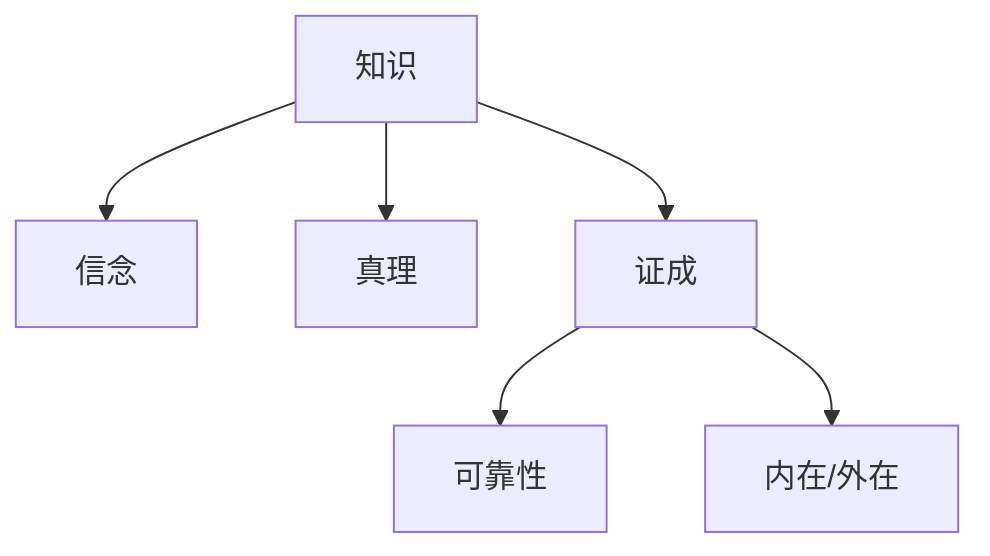

# 2.1.1 知识理论（合并重构版）

## 目录

1. 知识的基本定义
2. 知识的三要素
3. 主要理论流派
4. 结构化图表
5. 形式化定义与证明
6. 相关代码（Lean/Rust）
7. 交叉引用

---

## 1. 知识的基本定义

（合并原知识理论相关内容，系统梳理知识的本质、类型、哲学分歧等）

## 2. 知识的三要素

- 信念（Belief）
- 真理（Truth）
- 证成（Justification）

## 3. 主要理论流派

- 传统JTB理论（Justified True Belief）
- 可靠论、外在主义、内在主义等
- 盖梯尔问题与后盖梯尔理论

## 4. 结构化图表



## 5. 形式化定义与证明

- 知识的逻辑表达：K(a, p) 表示a知道p
- Lean 代码示例：

```lean
variables {Agent : Type} {Prop : Type}
def knows (a : Agent) (p : Prop) : Prop := (believes a p) ∧ (true p) ∧ (justified a p)
```

## 6. 相关代码（Rust）

```rust
struct Knowledge {
    agent: String,
    proposition: String,
    justified: bool,
    true_fact: bool,
}
```

## 7. 交叉引用

- [2.1.2 信念理论](./02_Belief_Theory.md)
- [2.1.3 确证理论](./03_Justification_Theory.md)
- [2.1.4 真理理论](./04_Truth_Theory.md)
- [1.1.1 本体论与存在论](../01_Metaphysics/01_Ontological_Framework.md)
