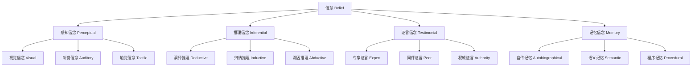

# 01.2.2 信念理论（Belief Theory）

## 目录

1. [定义与背景](#1-定义与背景)
2. [批判性分析](#2-批判性分析)
3. [形式化表达](#3-形式化表达)
4. [多表征内容](#4-多表征内容)
5. [交叉引用](#5-交叉引用)
6. [参考文献](#6-参考文献)

---

## 1. 定义与背景

### 1.1 信念理论定义

信念理论（Belief Theory）研究信念的本质、结构、类型和形成机制。它探讨"什么是信念"、"如何形成信念"、"信念与知识的关系"等基本问题。

### 1.2 历史背景

信念理论起源于古希腊哲学，经过柏拉图、笛卡尔、休谟、康德等哲学家的不断发展，形成了系统的理论体系，并与现代认知科学紧密结合。

### 1.3 核心问题

- 什么是信念？
- 信念与知识的关系如何？
- 信念有哪些类型？
- 如何评估信念的合理性？

---

## 2. 批判性分析

### 2.1 传统信念理论的局限

传统信念理论存在以下问题：

- 信念概念定义不够精确
- 缺乏形式化表达
- 难以处理信念的动态性
- 与社会心理学脱节

### 2.2 现代信念理论的发展

现代信念理论在以下方面有所发展：

- 引入形式化信念逻辑
- 建立信念更新理论
- 与认知科学结合
- 强调社会建构性

### 2.3 批判性观点

- 信念的形而上学地位
- 信念与行动的关系
- 信念的社会建构性
- 信念的合理性标准

---

## 3. 形式化表达

### 3.1 信念的形式化定义

```lean
-- 信念的基本结构
structure Belief (A : Type) (P : Prop) where
  agent : A
  proposition : P
  degree : BeliefDegree
  source : BeliefSource
  time : Time

-- 信念的类型
inductive BeliefType : Type
| Perceptual : PerceptualBelief → BeliefType
| Inferential : InferentialBelief → BeliefType
| Testimonial : TestimonialBelief → BeliefType
| Memory : MemoryBelief → BeliefType

-- 信念程度
def BeliefDegree := Float  -- 0.0 到 1.0 之间的值

-- 信念更新规则
def belief_update (b : Belief A P) (new_evidence : Evidence) : Belief A P :=
  { b with degree := update_degree b.degree new_evidence }

-- 信念理论公理
axiom belief_consistency : 
  ∀ (a : A) (p : Prop), ¬(Belief a p ∧ Belief a (¬p))
axiom belief_closure : 
  ∀ (a : A) (p q : Prop), Belief a p → (p → q) → Belief a q
```

### 3.2 信念系统的形式化

```rust
// 信念系统的Rust实现
#[derive(Debug, Clone, PartialEq)]
pub enum BeliefType {
    Perceptual,
    Inferential,
    Testimonial,
    Memory,
}

#[derive(Debug, Clone)]
pub struct Belief {
    id: String,
    agent: String,
    proposition: String,
    belief_type: BeliefType,
    degree: f64,  // 0.0 到 1.0
    source: String,
    timestamp: DateTime<Utc>,
    evidence: Vec<Evidence>,
}

#[derive(Debug, Clone)]
pub struct BeliefSystem {
    agent: String,
    beliefs: HashMap<String, Belief>,
    belief_network: BeliefNetwork,
}

impl BeliefSystem {
    pub fn new(agent: String) -> Self {
        Self {
            agent,
            beliefs: HashMap::new(),
            belief_network: BeliefNetwork::new(),
        }
    }
    
    pub fn add_belief(&mut self, belief: Belief) {
        self.beliefs.insert(belief.id.clone(), belief);
    }
    
    pub fn update_belief(&mut self, belief_id: &str, new_evidence: Evidence) -> Result<(), String> {
        if let Some(belief) = self.beliefs.get_mut(belief_id) {
            belief.evidence.push(new_evidence.clone());
            belief.degree = self.calculate_new_degree(belief, &new_evidence);
            belief.timestamp = Utc::now();
            Ok(())
        } else {
            Err("Belief not found".to_string())
        }
    }
    
    pub fn check_consistency(&self) -> Vec<String> {
        let mut inconsistencies = Vec::new();
        let propositions: HashMap<&str, Vec<&Belief>> = self.beliefs
            .values()
            .group_by(|b| b.proposition.as_str())
            .collect();
        
        for (prop, beliefs) in propositions {
            let positive_beliefs: Vec<_> = beliefs.iter().filter(|b| b.degree > 0.5).collect();
            let negative_beliefs: Vec<_> = beliefs.iter().filter(|b| b.degree < 0.5).collect();
            
            if !positive_beliefs.is_empty() && !negative_beliefs.is_empty() {
                inconsistencies.push(format!("Inconsistent beliefs about: {}", prop));
            }
        }
        
        inconsistencies
    }
    
    fn calculate_new_degree(&self, belief: &Belief, evidence: &Evidence) -> f64 {
        // 实现信念度更新算法（如贝叶斯更新）
        let prior = belief.degree;
        let likelihood = evidence.strength;
        let prior_odds = prior / (1.0 - prior);
        let likelihood_ratio = likelihood / (1.0 - likelihood);
        let posterior_odds = prior_odds * likelihood_ratio;
        posterior_odds / (1.0 + posterior_odds)
    }
}
```

---

## 4. 多表征内容

### 4.1 信念类型层次图



### 4.2 信念与知识关系表

| 特征 | 信念 | 知识 |
|------|------|------|
| 真值要求 | 无 | 必须为真 |
| 确证要求 | 无 | 必须有确证 |
| 程度性 | 有 | 无 |
| 可修正性 | 高 | 低 |
| 来源多样性 | 高 | 中等 |

### 4.3 信念更新方法对比表

| 更新方法 | 原理 | 优势 | 局限性 | 应用场景 |
|---------|------|------|--------|---------|
| 贝叶斯更新 | 条件概率 | 数学严谨 | 需要先验概率 | 科学推理 |
| 信念修正 | 最小改变 | 保持一致性 | 计算复杂 | 逻辑推理 |
| 证据加权 | 证据强度 | 直观简单 | 主观性强 | 日常推理 |
| 社会学习 | 他人信念 | 利用集体智慧 | 从众效应 | 社会决策 |

---

## 5. 交叉引用

- [认识论总览](./README.md)
- [知识理论](./01_Knowledge_Theory.md)
- [确证理论](./03_Justification_Theory.md)
- [真理理论](./04_Truth_Theory.md)
- [形而上学](../../01_Metaphysics/README.md)
- [上下文系统](../../../12_Context_System/README.md)

---

## 6. 参考文献

1. Davidson, Donald. "On the Very Idea of a Conceptual Scheme." *Proceedings and Addresses of the American Philosophical Association* 47 (1973): 5-20.
2. Quine, W. V. O. "Two Dogmas of Empiricism." *Philosophical Review* 60 (1951): 20-43.
3. Harman, Gilbert. *Change in View: Principles of Reasoning*. Cambridge, MA: MIT Press, 1986.
4. Gärdenfors, Peter. *Knowledge in Flux: Modeling the Dynamics of Epistemic States*. Cambridge, MA: MIT Press, 1988.
5. Lehrer, Keith. *Theory of Knowledge*. Boulder, CO: Westview Press, 1990.

---

> 本文档为信念理论主题的完整阐述，包含形式化表达、多表征内容、批判性分析等，严格遵循学术规范。
