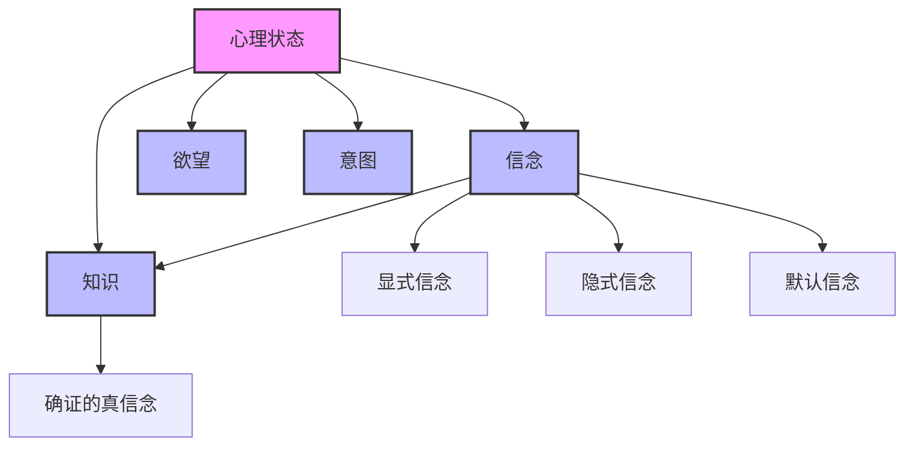

# 信念理论 (Belief Theory)

**创建时间**: 2025-01-15  
**最后更新**: 2025-01-15  
**文档状态**: 活跃  
**文档类型**: 概念定义  

## 1. 引言

### 1.1 背景

信念理论是认识论的核心组成部分，研究信念的本质、结构和合理性。信念作为知识的基础组成部分，在认知过程和推理系统中扮演着关键角色。理解信念的性质和运作机制不仅有助于解释人类认知，还能为形式科学中的不确定性推理和知识表示提供理论基础。

### 1.2 目标

本文档旨在：

1. 系统阐述信念的本质和特征
2. 分析信念系统的结构和组织
3. 探索信念的形式化表示方法
4. 考察信念理论在形式科学中的应用

### 1.3 相关概念

- **信念 (Belief)**: 对命题的接受或认可态度
- **命题态度 (Propositional Attitude)**: 主体对命题的心理状态
- **信念系统 (Belief System)**: 相互关联的信念集合
- **信念修正 (Belief Revision)**: 根据新信息调整信念的过程
- **信念度 (Degree of Belief)**: 对信念的确信程度

## 2. 信念的本质与特征

### 2.1 信念的基本定义

**定义 2.1.1** (信念)
信念是认知主体对命题的接受或认可态度，表示主体将该命题视为真的心理状态。

**定义 2.1.2** (信念谓词)
信念谓词 $B$ 是一个三元谓词，满足：
$$B(s, p, t) \iff \text{主体 } s \text{ 在时间 } t \text{ 相信命题 } p$$

### 2.2 信念的基本特征

信念具有以下基本特征：

1. **命题态度性**: 信念总是关于某个命题
2. **心理状态性**: 信念是主体的内在心理状态
3. **真值导向性**: 信念旨在把握真实情况
4. **行为倾向性**: 信念影响主体的行为决策
5. **程度变化性**: 信念可以有不同的强度或确信程度

### 2.3 信念与其他心理状态的关系

## 3. 信念系统结构

### 3.1 信念的逻辑结构

信念系统在逻辑上应满足以下性质：

**公理 3.1.1** (信念一致性)
理想的认知主体不应同时相信 $p$ 和 $\neg p$：
$$\neg(B(s, p, t) \land B(s, \neg p, t))$$

**公理 3.1.2** (信念闭合性)
如果主体相信 $p$ 且相信 $p \to q$，则主体也相信 $q$：
$$B(s, p, t) \land B(s, p \to q, t) \to B(s, q, t)$$

**定理 3.1.1** (信念合取)
$$B(s, p, t) \land B(s, q, t) \leftrightarrow B(s, p \land q, t)$$

### 3.2 信念网络

信念系统可以表示为信念网络：

**定义 3.2.1** (信念网络)
信念网络是一个有向图 $G = (V, E)$，其中：

- $V$ 是命题节点集合
- $E$ 是表示依赖关系的有向边集合

**定义 3.2.2** (信念依赖)
如果信念 $B(s, q, t)$ 依赖于信念 $B(s, p, t)$，则存在从 $p$ 到 $q$ 的有向路径。

### 3.3 信念层次

信念可以按层次结构组织：

1. **一阶信念**: 关于世界的信念
   - 例：$B(s, \text{"下雨"}, t)$

2. **二阶信念**: 关于信念的信念
   - 例：$B(s, B(s, \text{"下雨"}, t), t)$

3. **高阶信念**: 嵌套多层的信念
   - 例：$B(s_1, B(s_2, B(s_3, p, t), t), t)$

### 3.4 信念类型分类

| 信念类型 | 定义 | 特征 | 例子 |
|---------|------|------|------|
| 显式信念 | 主体明确认可的信念 | 可意识获取 | "我相信地球是圆的" |
| 隐式信念 | 从显式信念逻辑推导的信念 | 需要推理获取 | 相信勾股定理的推论 |
| 默认信念 | 未经反思的背景假设 | 通常不被质疑 | 相信物理定律稳定 |
| 基础信念 | 不依赖其他信念的信念 | 自证或自明 | 相信自己存在 |
| 派生信念 | 从其他信念推导的信念 | 依赖其他信念 | 科学理论推论 |

## 4. 信念的形式化表示

### 4.1 信念逻辑表示

信念可以通过模态逻辑进行形式化表示：

**定义 4.1.1** (信念逻辑语言)
信念逻辑语言 $\mathcal{L}_B$ 包含：

- 命题变元：$p, q, r, \ldots$
- 信念算子：$B_s$（表示主体s相信）
- 逻辑连接词：$\land, \lor, \neg, \to, \leftrightarrow$

**定义 4.1.2** (信念逻辑公理系统)
信念逻辑公理系统包括：

1. 所有命题逻辑的公理和规则
2. 分配公理：$B_s(p \to q) \to (B_s p \to B_s q)$
3. 一致性公理：$\neg B_s \bot$（不相信矛盾）
4. 正内省公理：$B_s p \to B_s B_s p$
5. 负内省公理：$\neg B_s p \to B_s \neg B_s p$

### 4.2 概率信念表示

使用概率理论表示信念度：

**定义 4.2.1** (信念度函数)
信念度函数 $P_s$ 将命题映射到 $[0,1]$ 区间：
$$P_s: \text{Proposition} \to [0,1]$$

**定义 4.2.2** (概率公理)
信念度函数满足概率公理：

1. $P_s(T) = 1$（必然命题的信念度为1）
2. $P_s(p) \geq 0$（信念度非负）
3. 如果 $p$ 和 $q$ 互斥，则 $P_s(p \lor q) = P_s(p) + P_s(q)$

### 4.3 贝叶斯信念网络

使用贝叶斯网络表示信念系统：

**定义 4.3.1** (贝叶斯信念网络)
贝叶斯信念网络是一个三元组 $BN = (G, X, P)$，其中：

- $G = (V, E)$ 是一个有向无环图
- $X = \{X_1, X_2, \ldots, X_n\}$ 是随机变量集合
- $P$ 是条件概率分布集合 $P(X_i | \text{Parents}(X_i))$

**定理 4.3.1** (联合概率分解)
贝叶斯网络中的联合概率可以分解为：
$$P(X_1, X_2, \ldots, X_n) = \prod_{i=1}^{n} P(X_i | \text{Parents}(X_i))$$

### 4.4 可能世界语义

使用可能世界语义解释信念：

**定义 4.4.1** (信念模型)
信念模型是一个三元组 $M = (W, R, V)$，其中：

- $W$ 是可能世界集合
- $R$ 是可达关系，$R \subseteq W \times W$
- $V$ 是赋值函数，将命题变元映射到世界集合

**定义 4.4.2** (信念满足条件)
$M, w \models B_s \phi$ 当且仅当对所有 $w'$ 使得 $wRw'$，有 $M, w' \models \phi$

## 5. 信念修正理论

### 5.1 信念修正操作

信念修正包括三种基本操作：

1. **扩充 (Expansion)**: 添加新信念而不移除任何现有信念
   - 表示：$K + p$（将p添加到信念集K中）

2. **修正 (Revision)**: 添加新信念并移除与之不一致的信念
   - 表示：$K * p$（用p修正信念集K）

3. **收缩 (Contraction)**: 移除特定信念
   - 表示：$K - p$（从信念集K中移除p）

### 5.2 AGM公理

AGM信念修正理论提出以下公理：

**公理 5.2.1** (闭合性)
$K * p$ 是逻辑闭合的信念集。

**公理 5.2.2** (成功性)
$p \in K * p$（修正后的信念集包含新信念）。

**公理 5.2.3** (包含性)
$K * p \subseteq K + p$（修正不添加不必要的信念）。

**公理 5.2.4** (一致性)
如果 $p$ 不是矛盾的，则 $K * p$ 不是矛盾的。

### 5.3 信念更新与贝叶斯更新

**定义 5.3.1** (贝叶斯更新)
当获得新证据 $e$ 时，信念度按以下方式更新：
$$P(h|e) = \frac{P(e|h) \times P(h)}{P(e)}$$

**定理 5.3.1** (荷兰赌注定理)
如果主体的信念度不遵循概率公理，则存在一系列赌注，使得主体无论如何都会遭受损失。

## 6. 信念的合理性

### 6.1 信念合理性标准

信念的合理性可以从以下几个方面评估：

1. **内部一致性**: 信念系统不包含矛盾
2. **外部一致性**: 信念与经验证据相符
3. **解释力**: 信念能够解释已知现象
4. **简洁性**: 信念系统尽可能简单
5. **可证伪性**: 信念可以被经验证据反驳

### 6.2 信念合理性理论

**定义 6.2.1** (信念合理性)
信念 $B(s, p, t)$ 是合理的，当且仅当存在充分理由 $R$ 支持 $p$，且 $s$ 基于 $R$ 形成对 $p$ 的信念。

**定理 6.2.1** (信念合理性与真理)
合理的信念更可能是真的，但合理性不保证真理。

### 6.3 认知偏见与信念形成

认知偏见影响信念形成过程：

1. **确认偏见**: 倾向于寻找支持已有信念的证据
2. **锚定效应**: 过度依赖首先获得的信息
3. **可得性启发式**: 基于容易想到的例子形成信念
4. **后见之明偏见**: 事后认为事件是可预测的

## 7. 应用案例

### 7.1 人工智能中的信念表示

信念理论在人工智能中的应用：

- **知识表示**: 使用信念逻辑表示智能体的知识状态
- **不确定性推理**: 使用贝叶斯网络处理不确定信息
- **多智能体系统**: 模拟智能体之间的信念交互

### 7.2 认知科学中的信念模型

信念理论在认知科学中的应用：

- **心智理论**: 研究人如何理解他人的信念
- **认知架构**: 在认知模型中表示信念结构
- **决策理论**: 分析信念如何影响决策过程

### 7.3 形式认识论中的信念分析

信念理论在形式认识论中的应用：

- **信念与知识关系**: 分析信念如何成为知识的组成部分
- **信念确证**: 研究信念的确证条件
- **信念的认识论价值**: 评估信念对认知目标的贡献

## 8. 相关引用

### 8.1 内部引用

- [知识理论](./01_Knowledge_Theory.md)
- [确证理论](./03_Justification_Theory.md)
- [真理理论](./04_Truth_Theory.md)
- [形式认识论](../../03_Logic_Theory/05_Formal_Epistemology.md)

### 8.2 外部引用

- Hintikka, J. (1962). *Knowledge and Belief: An Introduction to the Logic of the Two Notions*. Ithaca: Cornell University Press.
- Gärdenfors, P. (1988). *Knowledge in Flux: Modeling the Dynamics of Epistemic States*. Cambridge, MA: MIT Press.
- Jeffrey, R. (1983). *The Logic of Decision*. Chicago: University of Chicago Press.
- Stalnaker, R. (1984). *Inquiry*. Cambridge, MA: MIT Press.
