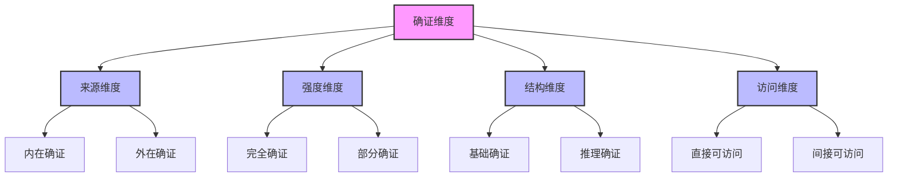
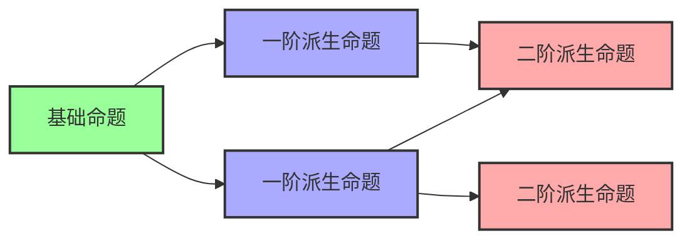

# 确证理论 (Justification Theory)

**创建时间**: 2025-01-15  
**最后更新**: 2025-01-15  
**文档状态**: 活跃  
**文档类型**: 概念定义  

## 1. 引言

### 1.1 背景

确证理论是认识论的核心组成部分，研究知识确证的方法、标准和结构。确证是将普通信念转化为知识的关键环节，为信念提供合理性基础。理解确证的本质和机制不仅有助于解决传统认识论问题，还能为形式科学中的证明方法和验证系统提供理论支持。

### 1.2 目标

本文档旨在：

1. 系统阐述确证的本质和类型
2. 分析不同的确证理论及其哲学基础
3. 探索确证关系的形式化表示方法
4. 考察确证理论在形式科学中的应用

### 1.3 相关概念

- **确证 (Justification)**: 使信念合理或有根据的性质或过程
- **证据 (Evidence)**: 支持信念的信息或理由
- **认识论地位 (Epistemic Status)**: 信念在认识论上的评价状态
- **确证结构 (Justification Structure)**: 确证关系的组织方式
- **确证标准 (Justification Standards)**: 评估确证有效性的准则

## 2. 确证的本质与类型

### 2.1 确证的基本定义

**定义 2.1.1** (确证)
确证是使信念在认识论上合理或有根据的性质或过程，是信念成为知识的必要条件之一。

**定义 2.1.2** (确证谓词)
确证谓词 $J$ 是一个三元谓词，满足：
$$J(s, p, t) \iff \text{主体 } s \text{ 在时间 } t \text{ 对命题 } p \text{ 有确证}$$

### 2.2 确证的基本类型

确证可以分为以下基本类型：

1. **命题确证 (Propositional Justification)**
   - 命题有被确证的性质
   - 与主体是否实际持有确证无关

2. **个人确证 (Personal Justification)**
   - 主体对信念有确证
   - 与主体的认知状态相关

3. **先天确证 (A Priori Justification)**
   - 不依赖经验的确证
   - 基于理性反思或概念分析

4. **后天确证 (A Posteriori Justification)**
   - 依赖经验的确证
   - 基于观察、实验或经验证据

### 2.3 确证的维度

确证可以沿多个维度分析：



### 2.4 确证类型分类表

| 确证类型 | 定义 | 特征 | 例子 |
|---------|------|------|------|
| 内在确证 | 基于主体内在状态的确证 | 主体可反思获取 | 通过直觉确证数学公理 |
| 外在确证 | 基于主体外部因素的确证 | 可能不被主体意识 | 通过可靠感知形成的信念 |
| 基础确证 | 不依赖其他确证的确证 | 自我支持 | 基本逻辑真理的确证 |
| 推理确证 | 通过推理获得的确证 | 依赖其他确证 | 从前提推导出结论的确证 |
| 完全确证 | 足以构成知识的确证 | 高度可靠 | 严格数学证明的确证 |
| 部分确证 | 增加信念合理性但不足以构成知识的确证 | 中等可靠 | 初步科学证据的确证 |

## 3. 确证理论流派

### 3.1 基础主义 (Foundationalism)

基础主义主张确证具有层级结构，某些基础信念不需要进一步确证：

**定义 3.1.1** (基础信念)
基础信念是不依赖其他信念而直接获得确证的信念。

**定义 3.1.2** (非基础信念)
非基础信念是通过与基础信念的推理关系获得确证的信念。

**公理 3.1.1** (基础主义原则)
所有确证的非基础信念最终都依赖于基础信念的确证。

**形式化表示**:

```text
// 基础主义确证结构
J(s, p, t) ↔ Basic(p) ∨ ∃q(Basic(q) ∧ Supports(q, p))

// 其中：
// Basic(p): p是基础命题
// Supports(q, p): q支持p
```

### 3.2 融贯主义 (Coherentism)

融贯主义主张确证来自信念系统内部的一致性和连贯性：

**定义 3.2.1** (信念融贯性)
信念融贯性是信念系统内部的逻辑一致性和相互支持关系。

**定义 3.2.2** (融贯确证)
融贯确证是信念通过与整个信念系统的融贯关系获得的确证。

**公理 3.2.1** (融贯主义原则)
信念的确证程度取决于其与整个信念系统的融贯程度。

**形式化表示**:

```text
// 融贯主义确证结构
J(s, p, t) ↔ ∃BS(BeliefSystem(BS) ∧ Member(p, BS) ∧ Coherent(BS))

// 其中：
// BeliefSystem(BS): BS是信念系统
// Member(p, BS): p是BS的成员
// Coherent(BS): BS是融贯的
```

### 3.3 可靠主义 (Reliabilism)

可靠主义主张确证来自可靠的信念形成过程：

**定义 3.3.1** (可靠过程)
可靠过程是通常产生真信念的认知过程。

**定义 3.3.2** (可靠确证)
可靠确证是信念通过可靠过程形成而获得的确证。

**公理 3.3.1** (可靠主义原则)
信念的确证程度取决于形成该信念的过程的可靠程度。

**形式化表示**:

```text
// 可靠主义确证结构
J(s, p, t) ↔ ∃P(Process(P) ∧ FormedBy(p, P) ∧ Reliable(P))

// 其中：
// Process(P): P是认知过程
// FormedBy(p, P): p通过P形成
// Reliable(P): P是可靠的
```

### 3.4 理论比较

| 理论 | 核心主张 | 优势 | 挑战 |
|------|---------|------|------|
| 基础主义 | 确证建立在不需要进一步确证的基础信念上 | 避免无限回溯 | 确定基础信念的标准 |
| 融贯主义 | 确证来自信念系统的整体融贯性 | 强调系统性 | 可能与真理脱节 |
| 可靠主义 | 确证来自可靠的信念形成过程 | 与自然化认识论兼容 | 定义可靠性的困难 |
| 德性认识论 | 确证来自认知德性的运用 | 整合主体因素 | 德性概念的模糊性 |

## 4. 确证结构与关系

### 4.1 线性确证结构

线性确证结构表示确证关系的单向链条：

**定义 4.1.1** (确证链)
确证链是一个命题序列 $p_1, p_2, \ldots, p_n$，其中每个 $p_i$ 为 $p_{i+1}$ 提供确证。

**定理 4.1.1** (确证传递性)
如果 $p$ 为 $q$ 提供确证，且 $q$ 为 $r$ 提供确证，则 $p$ 为 $r$ 提供确证。

### 4.2 网络确证结构

网络确证结构表示确证关系的复杂网络：

**定义 4.2.1** (确证网络)
确证网络是一个有向图 $G = (P, J)$，其中：

- $P$ 是命题集合
- $J$ 是确证关系，$J \subseteq P \times P$

**定义 4.2.2** (确证路径)
确证路径是确证网络中从命题 $p$ 到命题 $q$ 的有向路径，表示 $p$ 直接或间接地为 $q$ 提供确证。

### 4.3 确证强度

确证强度表示确证的程度或力量：

**定义 4.3.1** (确证强度函数)
确证强度函数 $JS$ 将主体、命题和时间映射到实数区间：
$$JS: \text{Subject} \times \text{Proposition} \times \text{Time} \to [0, 1]$$

**定理 4.3.1** (确证累积)
多个独立证据的累积确证强度通常大于单个证据的确证强度。

### 4.4 确证图表示



## 5. 确证的形式化表示

### 5.1 确证逻辑表示

确证可以通过模态逻辑进行形式化表示：

**定义 5.1.1** (确证逻辑语言)
确证逻辑语言 $\mathcal{L}_J$ 包含：

- 命题变元：$p, q, r, \ldots$
- 确证算子：$J_s$（表示主体s有确证）
- 逻辑连接词：$\land, \lor, \neg, \to, \leftrightarrow$

**定义 5.1.2** (确证逻辑公理系统)
确证逻辑公理系统包括：

1. 所有命题逻辑的公理和规则
2. 分配公理：$J_s(p \to q) \to (J_s p \to J_s q)$
3. 一致性公理：$\neg J_s \bot$（不能确证矛盾）
4. 知识确证公理：$K_s p \to J_s p$（知识蕴含确证）

### 5.2 确证概率表示

使用概率理论表示确证度：

**定义 5.2.1** (确证度函数)
确证度函数 $J_s$ 将命题映射到 $[0, 1]$ 区间：
$$J_s: \text{Proposition} \to [0, 1]$$

**定义 5.2.2** (贝叶斯确证)
命题 $e$ 为假设 $h$ 提供贝叶斯确证当且仅当：
$$P(h|e) > P(h)$$

### 5.3 确证图表示

使用图结构表示确证关系：

**定义 5.3.1** (确证图)
确证图是一个三元组 $JG = (P, J, W)$，其中：

- $P$ 是命题集合
- $J$ 是确证关系，$J \subseteq P \times P$
- $W$ 是权重函数，$W: J \to [0, 1]$，表示确证强度

**定义 5.3.2** (确证路径强度)
确证路径 $p_1, p_2, \ldots, p_n$ 的强度为路径上各边权重的函数，通常为最小值或乘积：
$$PathStrength(p_1, \ldots, p_n) = \min_{i=1}^{n-1} W(p_i, p_{i+1})$$
或
$$PathStrength(p_1, \ldots, p_n) = \prod_{i=1}^{n-1} W(p_i, p_{i+1})$$

### 5.4 类型论表示

使用依赖类型理论表示确证关系：

```text
// 基本类型
type Proposition
type Subject
type Time

// 确证类型
type Justification(s: Subject, p: Proposition, t: Time)

// 确证关系
type JustificationRelation = Π(p: Proposition, q: Proposition) Type
def justifies(p: Proposition, q: Proposition): JustificationRelation(p, q) = ...

// 确证强度
type JustificationStrength = Π(p: Proposition, q: Proposition) [0, 1]
def strength(p: Proposition, q: Proposition): JustificationStrength(p, q) = ...
```

## 6. 确证理论问题

### 6.1 格梯尔问题 (Gettier Problem)

格梯尔问题挑战了传统的"确证的真信念"知识定义：

**定义 6.1.1** (格梯尔案例)
格梯尔案例是主体拥有确证的真信念，但直觉上不构成知识的情境。

**定理 6.1.1** (格梯尔定理)
确证的真信念不足以构成知识，因为存在确证的真信念但不是知识的案例。

### 6.2 确证的无限回溯问题

确证的无限回溯问题质疑确证的最终来源：

**定义 6.2.1** (确证回溯)
确证回溯是指每个确证需要进一步确证的情况，可能导致无限回溯。

**定理 6.2.1** (三难困境)
确证理论面临三难困境：无限回溯、循环确证或武断终止。

### 6.3 内在主义与外在主义之争

内在主义与外在主义关于确证本质的争论：

**定义 6.3.1** (内在主义)
内在主义主张确证取决于主体内在可访问的因素。

**定义 6.3.2** (外在主义)
外在主义主张确证可以部分或完全取决于主体外部因素。

**定理 6.3.1** (内外之争)
内在主义强调主体视角和反思可获性，外在主义强调客观可靠性和真理联系。

## 7. 应用案例

### 7.1 数学证明的确证分析

确证理论在数学证明中的应用：

- **形式证明**: 基于公理和推理规则的严格确证
- **非形式证明**: 基于数学直觉和启发式的确证
- **计算机辅助证明**: 结合形式系统和计算机验证的确证

### 7.2 科学理论的确证模型

确证理论在科学方法中的应用：

- **假设检验**: 通过实验数据确证科学假设
- **理论选择**: 基于解释力、简洁性等确证标准选择理论
- **证据累积**: 多样证据的累积确证效应

### 7.3 人工智能中的确证机制

确证理论在人工智能中的应用：

- **知识表示**: 使用确证逻辑表示AI系统的知识状态
- **不确定推理**: 使用贝叶斯网络处理确证的不确定性
- **可解释AI**: 提供AI决策的确证和理由

## 8. 相关引用

### 8.1 内部引用

- [知识理论](./01_Knowledge_Theory.md)
- [信念理论](./02_Belief_Theory.md)
- [真理理论](./04_Truth_Theory.md)
- [形式逻辑](../../03_Logic_Theory/01_Formal_Logic.md)

### 8.2 外部引用

- Gettier, E. (1963). "Is Justified True Belief Knowledge?". *Analysis*, 23(6), 121-123.
- BonJour, L. (1985). *The Structure of Empirical Knowledge*. Cambridge, MA: Harvard University Press.
- Goldman, A. (1979). "What is Justified Belief?". In G. Pappas (Ed.), *Justification and Knowledge*. Dordrecht: Reidel.
- Sosa, E. (2007). *A Virtue Epistemology: Apt Belief and Reflective Knowledge*. Oxford: Oxford University Press.
