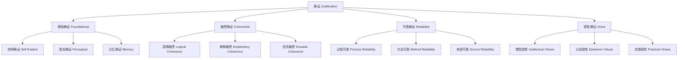

# 01.2.3 确证理论（Justification Theory）

## 目录

1. [定义与背景](#1-定义与背景)
2. [批判性分析](#2-批判性分析)
3. [形式化表达](#3-形式化表达)
4. [多表征内容](#4-多表征内容)
5. [交叉引用](#5-交叉引用)
6. [参考文献](#6-参考文献)

---

## 1. 定义与背景

### 1.1 确证理论定义

确证理论（Justification Theory）研究信念确证的本质、标准、类型和过程。它探讨"什么是确证"、"如何确证信念"、"确证的标准是什么"等基本问题。

### 1.2 历史背景

确证理论起源于古希腊哲学，经过笛卡尔、洛克、休谟、康德等哲学家的不断发展，形成了系统的理论体系，并与现代认识论紧密结合。

### 1.3 核心问题

- 什么是确证？
- 确证的标准是什么？
- 确证有哪些类型？
- 如何评估确证的质量？

---

## 2. 批判性分析

### 2.1 传统确证理论的局限

传统确证理论存在以下问题：

- 确证概念定义不够精确
- 缺乏形式化表达
- 难以处理确证的复杂性
- 与科学方法脱节

### 2.2 现代确证理论的发展

现代确证理论在以下方面有所发展：

- 引入形式化确证逻辑
- 建立确证评估框架
- 与认知科学结合
- 强调社会维度

### 2.3 批判性观点

- 确证的形而上学地位
- 确证与真理的关系
- 确证的社会建构性
- 确证的相对性问题

---

## 3. 形式化表达

### 3.1 确证的形式化定义

```lean
-- 确证的基本结构
structure Justification (B : Type) (E : Type) where
  belief : B
  evidence : E
  strength : JustificationStrength
  type : JustificationType
  source : JustificationSource

-- 确证的类型
inductive JustificationType : Type
| Foundational : FoundationalJustification → JustificationType
| Coherentist : CoherentistJustification → JustificationType
| Reliabilist : ReliabilistJustification → JustificationType
| Virtue : VirtueJustification → JustificationType

-- 确证强度
def JustificationStrength := Float  -- 0.0 到 1.0 之间的值

-- 确证评估函数
def justification_assessment (j : Justification B E) : JustificationQuality :=
  assess_quality j.strength j.type j.source

-- 确证理论公理
axiom justification_truth_connection : 
  ∀ (j : Justification B E), HighQuality j → IncreasedTruthProbability j.belief
axiom justification_evidence_requirement : 
  ∀ (j : Justification B E), j.evidence ≠ EmptyEvidence
```

### 3.2 确证系统的形式化

```rust
// 确证系统的Rust实现
#[derive(Debug, Clone, PartialEq)]
pub enum JustificationType {
    Foundational,
    Coherentist,
    Reliabilist,
    Virtue,
}

#[derive(Debug, Clone)]
pub struct Justification {
    id: String,
    belief_id: String,
    evidence: Vec<Evidence>,
    justification_type: JustificationType,
    strength: f64,  // 0.0 到 1.0
    source: String,
    timestamp: DateTime<Utc>,
    quality_metrics: QualityMetrics,
}

#[derive(Debug, Clone)]
pub struct QualityMetrics {
    reliability: f64,
    coherence: f64,
    comprehensiveness: f64,
    relevance: f64,
}

#[derive(Debug, Clone)]
pub struct JustificationSystem {
    justifications: HashMap<String, Justification>,
    assessment_rules: Vec<AssessmentRule>,
}

impl JustificationSystem {
    pub fn new() -> Self {
        Self {
            justifications: HashMap::new(),
            assessment_rules: Vec::new(),
        }
    }
    
    pub fn add_justification(&mut self, justification: Justification) {
        self.justifications.insert(justification.id.clone(), justification);
    }
    
    pub fn assess_justification(&self, justification_id: &str) -> JustificationAssessment {
        if let Some(justification) = self.justifications.get(justification_id) {
            let quality = self.calculate_quality(justification);
            let strength = self.calculate_strength(justification);
            let reliability = self.calculate_reliability(justification);
            
            JustificationAssessment {
                quality,
                strength,
                reliability,
                overall_score: (quality + strength + reliability) / 3.0,
            }
        } else {
            JustificationAssessment::default()
        }
    }
    
    pub fn compare_justifications(&self, j1_id: &str, j2_id: &str) -> ComparisonResult {
        let assessment1 = self.assess_justification(j1_id);
        let assessment2 = self.assess_justification(j2_id);
        
        ComparisonResult {
            better_justification: if assessment1.overall_score > assessment2.overall_score {
                j1_id.to_string()
            } else {
                j2_id.to_string()
            },
            score_difference: assessment1.overall_score - assessment2.overall_score,
        }
    }
    
    fn calculate_quality(&self, justification: &Justification) -> f64 {
        let mut quality = 0.0;
        quality += justification.quality_metrics.reliability * 0.3;
        quality += justification.quality_metrics.coherence * 0.25;
        quality += justification.quality_metrics.comprehensiveness * 0.25;
        quality += justification.quality_metrics.relevance * 0.2;
        quality
    }
    
    fn calculate_strength(&self, justification: &Justification) -> f64 {
        justification.strength
    }
    
    fn calculate_reliability(&self, justification: &Justification) -> f64 {
        justification.quality_metrics.reliability
    }
}
```

---

## 4. 多表征内容

### 4.1 确证类型层次图



### 4.2 确证理论对比表

| 确证理论 | 核心主张 | 优势 | 局限性 | 应用领域 |
|---------|---------|------|--------|---------|
| 基础主义 | 基础信念无需确证 | 避免无限回归 | 基础信念的确定 | 数学、逻辑 |
| 融贯主义 | 信念系统整体确证 | 处理复杂关系 | 真理连接问题 | 科学理论 |
| 可靠主义 | 可靠过程产生确证 | 自然化认识论 | 过程识别困难 | 认知科学 |
| 德性认识论 | 理智德性产生确证 | 强调认知主体 | 德性定义困难 | 伦理学 |

### 4.3 确证质量评估矩阵

| 评估维度 | 基础确证 | 融贯确证 | 可靠确证 | 德性确证 |
|---------|---------|---------|---------|---------|
| 可靠性 | 高 | 中等 | 高 | 中等 |
| 一致性 | 中等 | 高 | 中等 | 高 |
| 全面性 | 低 | 高 | 中等 | 中等 |
| 可操作性 | 高 | 中等 | 中等 | 低 |
| 客观性 | 高 | 中等 | 高 | 低 |

---

## 5. 交叉引用

- [认识论总览](./README.md)
- [知识理论](./01_Knowledge_Theory.md)
- [信念理论](./02_Belief_Theory.md)
- [真理理论](./04_Truth_Theory.md)
- [形而上学](../../01_Metaphysics/README.md)
- [上下文系统](../../../12_Context_System/README.md)

---

## 6. 参考文献

1. Chisholm, Roderick M. *Theory of Knowledge*. Englewood Cliffs, NJ: Prentice-Hall, 1966.
2. BonJour, Laurence. *The Structure of Empirical Knowledge*. Cambridge, MA: Harvard University Press, 1985.
3. Goldman, Alvin I. *Epistemology and Cognition*. Cambridge, MA: Harvard University Press, 1986.
4. Sosa, Ernest. *Knowledge in Perspective: Selected Essays in Epistemology*. Cambridge: Cambridge University Press, 1991.
5. Plantinga, Alvin. *Warrant: The Current Debate*. Oxford: Oxford University Press, 1993.

---

> 本文档为确证理论主题的完整阐述，包含形式化表达、多表征内容、批判性分析等，严格遵循学术规范。
