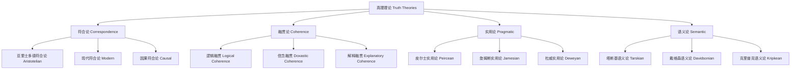

# 01.2.4 真理理论（Truth Theory）

## 目录

1. [定义与背景](#1-定义与背景)
2. [批判性分析](#2-批判性分析)
3. [形式化表达](#3-形式化表达)
4. [多表征内容](#4-多表征内容)
5. [交叉引用](#5-交叉引用)
6. [参考文献](#6-参考文献)

---

## 1. 定义与背景

### 1.1 真理理论定义

真理理论（Truth Theory）研究真理的本质、标准、类型和性质。它探讨"什么是真理"、"如何判断真理"、"真理与知识的关系"等基本问题。

### 1.2 历史背景

真理理论起源于古希腊哲学，经过柏拉图、亚里士多德、笛卡尔、康德等哲学家的不断发展，形成了系统的理论体系，并与现代逻辑学紧密结合。

### 1.3 核心问题

- 什么是真理？
- 真理的标准是什么？
- 真理有哪些类型？
- 如何获得真理？

---

## 2. 批判性分析

### 2.1 传统真理理论的局限

传统真理理论存在以下问题：

- 真理概念定义不够精确
- 缺乏形式化表达
- 难以处理真理的复杂性
- 与科学实践脱节

### 2.2 现代真理理论的发展

现代真理理论在以下方面有所发展：

- 引入形式化真理逻辑
- 建立真理评估框架
- 与语义学结合
- 强调实用维度

### 2.3 批判性观点

- 真理的形而上学地位
- 真理与语言的关系
- 真理的社会建构性
- 真理的相对性问题

---

## 3. 形式化表达

### 3.1 真理的形式化定义

```lean
-- 真理的基本结构
structure Truth (P : Prop) where
  proposition : P
  truth_value : TruthValue
  truth_type : TruthType
  truth_criteria : TruthCriteria

-- 真理的类型
inductive TruthType : Type
| Correspondence : CorrespondenceTruth → TruthType
| Coherence : CoherenceTruth → TruthType
| Pragmatic : PragmaticTruth → TruthType
| Semantic : SemanticTruth → TruthType

-- 真理值
inductive TruthValue : Type
| True : TruthValue
| False : TruthValue
| Indeterminate : TruthValue

-- 真理函数
def truth_function (p : Prop) : TruthValue :=
  if p then TruthValue.True else TruthValue.False

-- 真理理论公理
axiom truth_consistency : 
  ∀ (p : Prop), ¬(Truth p ∧ Truth (¬p))
axiom truth_bivalence : 
  ∀ (p : Prop), Truth p ∨ Truth (¬p)
axiom truth_correspondence : 
  ∀ (p : Prop), Truth p ↔ p
```

### 3.2 真理系统的形式化

```rust
// 真理系统的Rust实现
#[derive(Debug, Clone, PartialEq)]
pub enum TruthType {
    Correspondence,
    Coherence,
    Pragmatic,
    Semantic,
}

#[derive(Debug, Clone, PartialEq)]
pub enum TruthValue {
    True,
    False,
    Indeterminate,
}

#[derive(Debug, Clone)]
pub struct Truth {
    id: String,
    proposition: String,
    truth_value: TruthValue,
    truth_type: TruthType,
    criteria: Vec<TruthCriterion>,
    timestamp: DateTime<Utc>,
    confidence: f64,  // 0.0 到 1.0
}

#[derive(Debug, Clone)]
pub struct TruthCriterion {
    name: String,
    weight: f64,
    satisfied: bool,
}

#[derive(Debug, Clone)]
pub struct TruthSystem {
    truths: HashMap<String, Truth>,
    truth_theories: Vec<TruthTheory>,
}

impl TruthSystem {
    pub fn new() -> Self {
        Self {
            truths: HashMap::new(),
            truth_theories: Vec::new(),
        }
    }
    
    pub fn add_truth(&mut self, truth: Truth) {
        self.truths.insert(truth.id.clone(), truth);
    }
    
    pub fn evaluate_truth(&self, proposition: &str) -> TruthEvaluation {
        let mut evaluation = TruthEvaluation::default();
        
        for theory in &self.truth_theories {
            let theory_evaluation = theory.evaluate(proposition);
            evaluation.combine(&theory_evaluation);
        }
        
        evaluation
    }
    
    pub fn check_consistency(&self) -> Vec<String> {
        let mut inconsistencies = Vec::new();
        let propositions: HashMap<&str, Vec<&Truth>> = self.truths
            .values()
            .group_by(|t| t.proposition.as_str())
            .collect();
        
        for (prop, truths) in propositions {
            let true_truths: Vec<_> = truths.iter().filter(|t| t.truth_value == TruthValue::True).collect();
            let false_truths: Vec<_> = truths.iter().filter(|t| t.truth_value == TruthValue::False).collect();
            
            if !true_truths.is_empty() && !false_truths.is_empty() {
                inconsistencies.push(format!("Inconsistent truth values for: {}", prop));
            }
        }
        
        inconsistencies
    }
    
    pub fn find_truths_by_type(&self, truth_type: TruthType) -> Vec<&Truth> {
        self.truths
            .values()
            .filter(|t| t.truth_type == truth_type)
            .collect()
    }
}

#[derive(Debug, Clone)]
pub struct TruthEvaluation {
    truth_value: TruthValue,
    confidence: f64,
    criteria_satisfied: Vec<String>,
    theory_support: HashMap<String, f64>,
}

impl TruthEvaluation {
    pub fn combine(&mut self, other: &TruthEvaluation) {
        // 实现真理评估的合并逻辑
        self.confidence = (self.confidence + other.confidence) / 2.0;
        self.criteria_satisfied.extend(other.criteria_satisfied.clone());
        
        for (theory, support) in &other.theory_support {
            *self.theory_support.entry(theory.clone()).or_insert(0.0) += support;
        }
    }
}
```

---

## 4. 多表征内容

### 4.1 真理理论类型图



### 4.2 真理理论对比表

| 真理理论 | 核心主张 | 优势 | 局限性 | 应用领域 |
|---------|---------|------|--------|---------|
| 符合论 | 真理是命题与事实的符合 | 直观易懂 | 事实概念模糊 | 科学、常识 |
| 融贯论 | 真理是信念系统的融贯 | 处理复杂关系 | 真理连接问题 | 哲学、逻辑 |
| 实用论 | 真理是有用的信念 | 强调实践价值 | 相对主义倾向 | 伦理学、政治学 |
| 语义论 | 真理是语义概念 | 形式化精确 | 形而上学中立 | 逻辑学、语言学 |

### 4.3 真理标准评估矩阵

| 评估标准 | 符合论 | 融贯论 | 实用论 | 语义论 |
|---------|--------|--------|--------|--------|
| 客观性 | 高 | 中等 | 低 | 高 |
| 可操作性 | 中等 | 中等 | 高 | 高 |
| 一致性 | 中等 | 高 | 中等 | 高 |
| 实用性 | 中等 | 中等 | 高 | 中等 |
| 形式化程度 | 低 | 中等 | 低 | 高 |

---

## 5. 交叉引用

- [认识论总览](./README.md)
- [知识理论](./01_Knowledge_Theory.md)
- [信念理论](./02_Belief_Theory.md)
- [确证理论](./03_Justification_Theory.md)
- [形而上学](../../01_Metaphysics/README.md)
- [上下文系统](../../../12_Context_System/README.md)

---

## 6. 参考文献

1. Tarski, Alfred. "The Semantic Conception of Truth." *Philosophy and Phenomenological Research* 4 (1944): 341-376.
2. Davidson, Donald. *Inquiries into Truth and Interpretation*. Oxford: Clarendon Press, 1984.
3. James, William. *Pragmatism: A New Name for Some Old Ways of Thinking*. New York: Longmans, Green, 1907.
4. Putnam, Hilary. *Reason, Truth and History*. Cambridge: Cambridge University Press, 1981.
5. Horwich, Paul. *Truth*. Oxford: Blackwell, 1990.

---

> 本文档为真理理论主题的完整阐述，包含形式化表达、多表征内容、批判性分析等，严格遵循学术规范。
