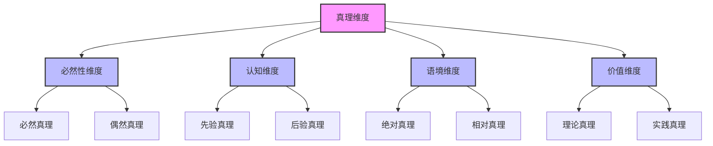
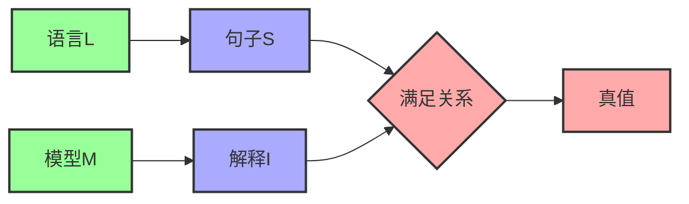

# 真理理论 (Truth Theory)

**创建时间**: 2025-01-15  
**最后更新**: 2025-01-15  
**文档状态**: 活跃  
**文档类型**: 概念定义  

## 1. 引言

### 1.1 背景

真理理论是认识论和形而上学的核心研究领域，探讨真理的本质、标准和类型。真理概念在知识定义中扮演着关键角色，因为知识通常被理解为确证的真信念。理解真理的本质不仅有助于解决哲学中的基本问题，还能为形式科学中的语义理论和验证系统提供理论基础。

### 1.2 目标

本文档旨在：

1. 系统阐述真理的本质和类型
2. 分析不同的真理理论及其哲学基础
3. 探索真理概念的形式化表示方法
4. 考察真理理论在形式科学中的应用

### 1.3 相关概念

- **真理 (Truth)**: 命题与实在相符合的性质
- **真值 (Truth Value)**: 命题的真假状态
- **真理载体 (Truth Bearer)**: 能够具有真值的实体，如命题、语句或信念
- **真理制造者 (Truth Maker)**: 使真理载体为真的实在方面
- **真理条件 (Truth Condition)**: 使命题为真的必要充分条件

## 2. 真理的本质与类型

### 2.1 真理的基本定义

**定义 2.1.1** (真理)
真理是命题与其所描述的实在之间的一种对应关系，表示命题准确反映了实在的状况。

**定义 2.1.2** (真值谓词)
真值谓词 $T$ 是一个一元谓词，满足：
$$T(p) \iff \text{命题 } p \text{ 为真}$$

### 2.2 真理的基本类型

真理可以分为以下基本类型：

1. **必然真理 (Necessary Truth)**
   - 在所有可能世界中都为真的命题
   - 例：逻辑真理、数学真理

2. **偶然真理 (Contingent Truth)**
   - 在实际世界为真但在某些可能世界为假的命题
   - 例：经验事实、历史事件

3. **分析真理 (Analytic Truth)**
   - 仅凭概念分析就能确定真值的命题
   - 例：所有单身汉都是未婚的

4. **综合真理 (Synthetic Truth)**
   - 需要参考经验才能确定真值的命题
   - 例：地球绕太阳运行

### 2.3 真理的维度

真理可以沿多个维度分析：



### 2.4 真理类型分类表

| 真理类型 | 定义 | 特征 | 例子 |
|---------|------|------|------|
| 必然真理 | 不可能为假的真理 | 在所有可能世界中为真 | 2+2=4 |
| 偶然真理 | 可能为假的真理 | 依赖于实际世界状态 | 巴黎是法国首都 |
| 分析真理 | 基于概念关系的真理 | 通过概念分析可知 | 所有三角形有三边 |
| 综合真理 | 基于经验事实的真理 | 需要经验验证 | 水在100°C沸腾 |
| 先验真理 | 不依赖经验的真理 | 通过理性可知 | 逻辑公理 |
| 后验真理 | 依赖经验的真理 | 需要经验证据 | 科学定律 |

## 3. 真理理论流派

### 3.1 对应论 (Correspondence Theory)

对应论主张真理是命题与事实之间的对应关系：

**定义 3.1.1** (对应关系)
对应关系是命题结构与事实结构之间的同构映射。

**定义 3.1.2** (对应真理)
命题p为真当且仅当存在与p相对应的事实。

**公理 3.1.1** (对应原则)
$$T(p) \iff \exists f(\text{Fact}(f) \land \text{Corresponds}(p, f))$$

**形式化表示**:

```text
// 对应论真理定义
T(p) ↔ ∃f(Fact(f) ∧ Corresponds(p, f))

// 其中：
// Fact(f): f是事实
// Corresponds(p, f): p与f相对应
```

### 3.2 融贯论 (Coherence Theory)

融贯论主张真理是命题与整个信念系统的一致性：

**定义 3.2.1** (融贯关系)
融贯关系是命题与信念系统之间的逻辑一致性和相互支持关系。

**定义 3.2.2** (融贯真理)
命题p为真当且仅当p与最佳信念系统融贯。

**公理 3.2.1** (融贯原则)
$$T(p) \iff \exists BS(\text{BestSystem}(BS) \land \text{Coheres}(p, BS))$$

**形式化表示**:

```text
// 融贯论真理定义
T(p) ↔ ∃BS(BestSystem(BS) ∧ Coheres(p, BS))

// 其中：
// BestSystem(BS): BS是最佳信念系统
// Coheres(p, BS): p与BS融贯
```

### 3.3 实用论 (Pragmatic Theory)

实用论主张真理是有实用价值的信念：

**定义 3.3.1** (实用价值)
实用价值是信念在实践中产生有益后果的能力。

**定义 3.3.2** (实用真理)
命题p为真当且仅当相信p具有最大的实用价值。

**公理 3.3.1** (实用原则)
$$T(p) \iff \text{MaxUtility}(\text{Believe}(p))$$

**形式化表示**:

```text
// 实用论真理定义
T(p) ↔ MaxUtility(Believe(p))

// 其中：
// Believe(p): 相信p
// MaxUtility(b): b具有最大实用价值
```

### 3.4 共识论 (Consensus Theory)

共识论主张真理是理想条件下的共识：

**定义 3.4.1** (理想共识)
理想共识是在理想认识条件下达成的一致意见。

**定义 3.4.2** (共识真理)
命题p为真当且仅当p在理想条件下会成为共识。

**公理 3.4.1** (共识原则)
$$T(p) \iff \text{IdealConsensus}(p)$$

**形式化表示**:

```text
// 共识论真理定义
T(p) ↔ IdealConsensus(p)

// 其中：
// IdealConsensus(p): p在理想条件下是共识
```

### 3.5 理论比较

| 理论 | 核心主张 | 优势 | 挑战 |
|------|---------|------|------|
| 对应论 | 真理是命题与事实的对应 | 符合常识直觉 | 解释对应关系的困难 |
| 融贯论 | 真理是与最佳信念系统的融贯 | 强调系统性 | 可能与实在脱节 |
| 实用论 | 真理是具有实用价值的信念 | 强调实践意义 | 可能导致相对主义 |
| 共识论 | 真理是理想条件下的共识 | 强调交互验证 | 理想条件难以定义 |
| 最小论 | 真理是一个最小逻辑概念 | 避免形而上学负担 | 解释力有限 |

## 4. 形式语言中的真理

### 4.1 塔尔斯基真理定义

塔尔斯基提出了形式语言中的真理定义：

**定义 4.1.1** (满足关系)
满足关系是对象序列与开放公式之间的关系，表示序列使公式为真。

**定义 4.1.2** (真句子)
在语言L中，句子S为真当且仅当S在模型M中被满足。

**公理 4.1.1** (塔尔斯基模式)
$$T(\text{"P"}) \iff P$$

**例子**:

```text
// 塔尔斯基真理定义示例
T("雪是白的") ↔ 雪是白的
```

### 4.2 真理的不可定义性定理

塔尔斯基证明了在足够强的形式系统中，真理不可定义：

**定理 4.2.1** (不可定义性定理)
在包含基本算术的形式系统中，该系统的真理谓词不能在系统内部定义。

**证明概要**:
使用对角线论证，可以构造一个与真理谓词相矛盾的句子。

### 4.3 克里普克真理理论

克里普克提出了处理真理悖论的部分真理理论：

**定义 4.3.1** (真值间隙)
真值间隙是既不为真也不为假的语句。

**定义 4.3.2** (固定点)
固定点是真理谓词的解释，使得进一步应用真理谓词不改变任何句子的真值。

**定理 4.3.1** (最小固定点)
存在真理谓词的最小固定点解释。

### 4.4 真理的形式化表示



## 5. 真理的形式化表示

### 5.1 集合论表示

使用集合论表示真理概念：

**定义 5.1.1** (真命题集)
真命题集是所有真命题的集合：
$$\text{TRUE} = \{p \in \text{PROP} \mid T(p)\}$$

**定义 5.1.2** (真理制造者函数)
真理制造者函数将命题映射到使其为真的事实集合：
$$TM: \text{PROP} \to \mathcal{P}(\text{FACT})$$

### 5.2 模型论表示

使用模型论表示真理概念：

**定义 5.2.1** (模型满足)
模型M满足公式φ，记作$M \models \phi$，当且仅当φ在M中为真。

**定义 5.2.2** (逻辑真理)
公式φ是逻辑真理，当且仅当所有模型都满足φ：
$$\models \phi \iff \forall M(M \models \phi)$$

### 5.3 类型论表示

使用依赖类型理论表示真理概念：

```text
// 基本类型
type Prop           // 命题类型
type True(p: Prop)  // p为真的证明类型

// 真理函数
def isTrue(p: Prop): Bool = ...

// 真理类型
type TruthValue = {true, false}
def truthValue(p: Prop): TruthValue = 
  if isTrue(p) then true else false

// 真理制造者
type TruthMaker(p: Prop) = Σ(f: Fact) Makes(f, p)
def truthMaker(p: Prop): Option[TruthMaker(p)] = ...
```

### 5.4 真理算子表示

使用真理算子表示真理概念：

**定义 5.4.1** (真理算子)
真理算子T是一个一元算子，满足：
$$T(p) \iff p$$

**定理 5.4.1** (真理算子性质)
真理算子满足以下性质：

1. $T(p \land q) \iff T(p) \land T(q)$
2. $T(p \lor q) \iff T(p) \lor T(q)$
3. $T(\neg p) \iff \neg T(p)$
4. $T(T(p)) \iff T(p)$

## 6. 真理理论问题

### 6.1 说谎者悖论 (Liar Paradox)

说谎者悖论是真理理论面临的核心挑战：

**定义 6.1.1** (说谎者句子)
说谎者句子L是一个自我指称的句子，声称自己为假：
$$L = \text{"L是假的"}$$

**定理 6.1.1** (悖论结果)
假设L有确定真值，则L为真当且仅当L为假，导致矛盾。

### 6.2 真理的相对性问题

真理的相对性问题质疑绝对真理的可能性：

**定义 6.2.1** (真理相对性)
真理相对性是指真值可能依赖于语境、概念框架或评价标准。

**定理 6.2.1** (相对性论证)
不同概念框架可能导致不同的真值判断，挑战绝对真理的概念。

### 6.3 真理与意义的关系

真理与意义的关系是语言哲学的核心问题：

**定义 6.3.1** (真理条件语义)
真理条件语义将句子的意义等同于其真值条件。

**定理 6.3.1** (意义-真理关系)
理解句子的意义等价于知道使其为真的条件。

## 7. 应用案例

### 7.1 形式系统中的真理

真理理论在形式系统中的应用：

- **形式语义学**: 使用真值条件定义形式语言的语义
- **模型检验**: 验证系统是否满足特定属性
- **证明理论**: 分析形式系统中的真理概念

### 7.2 科学理论中的真理

真理理论在科学方法中的应用：

- **科学实在论**: 科学理论是否描述了实在真相
- **理论真值**: 科学理论的近似真理概念
- **经验充分性**: 理论与经验证据的一致性

### 7.3 人工智能中的真理

真理理论在人工智能中的应用：

- **知识表示**: 使用真值语义表示AI系统的知识
- **推理系统**: 基于真值的逻辑推理机制
- **不确定性处理**: 扩展真值概念处理不确定性

## 8. 相关引用

### 8.1 内部引用

- [知识理论](./01_Knowledge_Theory.md)
- [信念理论](./02_Belief_Theory.md)
- [确证理论](./03_Justification_Theory.md)
- [形式语义学](../../04_Formal_Language_Theory/03_Formal_Semantics.md)

### 8.2 外部引用

- Tarski, A. (1944). "The Semantic Conception of Truth and the Foundations of Semantics". *Philosophy and Phenomenological Research*, 4(3), 341-376.
- Kripke, S. (1975). "Outline of a Theory of Truth". *Journal of Philosophy*, 72(19), 690-716.
- Davidson, D. (1967). "Truth and Meaning". *Synthese*, 17(1), 304-323.
- Horwich, P. (1998). *Truth*. Oxford: Oxford University Press.
