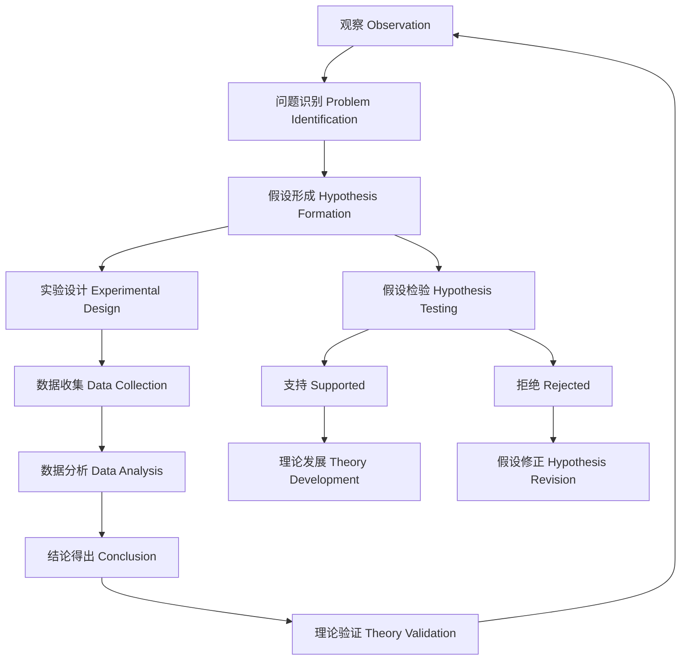

# 01.3.1 科学方法（Scientific Method）

## 目录

1. [定义与背景](#1-定义与背景)
2. [批判性分析](#2-批判性分析)
3. [形式化表达](#3-形式化表达)
4. [多表征内容](#4-多表征内容)
5. [交叉引用](#5-交叉引用)
6. [参考文献](#6-参考文献)

---

## 1. 定义与背景

### 1.1 科学方法定义

科学方法（Scientific Method）是系统性的研究程序，用于获取知识、验证假设和建立理论。它包括观察、假设、实验、分析和结论等步骤。

### 1.2 历史背景

科学方法起源于古希腊哲学，经过伽利略、培根、笛卡尔、波普尔等科学家的不断发展，形成了系统的理论体系，成为现代科学研究的基础。

### 1.3 核心问题

- 什么是科学方法？
- 科学方法有哪些步骤？
- 如何保证科学方法的有效性？
- 科学方法的局限性是什么？

---

## 2. 批判性分析

### 2.1 传统科学方法的局限

传统科学方法存在以下问题：

- 过于简化复杂现象
- 难以处理不可观察实体
- 缺乏对主观因素的考虑
- 与社会文化脱节

### 2.2 现代科学方法的发展

现代科学方法在以下方面有所发展：

- 引入复杂性科学方法
- 建立跨学科研究范式
- 与人工智能结合
- 强调可重复性和透明度

### 2.3 批判性观点

- 科学方法的普遍性假设
- 科学与社会的关系
- 科学方法的价值观中立性
- 科学方法的可操作性

---

## 3. 形式化表达

### 3.1 科学方法的形式化定义

```lean
-- 科学方法的基本结构
structure ScientificMethod where
  observation : Observation
  hypothesis : Hypothesis
  experiment : Experiment
  analysis : Analysis
  conclusion : Conclusion

-- 科学方法的步骤
inductive MethodStep : Type
| Observe : Observation → MethodStep
| Hypothesize : Hypothesis → MethodStep
| Experiment : Experiment → MethodStep
| Analyze : Analysis → MethodStep
| Conclude : Conclusion → MethodStep

-- 假设验证函数
def hypothesis_testing (h : Hypothesis) (e : Experiment) : TestResult :=
  if e.results.support h then TestResult.Supported
  else TestResult.Refuted

-- 科学方法公理
axiom reproducibility_requirement : 
  ∀ (e : Experiment), Reproducible e → Valid e
axiom falsifiability_requirement : 
  ∀ (h : Hypothesis), Falsifiable h → Scientific h
```

### 3.2 科学方法的计算实现

```rust
// 科学方法的Rust实现
#[derive(Debug, Clone, PartialEq)]
pub enum MethodStep {
    Observation(Observation),
    Hypothesis(Hypothesis),
    Experiment(Experiment),
    Analysis(Analysis),
    Conclusion(Conclusion),
}

#[derive(Debug, Clone)]
pub struct Observation {
    id: String,
    description: String,
    data: Vec<DataPoint>,
    timestamp: DateTime<Utc>,
    observer: String,
}

#[derive(Debug, Clone)]
pub struct Hypothesis {
    id: String,
    statement: String,
    variables: Vec<Variable>,
    predictions: Vec<Prediction>,
    falsifiable: bool,
}

#[derive(Debug, Clone)]
pub struct Experiment {
    id: String,
    hypothesis_id: String,
    design: ExperimentalDesign,
    procedure: Vec<ProcedureStep>,
    results: Vec<Result>,
    controls: Vec<Control>,
}

#[derive(Debug, Clone)]
pub struct ScientificMethod {
    steps: Vec<MethodStep>,
    current_step: usize,
    metadata: MethodMetadata,
}

impl ScientificMethod {
    pub fn new() -> Self {
        Self {
            steps: Vec::new(),
            current_step: 0,
            metadata: MethodMetadata::default(),
        }
    }
    
    pub fn add_step(&mut self, step: MethodStep) {
        self.steps.push(step);
    }
    
    pub fn execute_step(&mut self) -> Result<StepResult, String> {
        if self.current_step >= self.steps.len() {
            return Err("No more steps to execute".to_string());
        }
        
        let step = &self.steps[self.current_step];
        let result = match step {
            MethodStep::Observation(obs) => self.execute_observation(obs),
            MethodStep::Hypothesis(hyp) => self.execute_hypothesis(hyp),
            MethodStep::Experiment(exp) => self.execute_experiment(exp),
            MethodStep::Analysis(ana) => self.execute_analysis(ana),
            MethodStep::Conclusion(con) => self.execute_conclusion(con),
        };
        
        self.current_step += 1;
        result
    }
    
    pub fn validate_method(&self) -> Vec<String> {
        let mut issues = Vec::new();
        
        // 检查步骤完整性
        if self.steps.is_empty() {
            issues.push("No steps defined".to_string());
        }
        
        // 检查假设的可证伪性
        for step in &self.steps {
            if let MethodStep::Hypothesis(hyp) = step {
                if !hyp.falsifiable {
                    issues.push(format!("Hypothesis {} is not falsifiable", hyp.id));
                }
            }
        }
        
        // 检查实验的可重复性
        for step in &self.steps {
            if let MethodStep::Experiment(exp) = step {
                if !self.is_reproducible(exp) {
                    issues.push(format!("Experiment {} may not be reproducible", exp.id));
                }
            }
        }
        
        issues
    }
    
    fn execute_observation(&self, obs: &Observation) -> Result<StepResult, String> {
        // 实现观察步骤
        Ok(StepResult::ObservationCompleted(obs.clone()))
    }
    
    fn execute_hypothesis(&self, hyp: &Hypothesis) -> Result<StepResult, String> {
        // 实现假设步骤
        Ok(StepResult::HypothesisFormulated(hyp.clone()))
    }
    
    fn execute_experiment(&self, exp: &Experiment) -> Result<StepResult, String> {
        // 实现实验步骤
        Ok(StepResult::ExperimentCompleted(exp.clone()))
    }
    
    fn execute_analysis(&self, ana: &Analysis) -> Result<StepResult, String> {
        // 实现分析步骤
        Ok(StepResult::AnalysisCompleted(ana.clone()))
    }
    
    fn execute_conclusion(&self, con: &Conclusion) -> Result<StepResult, String> {
        // 实现结论步骤
        Ok(StepResult::ConclusionReached(con.clone()))
    }
    
    fn is_reproducible(&self, exp: &Experiment) -> bool {
        // 检查实验的可重复性
        exp.design.is_standardized && !exp.procedure.is_empty()
    }
}
```

---

## 4. 多表征内容

### 4.1 科学方法流程图



### 4.2 科学方法类型对比表

| 方法类型 | 特点 | 优势 | 局限性 | 应用领域 |
|---------|------|------|--------|---------|
| 实验法 | 控制变量、因果推断 | 因果关系明确 | 外部效度有限 | 心理学、医学 |
| 观察法 | 自然情境、描述性 | 生态效度高 | 难以控制变量 | 人类学、社会学 |
| 调查法 | 大样本、统计分析 | 代表性好 | 深度有限 | 社会学、经济学 |
| 案例法 | 深度分析、质性研究 | 理解深入 | 推广性有限 | 管理学、教育学 |

### 4.3 科学方法质量评估矩阵

| 评估维度 | 实验法 | 观察法 | 调查法 | 案例法 |
|---------|--------|--------|--------|--------|
| 内部效度 | 高 | 中等 | 中等 | 中等 |
| 外部效度 | 中等 | 高 | 高 | 低 |
| 可靠性 | 高 | 中等 | 高 | 中等 |
| 可操作性 | 高 | 中等 | 高 | 中等 |
| 成本效益 | 中等 | 低 | 高 | 中等 |

---

## 5. 交叉引用

- [方法论总览](./README.md)
- [形式方法](./02_Formal_Methods.md)
- [研究范式](./03_Research_Paradigms.md)
- [认识论](../../02_Epistemology/README.md)
- [上下文系统](../../../12_Context_System/README.md)

---

## 6. 参考文献

1. Popper, Karl R. *The Logic of Scientific Discovery*. London: Hutchinson, 1959.
2. Kuhn, Thomas S. *The Structure of Scientific Revolutions*. Chicago: University of Chicago Press, 1962.
3. Feyerabend, Paul. *Against Method*. London: Verso, 1975.
4. Lakatos, Imre. *The Methodology of Scientific Research Programmes*. Cambridge: Cambridge University Press, 1978.
5. Laudan, Larry. *Progress and Its Problems: Towards a Theory of Scientific Growth*. Berkeley: University of California Press, 1977.

---

> 本文档为科学方法主题的完整阐述，包含形式化表达、多表征内容、批判性分析等，严格遵循学术规范。
