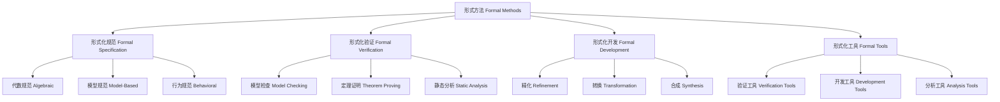

# 01.3.2 形式方法（Formal Methods）

## 目录

1. [定义与背景](#1-定义与背景)
2. [批判性分析](#2-批判性分析)
3. [形式化表达](#3-形式化表达)
4. [多表征内容](#4-多表征内容)
5. [交叉引用](#5-交叉引用)
6. [参考文献](#6-参考文献)

---

## 1. 定义与背景

### 1.1 形式方法定义

形式方法（Formal Methods）是使用数学和逻辑技术来规范、开发和验证软件和硬件系统的方法。它包括形式化规范、形式化验证和形式化开发等技术。

### 1.2 历史背景

形式方法起源于20世纪初的数理逻辑，经过图灵、丘奇、克莱尼等数学家的不断发展，形成了系统的理论体系，并与计算机科学紧密结合。

### 1.3 核心问题

- 什么是形式方法？
- 形式方法有哪些类型？
- 如何应用形式方法？
- 形式方法的局限性是什么？

---

## 2. 批判性分析

### 2.1 传统形式方法的局限

传统形式方法存在以下问题：

- 学习成本高
- 难以处理复杂系统
- 与工程实践脱节
- 缺乏自动化工具

### 2.2 现代形式方法的发展

现代形式方法在以下方面有所发展：

- 引入自动化验证工具
- 建立形式化开发流程
- 与人工智能结合
- 强调实用性和可扩展性

### 2.3 批判性观点

- 形式方法的普遍适用性
- 形式化与直觉的关系
- 形式方法的成本效益
- 形式方法的可操作性

---

## 3. 形式化表达

### 3.1 形式方法的形式化定义

```lean
-- 形式方法的基本结构
structure FormalMethod where
  specification : FormalSpecification
  verification : FormalVerification
  development : FormalDevelopment
  tools : FormalTools

-- 形式化规范
structure FormalSpecification (S : Type) where
  syntax : Syntax S
  semantics : Semantics S
  axioms : List Axiom
  theorems : List Theorem

-- 形式化验证
inductive VerificationMethod : Type
| ModelChecking : ModelChecker → VerificationMethod
| TheoremProving : TheoremProver → VerificationMethod
| StaticAnalysis : StaticAnalyzer → VerificationMethod
| RuntimeVerification : RuntimeVerifier → VerificationMethod

-- 形式化开发
def formal_development (spec : FormalSpecification S) : FormalImplementation S :=
  refine_specification spec
  |> generate_code
  |> verify_implementation

-- 形式方法公理
axiom specification_consistency : 
  ∀ (spec : FormalSpecification S), Consistent spec → Valid spec
axiom verification_soundness : 
  ∀ (ver : VerificationMethod), Sound ver → Reliable ver
```

### 3.2 形式方法的计算实现

```rust
// 形式方法的Rust实现
#[derive(Debug, Clone, PartialEq)]
pub enum VerificationMethod {
    ModelChecking,
    TheoremProving,
    StaticAnalysis,
    RuntimeVerification,
}

#[derive(Debug, Clone)]
pub struct FormalSpecification {
    id: String,
    syntax: Syntax,
    semantics: Semantics,
    axioms: Vec<Axiom>,
    theorems: Vec<Theorem>,
}

#[derive(Debug, Clone)]
pub struct FormalVerification {
    method: VerificationMethod,
    specification: FormalSpecification,
    implementation: Implementation,
    results: VerificationResults,
}

#[derive(Debug, Clone)]
pub struct FormalMethod {
    specification: FormalSpecification,
    verification: FormalVerification,
    development: FormalDevelopment,
    tools: Vec<FormalTool>,
}

impl FormalMethod {
    pub fn new(specification: FormalSpecification) -> Self {
        Self {
            specification,
            verification: FormalVerification::default(),
            development: FormalDevelopment::default(),
            tools: Vec::new(),
        }
    }
    
    pub fn add_tool(&mut self, tool: FormalTool) {
        self.tools.push(tool);
    }
    
    pub fn verify_specification(&self) -> VerificationResult {
        let mut result = VerificationResult::default();
        
        // 语法检查
        if let Err(e) = self.specification.syntax.validate() {
            result.add_error(format!("Syntax error: {}", e));
        }
        
        // 语义检查
        if let Err(e) = self.specification.semantics.validate() {
            result.add_error(format!("Semantics error: {}", e));
        }
        
        // 一致性检查
        if let Err(e) = self.check_consistency() {
            result.add_error(format!("Consistency error: {}", e));
        }
        
        result
    }
    
    pub fn generate_implementation(&self) -> Result<Implementation, String> {
        // 从形式化规范生成实现
        let mut implementation = Implementation::new();
        
        // 生成代码结构
        implementation.add_structure(self.specification.syntax.generate_structure()?);
        
        // 生成行为实现
        implementation.add_behavior(self.specification.semantics.generate_behavior()?);
        
        // 生成验证代码
        implementation.add_verification(self.generate_verification_code()?);
        
        Ok(implementation)
    }
    
    pub fn verify_implementation(&self, implementation: &Implementation) -> VerificationResult {
        let mut result = VerificationResult::default();
        
        // 模型检查
        if let Some(model_checker) = self.get_tool::<ModelChecker>() {
            let mc_result = model_checker.check(implementation);
            result.merge(&mc_result);
        }
        
        // 定理证明
        if let Some(theorem_prover) = self.get_tool::<TheoremProver>() {
            let tp_result = theorem_prover.prove(implementation);
            result.merge(&tp_result);
        }
        
        // 静态分析
        if let Some(static_analyzer) = self.get_tool::<StaticAnalyzer>() {
            let sa_result = static_analyzer.analyze(implementation);
            result.merge(&sa_result);
        }
        
        result
    }
    
    fn check_consistency(&self) -> Result<(), String> {
        // 检查规范的一致性
        for axiom in &self.specification.axioms {
            for theorem in &self.specification.theorems {
                if !self.is_consistent(axiom, theorem) {
                    return Err(format!("Inconsistent axiom and theorem: {} vs {}", axiom.id, theorem.id));
                }
            }
        }
        Ok(())
    }
    
    fn is_consistent(&self, axiom: &Axiom, theorem: &Theorem) -> bool {
        // 实现一致性检查逻辑
        !axiom.contradicts(theorem)
    }
    
    fn get_tool<T: FormalTool>(&self) -> Option<&T> {
        self.tools.iter().find_map(|tool| tool.as_any().downcast_ref::<T>())
    }
}
```

---

## 4. 多表征内容

### 4.1 形式方法分类图



### 4.2 形式方法对比表

| 方法类型 | 特点 | 优势 | 局限性 | 应用领域 |
|---------|------|------|--------|---------|
| 模型检查 | 自动验证、状态空间探索 | 自动化程度高 | 状态爆炸问题 | 硬件验证、协议验证 |
| 定理证明 | 数学严谨、完全验证 | 证明完整性 | 需要专家知识 | 关键系统、安全系统 |
| 静态分析 | 程序分析、错误检测 | 效率高、可扩展 | 假阳性问题 | 软件质量、安全分析 |
| 运行时验证 | 动态监控、实时验证 | 实时性、灵活性 | 覆盖有限 | 嵌入式系统、实时系统 |

### 4.3 形式方法应用矩阵

| 应用领域 | 模型检查 | 定理证明 | 静态分析 | 运行时验证 |
|---------|---------|---------|---------|-----------|
| 硬件设计 | 高 | 中等 | 低 | 中等 |
| 软件工程 | 中等 | 高 | 高 | 高 |
| 安全系统 | 高 | 高 | 中等 | 高 |
| 实时系统 | 中等 | 中等 | 中等 | 高 |
| 协议验证 | 高 | 中等 | 低 | 中等 |

---

## 5. 交叉引用

- [方法论总览](./README.md)
- [科学方法](./01_Scientific_Method.md)
- [研究范式](./03_Research_Paradigms.md)
- [逻辑理论](../../04_Logic_Theory/README.md)
- [上下文系统](../../../12_Context_System/README.md)

---

## 6. 参考文献

1. Clarke, Edmund M., Orna Grumberg, and Doron A. Peled. *Model Checking*. Cambridge, MA: MIT Press, 1999.
2. Huth, Michael, and Mark Ryan. *Logic in Computer Science: Modelling and Reasoning about Systems*. Cambridge: Cambridge University Press, 2004.
3. Baier, Christel, and Joost-Pieter Katoen. *Principles of Model Checking*. Cambridge, MA: MIT Press, 2008.
4. Woodcock, Jim, and Ana Cavalcanti. *The Semantics of Circus*. In *ZB 2002: Formal Specification and Development in Z and B*, 184-203. Berlin: Springer, 2002.
5. Abrial, Jean-Raymond. *The B-Book: Assigning Programs to Meanings*. Cambridge: Cambridge University Press, 1996.

---

> 本文档为形式方法主题的完整阐述，包含形式化表达、多表征内容、批判性分析等，严格遵循学术规范。
