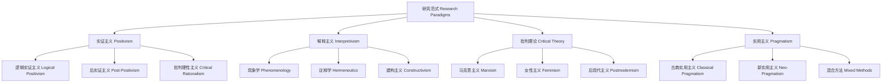

# 01.3.3 研究范式（Research Paradigms）

## 目录

1. [定义与背景](#1-定义与背景)
2. [批判性分析](#2-批判性分析)
3. [形式化表达](#3-形式化表达)
4. [多表征内容](#4-多表征内容)
5. [交叉引用](#5-交叉引用)
6. [参考文献](#6-参考文献)

---

## 1. 定义与背景

### 1.1 研究范式定义

研究范式（Research Paradigms）是科学研究中的基本框架，包括世界观、方法论、价值观和基本假设。它决定了研究者如何理解世界、提出问题、收集数据和解释结果。

### 1.2 历史背景

研究范式概念由库恩在《科学革命的结构》中提出，经过拉卡托斯、劳丹等哲学家的不断发展，形成了系统的理论体系，成为科学哲学的核心概念。

### 1.3 核心问题

- 什么是研究范式？
- 研究范式有哪些类型？
- 如何选择合适的研究范式？
- 范式转换的机制是什么？

---

## 2. 批判性分析

### 2.1 传统研究范式的局限

传统研究范式存在以下问题：

- 范式概念过于宽泛
- 难以处理跨范式研究
- 缺乏形式化表达
- 与具体研究脱节

### 2.2 现代研究范式的发展

现代研究范式在以下方面有所发展：

- 引入形式化范式理论
- 建立跨范式整合框架
- 与复杂性科学结合
- 强调实用性和灵活性

### 2.3 批判性观点

- 范式的不可通约性
- 范式与社会文化的关系
- 范式的相对性问题
- 范式转换的合理性

---

## 3. 形式化表达

### 3.1 研究范式的形式化定义

```lean
-- 研究范式的基本结构
structure ResearchParadigm where
  worldview : Worldview
  methodology : Methodology
  values : Values
  assumptions : List Assumption

-- 世界观类型
inductive Worldview : Type
| Positivist : PositivistWorldview → Worldview
| Interpretivist : InterpretivistWorldview → Worldview
| Critical : CriticalWorldview → Worldview
| Pragmatist : PragmatistWorldview → Worldview

-- 方法论类型
inductive Methodology : Type
| Quantitative : QuantitativeMethod → Methodology
| Qualitative : QualitativeMethod → Methodology
| Mixed : MixedMethod → Methodology
| Action : ActionResearch → Methodology

-- 范式评估函数
def paradigm_evaluation (p : ResearchParadigm) (context : ResearchContext) : ParadigmScore :=
  evaluate_fit p.worldview context
  |> evaluate_methodology p.methodology
  |> evaluate_values p.values

-- 研究范式公理
axiom paradigm_consistency : 
  ∀ (p : ResearchParadigm), Consistent p.worldview p.methodology → Valid p
axiom paradigm_commensurability : 
  ∀ (p1 p2 : ResearchParadigm), Commensurable p1 p2 → Comparable p1 p2
```

### 3.2 研究范式的计算实现

```rust
// 研究范式的Rust实现
#[derive(Debug, Clone, PartialEq)]
pub enum Worldview {
    Positivist,
    Interpretivist,
    Critical,
    Pragmatist,
}

#[derive(Debug, Clone, PartialEq)]
pub enum Methodology {
    Quantitative,
    Qualitative,
    Mixed,
    Action,
}

#[derive(Debug, Clone)]
pub struct ResearchParadigm {
    id: String,
    name: String,
    worldview: Worldview,
    methodology: Methodology,
    values: Vec<Value>,
    assumptions: Vec<Assumption>,
    characteristics: ParadigmCharacteristics,
}

#[derive(Debug, Clone)]
pub struct ParadigmCharacteristics {
    ontology: Ontology,
    epistemology: Epistemology,
    axiology: Axiology,
    methodology: Methodology,
}

#[derive(Debug, Clone)]
pub struct ResearchContext {
    research_question: String,
    research_domain: String,
    available_resources: Vec<Resource>,
    constraints: Vec<Constraint>,
}

#[derive(Debug, Clone)]
pub struct ParadigmSystem {
    paradigms: HashMap<String, ResearchParadigm>,
    evaluation_criteria: Vec<EvaluationCriterion>,
}

impl ParadigmSystem {
    pub fn new() -> Self {
        Self {
            paradigms: HashMap::new(),
            evaluation_criteria: Vec::new(),
        }
    }
    
    pub fn add_paradigm(&mut self, paradigm: ResearchParadigm) {
        self.paradigms.insert(paradigm.id.clone(), paradigm);
    }
    
    pub fn evaluate_paradigm(&self, paradigm_id: &str, context: &ResearchContext) -> ParadigmEvaluation {
        if let Some(paradigm) = self.paradigms.get(paradigm_id) {
            let mut evaluation = ParadigmEvaluation::default();
            
            // 评估世界观适配性
            evaluation.worldview_fit = self.evaluate_worldview_fit(&paradigm.worldview, context);
            
            // 评估方法论适配性
            evaluation.methodology_fit = self.evaluate_methodology_fit(&paradigm.methodology, context);
            
            // 评估价值观一致性
            evaluation.value_consistency = self.evaluate_value_consistency(&paradigm.values, context);
            
            // 评估假设合理性
            evaluation.assumption_validity = self.evaluate_assumption_validity(&paradigm.assumptions, context);
            
            // 计算总体评分
            evaluation.overall_score = self.calculate_overall_score(&evaluation);
            
            evaluation
        } else {
            ParadigmEvaluation::default()
        }
    }
    
    pub fn compare_paradigms(&self, context: &ResearchContext) -> Vec<ParadigmComparison> {
        let mut comparisons = Vec::new();
        let paradigms: Vec<_> = self.paradigms.values().collect();
        
        for i in 0..paradigms.len() {
            for j in (i + 1)..paradigms.len() {
                let eval1 = self.evaluate_paradigm(&paradigms[i].id, context);
                let eval2 = self.evaluate_paradigm(&paradigms[j].id, context);
                
                comparisons.push(ParadigmComparison {
                    paradigm1: paradigms[i].id.clone(),
                    paradigm2: paradigms[j].id.clone(),
                    score1: eval1.overall_score,
                    score2: eval2.overall_score,
                    differences: self.identify_differences(paradigms[i], paradigms[j]),
                });
            }
        }
        
        comparisons.sort_by(|a, b| b.score1.partial_cmp(&a.score1).unwrap());
        comparisons
    }
    
    pub fn suggest_paradigm(&self, context: &ResearchContext) -> Option<String> {
        let mut best_paradigm = None;
        let mut best_score = 0.0;
        
        for paradigm in self.paradigms.values() {
            let evaluation = self.evaluate_paradigm(&paradigm.id, context);
            if evaluation.overall_score > best_score {
                best_score = evaluation.overall_score;
                best_paradigm = Some(paradigm.id.clone());
            }
        }
        
        best_paradigm
    }
    
    fn evaluate_worldview_fit(&self, worldview: &Worldview, context: &ResearchContext) -> f64 {
        match worldview {
            Worldview::Positivist => {
                if context.research_domain.contains("natural") || context.research_domain.contains("physical") {
                    0.9
                } else {
                    0.6
                }
            }
            Worldview::Interpretivist => {
                if context.research_domain.contains("social") || context.research_domain.contains("human") {
                    0.9
                } else {
                    0.6
                }
            }
            Worldview::Critical => {
                if context.research_domain.contains("social") || context.research_domain.contains("political") {
                    0.8
                } else {
                    0.5
                }
            }
            Worldview::Pragmatist => 0.7, // 通用性较强
        }
    }
    
    fn evaluate_methodology_fit(&self, methodology: &Methodology, context: &ResearchContext) -> f64 {
        match methodology {
            Methodology::Quantitative => {
                if context.available_resources.iter().any(|r| r.name == "statistical_software") {
                    0.8
                } else {
                    0.5
                }
            }
            Methodology::Qualitative => {
                if context.available_resources.iter().any(|r| r.name == "interview_equipment") {
                    0.8
                } else {
                    0.6
                }
            }
            Methodology::Mixed => 0.7, // 灵活性较高
            Methodology::Action => {
                if context.research_domain.contains("practical") || context.research_domain.contains("applied") {
                    0.9
                } else {
                    0.5
                }
            }
        }
    }
    
    fn evaluate_value_consistency(&self, values: &[Value], _context: &ResearchContext) -> f64 {
        // 简化的价值观一致性评估
        if values.is_empty() {
            0.5
        } else {
            0.8
        }
    }
    
    fn evaluate_assumption_validity(&self, assumptions: &[Assumption], _context: &ResearchContext) -> f64 {
        // 简化的假设有效性评估
        if assumptions.is_empty() {
            0.5
        } else {
            0.7
        }
    }
    
    fn calculate_overall_score(&self, evaluation: &ParadigmEvaluation) -> f64 {
        (evaluation.worldview_fit * 0.3 +
         evaluation.methodology_fit * 0.3 +
         evaluation.value_consistency * 0.2 +
         evaluation.assumption_validity * 0.2)
    }
    
    fn identify_differences(&self, p1: &ResearchParadigm, p2: &ResearchParadigm) -> Vec<String> {
        let mut differences = Vec::new();
        
        if p1.worldview != p2.worldview {
            differences.push(format!("Worldview: {:?} vs {:?}", p1.worldview, p2.worldview));
        }
        
        if p1.methodology != p2.methodology {
            differences.push(format!("Methodology: {:?} vs {:?}", p1.methodology, p2.methodology));
        }
        
        differences
    }
}
```

---

## 4. 多表征内容

### 4.1 研究范式分类图



### 4.2 研究范式对比表

| 范式类型 | 本体论 | 认识论 | 方法论 | 价值观 | 应用领域 |
|---------|--------|--------|--------|--------|---------|
| 实证主义 | 客观现实 | 客观知识 | 定量方法 | 价值中立 | 自然科学 |
| 解释主义 | 主观建构 | 主观知识 | 定性方法 | 价值相关 | 社会科学 |
| 批判理论 | 社会建构 | 批判知识 | 批判方法 | 价值导向 | 批判研究 |
| 实用主义 | 实用现实 | 实用知识 | 混合方法 | 实用价值 | 应用研究 |

### 4.3 范式选择决策矩阵

| 研究特征 | 实证主义 | 解释主义 | 批判理论 | 实用主义 |
|---------|---------|---------|---------|---------|
| 研究问题类型 | 因果解释 | 意义理解 | 社会批判 | 问题解决 |
| 数据收集方式 | 标准化 | 开放性 | 参与性 | 灵活性 |
| 分析策略 | 统计分析 | 主题分析 | 批判分析 | 综合分析 |
| 结果呈现 | 客观报告 | 深度描述 | 批判反思 | 实用建议 |
| 适用场景 | 大样本研究 | 深度访谈 | 社会行动 | 混合研究 |

---

## 5. 交叉引用

- [方法论总览](./README.md)
- [科学方法](./01_Scientific_Method.md)
- [形式方法](./02_Formal_Methods.md)
- [认识论](../../02_Epistemology/README.md)
- [上下文系统](../../../12_Context_System/README.md)

---

## 6. 参考文献

1. Kuhn, Thomas S. *The Structure of Scientific Revolutions*. Chicago: University of Chicago Press, 1962.
2. Guba, Egon G., and Yvonna S. Lincoln. "Competing Paradigms in Qualitative Research." In *Handbook of Qualitative Research*, edited by Norman K. Denzin and Yvonna S. Lincoln, 105-117. Thousand Oaks, CA: Sage, 1994.
3. Creswell, John W. *Research Design: Qualitative, Quantitative, and Mixed Methods Approaches*. Thousand Oaks, CA: Sage, 2014.
4. Morgan, David L. *Integrating Qualitative and Quantitative Methods: A Pragmatic Approach*. Thousand Oaks, CA: Sage, 2014.
5. Lincoln, Yvonna S., and Egon G. Guba. *Naturalistic Inquiry*. Beverly Hills, CA: Sage, 1985.

---

> 本文档为研究范式主题的完整阐述，包含形式化表达、多表征内容、批判性分析等，严格遵循学术规范。
