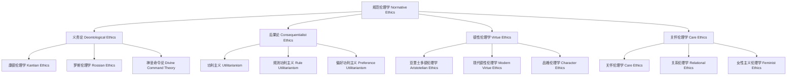

# 01.5.2 规范伦理学（Normative Ethics）

## 目录

1. [定义与背景](#1-定义与背景)
2. [批判性分析](#2-批判性分析)
3. [形式化表达](#3-形式化表达)
4. [多表征内容](#4-多表征内容)
5. [交叉引用](#5-交叉引用)
6. [参考文献](#6-参考文献)

---

## 1. 定义与背景

### 1.1 规范伦理学定义

规范伦理学（Normative Ethics）是研究道德行为标准和原则的伦理学分支。它关注什么行为是正确或错误的，什么行为是应该或不应该做的，以及如何判断行为的道德价值。

### 1.2 历史背景

规范伦理学起源于古希腊哲学，经过亚里士多德、康德、密尔等哲学家的不断发展，形成了系统的理论体系，包括德性伦理学、义务论和功利主义等主要流派。

### 1.3 核心问题

- 什么是道德上正确的行为？
- 如何判断行为的道德价值？
- 道德原则的基础是什么？
- 不同道德理论如何比较？

---

## 2. 批判性分析

### 2.1 传统规范伦理学的局限

传统规范伦理学存在以下问题：

- 过于抽象和理想化
- 难以处理复杂情境
- 缺乏文化敏感性
- 与具体实践脱节

### 2.2 现代规范伦理学的发展

现代规范伦理学在以下方面有所发展：

- 引入情境敏感性
- 建立多元主义框架
- 与心理学结合
- 强调实践指导性

### 2.3 批判性观点

- 道德原则的普遍性
- 不同理论间的冲突
- 道德直觉的作用
- 文化相对主义

---

## 3. 形式化表达

### 3.1 规范伦理学的形式化定义

```lean
-- 规范伦理学的基本结构
structure NormativeEthics where
  moral_principles : MoralPrinciples
  action_evaluation : ActionEvaluation
  moral_reasoning : MoralReasoning
  theory_comparison : TheoryComparison

-- 道德原则类型
inductive MoralPrinciple : Type
| Deontological : DeontologicalPrinciple → MoralPrinciple
| Consequentialist : ConsequentialistPrinciple → MoralPrinciple
| Virtue : VirtuePrinciple → MoralPrinciple
| Care : CarePrinciple → MoralPrinciple

-- 行为评估函数
def action_evaluation (action : Action) (principle : MoralPrinciple) : MoralEvaluation :=
  match principle with
  | Deontological d => evaluate_deontologically action d
  | Consequentialist c => evaluate_consequentially action c
  | Virtue v => evaluate_virtuously action v
  | Care care => evaluate_carefully action care

-- 道德推理函数
def moral_reasoning (situation : Situation) (principles : List MoralPrinciple) : MoralDecision :=
  apply_principles situation principles
  |> weigh_conflicts
  |> reach_decision

-- 规范伦理学公理
axiom principle_consistency : 
  ∀ (p : MoralPrinciple), Consistent p → Valid p
axiom action_evaluability : 
  ∀ (a : Action), Evaluable a → MorallyRelevant a
```

### 3.2 规范伦理学的计算实现

```rust
// 规范伦理学的Rust实现
#[derive(Debug, Clone, PartialEq)]
pub enum MoralPrincipleType {
    Deontological,
    Consequentialist,
    Virtue,
    Care,
}

#[derive(Debug, Clone)]
pub struct Action {
    id: String,
    description: String,
    agent: String,
    consequences: Vec<Consequence>,
    intentions: Vec<Intention>,
    context: Situation,
}

#[derive(Debug, Clone)]
pub struct MoralPrinciple {
    id: String,
    name: String,
    principle_type: MoralPrincipleType,
    content: String,
    scope: PrincipleScope,
    weight: f64,
}

#[derive(Debug, Clone)]
pub struct Situation {
    id: String,
    description: String,
    agents: Vec<Agent>,
    actions: Vec<Action>,
    consequences: Vec<Consequence>,
    context: Context,
}

#[derive(Debug, Clone)]
pub struct NormativeEthics {
    principles: Vec<MoralPrinciple>,
    evaluation_methods: Vec<EvaluationMethod>,
    reasoning_frameworks: Vec<ReasoningFramework>,
}

#[derive(Debug, Clone)]
pub struct NormativeEthicalSystem {
    theories: HashMap<String, NormativeEthics>,
    evaluation_criteria: Vec<EvaluationCriterion>,
}

impl NormativeEthicalSystem {
    pub fn new() -> Self {
        Self {
            theories: HashMap::new(),
            evaluation_criteria: Vec::new(),
        }
    }
    
    pub fn add_theory(&mut self, theory: NormativeEthics) {
        self.theories.insert(theory.id.clone(), theory);
    }
    
    pub fn evaluate_action(&self, action: &Action, principles: &[MoralPrinciple]) -> ActionEvaluation {
        let mut evaluation = ActionEvaluation::default();
        
        for principle in principles {
            let principle_evaluation = match principle.principle_type {
                MoralPrincipleType::Deontological => {
                    self.evaluate_deontologically(action, principle)
                }
                MoralPrincipleType::Consequentialist => {
                    self.evaluate_consequentially(action, principle)
                }
                MoralPrincipleType::Virtue => {
                    self.evaluate_virtuously(action, principle)
                }
                MoralPrincipleType::Care => {
                    self.evaluate_carefully(action, principle)
                }
            };
            
            evaluation.add_principle_evaluation(principle.id.clone(), principle_evaluation);
        }
        
        // 计算综合评估
        evaluation.overall_evaluation = self.calculate_overall_evaluation(&evaluation);
        
        evaluation
    }
    
    pub fn make_moral_decision(&self, situation: &Situation, principles: &[MoralPrinciple]) -> MoralDecision {
        let mut decision = MoralDecision::default();
        
        // 识别可能的行动
        let possible_actions = self.identify_possible_actions(situation);
        
        // 评估每个行动
        let mut action_evaluations = Vec::new();
        for action in &possible_actions {
            let evaluation = self.evaluate_action(action, principles);
            action_evaluations.push((action.clone(), evaluation));
        }
        
        // 选择最佳行动
        if let Some((best_action, best_evaluation)) = action_evaluations.iter()
            .max_by(|a, b| a.1.overall_evaluation.partial_cmp(&b.1.overall_evaluation).unwrap()) {
            decision.chosen_action = Some(best_action.clone());
            decision.justification = self.generate_justification(best_action, best_evaluation, principles);
        }
        
        decision
    }
    
    pub fn compare_theories(&self, situation: &Situation) -> Vec<TheoryComparison> {
        let mut comparisons = Vec::new();
        let theories: Vec<_> = self.theories.values().collect();
        
        for i in 0..theories.len() {
            for j in (i + 1)..theories.len() {
                let decision1 = self.make_moral_decision(situation, &theories[i].principles);
                let decision2 = self.make_moral_decision(situation, &theories[j].principles);
                
                comparisons.push(TheoryComparison {
                    theory1: theories[i].id.clone(),
                    theory2: theories[j].id.clone(),
                    decision1: decision1.chosen_action.clone(),
                    decision2: decision2.chosen_action.clone(),
                    agreement: self.calculate_agreement(&decision1, &decision2),
                });
            }
        }
        
        comparisons
    }
    
    fn evaluate_deontologically(&self, action: &Action, principle: &MoralPrinciple) -> PrincipleEvaluation {
        let mut evaluation = PrincipleEvaluation::default();
        
        // 检查是否符合义务
        if self.fulfills_duty(action, principle) {
            evaluation.score = 1.0;
            evaluation.reason = "Fulfills moral duty".to_string();
        } else {
            evaluation.score = 0.0;
            evaluation.reason = "Violates moral duty".to_string();
        }
        
        evaluation
    }
    
    fn evaluate_consequentially(&self, action: &Action, principle: &MoralPrinciple) -> PrincipleEvaluation {
        let mut evaluation = PrincipleEvaluation::default();
        
        // 计算后果的效用
        let total_utility = self.calculate_total_utility(&action.consequences);
        evaluation.score = total_utility / 100.0; // 标准化到0-1范围
        evaluation.reason = format!("Total utility: {}", total_utility);
        
        evaluation
    }
    
    fn evaluate_virtuously(&self, action: &Action, principle: &MoralPrinciple) -> PrincipleEvaluation {
        let mut evaluation = PrincipleEvaluation::default();
        
        // 评估德性特征
        let virtue_score = self.calculate_virtue_score(action, principle);
        evaluation.score = virtue_score;
        evaluation.reason = "Virtue-based evaluation".to_string();
        
        evaluation
    }
    
    fn evaluate_carefully(&self, action: &Action, principle: &MoralPrinciple) -> PrincipleEvaluation {
        let mut evaluation = PrincipleEvaluation::default();
        
        // 评估关怀关系
        let care_score = self.calculate_care_score(action, principle);
        evaluation.score = care_score;
        evaluation.reason = "Care-based evaluation".to_string();
        
        evaluation
    }
    
    fn calculate_overall_evaluation(&self, evaluation: &ActionEvaluation) -> f64 {
        let mut total_score = 0.0;
        let mut total_weight = 0.0;
        
        for (_, principle_eval) in &evaluation.principle_evaluations {
            total_score += principle_eval.score * principle_eval.weight;
            total_weight += principle_eval.weight;
        }
        
        if total_weight > 0.0 {
            total_score / total_weight
        } else {
            0.5
        }
    }
    
    fn identify_possible_actions(&self, situation: &Situation) -> Vec<Action> {
        // 简化的可能行动识别
        situation.actions.clone()
    }
    
    fn generate_justification(&self, action: &Action, evaluation: &ActionEvaluation, principles: &[MoralPrinciple]) -> String {
        let mut justification = format!("Action '{}' was chosen because: ", action.description);
        
        for (principle_id, principle_eval) in &evaluation.principle_evaluations {
            if let Some(principle) = principles.iter().find(|p| p.id == *principle_id) {
                justification.push_str(&format!("According to {} ({}), ", principle.name, principle_eval.reason));
            }
        }
        
        justification.push_str(&format!("Overall evaluation score: {:.2}", evaluation.overall_evaluation));
        
        justification
    }
    
    fn calculate_agreement(&self, decision1: &MoralDecision, decision2: &MoralDecision) -> f64 {
        if decision1.chosen_action.as_ref() == decision2.chosen_action.as_ref() {
            1.0
        } else {
            0.0
        }
    }
    
    fn fulfills_duty(&self, _action: &Action, _principle: &MoralPrinciple) -> bool {
        // 简化的义务履行检查
        true
    }
    
    fn calculate_total_utility(&self, consequences: &[Consequence]) -> f64 {
        consequences.iter().map(|c| c.utility).sum()
    }
    
    fn calculate_virtue_score(&self, _action: &Action, _principle: &MoralPrinciple) -> f64 {
        // 简化的德性评分
        0.7
    }
    
    fn calculate_care_score(&self, _action: &Action, _principle: &MoralPrinciple) -> f64 {
        // 简化的关怀评分
        0.8
    }
}
```

---

## 4. 多表征内容

### 4.1 规范伦理学理论分类图



### 4.2 规范伦理学理论对比表

| 理论类型 | 核心原则 | 判断标准 | 主要代表 | 优势 | 局限性 |
|---------|---------|---------|---------|------|--------|
| 义务论 | 道德义务 | 行为本身 | 康德 | 普遍性 | 僵化性 |
| 功利主义 | 最大幸福 | 后果效用 | 密尔 | 实用性 | 计算困难 |
| 德性伦理学 | 品格德性 | 行为者 | 亚里士多德 | 完整性 | 指导性不足 |
| 关怀伦理学 | 关怀关系 | 关系质量 | 吉利根 | 情感性 | 相对性 |

### 4.3 道德决策分析矩阵

| 决策情境 | 义务论 | 功利主义 | 德性伦理学 | 关怀伦理学 |
|---------|--------|---------|-----------|-----------|
| 诚实问题 | 绝对诚实 | 后果权衡 | 诚实品格 | 关系考虑 |
| 生命选择 | 生命神圣 | 效用计算 | 生命价值 | 生命关怀 |
| 正义分配 | 平等原则 | 效用最大化 | 正义德性 | 关系正义 |
| 环境问题 | 自然权利 | 生态效用 | 环境德性 | 生态关怀 |

---

## 5. 交叉引用

- [伦理学总览](./README.md)
- [元伦理学](./01_Meta_Ethics.md)
- [应用伦理学](./03_Applied_Ethics.md)
- [形而上学](../../01_Metaphysics/README.md)
- [上下文系统](../../../12_Context_System/README.md)

---

## 6. 参考文献

1. Kant, Immanuel. *Groundwork of the Metaphysics of Morals*. Translated by Mary Gregor. Cambridge: Cambridge University Press, 1997.
2. Mill, John Stuart. *Utilitarianism*. London: Longmans, Green, Reader, and Dyer, 1863.
3. Aristotle. *Nicomachean Ethics*. Translated by W. D. Ross. Oxford: Oxford University Press, 1925.
4. Gilligan, Carol. *In a Different Voice: Psychological Theory and Women's Development*. Cambridge, MA: Harvard University Press, 1982.
5. Ross, W. D. *The Right and the Good*. Oxford: Clarendon Press, 1930.

---

> 本文档为规范伦理学主题的完整阐述，包含形式化表达、多表征内容、批判性分析等，严格遵循学术规范。
