# 01.5.3 应用伦理学（Applied Ethics）

## 目录

1. [定义与背景](#1-定义与背景)
2. [批判性分析](#2-批判性分析)
3. [形式化表达](#3-形式化表达)
4. [多表征内容](#4-多表征内容)
5. [交叉引用](#5-交叉引用)
6. [参考文献](#6-参考文献)

---

## 1. 定义与背景

### 1.1 应用伦理学定义

应用伦理学（Applied Ethics）是将伦理学理论应用于具体道德问题的分支。它关注实际生活中的道德困境，如生命伦理、环境伦理、商业伦理、技术伦理等具体领域的道德问题。

### 1.2 历史背景

应用伦理学兴起于20世纪60年代，随着社会问题的复杂化和专业化，传统的伦理学理论需要应用到具体实践中。经过辛格、汤普森、纳斯鲍姆等哲学家的不断发展，形成了系统的应用伦理学体系。

### 1.3 核心问题

- 如何将伦理学理论应用到具体问题？
- 不同领域的道德问题有何特点？
- 如何处理道德冲突和困境？
- 应用伦理学的实践指导作用是什么？

---

## 2. 批判性分析

### 2.1 传统应用伦理学的局限

传统应用伦理学存在以下问题：

- 理论应用过于机械
- 忽视具体情境的复杂性
- 缺乏跨学科视角
- 与政策制定脱节

### 2.2 现代应用伦理学的发展

现代应用伦理学在以下方面有所发展：

- 引入情境敏感性方法
- 建立跨学科合作框架
- 与政策科学结合
- 强调实践有效性

### 2.3 批判性观点

- 理论应用的合理性
- 不同领域间的协调
- 文化差异的影响
- 技术发展的挑战

---

## 3. 形式化表达

### 3.1 应用伦理学的形式化定义

```lean
-- 应用伦理学的基本结构
structure AppliedEthics where
  ethical_domains : EthicalDomains
  case_analysis : CaseAnalysis
  policy_recommendation : PolicyRecommendation
  practical_guidance : PracticalGuidance

-- 伦理领域类型
inductive EthicalDomain : Type
| Bioethics : BioethicsDomain → EthicalDomain
| Environmental : EnvironmentalDomain → EthicalDomain
| Business : BusinessDomain → EthicalDomain
| Technology : TechnologyDomain → EthicalDomain
| Medical : MedicalDomain → EthicalDomain

-- 案例分析函数
def case_analysis (case : EthicalCase) (theories : List EthicalTheory) : CaseAnalysis :=
  analyze_facts case
  |> identify_issues
  |> apply_theories theories
  |> generate_recommendations

-- 政策建议函数
def policy_recommendation (issue : EthicalIssue) (stakeholders : List Stakeholder) : PolicyRecommendation :=
  identify_options issue
  |> evaluate_alternatives stakeholders
  |> select_best_option
  |> implement_strategy

-- 应用伦理学公理
axiom case_specificity : 
  ∀ (c : EthicalCase), Specific c → Relevant c
axiom theory_applicability : 
  ∀ (t : EthicalTheory), Applicable t → Useful t
```

### 3.2 应用伦理学的计算实现

```rust
// 应用伦理学的Rust实现
#[derive(Debug, Clone, PartialEq)]
pub enum EthicalDomain {
    Bioethics,
    Environmental,
    Business,
    Technology,
    Medical,
}

#[derive(Debug, Clone)]
pub struct EthicalCase {
    id: String,
    title: String,
    description: String,
    domain: EthicalDomain,
    stakeholders: Vec<Stakeholder>,
    facts: Vec<Fact>,
    issues: Vec<EthicalIssue>,
}

#[derive(Debug, Clone)]
pub struct Stakeholder {
    id: String,
    name: String,
    role: String,
    interests: Vec<Interest>,
    power: f64,
    legitimacy: f64,
}

#[derive(Debug, Clone)]
pub struct EthicalIssue {
    id: String,
    description: String,
    severity: IssueSeverity,
    urgency: IssueUrgency,
    affected_stakeholders: Vec<String>,
}

#[derive(Debug, Clone)]
pub struct AppliedEthics {
    domains: Vec<EthicalDomain>,
    cases: Vec<EthicalCase>,
    theories: Vec<EthicalTheory>,
    policies: Vec<PolicyRecommendation>,
}

#[derive(Debug, Clone)]
pub struct AppliedEthicalSystem {
    domains: HashMap<EthicalDomain, DomainExpertise>,
    case_database: Vec<EthicalCase>,
    theory_library: Vec<EthicalTheory>,
}

impl AppliedEthicalSystem {
    pub fn new() -> Self {
        Self {
            domains: HashMap::new(),
            case_database: Vec::new(),
            theory_library: Vec::new(),
        }
    }
    
    pub fn add_case(&mut self, case: EthicalCase) {
        self.case_database.push(case);
    }
    
    pub fn add_theory(&mut self, theory: EthicalTheory) {
        self.theory_library.push(theory);
    }
    
    pub fn analyze_case(&self, case_id: &str) -> CaseAnalysis {
        if let Some(case) = self.case_database.iter().find(|c| c.id == case_id) {
            let mut analysis = CaseAnalysis::default();
            
            // 分析事实
            analysis.facts = self.analyze_facts(case);
            
            // 识别问题
            analysis.issues = self.identify_issues(case);
            
            // 应用理论
            analysis.theory_applications = self.apply_theories(case);
            
            // 生成建议
            analysis.recommendations = self.generate_recommendations(case, &analysis);
            
            analysis
        } else {
            CaseAnalysis::default()
        }
    }
    
    pub fn recommend_policy(&self, issue: &EthicalIssue) -> PolicyRecommendation {
        let mut recommendation = PolicyRecommendation::default();
        
        // 识别政策选项
        let options = self.identify_policy_options(issue);
        
        // 评估选项
        let evaluations = self.evaluate_policy_options(&options, issue);
        
        // 选择最佳选项
        if let Some(best_option) = evaluations.iter()
            .max_by(|a, b| a.score.partial_cmp(&b.score).unwrap()) {
            recommendation.selected_option = Some(best_option.option.clone());
            recommendation.justification = best_option.justification.clone();
        }
        
        // 制定实施策略
        recommendation.implementation_strategy = self.create_implementation_strategy(&recommendation);
        
        recommendation
    }
    
    pub fn find_similar_cases(&self, case: &EthicalCase) -> Vec<CaseSimilarity> {
        let mut similarities = Vec::new();
        
        for other_case in &self.case_database {
            if other_case.id != case.id {
                let similarity_score = self.calculate_case_similarity(case, other_case);
                if similarity_score > 0.5 {
                    similarities.push(CaseSimilarity {
                        case_id: other_case.id.clone(),
                        similarity_score,
                        common_issues: self.find_common_issues(case, other_case),
                    });
                }
            }
        }
        
        similarities.sort_by(|a, b| b.similarity_score.partial_cmp(&a.similarity_score).unwrap());
        similarities
    }
    
    pub fn evaluate_ethical_impact(&self, action: &EthicalAction) -> ImpactAssessment {
        let mut assessment = ImpactAssessment::default();
        
        // 评估对利益相关者的影响
        assessment.stakeholder_impacts = self.assess_stakeholder_impacts(action);
        
        // 评估长期影响
        assessment.long_term_effects = self.assess_long_term_effects(action);
        
        // 评估风险
        assessment.risks = self.assess_risks(action);
        
        // 计算总体影响评分
        assessment.overall_impact = self.calculate_overall_impact(&assessment);
        
        assessment
    }
    
    fn analyze_facts(&self, case: &EthicalCase) -> Vec<AnalyzedFact> {
        case.facts.iter().map(|fact| AnalyzedFact {
            fact: fact.clone(),
            relevance: self.assess_fact_relevance(fact, case),
            reliability: self.assess_fact_reliability(fact),
            implications: self.identify_fact_implications(fact, case),
        }).collect()
    }
    
    fn identify_issues(&self, case: &EthicalCase) -> Vec<IdentifiedIssue> {
        case.issues.iter().map(|issue| IdentifiedIssue {
            issue: issue.clone(),
            severity: self.assess_issue_severity(issue, case),
            urgency: self.assess_issue_urgency(issue, case),
            affected_stakeholders: self.identify_affected_stakeholders(issue, case),
        }).collect()
    }
    
    fn apply_theories(&self, case: &EthicalCase) -> Vec<TheoryApplication> {
        self.theory_library.iter().map(|theory| TheoryApplication {
            theory: theory.clone(),
            application: self.apply_theory_to_case(theory, case),
            relevance: self.assess_theory_relevance(theory, case),
            limitations: self.identify_theory_limitations(theory, case),
        }).collect()
    }
    
    fn generate_recommendations(&self, case: &EthicalCase, analysis: &CaseAnalysis) -> Vec<Recommendation> {
        let mut recommendations = Vec::new();
        
        // 基于理论应用生成建议
        for theory_app in &analysis.theory_applications {
            if theory_app.relevance > 0.7 {
                recommendations.push(Recommendation {
                    content: self.generate_theory_based_recommendation(&theory_app.theory, case),
                    basis: format!("Based on {}", theory_app.theory.name),
                    priority: self.calculate_recommendation_priority(&theory_app),
                });
            }
        }
        
        // 基于案例分析生成建议
        recommendations.push(Recommendation {
            content: self.generate_case_based_recommendation(case, analysis),
            basis: "Based on case analysis".to_string(),
            priority: 0.8,
        });
        
        recommendations.sort_by(|a, b| b.priority.partial_cmp(&a.priority).unwrap());
        recommendations
    }
    
    fn identify_policy_options(&self, issue: &EthicalIssue) -> Vec<PolicyOption> {
        // 简化的政策选项识别
        vec![
            PolicyOption {
                id: "option1".to_string(),
                description: "Regulatory approach".to_string(),
                approach: PolicyApproach::Regulatory,
            },
            PolicyOption {
                id: "option2".to_string(),
                description: "Market-based approach".to_string(),
                approach: PolicyApproach::Market,
            },
            PolicyOption {
                id: "option3".to_string(),
                description: "Voluntary approach".to_string(),
                approach: PolicyApproach::Voluntary,
            },
        ]
    }
    
    fn evaluate_policy_options(&self, options: &[PolicyOption], issue: &EthicalIssue) -> Vec<PolicyEvaluation> {
        options.iter().map(|option| PolicyEvaluation {
            option: option.clone(),
            score: self.calculate_policy_score(option, issue),
            justification: self.generate_policy_justification(option, issue),
        }).collect()
    }
    
    fn calculate_case_similarity(&self, case1: &EthicalCase, case2: &EthicalCase) -> f64 {
        let mut similarity = 0.0;
        
        // 领域相似性
        if case1.domain == case2.domain {
            similarity += 0.3;
        }
        
        // 问题相似性
        let common_issues = self.count_common_issues(case1, case2);
        similarity += 0.4 * (common_issues as f64 / case1.issues.len().max(case2.issues.len()) as f64);
        
        // 利益相关者相似性
        let common_stakeholders = self.count_common_stakeholders(case1, case2);
        similarity += 0.3 * (common_stakeholders as f64 / case1.stakeholders.len().max(case2.stakeholders.len()) as f64);
        
        similarity
    }
    
    fn assess_fact_relevance(&self, _fact: &Fact, _case: &EthicalCase) -> f64 {
        // 简化的相关性评估
        0.8
    }
    
    fn assess_fact_reliability(&self, _fact: &Fact) -> f64 {
        // 简化的可靠性评估
        0.9
    }
    
    fn identify_fact_implications(&self, _fact: &Fact, _case: &EthicalCase) -> Vec<String> {
        vec!["Implication 1".to_string(), "Implication 2".to_string()]
    }
    
    fn assess_issue_severity(&self, issue: &EthicalIssue, _case: &EthicalCase) -> f64 {
        match issue.severity {
            IssueSeverity::Low => 0.3,
            IssueSeverity::Medium => 0.6,
            IssueSeverity::High => 0.9,
        }
    }
    
    fn assess_issue_urgency(&self, issue: &EthicalIssue, _case: &EthicalCase) -> f64 {
        match issue.urgency {
            IssueUrgency::Low => 0.3,
            IssueUrgency::Medium => 0.6,
            IssueUrgency::High => 0.9,
        }
    }
    
    fn identify_affected_stakeholders(&self, issue: &EthicalIssue, case: &EthicalCase) -> Vec<Stakeholder> {
        case.stakeholders.iter()
            .filter(|s| issue.affected_stakeholders.contains(&s.id))
            .cloned()
            .collect()
    }
    
    fn apply_theory_to_case(&self, _theory: &EthicalTheory, _case: &EthicalCase) -> String {
        "Theory application result".to_string()
    }
    
    fn assess_theory_relevance(&self, _theory: &EthicalTheory, _case: &EthicalCase) -> f64 {
        // 简化的理论相关性评估
        0.7
    }
    
    fn identify_theory_limitations(&self, _theory: &EthicalTheory, _case: &EthicalCase) -> Vec<String> {
        vec!["Limitation 1".to_string(), "Limitation 2".to_string()]
    }
    
    fn generate_theory_based_recommendation(&self, _theory: &EthicalTheory, _case: &EthicalCase) -> String {
        "Theory-based recommendation".to_string()
    }
    
    fn generate_case_based_recommendation(&self, _case: &EthicalCase, _analysis: &CaseAnalysis) -> String {
        "Case-based recommendation".to_string()
    }
    
    fn calculate_recommendation_priority(&self, _theory_app: &TheoryApplication) -> f64 {
        // 简化的优先级计算
        0.8
    }
    
    fn calculate_policy_score(&self, _option: &PolicyOption, _issue: &EthicalIssue) -> f64 {
        // 简化的政策评分
        0.7
    }
    
    fn generate_policy_justification(&self, _option: &PolicyOption, _issue: &EthicalIssue) -> String {
        "Policy justification".to_string()
    }
    
    fn count_common_issues(&self, case1: &EthicalCase, case2: &EthicalCase) -> usize {
        case1.issues.iter()
            .filter(|i1| case2.issues.iter().any(|i2| i1.description == i2.description))
            .count()
    }
    
    fn count_common_stakeholders(&self, case1: &EthicalCase, case2: &EthicalCase) -> usize {
        case1.stakeholders.iter()
            .filter(|s1| case2.stakeholders.iter().any(|s2| s1.role == s2.role))
            .count()
    }
    
    fn find_common_issues(&self, case1: &EthicalCase, case2: &EthicalCase) -> Vec<String> {
        case1.issues.iter()
            .filter_map(|i1| {
                if case2.issues.iter().any(|i2| i1.description == i2.description) {
                    Some(i1.description.clone())
                } else {
                    None
                }
            })
            .collect()
    }
    
    fn assess_stakeholder_impacts(&self, _action: &EthicalAction) -> Vec<StakeholderImpact> {
        vec![StakeholderImpact {
            stakeholder_id: "stakeholder1".to_string(),
            impact_type: ImpactType::Positive,
            magnitude: 0.7,
        }]
    }
    
    fn assess_long_term_effects(&self, _action: &EthicalAction) -> Vec<LongTermEffect> {
        vec![LongTermEffect {
            description: "Long-term effect".to_string(),
            probability: 0.6,
            magnitude: 0.5,
        }]
    }
    
    fn assess_risks(&self, _action: &EthicalAction) -> Vec<Risk> {
        vec![Risk {
            description: "Potential risk".to_string(),
            probability: 0.3,
            severity: 0.7,
        }]
    }
    
    fn calculate_overall_impact(&self, assessment: &ImpactAssessment) -> f64 {
        // 简化的总体影响计算
        let stakeholder_score: f64 = assessment.stakeholder_impacts.iter().map(|i| i.magnitude).sum();
        let effect_score: f64 = assessment.long_term_effects.iter().map(|e| e.magnitude * e.probability).sum();
        let risk_score: f64 = assessment.risks.iter().map(|r| r.severity * r.probability).sum();
        
        (stakeholder_score + effect_score - risk_score) / 3.0
    }
    
    fn create_implementation_strategy(&self, _recommendation: &PolicyRecommendation) -> ImplementationStrategy {
        ImplementationStrategy {
            steps: vec!["Step 1".to_string(), "Step 2".to_string()],
            timeline: "6 months".to_string(),
            resources: vec!["Resource 1".to_string(), "Resource 2".to_string()],
        }
    }
}
```

---

## 4. 多表征内容

### 4.1 应用伦理学领域分类图

```mermaid
graph TD
    A[应用伦理学 Applied Ethics] --> B[生命伦理学 Bioethics]
    A --> C[环境伦理学 Environmental Ethics]
    A --> D[商业伦理学 Business Ethics]
    A --> E[技术伦理学 Technology Ethics]
    A --> F[医学伦理学 Medical Ethics]
    
    B --> B1[生殖技术 Reproductive Technology]
    B --> B2[基因工程 Genetic Engineering]
    B --> B3[生命终结 End of Life]
    
    C --> C1[气候变化 Climate Change]
    C --> C2[生物多样性 Biodiversity]
    C --> C3[可持续发展 Sustainable Development]
    
    D --> D1[企业社会责任 Corporate Social Responsibility]
    D --> D2[公平贸易 Fair Trade]
    D --> D3[反腐败 Anti-Corruption]
    
    E --> E1[人工智能 Artificial Intelligence]
    E --> E2[数据隐私 Data Privacy]
    E --> E3[网络安全 Cybersecurity]
    
    F --> F1[知情同意 Informed Consent]
    F --> F2[医疗资源分配 Resource Allocation]
    F --> F3[医患关系 Doctor-Patient Relationship]
```



### 4.2 应用伦理学领域对比表

| 伦理领域 | 主要问题 | 核心原则 | 应用方法 | 政策影响 |
|---------|---------|---------|---------|---------|
| 生命伦理学 | 生命价值、尊严 | 尊重自主、不伤害 | 案例分析、原则主义 | 医疗政策、法律 |
| 环境伦理学 | 生态平衡、可持续 | 生态正义、代际公平 | 系统分析、风险评估 | 环境政策、国际协议 |
| 商业伦理学 | 利益冲突、责任 | 诚信、公平、透明 | 利益相关者分析 | 商业法规、行业标准 |
| 技术伦理学 | 技术风险、控制 | 负责任创新、预防 | 技术评估、参与式设计 | 技术政策、监管框架 |
| 医学伦理学 | 医患关系、资源 | 有利、不伤害、公正 | 临床伦理咨询 | 医疗政策、实践指南 |

### 4.3 伦理决策分析矩阵

| 决策类型 | 事实分析 | 价值判断 | 利益相关者 | 政策建议 |
|---------|---------|---------|-----------|---------|
| 医疗决策 | 医学事实 | 生命价值 | 患者、家属、医生 | 临床指南 |
| 环境决策 | 科学数据 | 生态价值 | 当代人、后代、自然 | 环境法规 |
| 商业决策 | 经济数据 | 道德价值 | 股东、员工、社会 | 商业规范 |
| 技术决策 | 技术评估 | 社会价值 | 开发者、用户、社会 | 技术标准 |

---

## 5. 交叉引用

- [伦理学总览](./README.md)
- [元伦理学](./01_Meta_Ethics.md)
- [规范伦理学](./02_Normative_Ethics.md)
- [方法论](../../03_Methodology/README.md)
- [上下文系统](../../../12_Context_System/README.md)

---

## 6. 参考文献

1. Beauchamp, Tom L., and James F. Childress. *Principles of Biomedical Ethics*. 7th ed. New York: Oxford University Press, 2013.
2. Singer, Peter. *Practical Ethics*. 3rd ed. Cambridge: Cambridge University Press, 2011.
3. Thompson, Paul B. *Food and Agricultural Biotechnology in Ethical Perspective*. Dordrecht: Springer, 2007.
4. Floridi, Luciano. *The Ethics of Information*. Oxford: Oxford University Press, 2013.
5. Nussbaum, Martha C. *Frontiers of Justice: Disability, Nationality, Species Membership*. Cambridge, MA: Harvard University Press, 2006.

---

> 本文档为应用伦理学主题的完整阐述，包含形式化表达、多表征内容、批判性分析等，严格遵循学术规范。
