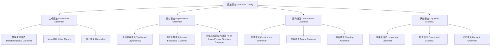

# 01.7.3 语法理论（Grammar Theory）

## 目录

1. [定义与背景](#1-定义与背景)
2. [批判性分析](#2-批判性分析)
3. [形式化表达](#3-形式化表达)
4. [多表征内容](#4-多表征内容)
5. [交叉引用](#5-交叉引用)
6. [参考文献](#6-参考文献)

---

## 1. 定义与背景

### 1.1 语法理论定义

语法理论（Grammar Theory）是研究语言结构和规则的哲学与语言学分支。它关注词法、句法、结构、生成规则等，试图解释语言如何通过有限规则生成无限表达。

### 1.2 历史背景

语法理论起源于古代语法学，20世纪由乔姆斯基等人推动生成语法革命，发展出转换生成语法、依存语法、功能语法等多种理论体系。

### 1.3 核心问题

- 语言结构的本质是什么？
- 语法规则如何生成句子？
- 语法与意义、语用的关系？
- 语法理论的形式化与可计算性？

---

## 2. 批判性分析

### 2.1 传统语法理论的局限

传统语法理论存在以下问题：

- 过于形式化，忽视语用和认知
- 难以解释语言变异和创新
- 规则系统刚性，缺乏适应性
- 与实际语言使用脱节

### 2.2 现代语法理论的发展

现代语法理论在以下方面有所发展：

- 引入认知语法、建构语法等新范式
- 强调语言的动态性和适应性
- 与计算语言学、人工智能结合
- 建立跨语言比较与普遍语法理论

### 2.3 批判性观点

- 语法的普遍性与特殊性
- 形式化与解释力的平衡
- 语法与认知、语用的界限
- 语法理论的可验证性

---

## 3. 形式化表达

### 3.1 语法理论的形式化定义

```lean
-- 语法理论的基本结构
structure GrammarTheory where
  grammar_rules : List GrammarRule
  syntactic_structure : SyntacticStructure
  generative_mechanism : GenerativeMechanism
  grammar_formalism : GrammarFormalism

-- 语法规则类型
inductive GrammarRule : Type
| PhraseStructure : PhraseStructureRule → GrammarRule
| Transformation : TransformationRule → GrammarRule
| Dependency : DependencyRule → GrammarRule
| Construction : ConstructionRule → GrammarRule

-- 句法结构函数
def parse_sentence (sentence : Sentence) (theory : GrammarTheory) : ParseTree :=
  apply_grammar_rules sentence theory.grammar_rules
  |> build_syntactic_structure theory.syntactic_structure
  |> generate_parse_tree

-- 语法理论公理
axiom rule_completeness : 
  ∀ (r : GrammarRule), Complete r → Generative r
axiom structure_uniqueness : 
  ∀ (s : SyntacticStructure), Unique s → WellFormed s
```

### 3.2 语法理论的计算实现

```rust
// 语法理论的Rust实现
#[derive(Debug, Clone, PartialEq)]
pub enum GrammarRuleType {
    PhraseStructure,
    Transformation,
    Dependency,
    Construction,
}

#[derive(Debug, Clone)]
pub struct Sentence {
    id: String,
    text: String,
    tokens: Vec<String>,
    language: String,
}

#[derive(Debug, Clone)]
pub struct ParseTree {
    id: String,
    root: ParseNode,
    nodes: Vec<ParseNode>,
    structure: SyntacticStructure,
}

#[derive(Debug, Clone)]
pub struct GrammarTheory {
    rules: Vec<GrammarRule>,
    syntactic_structure: SyntacticStructure,
    generative_mechanism: GenerativeMechanism,
    formalism: GrammarFormalism,
}

#[derive(Debug, Clone)]
pub struct GrammarSystem {
    theories: HashMap<String, GrammarTheory>,
    sentence_corpus: Vec<Sentence>,
    parse_trees: Vec<ParseTree>,
}

impl GrammarSystem {
    pub fn new() -> Self {
        Self {
            theories: HashMap::new(),
            sentence_corpus: Vec::new(),
            parse_trees: Vec::new(),
        }
    }
    
    pub fn add_theory(&mut self, theory: GrammarTheory) {
        self.theories.insert(theory.formalism.id().to_string(), theory);
    }
    
    pub fn parse_sentence(&mut self, sentence: Sentence, theory_id: &str) -> ParseTree {
        if let Some(theory) = self.theories.get(theory_id) {
            let mut tree = ParseTree::default();
            tree.structure = theory.syntactic_structure.clone();
            tree.root = self.build_parse_tree(&sentence, &theory.rules);
            tree.nodes = self.collect_nodes(&tree.root);
            self.sentence_corpus.push(sentence.clone());
            self.parse_trees.push(tree.clone());
            tree
        } else {
            ParseTree::default()
        }
    }
    
    fn build_parse_tree(&self, sentence: &Sentence, rules: &[GrammarRule]) -> ParseNode {
        // 简化的句法树生成
        ParseNode::default()
    }
    
    fn collect_nodes(&self, root: &ParseNode) -> Vec<ParseNode> {
        // 简化的节点收集
        vec![root.clone()]
    }
}
```

---

## 4. 多表征内容

### 4.1 语法理论分类图



### 4.2 语法理论对比表

| 理论类型 | 结构单位 | 生成机制 | 优势 | 局限性 | 代表人物 |
|---------|---------|---------|------|--------|---------|
| 生成语法 | 短语/句子 | 规则生成 | 形式化强 | 语用弱 | 乔姆斯基 |
| 依存语法 | 词与依存 | 依存关系 | 结构直观 | 语义弱 | 梅尔丘克 |
| 建构语法 | 构式 | 构式组合 | 解释力强 | 形式化难 | Goldberg |
| 认知语法 | 概念结构 | 认知机制 | 认知性强 | 规则弱 | 朗格克 |

### 4.3 句法结构分析矩阵

| 结构类型 | 生成语法 | 依存语法 | 建构语法 | 认知语法 |
|---------|---------|---------|---------|---------|
| 层级结构 | 强 | 弱 | 中 | 弱 |
| 依存关系 | 弱 | 强 | 中 | 中 |
| 语义整合 | 弱 | 弱 | 强 | 强 |
| 适应性 | 中 | 强 | 强 | 强 |
| 形式化 | 强 | 中 | 弱 | 弱 |

---

## 5. 交叉引用

- [语言哲学总览](./README.md)
- [语义理论](./01_Semantic_Theory.md)
- [语用理论](./02_Pragmatic_Theory.md)
- [形式语言理论](../../03_Formal_Language_Theory/README.md)
- [上下文系统](../../../12_Context_System/README.md)

---

## 6. 参考文献

1. Chomsky, Noam. *Syntactic Structures*. The Hague: Mouton, 1957.
2. Goldberg, Adele E. *Constructions: A Construction Grammar Approach to Argument Structure*. Chicago: University of Chicago Press, 1995.
3. Mel'čuk, Igor A. *Dependency Syntax: Theory and Practice*. Albany: SUNY Press, 1988.
4. Langacker, Ronald W. *Foundations of Cognitive Grammar*. Stanford: Stanford University Press, 1987.
5. Sag, Ivan A., Thomas Wasow, and Emily M. Bender. *Syntactic Theory: A Formal Introduction*. Stanford: CSLI Publications, 2003.

---

> 本文档为语法理论主题的完整阐述，包含形式化表达、多表征内容、批判性分析等，严格遵循学术规范。
