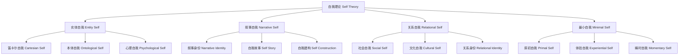

# 01.6.3 自我理论（Self Theory）

## 目录

1. [定义与背景](#1-定义与背景)
2. [批判性分析](#2-批判性分析)
3. [形式化表达](#3-形式化表达)
4. [多表征内容](#4-多表征内容)
5. [交叉引用](#5-交叉引用)
6. [参考文献](#6-参考文献)

---

## 1. 定义与背景

### 1.1 自我理论定义

自我理论（Self Theory）是研究自我意识、自我认同、自我结构与功能的哲学与心理学分支。它关注自我的本质、形成机制、发展过程及其与社会、认知、情感的关系。

### 1.2 历史背景

自我理论起源于古希腊哲学，经过笛卡尔、詹姆斯、弗洛伊德、梅洛-庞蒂等哲学家和心理学家的不断发展，形成了多元的理论体系，包括实体自我、叙事自我、关系自我等主要流派。

### 1.3 核心问题

- 什么是自我？
- 自我是如何形成和发展的？
- 自我与意识、认知、社会的关系？
- 自我的统一性与多样性？

---

## 2. 批判性分析

### 2.1 传统自我理论的局限

传统自我理论存在以下问题：

- 过于实体化
- 忽视社会与文化影响
- 难以解释自我分裂与多重自我
- 与神经科学脱节

### 2.2 现代自我理论的发展

现代自我理论在以下方面有所发展：

- 引入叙事自我与关系自我理论
- 建立多层次自我模型
- 与神经科学、认知科学结合
- 强调自我动态性与多样性

### 2.3 批判性观点

- 自我的本体论地位
- 自我统一性的挑战
- 自我与他者的界限
- 自我与社会建构

---

## 3. 形式化表达

### 3.1 自我理论的形式化定义

```lean
-- 自我理论的基本结构
structure SelfTheory where
  self_concept : SelfConcept
  self_identity : SelfIdentity
  self_function : SelfFunction
  self_narrative : SelfNarrative

-- 自我类型
inductive SelfType : Type
| EntitySelf : EntitySelf → SelfType
| NarrativeSelf : NarrativeSelf → SelfType
| RelationalSelf : RelationalSelf → SelfType
| MinimalSelf : MinimalSelf → SelfType

-- 自我模型函数
def self_model (experience : Experience) (theory : SelfTheory) : SelfState :=
  construct_self_concept experience
  |> update_self_identity theory.self_identity
  |> perform_self_function theory.self_function
  |> generate_self_narrative theory.self_narrative

-- 自我理论公理
axiom self_unity : 
  ∀ (s : SelfType), Unified s → Stable s
axiom self_plasticity : 
  ∀ (s : SelfType), Plastic s → Adaptive s
```

### 3.2 自我理论的计算实现

```rust
// 自我理论的Rust实现
#[derive(Debug, Clone, PartialEq)]
pub enum SelfType {
    EntitySelf,
    NarrativeSelf,
    RelationalSelf,
    MinimalSelf,
}

#[derive(Debug, Clone)]
pub struct Experience {
    id: String,
    content: String,
    context: Context,
    timestamp: DateTime<Utc>,
}

#[derive(Debug, Clone)]
pub struct SelfState {
    id: String,
    self_type: SelfType,
    self_concept: SelfConcept,
    self_identity: SelfIdentity,
    self_function: SelfFunction,
    self_narrative: SelfNarrative,
}

#[derive(Debug, Clone)]
pub struct SelfTheory {
    self_concept: SelfConcept,
    self_identity: SelfIdentity,
    self_function: SelfFunction,
    self_narrative: SelfNarrative,
}

#[derive(Debug, Clone)]
pub struct SelfSystem {
    theories: HashMap<String, SelfTheory>,
    experience_history: Vec<Experience>,
    self_states: Vec<SelfState>,
}

impl SelfSystem {
    pub fn new() -> Self {
        Self {
            theories: HashMap::new(),
            experience_history: Vec::new(),
            self_states: Vec::new(),
        }
    }
    
    pub fn add_theory(&mut self, theory: SelfTheory) {
        self.theories.insert(theory.self_concept.id.clone(), theory);
    }
    
    pub fn process_experience(&mut self, experience: Experience, theory_id: &str) -> SelfState {
        if let Some(theory) = self.theories.get(theory_id) {
            let mut state = SelfState::default();
            state.self_type = SelfType::EntitySelf; // 简化处理
            state.self_concept = theory.self_concept.clone();
            state.self_identity = theory.self_identity.clone();
            state.self_function = theory.self_function.clone();
            state.self_narrative = theory.self_narrative.clone();
            self.experience_history.push(experience.clone());
            self.self_states.push(state.clone());
            state
        } else {
            SelfState::default()
        }
    }
}
```

---

## 4. 多表征内容

### 4.1 自我理论分类图



### 4.2 自我理论对比表

| 理论类型 | 自我本质 | 形成机制 | 统一性 | 多样性 | 代表人物 |
|---------|---------|---------|------|------|---------|
| 实体自我 | 独立实体 | 内在属性 | 强 | 弱 | 笛卡尔 |
| 叙事自我 | 叙事结构 | 生活故事 | 中 | 强 | 里科尔 |
| 关系自我 | 社会关系 | 互动建构 | 弱 | 强 | 梅洛-庞蒂 |
| 最小自我 | 体验流 | 意识瞬间 | 弱 | 强 | 加拉格尔 |

### 4.3 自我结构分析矩阵

| 结构维度 | 实体自我 | 叙事自我 | 关系自我 | 最小自我 |
|---------|---------|---------|---------|---------|
| 意识层次 | 高 | 中 | 低 | 极低 |
| 认同感 | 强 | 中 | 弱 | 极弱 |
| 稳定性 | 高 | 中 | 低 | 极低 |
| 适应性 | 低 | 高 | 高 | 极高 |
| 社会性 | 低 | 高 | 极高 | 低 |

---

## 5. 交叉引用

- [心灵哲学总览](./README.md)
- [意识理论](./01_Consciousness_Theory.md)
- [认知理论](./02_Cognitive_Theory.md)
- [认识论](../../02_Epistemology/README.md)
- [上下文系统](../../../12_Context_System/README.md)

---

## 6. 参考文献

1. James, William. *The Principles of Psychology*. New York: Henry Holt, 1890.
2. Ricoeur, Paul. *Oneself as Another*. Chicago: University of Chicago Press, 1992.
3. Gallagher, Shaun. *How the Body Shapes the Mind*. Oxford: Oxford University Press, 2005.
4. Merleau-Ponty, Maurice. *Phenomenology of Perception*. London: Routledge, 1962.
5. Strawson, Galen. *Selves: An Essay in Revisionary Metaphysics*. Oxford: Oxford University Press, 2009.

---

> 本文档为自我理论主题的完整阐述，包含形式化表达、多表征内容、批判性分析等，严格遵循学术规范。
