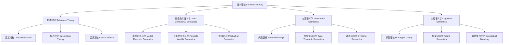

# 01.7.1 语义理论（Semantic Theory）

## 目录

1. [定义与背景](#1-定义与背景)
2. [批判性分析](#2-批判性分析)
3. [形式化表达](#3-形式化表达)
4. [多表征内容](#4-多表征内容)
5. [交叉引用](#5-交叉引用)
6. [参考文献](#6-参考文献)

---

## 1. 定义与背景

### 1.1 语义理论定义

语义理论（Semantic Theory）是研究语言意义的哲学分支。它关注词语、句子和话语的意义，包括指称、真值、内涵、外延等核心概念，试图解释语言如何表达和传达意义。

### 1.2 历史背景

语义理论起源于古希腊哲学，经过弗雷格、罗素、维特根斯坦、克里普克等哲学家的不断发展，形成了系统的理论体系，包括指称理论、真值条件语义学、内涵语义学等主要流派。

### 1.3 核心问题

- 什么是语言意义？
- 词语如何指称对象？
- 句子的真值条件是什么？
- 意义与使用的关系是什么？

---

## 2. 批判性分析

### 2.1 传统语义理论的局限

传统语义理论存在以下问题：

- 过于关注形式化
- 忽视语用因素
- 难以处理语境依赖
- 与认知脱节

### 2.2 现代语义理论的发展

现代语义理论在以下方面有所发展：

- 引入认知语义学
- 建立动态语义学
- 与语用学结合
- 强调语境敏感性

### 2.3 批判性观点

- 意义的客观性
- 指称的确定性
- 真值的相对性
- 意义的整体性

---

## 3. 形式化表达

### 3.1 语义理论的形式化定义

```lean
-- 语义理论的基本结构
structure SemanticTheory where
  meaning_definition : MeaningDefinition
  reference_theory : ReferenceTheory
  truth_conditions : TruthConditions
  compositionality : Compositionality

-- 意义定义类型
inductive MeaningDefinition : Type
| Referential : ReferentialMeaning → MeaningDefinition
| TruthConditional : TruthConditionalMeaning → MeaningDefinition
| Conceptual : ConceptualMeaning → MeaningDefinition
| UseBased : UseBasedMeaning → MeaningDefinition

-- 指称理论
structure ReferenceTheory where
  reference_relation : ReferenceRelation
  sense_relation : SenseRelation
  context_dependency : ContextDependency
  causal_chains : CausalChains

-- 真值条件
structure TruthConditions where
  truth_function : TruthFunction
  satisfaction_relation : SatisfactionRelation
  possible_worlds : PossibleWorlds
  truth_values : TruthValues

-- 语义解释函数
def semantic_interpretation (expression : Expression) (context : Context) : SemanticValue :=
  analyze_expression expression
  |> determine_reference context
  |> calculate_truth_conditions
  |> assign_meaning

-- 语义理论公理
axiom compositionality_principle : 
  ∀ (e : Expression), Compositional e → Systematic e
axiom reference_determinacy : 
  ∀ (t : Term), Determinate t → Stable t
```

### 3.2 语义理论的计算实现

```rust
// 语义理论的Rust实现
#[derive(Debug, Clone, PartialEq)]
pub enum MeaningDefinition {
    Referential,
    TruthConditional,
    Conceptual,
    UseBased,
}

#[derive(Debug, Clone)]
pub struct Expression {
    id: String,
    text: String,
    syntax_structure: SyntaxStructure,
    semantic_type: SemanticType,
    context: Context,
}

#[derive(Debug, Clone)]
pub struct Context {
    id: String,
    world_state: WorldState,
    speaker: Agent,
    hearer: Agent,
    time: DateTime<Utc>,
    location: Location,
    discourse_context: DiscourseContext,
}

#[derive(Debug, Clone)]
pub struct SemanticValue {
    id: String,
    reference: Option<Reference>,
    truth_conditions: TruthConditions,
    meaning: Meaning,
    context_dependency: ContextDependency,
}

#[derive(Debug, Clone)]
pub struct SemanticTheory {
    definition: MeaningDefinition,
    reference_model: ReferenceModel,
    truth_model: TruthModel,
    composition_model: CompositionModel,
}

#[derive(Debug, Clone)]
pub struct SemanticSystem {
    theories: HashMap<String, SemanticTheory>,
    lexicon: HashMap<String, LexicalEntry>,
    grammar: Grammar,
    context_database: Vec<Context>,
}

impl SemanticSystem {
    pub fn new() -> Self {
        Self {
            theories: HashMap::new(),
            lexicon: HashMap::new(),
            grammar: Grammar::default(),
            context_database: Vec::new(),
        }
    }
    
    pub fn add_theory(&mut self, theory: SemanticTheory) {
        self.theories.insert(theory.id.clone(), theory);
    }
    
    pub fn add_lexical_entry(&mut self, word: String, entry: LexicalEntry) {
        self.lexicon.insert(word, entry);
    }
    
    pub fn add_context(&mut self, context: Context) {
        self.context_database.push(context);
    }
    
    pub fn interpret_expression(&self, expression: &Expression, context: &Context) -> SemanticInterpretation {
        let mut interpretation = SemanticInterpretation::default();
        
        // 分析表达式结构
        interpretation.syntax_analysis = self.analyze_syntax(expression);
        
        // 确定指称
        interpretation.reference = self.determine_reference(expression, context);
        
        // 计算真值条件
        interpretation.truth_conditions = self.calculate_truth_conditions(expression, context);
        
        // 分配意义
        interpretation.meaning = self.assign_meaning(expression, context);
        
        interpretation
    }
    
    pub fn evaluate_truth(&self, expression: &Expression, context: &Context) -> TruthEvaluation {
        let mut evaluation = TruthEvaluation::default();
        
        // 获取语义解释
        let interpretation = self.interpret_expression(expression, context);
        
        // 检查真值条件
        evaluation.truth_value = self.check_truth_conditions(&interpretation.truth_conditions, context);
        
        // 评估确定性
        evaluation.certainty = self.assess_certainty(&interpretation, context);
        
        // 识别真值条件
        evaluation.conditions = self.identify_truth_conditions(&interpretation, context);
        
        evaluation
    }
    
    pub fn analyze_meaning(&self, expression: &Expression, context: &Context) -> MeaningAnalysis {
        let mut analysis = MeaningAnalysis::default();
        
        // 分析词汇意义
        analysis.lexical_meaning = self.analyze_lexical_meaning(expression);
        
        // 分析组合意义
        analysis.compositional_meaning = self.analyze_compositional_meaning(expression);
        
        // 分析语境意义
        analysis.contextual_meaning = self.analyze_contextual_meaning(expression, context);
        
        // 分析语用意义
        analysis.pragmatic_meaning = self.analyze_pragmatic_meaning(expression, context);
        
        analysis
    }
    
    pub fn compare_theories(&self, expression: &Expression, context: &Context) -> Vec<TheoryComparison> {
        let mut comparisons = Vec::new();
        let theories: Vec<_> = self.theories.values().collect();
        
        for i in 0..theories.len() {
            for j in (i + 1)..theories.len() {
                let interp1 = self.interpret_with_theory(expression, context, &theories[i]);
                let interp2 = self.interpret_with_theory(expression, context, &theories[j]);
                
                comparisons.push(TheoryComparison {
                    theory1: theories[i].id.clone(),
                    theory2: theories[j].id.clone(),
                    interpretation1: interp1,
                    interpretation2: interp2,
                    agreement: self.calculate_interpretation_agreement(&interp1, &interp2),
                });
            }
        }
        
        comparisons
    }
    
    pub fn resolve_ambiguity(&self, expression: &Expression, context: &Context) -> Disambiguation {
        let mut disambiguation = Disambiguation::default();
        
        // 识别歧义
        disambiguation.ambiguities = self.identify_ambiguities(expression);
        
        // 生成候选解释
        disambiguation.candidates = self.generate_candidates(expression, context);
        
        // 评估候选解释
        disambiguation.evaluations = self.evaluate_candidates(&disambiguation.candidates, context);
        
        // 选择最佳解释
        if let Some(best_candidate) = disambiguation.evaluations.iter()
            .max_by(|a, b| a.score.partial_cmp(&b.score).unwrap()) {
            disambiguation.selected_interpretation = Some(best_candidate.interpretation.clone());
            disambiguation.confidence = best_candidate.score;
        }
        
        disambiguation
    }
    
    fn analyze_syntax(&self, expression: &Expression) -> SyntaxAnalysis {
        let mut analysis = SyntaxAnalysis::default();
        
        // 分析句法结构
        analysis.structure = self.parse_syntax_structure(&expression.syntax_structure);
        
        // 识别句法关系
        analysis.relations = self.identify_syntactic_relations(&expression.syntax_structure);
        
        // 分析句法功能
        analysis.functions = self.analyze_syntactic_functions(&expression.syntax_structure);
        
        analysis
    }
    
    fn determine_reference(&self, expression: &Expression, context: &Context) -> Option<Reference> {
        match expression.semantic_type {
            SemanticType::ProperName => {
                self.resolve_proper_name_reference(expression, context)
            }
            SemanticType::DefiniteDescription => {
                self.resolve_definite_description_reference(expression, context)
            }
            SemanticType::Indexical => {
                self.resolve_indexical_reference(expression, context)
            }
            SemanticType::Quantifier => {
                self.resolve_quantifier_reference(expression, context)
            }
            _ => None,
        }
    }
    
    fn calculate_truth_conditions(&self, expression: &Expression, context: &Context) -> TruthConditions {
        let mut conditions = TruthConditions::default();
        
        // 分析逻辑结构
        conditions.logical_structure = self.analyze_logical_structure(expression);
        
        // 确定真值函数
        conditions.truth_function = self.determine_truth_function(expression);
        
        // 识别满足条件
        conditions.satisfaction_conditions = self.identify_satisfaction_conditions(expression, context);
        
        // 分析可能世界
        conditions.possible_worlds = self.analyze_possible_worlds(expression, context);
        
        conditions
    }
    
    fn assign_meaning(&self, expression: &Expression, context: &Context) -> Meaning {
        let mut meaning = Meaning::default();
        
        // 分配词汇意义
        meaning.lexical_meaning = self.assign_lexical_meaning(expression);
        
        // 分配组合意义
        meaning.compositional_meaning = self.assign_compositional_meaning(expression);
        
        // 分配语境意义
        meaning.contextual_meaning = self.assign_contextual_meaning(expression, context);
        
        // 分配语用意义
        meaning.pragmatic_meaning = self.assign_pragmatic_meaning(expression, context);
        
        meaning
    }
    
    fn check_truth_conditions(&self, conditions: &TruthConditions, context: &Context) -> bool {
        // 检查真值条件是否满足
        let world_state = &context.world_state;
        
        // 检查逻辑结构
        if !self.evaluate_logical_structure(&conditions.logical_structure, world_state) {
            return false;
        }
        
        // 检查满足条件
        if !self.evaluate_satisfaction_conditions(&conditions.satisfaction_conditions, world_state) {
            return false;
        }
        
        // 检查可能世界
        if !self.evaluate_possible_worlds(&conditions.possible_worlds, world_state) {
            return false;
        }
        
        true
    }
    
    fn assess_certainty(&self, interpretation: &SemanticInterpretation, context: &Context) -> f64 {
        let mut certainty = 1.0;
        
        // 基于指称确定性
        if let Some(ref reference) = interpretation.reference {
            certainty *= self.assess_reference_certainty(reference, context);
        }
        
        // 基于真值条件确定性
        certainty *= self.assess_truth_condition_certainty(&interpretation.truth_conditions, context);
        
        // 基于意义确定性
        certainty *= self.assess_meaning_certainty(&interpretation.meaning, context);
        
        certainty
    }
    
    fn identify_truth_conditions(&self, interpretation: &SemanticInterpretation, context: &Context) -> Vec<TruthCondition> {
        let mut conditions = Vec::new();
        
        // 从真值条件中提取具体条件
        for condition in &interpretation.truth_conditions.satisfaction_conditions {
            conditions.push(TruthCondition {
                description: condition.description.clone(),
                type_: condition.type_.clone(),
                importance: condition.importance,
            });
        }
        
        conditions
    }
    
    fn analyze_lexical_meaning(&self, expression: &Expression) -> LexicalMeaning {
        let mut meaning = LexicalMeaning::default();
        
        // 分析词汇条目
        if let Some(entry) = self.lexicon.get(&expression.text) {
            meaning.denotation = entry.denotation.clone();
            meaning.connotation = entry.connotation.clone();
            meaning.sense = entry.sense.clone();
        }
        
        meaning
    }
    
    fn analyze_compositional_meaning(&self, expression: &Expression) -> CompositionalMeaning {
        let mut meaning = CompositionalMeaning::default();
        
        // 分析组合规则
        meaning.composition_rules = self.identify_composition_rules(&expression.syntax_structure);
        
        // 分析语义组合
        meaning.semantic_composition = self.analyze_semantic_composition(&expression.syntax_structure);
        
        // 分析功能应用
        meaning.function_application = self.analyze_function_application(&expression.syntax_structure);
        
        meaning
    }
    
    fn analyze_contextual_meaning(&self, expression: &Expression, context: &Context) -> ContextualMeaning {
        let mut meaning = ContextualMeaning::default();
        
        // 分析语境依赖
        meaning.context_dependencies = self.identify_context_dependencies(expression, context);
        
        // 分析索引性
        meaning.indexicality = self.analyze_indexicality(expression, context);
        
        // 分析语境敏感性
        meaning.context_sensitivity = self.analyze_context_sensitivity(expression, context);
        
        meaning
    }
    
    fn analyze_pragmatic_meaning(&self, expression: &Expression, context: &Context) -> PragmaticMeaning {
        let mut meaning = PragmaticMeaning::default();
        
        // 分析言外之意
        meaning.implicature = self.analyze_implicature(expression, context);
        
        // 分析预设
        meaning.presupposition = self.analyze_presupposition(expression, context);
        
        // 分析言语行为
        meaning.speech_act = self.analyze_speech_act(expression, context);
        
        meaning
    }
    
    fn interpret_with_theory(&self, expression: &Expression, context: &Context, theory: &SemanticTheory) -> SemanticInterpretation {
        // 基于特定理论进行解释
        let mut interpretation = SemanticInterpretation::default();
        
        match theory.definition {
            MeaningDefinition::Referential => {
                interpretation = self.interpret_referentially(expression, context);
            }
            MeaningDefinition::TruthConditional => {
                interpretation = self.interpret_truth_conditionally(expression, context);
            }
            MeaningDefinition::Conceptual => {
                interpretation = self.interpret_conceptually(expression, context);
            }
            MeaningDefinition::UseBased => {
                interpretation = self.interpret_use_based(expression, context);
            }
        }
        
        interpretation
    }
    
    fn calculate_interpretation_agreement(&self, interp1: &SemanticInterpretation, interp2: &SemanticInterpretation) -> f64 {
        let mut agreement = 0.0;
        let mut total_comparisons = 0;
        
        // 比较指称
        if let (Some(ref1), Some(ref2)) = (&interp1.reference, &interp2.reference) {
            if ref1 == ref2 {
                agreement += 1.0;
            }
            total_comparisons += 1;
        }
        
        // 比较真值条件
        if interp1.truth_conditions == interp2.truth_conditions {
            agreement += 1.0;
        }
        total_comparisons += 1;
        
        // 比较意义
        if interp1.meaning == interp2.meaning {
            agreement += 1.0;
        }
        total_comparisons += 1;
        
        if total_comparisons > 0 {
            agreement / total_comparisons as f64
        } else {
            0.0
        }
    }
    
    fn identify_ambiguities(&self, expression: &Expression) -> Vec<Ambiguity> {
        let mut ambiguities = Vec::new();
        
        // 识别词汇歧义
        if let Some(entry) = self.lexicon.get(&expression.text) {
            if entry.senses.len() > 1 {
                ambiguities.push(Ambiguity {
                    type_: AmbiguityType::Lexical,
                    description: "Multiple lexical senses".to_string(),
                    candidates: entry.senses.clone(),
                });
            }
        }
        
        // 识别句法歧义
        if self.has_syntactic_ambiguity(&expression.syntax_structure) {
            ambiguities.push(Ambiguity {
                type_: AmbiguityType::Syntactic,
                description: "Multiple syntactic structures".to_string(),
                candidates: self.generate_syntactic_candidates(&expression.syntax_structure),
            });
        }
        
        ambiguities
    }
    
    fn generate_candidates(&self, expression: &Expression, context: &Context) -> Vec<SemanticInterpretation> {
        let mut candidates = Vec::new();
        
        // 为每个歧义生成候选解释
        let ambiguities = self.identify_ambiguities(expression);
        
        for ambiguity in ambiguities {
            for candidate in &ambiguity.candidates {
                let mut modified_expression = expression.clone();
                // 修改表达式以反映候选解释
                candidates.push(self.interpret_expression(&modified_expression, context));
            }
        }
        
        candidates
    }
    
    fn evaluate_candidates(&self, candidates: &[SemanticInterpretation], context: &Context) -> Vec<CandidateEvaluation> {
        candidates.iter().map(|candidate| CandidateEvaluation {
            interpretation: candidate.clone(),
            score: self.calculate_candidate_score(candidate, context),
            justification: self.generate_candidate_justification(candidate, context),
        }).collect()
    }
    
    // 辅助方法的简化实现
    fn parse_syntax_structure(&self, _structure: &SyntaxStructure) -> ParsedStructure {
        ParsedStructure::default()
    }
    
    fn identify_syntactic_relations(&self, _structure: &SyntaxStructure) -> Vec<SyntacticRelation> {
        vec![SyntacticRelation::default()]
    }
    
    fn analyze_syntactic_functions(&self, _structure: &SyntaxStructure) -> Vec<SyntacticFunction> {
        vec![SyntacticFunction::default()]
    }
    
    fn resolve_proper_name_reference(&self, _expression: &Expression, _context: &Context) -> Option<Reference> {
        Some(Reference::default())
    }
    
    fn resolve_definite_description_reference(&self, _expression: &Expression, _context: &Context) -> Option<Reference> {
        Some(Reference::default())
    }
    
    fn resolve_indexical_reference(&self, _expression: &Expression, _context: &Context) -> Option<Reference> {
        Some(Reference::default())
    }
    
    fn resolve_quantifier_reference(&self, _expression: &Expression, _context: &Context) -> Option<Reference> {
        Some(Reference::default())
    }
    
    fn analyze_logical_structure(&self, _expression: &Expression) -> LogicalStructure {
        LogicalStructure::default()
    }
    
    fn determine_truth_function(&self, _expression: &Expression) -> TruthFunction {
        TruthFunction::default()
    }
    
    fn identify_satisfaction_conditions(&self, _expression: &Expression, _context: &Context) -> Vec<SatisfactionCondition> {
        vec![SatisfactionCondition::default()]
    }
    
    fn analyze_possible_worlds(&self, _expression: &Expression, _context: &Context) -> Vec<PossibleWorld> {
        vec![PossibleWorld::default()]
    }
    
    fn assign_lexical_meaning(&self, _expression: &Expression) -> LexicalMeaning {
        LexicalMeaning::default()
    }
    
    fn assign_compositional_meaning(&self, _expression: &Expression) -> CompositionalMeaning {
        CompositionalMeaning::default()
    }
    
    fn assign_contextual_meaning(&self, _expression: &Expression, _context: &Context) -> ContextualMeaning {
        ContextualMeaning::default()
    }
    
    fn assign_pragmatic_meaning(&self, _expression: &Expression, _context: &Context) -> PragmaticMeaning {
        PragmaticMeaning::default()
    }
    
    fn evaluate_logical_structure(&self, _structure: &LogicalStructure, _world_state: &WorldState) -> bool {
        true
    }
    
    fn evaluate_satisfaction_conditions(&self, _conditions: &[SatisfactionCondition], _world_state: &WorldState) -> bool {
        true
    }
    
    fn evaluate_possible_worlds(&self, _worlds: &[PossibleWorld], _world_state: &WorldState) -> bool {
        true
    }
    
    fn assess_reference_certainty(&self, _reference: &Reference, _context: &Context) -> f64 {
        0.8
    }
    
    fn assess_truth_condition_certainty(&self, _conditions: &TruthConditions, _context: &Context) -> f64 {
        0.9
    }
    
    fn assess_meaning_certainty(&self, _meaning: &Meaning, _context: &Context) -> f64 {
        0.7
    }
    
    fn identify_composition_rules(&self, _structure: &SyntaxStructure) -> Vec<CompositionRule> {
        vec![CompositionRule::default()]
    }
    
    fn analyze_semantic_composition(&self, _structure: &SyntaxStructure) -> SemanticComposition {
        SemanticComposition::default()
    }
    
    fn analyze_function_application(&self, _structure: &SyntaxStructure) -> FunctionApplication {
        FunctionApplication::default()
    }
    
    fn identify_context_dependencies(&self, _expression: &Expression, _context: &Context) -> Vec<ContextDependency> {
        vec![ContextDependency::default()]
    }
    
    fn analyze_indexicality(&self, _expression: &Expression, _context: &Context) -> Indexicality {
        Indexicality::default()
    }
    
    fn analyze_context_sensitivity(&self, _expression: &Expression, _context: &Context) -> ContextSensitivity {
        ContextSensitivity::default()
    }
    
    fn analyze_implicature(&self, _expression: &Expression, _context: &Context) -> Implicature {
        Implicature::default()
    }
    
    fn analyze_presupposition(&self, _expression: &Expression, _context: &Context) -> Presupposition {
        Presupposition::default()
    }
    
    fn analyze_speech_act(&self, _expression: &Expression, _context: &Context) -> SpeechAct {
        SpeechAct::default()
    }
    
    fn interpret_referentially(&self, _expression: &Expression, _context: &Context) -> SemanticInterpretation {
        SemanticInterpretation::default()
    }
    
    fn interpret_truth_conditionally(&self, _expression: &Expression, _context: &Context) -> SemanticInterpretation {
        SemanticInterpretation::default()
    }
    
    fn interpret_conceptually(&self, _expression: &Expression, _context: &Context) -> SemanticInterpretation {
        SemanticInterpretation::default()
    }
    
    fn interpret_use_based(&self, _expression: &Expression, _context: &Context) -> SemanticInterpretation {
        SemanticInterpretation::default()
    }
    
    fn has_syntactic_ambiguity(&self, _structure: &SyntaxStructure) -> bool {
        false
    }
    
    fn generate_syntactic_candidates(&self, _structure: &SyntaxStructure) -> Vec<String> {
        vec!["candidate1".to_string(), "candidate2".to_string()]
    }
    
    fn calculate_candidate_score(&self, _candidate: &SemanticInterpretation, _context: &Context) -> f64 {
        0.8
    }
    
    fn generate_candidate_justification(&self, _candidate: &SemanticInterpretation, _context: &Context) -> String {
        "Candidate justification".to_string()
    }
}
```

---

## 4. 多表征内容

### 4.1 语义理论分类图



### 4.2 语义理论对比表

| 理论类型 | 意义定义 | 指称机制 | 真值条件 | 主要代表 | 优势 | 局限性 |
|---------|---------|---------|---------|---------|------|--------|
| 指称理论 | 指称对象 | 直接指称 | 对象存在 | 克里普克 | 直观性 | 空名问题 |
| 真值条件语义学 | 真值条件 | 满足关系 | 世界状态 | 戴维森 | 形式化 | 语境依赖 |
| 内涵语义学 | 内涵函数 | 可能世界 | 世界集合 | 蒙塔古 | 精确性 | 复杂性 |
| 认知语义学 | 概念结构 | 心理表征 | 认知模型 | 莱考夫 | 认知性 | 主观性 |

### 4.3 语义分析矩阵

| 分析维度 | 词汇层面 | 句法层面 | 语义层面 | 语用层面 |
|---------|---------|---------|---------|---------|
| 指称分析 | 词汇指称 | 短语指称 | 句子指称 | 话语指称 |
| 真值分析 | 词汇真值 | 短语真值 | 句子真值 | 话语真值 |
| 意义分析 | 词汇意义 | 组合意义 | 句子意义 | 语境意义 |
| 歧义分析 | 词汇歧义 | 句法歧义 | 语义歧义 | 语用歧义 |

---

## 5. 交叉引用

- [语言哲学总览](./README.md)
- [语用理论](./02_Pragmatic_Theory.md)
- [语法理论](./03_Grammar_Theory.md)
- [认识论](../../02_Epistemology/README.md)
- [上下文系统](../../../12_Context_System/README.md)

---

## 6. 参考文献

1. Frege, Gottlob. "Über Sinn und Bedeutung." *Zeitschrift für Philosophie und philosophische Kritik* 100 (1892): 25-50.
2. Kripke, Saul A. *Naming and Necessity*. Cambridge, MA: Harvard University Press, 1980.
3. Davidson, Donald. *Inquiries into Truth and Interpretation*. Oxford: Clarendon Press, 1984.
4. Montague, Richard. *Formal Philosophy: Selected Papers of Richard Montague*. New Haven: Yale University Press, 1974.
5. Lakoff, George. *Women, Fire, and Dangerous Things: What Categories Reveal about the Mind*. Chicago: University of Chicago Press, 1987.

---

> 本文档为语义理论主题的完整阐述，包含形式化表达、多表征内容、批判性分析等，严格遵循学术规范。
