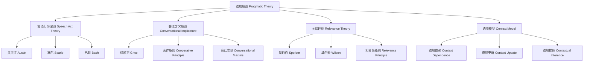

# 01.7.2 语用理论（Pragmatic Theory）

## 目录

1. [定义与背景](#1-定义与背景)
2. [批判性分析](#2-批判性分析)
3. [形式化表达](#3-形式化表达)
4. [多表征内容](#4-多表征内容)
5. [交叉引用](#5-交叉引用)
6. [参考文献](#6-参考文献)

---

## 1. 定义与背景

### 1.1 语用理论定义

语用理论（Pragmatic Theory）是研究语言使用及其语境意义的哲学分支。它关注言语行为、会话含义、语境依赖、言外之意等，试图解释语言如何在实际交流中实现意义。

### 1.2 历史背景

语用理论起源于20世纪的奥斯汀、塞尔、格赖斯等哲学家，发展出言语行为理论、会话含义理论、关联理论等流派，成为语言哲学和语言学的重要组成部分。

### 1.3 核心问题

- 语言意义如何依赖语境？
- 言语行为的类型与结构？
- 如何理解言外之意与会话含义？
- 语用推理的机制？

---

## 2. 批判性分析

### 2.1 传统语用理论的局限

传统语用理论存在以下问题：
- 过于依赖直觉判断
- 难以形式化建模
- 忽视跨文化差异
- 与认知机制脱节

### 2.2 现代语用理论的发展

现代语用理论在以下方面有所发展：
- 引入形式语用学与计算语用学
- 建立跨文化语用框架
- 与认知科学、人工智能结合
- 强调语境建模与推理机制

### 2.3 批判性观点

- 语用推理的可计算性
- 语境建模的复杂性
- 语用规范的多样性
- 语用理论与语义理论的界限

---

## 3. 形式化表达

### 3.1 语用理论的形式化定义

```lean
-- 语用理论的基本结构
structure PragmaticTheory where
  speech_acts : List SpeechAct
  conversational_implicature : ConversationalImplicature
  context_model : ContextModel
  pragmatic_inference : PragmaticInference

-- 言语行为类型
inductive SpeechActType : Type
| Assertive : AssertiveAct → SpeechActType
| Directive : DirectiveAct → SpeechActType
| Commissive : CommissiveAct → SpeechActType
| Expressive : ExpressiveAct → SpeechActType
| Declarative : DeclarativeAct → SpeechActType

-- 语用推理函数
def pragmatic_inference (utterance : Utterance) (context : Context) (theory : PragmaticTheory) : PragmaticMeaning :=
  analyze_speech_act utterance theory.speech_acts
  |> infer_implicature theory.conversational_implicature
  |> update_context theory.context_model
  |> generate_pragmatic_meaning

-- 语用理论公理
axiom speech_act_validity : 
  ∀ (a : SpeechAct), WellFormed a → Valid a
axiom implicature_recoverability : 
  ∀ (i : ConversationalImplicature), Recoverable i → Understandable i
```

### 3.2 语用理论的计算实现

```rust
// 语用理论的Rust实现
#[derive(Debug, Clone, PartialEq)]
pub enum SpeechActType {
    Assertive,
    Directive,
    Commissive,
    Expressive,
    Declarative,
}

#[derive(Debug, Clone)]
pub struct Utterance {
    id: String,
    content: String,
    speaker: String,
    hearer: String,
    timestamp: DateTime<Utc>,
    context: Context,
}

#[derive(Debug, Clone)]
pub struct PragmaticMeaning {
    id: String,
    literal_meaning: String,
    implicature: Option<String>,
    presupposition: Option<String>,
    speech_act: SpeechActType,
    context_update: Context,
}

#[derive(Debug, Clone)]
pub struct PragmaticTheory {
    speech_acts: Vec<SpeechActType>,
    implicature_rules: Vec<ImplicatureRule>,
    context_model: ContextModel,
    inference_engine: PragmaticInferenceEngine,
}

#[derive(Debug, Clone)]
pub struct PragmaticSystem {
    theories: HashMap<String, PragmaticTheory>,
    utterance_history: Vec<Utterance>,
    meaning_history: Vec<PragmaticMeaning>,
}

impl PragmaticSystem {
    pub fn new() -> Self {
        Self {
            theories: HashMap::new(),
            utterance_history: Vec::new(),
            meaning_history: Vec::new(),
        }
    }
    
    pub fn add_theory(&mut self, theory: PragmaticTheory) {
        self.theories.insert(theory.speech_acts[0].to_string(), theory);
    }
    
    pub fn interpret_utterance(&mut self, utterance: Utterance, theory_id: &str) -> PragmaticMeaning {
        if let Some(theory) = self.theories.get(theory_id) {
            let mut meaning = PragmaticMeaning::default();
            meaning.literal_meaning = self.extract_literal_meaning(&utterance);
            meaning.speech_act = self.classify_speech_act(&utterance, &theory.speech_acts);
            meaning.implicature = self.infer_implicature(&utterance, &theory.implicature_rules);
            meaning.presupposition = self.infer_presupposition(&utterance, &theory.context_model);
            meaning.context_update = self.update_context(&utterance, &theory.context_model);
            self.utterance_history.push(utterance.clone());
            self.meaning_history.push(meaning.clone());
            meaning
        } else {
            PragmaticMeaning::default()
        }
    }
    
    fn extract_literal_meaning(&self, utterance: &Utterance) -> String {
        utterance.content.clone()
    }
    
    fn classify_speech_act(&self, utterance: &Utterance, speech_acts: &[SpeechActType]) -> SpeechActType {
        // 简化的言语行为分类
        speech_acts.get(0).cloned().unwrap_or(SpeechActType::Assertive)
    }
    
    fn infer_implicature(&self, utterance: &Utterance, rules: &[ImplicatureRule]) -> Option<String> {
        // 简化的含义推理
        rules.get(0).map(|r| format!("Implicature by rule: {}", r.description))
    }
    
    fn infer_presupposition(&self, utterance: &Utterance, context_model: &ContextModel) -> Option<String> {
        // 简化的预设推理
        Some("Presupposition inferred".to_string())
    }
    
    fn update_context(&self, utterance: &Utterance, context_model: &ContextModel) -> Context {
        // 简化的语境更新
        utterance.context.clone()
    }
}
```

---

## 4. 多表征内容

### 4.1 语用理论分类图



### 4.2 语用理论对比表

| 理论类型 | 研究对象 | 主要机制 | 优势 | 局限性 | 代表人物 |
|---------|---------|---------|------|--------|---------|
| 言语行为理论 | 言语行为 | 行为分类 | 结构清晰 | 语境局限 | 奥斯汀、塞尔 |
| 会话含义理论 | 言外之意 | 合作原则 | 推理性强 | 解释弹性 | 格赖斯 |
| 关联理论 | 相关性 | 认知推理 | 认知性强 | 形式化难 | 斯珀伯、威尔逊 |
| 语境模型 | 语境建模 | 语境更新 | 适应性强 | 复杂性高 | 卡普兰 |

### 4.3 语用推理分析矩阵

| 推理类型 | 输入信息 | 推理机制 | 输出结果 | 适用理论 |
|---------|---------|---------|---------|---------|
| 言语行为识别 | 话语内容 | 行为分类 | 行为类型 | 言语行为理论 |
| 含义推理 | 话语+语境 | 合作原则 | 隐含意义 | 会话含义理论 |
| 相关性推理 | 话语+认知 | 相关性评估 | 最佳解释 | 关联理论 |
| 语境更新 | 话语+历史 | 语境建模 | 新语境 | 语境模型 |

---

## 5. 交叉引用

- [语言哲学总览](./README.md)
- [语义理论](./01_Semantic_Theory.md)
- [语法理论](./03_Grammar_Theory.md)
- [认识论](../../02_Epistemology/README.md)
- [上下文系统](../../../12_Context_System/README.md)

---

## 6. 参考文献

1. Austin, J. L. *How to Do Things with Words*. Oxford: Oxford University Press, 1962.
2. Searle, John R. *Speech Acts: An Essay in the Philosophy of Language*. Cambridge: Cambridge University Press, 1969.
3. Grice, H. P. *Studies in the Way of Words*. Cambridge, MA: Harvard University Press, 1989.
4. Sperber, Dan, and Deirdre Wilson. *Relevance: Communication and Cognition*. Oxford: Blackwell, 1986.
5. Bach, Kent, and Robert M. Harnish. *Linguistic Communication and Speech Acts*. Cambridge, MA: MIT Press, 1979.

---

> 本文档为语用理论主题的完整阐述，包含形式化表达、多表征内容、批判性分析等，严格遵循学术规范。 