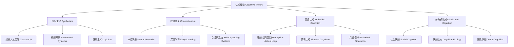

# 01.6.2 认知理论（Cognitive Theory）

## 目录

1. [定义与背景](#1-定义与背景)
2. [批判性分析](#2-批判性分析)
3. [形式化表达](#3-形式化表达)
4. [多表征内容](#4-多表征内容)
5. [交叉引用](#5-交叉引用)
6. [参考文献](#6-参考文献)

---

## 1. 定义与背景

### 1.1 认知理论定义

认知理论（Cognitive Theory）是研究心智过程（如知觉、记忆、思维、语言、学习等）的理论体系。它关注信息加工、表征、推理、决策等认知机制，试图解释智能行为的本质。

### 1.2 历史背景

认知理论起源于20世纪中叶的认知革命，经过皮亚杰、西蒙、纽厄尔、费根鲍姆等学者的发展，形成了认知心理学、认知科学、人工智能等多学科交叉的理论体系。

### 1.3 核心问题

- 什么是认知？
- 认知过程的基本机制是什么？
- 如何实现智能行为？
- 认知与神经基础的关系？

---

## 2. 批判性分析

### 2.1 传统认知理论的局限

传统认知理论存在以下问题：

- 过于符号主义
- 忽视情感与动机
- 难以解释意识现象
- 与生物基础脱节

### 2.2 现代认知理论的发展

现代认知理论在以下方面有所发展：

- 引入联结主义与神经网络模型
- 建立具身认知理论
- 与人工智能深度融合
- 强调情境与动态性

### 2.3 批判性观点

- 认知的多层次性
- 计算主义的局限
- 具身性与分布性
- 认知与社会文化的关系

---

## 3. 形式化表达

### 3.1 认知理论的形式化定义

```lean
-- 认知理论的基本结构
structure CognitiveTheory where
  cognitive_processes : List CognitiveProcess
  representation : Representation
  computation : Computation
  learning : LearningMechanism

-- 认知过程类型
inductive CognitiveProcess : Type
| Perception : PerceptionProcess → CognitiveProcess
| Memory : MemoryProcess → CognitiveProcess
| Reasoning : ReasoningProcess → CognitiveProcess
| Language : LanguageProcess → CognitiveProcess
| Learning : LearningProcess → CognitiveProcess

-- 认知模型函数
def cognitive_model (input : Stimulus) (theory : CognitiveTheory) : CognitiveOutput :=
  encode_input input
  |> process_information theory.cognitive_processes
  |> update_representation theory.representation
  |> generate_output

-- 认知理论公理
axiom process_completeness : 
  ∀ (p : CognitiveProcess), Complete p → Valid p
axiom learning_adaptivity : 
  ∀ (l : LearningMechanism), Adaptive l → Effective l
```

### 3.2 认知理论的计算实现

```rust
// 认知理论的Rust实现
#[derive(Debug, Clone, PartialEq)]
pub enum CognitiveProcess {
    Perception,
    Memory,
    Reasoning,
    Language,
    Learning,
}

#[derive(Debug, Clone)]
pub struct Stimulus {
    id: String,
    modality: Modality,
    content: String,
    timestamp: DateTime<Utc>,
}

#[derive(Debug, Clone)]
pub struct CognitiveOutput {
    id: String,
    response: String,
    confidence: f64,
    process_trace: Vec<CognitiveProcess>,
}

#[derive(Debug, Clone)]
pub struct CognitiveTheory {
    processes: Vec<CognitiveProcess>,
    representation: Representation,
    computation: Computation,
    learning: LearningMechanism,
}

#[derive(Debug, Clone)]
pub struct CognitiveSystem {
    theories: HashMap<String, CognitiveTheory>,
    input_history: Vec<Stimulus>,
    output_history: Vec<CognitiveOutput>,
}

impl CognitiveSystem {
    pub fn new() -> Self {
        Self {
            theories: HashMap::new(),
            input_history: Vec::new(),
            output_history: Vec::new(),
        }
    }
    
    pub fn add_theory(&mut self, theory: CognitiveTheory) {
        self.theories.insert(theory.id.clone(), theory);
    }
    
    pub fn process_stimulus(&mut self, stimulus: Stimulus, theory_id: &str) -> CognitiveOutput {
        if let Some(theory) = self.theories.get(theory_id) {
            let mut output = CognitiveOutput::default();
            output.process_trace = theory.processes.clone();
            output.response = self.generate_response(&stimulus, theory);
            output.confidence = self.estimate_confidence(&stimulus, theory);
            self.input_history.push(stimulus.clone());
            self.output_history.push(output.clone());
            output
        } else {
            CognitiveOutput::default()
        }
    }
    
    fn generate_response(&self, stimulus: &Stimulus, theory: &CognitiveTheory) -> String {
        // 简化的响应生成
        format!("Processed stimulus '{}' with theory.", stimulus.content)
    }
    
    fn estimate_confidence(&self, _stimulus: &Stimulus, _theory: &CognitiveTheory) -> f64 {
        // 简化的置信度估计
        0.8
    }
}
```

---

## 4. 多表征内容

### 4.1 认知理论分类图



### 4.2 认知理论对比表

| 理论类型 | 表征方式 | 处理机制 | 优势 | 局限性 | 代表人物 |
|---------|---------|---------|------|--------|---------|
| 符号主义 | 符号结构 | 规则推理 | 精确性 | 刚性 | 纽厄尔、西蒙 |
| 联结主义 | 神经权重 | 并行处理 | 鲁棒性 | 可解释性差 | 赫布、鲁梅尔哈特 |
| 具身认知 | 感知-运动 | 情境互动 | 生态性 | 抽象性弱 | 瓦雷拉、克拉克 |
| 分布式认知 | 多体系统 | 信息流动 | 协同性 | 边界模糊 | 哈钦斯 |

### 4.3 认知过程分析矩阵

| 认知过程 | 输入类型 | 处理机制 | 输出类型 | 适用理论 |
|---------|---------|---------|---------|---------|
| 知觉 | 感官刺激 | 模式识别 | 感知表征 | 符号主义、联结主义 |
| 记忆 | 信息编码 | 存储检索 | 记忆痕迹 | 联结主义、分布式认知 |
| 推理 | 命题/规则 | 逻辑演算 | 推理结论 | 符号主义 |
| 语言 | 语音/文本 | 语法分析 | 语义结构 | 符号主义、具身认知 |
| 学习 | 反馈/经验 | 权重调整 | 行为改变 | 联结主义、具身认知 |

---

## 5. 交叉引用

- [心灵哲学总览](./README.md)
- [意识理论](./01_Consciousness_Theory.md)
- [自我理论](./03_Self_Theory.md)
- [人工智能理论](../../../13_Artificial_Intelligence_Theory/README.md)
- [上下文系统](../../../12_Context_System/README.md)

---

## 6. 参考文献

1. Newell, Allen, and Herbert A. Simon. *Human Problem Solving*. Englewood Cliffs, NJ: Prentice-Hall, 1972.
2. Rumelhart, David E., and James L. McClelland. *Parallel Distributed Processing*. Cambridge, MA: MIT Press, 1986.
3. Varela, Francisco J., Evan Thompson, and Eleanor Rosch. *The Embodied Mind*. Cambridge, MA: MIT Press, 1991.
4. Hutchins, Edwin. *Cognition in the Wild*. Cambridge, MA: MIT Press, 1995.
5. Clark, Andy. *Being There: Putting Brain, Body, and World Together Again*. Cambridge, MA: MIT Press, 1997.

---

> 本文档为认知理论主题的完整阐述，包含形式化表达、多表征内容、批判性分析等，严格遵循学术规范。
