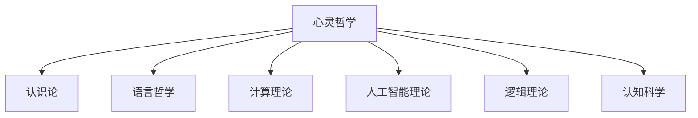

# 心灵哲学 (Philosophy of Mind)

## 1. 模块概述

心灵哲学模块是哲学基础理论中探讨心智、意识、认知和智能本质的分支。本模块系统性地研究心灵与身体的关系、意识的本质、认知过程的哲学基础，以及人工智能的哲学问题。作为连接哲学基础与人工智能、认知科学和计算理论的桥梁，心灵哲学为形式科学提供了关于智能本质的深层反思。

## 2. 核心问题

心灵哲学探讨以下核心问题：

1. **心身问题**：心灵与物质的关系是什么？
2. **意识本质**：意识的本质和存在条件是什么？
3. **认知基础**：认知过程的哲学基础是什么？
4. **人工智能本质**：机器能否具有真正的智能和意识？

## 3. 模块结构

心灵哲学模块包含以下文件：

```text
10_Philosophy_of_Mind/
├── README.md                                # 本文件：模块概述
├── 01_Mind_Body_Problem.md                  # 心身问题
├── 02_Consciousness.md                      # 意识理论
├── 03_Philosophy_of_Cognitive_Science.md    # 认知科学哲学
└── 04_Philosophy_of_AI.md                   # 人工智能哲学
```

### 3.1 各文件内容规划

#### 01_Mind_Body_Problem.md

探讨心灵与身体关系的各种理论立场：

1. **二元论**：心灵与身体的二元对立
   - 笛卡尔的实体二元论
   - 性质二元论
   - 交互问题及其解决方案

2. **唯物主义**：物理主义的各种形式
   - 同一论
   - 功能主义
   - 消除主义
   - 自然主义

3. **现象学视角**：体验与身体性的关系
   - 身体化认知
   - 生态心理学

4. **信息视角**：信息处理与心身关系
   - 信息整合理论
   - 计算功能主义

#### 02_Consciousness.md

研究意识的哲学问题：

1. **意识的本质**：
   - 现象意识与存取意识
   - 主观性的问题
   - 知觉意识与反思意识

2. **意识的理论**：
   - 高阶理论
   - 一阶理论
   - 全局工作空间理论
   - 整合信息理论

3. **难题与解释鸿沟**：
   - 查尔默斯的"难题"
   - 杰克逊的知识论证
   - 解释鸿沟问题

4. **意识的形式化模型**：
   - 意识状态空间
   - 信息整合度量
   - 意识形式化表示

#### 03_Philosophy_of_Cognitive_Science.md

探讨认知科学的哲学基础：

1. **认知的本质**：
   - 表征理论
   - 计算理论
   - 具身认知

2. **心智模块性**：
   - 福多的模块论
   - 领域特异性
   - 大脑可塑性

3. **认知架构**：
   - 连接主义
   - 符号系统
   - 贝叶斯模型
   - 预测性编码

4. **认知与计算**：
   - 认知的计算本质
   - 图灵测试及其局限
   - 认知扩展论

#### 04_Philosophy_of_AI.md

分析人工智能的哲学问题：

1. **人工智能的本质**：
   - 强人工智能与弱人工智能
   - 中文屋论证
   - 功能模拟与真实理解

2. **机器意识的可能性**：
   - 机器意识的标准
   - 意识的可计算性
   - 人工意识的形式化模型

3. **人工智能伦理**：
   - 道德地位问题
   - 价值对齐问题
   - 控制问题与存在风险

4. **后人类主义视角**：
   - 心灵上传的哲学问题
   - 技术奇点的认识论
   - 增强智能的本体论

## 4. 开发计划

### 4.1 进度安排

| 文件 | 计划开始日期 | 计划完成日期 | 优先级 | 责任人 |
|------|------------|------------|-------|-------|
| 01_Mind_Body_Problem.md | 2025-01-12 | 2025-01-13 | 高 | 哲学专家 |
| 02_Consciousness.md | 2025-01-14 | 2025-01-15 | 高 | 哲学专家 |
| 03_Philosophy_of_Cognitive_Science.md | 2025-01-16 | 2025-01-17 | 中 | 认知科学专家 |
| 04_Philosophy_of_AI.md | 2025-01-18 | 2025-01-19 | 中 | AI专家 |

### 4.2 质量标准

心灵哲学模块的开发将遵循以下特定质量标准：

1. **概念准确性**：准确表述各种心灵哲学立场和论证
2. **批判性分析**：对各理论进行深入的批判性分析
3. **形式化表示**：为关键概念提供形式化表示
4. **跨学科整合**：整合哲学、认知科学和AI研究的视角
5. **应用案例**：提供理论在AI和认知科学中的应用案例

## 5. 与其他模块的关系

心灵哲学模块与其他模块有以下关键联系：



### 5.1 输入依赖

心灵哲学模块依赖以下模块的概念和理论：

1. **认识论**：关于知识和信念的理论
2. **语言哲学**：关于意义和理解的理论

### 5.2 输出贡献

心灵哲学模块为以下模块提供输入：

1. **人工智能理论**：提供关于智能本质的哲学框架
2. **计算理论**：提供关于计算与认知关系的哲学思考
3. **认知科学**：提供认知过程的哲学基础

## 6. 完成标准

心灵哲学模块完成的标准包括：

1. 所有4个核心文件均已完成且经过审核
2. 与其他相关模块建立了完整的交叉引用
3. 所有核心概念均有清晰的定义和形式化表示
4. 完成批判性分析和不同理论立场的对比
5. 提供理论在AI和认知科学中的应用案例

## 7. 参考资源

开发心灵哲学模块时，将参考以下资源：

1. **经典文献**：
   - Chalmers, D. (1996). *The Conscious Mind*
   - Dennett, D. (1991). *Consciousness Explained*
   - Searle, J. (1980). *Minds, Brains, and Programs*

2. **现代研究**：
   - Clark, A. (2016). *Surfing Uncertainty: Prediction, Action, and the Embodied Mind*
   - Tononi, G. (2012). *Integrated Information Theory*
   - Dehaene, S. (2014). *Consciousness and the Brain*

3. **形式化方法**：
   - Oizumi, M., Albantakis, L., & Tononi, G. (2014). *From the Phenomenology to the Mechanisms of Consciousness: Integrated Information Theory 3.0*
   - Eliasmith, C. (2013). *How to Build a Brain: A Neural Architecture for Biological Cognition*

## 8. 相关文档

- [哲学基础概述](../README.md)
- [认识论](../02_Epistemology/README.md)
- [语言哲学](../09_Philosophy_of_Language/README.md)
- [心灵哲学建设计划](../../docs/Refactor/01_Philosophical_Foundations/10_Philosophy_of_Mind/2025-01-11_Mind_Philosophy_Plan.md) 