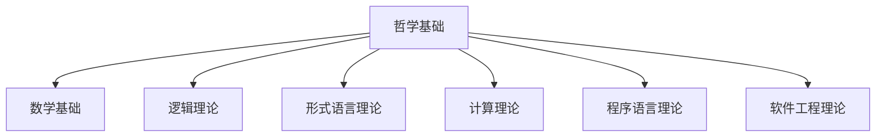
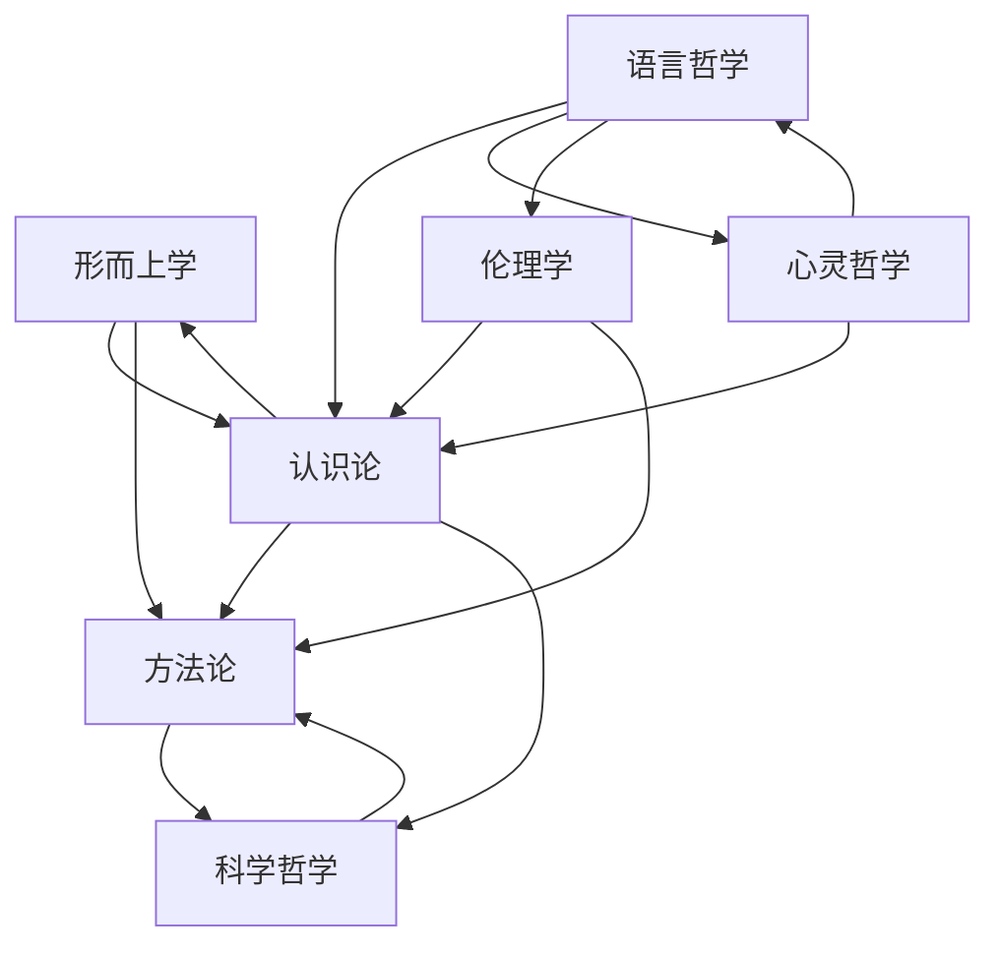

# 哲学基础 (Philosophical Foundations)

## 1. 模块概述

哲学基础模块是形式科学项目的理论根基，提供了各个学科领域的哲学分析框架、概念体系和方法论基础。本模块系统性地整合了形而上学、认识论、方法论、科学哲学、伦理学和语言哲学等核心哲学分支，建立了从哲学思想到形式科学各领域的概念桥接。

## 2. 子模块结构

哲学基础模块包含以下子模块：

```text
01_Philosophical_Foundations/
├── README.md                    # 本文件：模块概述和导航
├── Context/                     # 哲学基础上下文文件
├── 01_Metaphysics/              # 形而上学
│   ├── README.md                  # 形而上学概述
│   ├── 01_Being_and_Existence.md  # 存在与本质
│   ├── 02_Entity_Theory.md        # 实体理论
│   ├── 03_Modal_Theory.md         # 模态理论
│   └── 04_Causality_Theory.md     # 因果理论
├── 02_Epistemology/             # 认识论
│   ├── README.md                  # 认识论概述
│   ├── 01_Knowledge_Theory.md     # 知识理论
│   ├── 02_Belief_Theory.md        # 信念理论
│   ├── 03_Justification_Theory.md # 确证理论
│   └── 04_Truth_Theory.md         # 真理理论
├── 03_Methodology/              # 方法论
│   ├── README.md                  # 方法论概述
│   ├── 01_Scientific_Methodology.md     # 科学方法论
│   ├── 02_Formal_Methods.md            # 形式化方法
│   ├── 03_Analytical_Synthetic_Methods.md # 分析综合法
│   └── 04_Research_Paradigms.md       # 研究范式
├── 05_Philosophy_of_Science/    # 科学哲学
│   ├── README.md                  # 科学哲学概述
│   ├── 01_Scientific_Methodology.md # 科学方法论
│   ├── 02_Scientific_Realism.md   # 科学实在论
│   ├── 03_Scientific_Explanation.md # 科学解释理论
│   └── 04_Scientific_Progress.md  # 科学进步理论
├── 08_Ethics/                   # 伦理学
│   ├── README.md                  # 伦理学概述
│   ├── 01_Normative_Ethics.md     # 规范伦理学
│   ├── 02_Meta_Ethics.md          # 元伦理学
│   ├── 03_Applied_Ethics.md       # 应用伦理学
│   └── 04_AI_Ethics.md            # AI伦理学
├── 09_Philosophy_of_Language/   # 语言哲学
│   ├── README.md                  # 语言哲学概述
│   ├── 01_Semantics.md            # 语义学
│   ├── 02_Pragmatics.md           # 语用学
│   ├── 03_Speech_Acts.md          # 语言行为理论
│   └── 04_Formal_Pragmatics.md    # 形式语用学
└── 10_Philosophy_of_Mind/       # 心灵哲学(进行中)
    ├── README.md                  # 心灵哲学概述
    ├── 01_Mind_Body_Problem.md    # 心身问题
    ├── 02_Consciousness.md        # 意识理论
    ├── 03_Philosophy_of_Cognitive_Science.md # 认知科学哲学
    └── 04_Philosophy_of_AI.md     # 人工智能哲学
```

## 3. 模块功能与作用

### 3.1 核心功能

哲学基础模块提供以下核心功能：

1. **概念基础**：提供形式科学各领域的哲学概念基础
2. **方法论框架**：建立研究方法和理论构建的哲学框架
3. **批判分析工具**：提供评估理论和模型的批判性分析工具
4. **跨学科桥接**：连接不同学科领域的概念体系
5. **伦理指导**：为技术发展和应用提供伦理思考框架

### 3.2 对其他模块的贡献

哲学基础模块为其他形式科学模块提供以下支持：

1. **为形式语言理论**提供语言哲学基础
2. **为逻辑理论**提供认识论和语言哲学基础
3. **为计算理论和人工智能**提供心灵哲学基础
4. **为软件工程理论**提供伦理学和方法论基础
5. **为数学基础**提供形而上学和认识论支持

## 4. 当前状态

### 4.1 完成度

| 子模块 | 完成状态 | 优先级 | 备注 |
|-------|---------|-------|------|
| 形而上学 | 完成 (100%) | - | 已完成全部4个文件 |
| 认识论 | 完成 (100%) | - | 已完成全部4个文件 |
| 方法论 | 完成 (100%) | - | 已完成全部4个文件 |
| 科学哲学 | 完成 (100%) | - | 已完成全部4个文件 |
| 伦理学 | 完成 (100%) | - | 已完成全部4个文件 |
| 语言哲学 | 完成 (100%) | - | 已完成全部4个文件 |
| 心灵哲学 | 规划中 (0%) | 高 | 即将开始构建 |
| 社会政治哲学 | 未开始 (0%) | 中 | 计划于心灵哲学完成后启动 |

### 4.2 近期更新

1. **语言哲学部分完成** (2025-01-10)：
   - 完成了语义学、语用学、语言行为理论和形式语用学文件
   - 实现了与认识论和逻辑理论的交叉引用

2. **心灵哲学部分规划** (2025-01-10)：
   - 完成心灵哲学模块重构计划
   - 设计心灵哲学标准目录结构

## 5. 交叉引用关系

哲学基础模块与其他模块的主要交叉引用关系：



## 6. 内部交叉引用

哲学基础内部各子模块间的交叉引用关系：



## 7. 使用指南

### 7.1 如何使用本模块

1. **理论基础研究**：从相关哲学子模块开始，了解特定领域的哲学基础
2. **跨学科探索**：通过交叉引用关系探索不同哲学分支间的联系
3. **应用于具体领域**：将哲学概念和分析工具应用到具体研究领域

### 7.2 贡献指南

如需对哲学基础模块做出贡献，请遵循以下原则：

1. **概念准确性**：确保哲学概念的准确表述和定义
2. **形式化表示**：为哲学概念提供数学形式化表示
3. **代码实现**：为关键概念提供Rust或Haskell实现
4. **交叉引用**：维护与相关模块的交叉引用关系

## 8. 相关文档

- [形式科学项目总览](../README.md)
- [统一目录结构规范](../统一目录结构规范.md)
- [哲学基础上下文](./Context/2025-01-05_Philosophy_Context_Progress.md)
- [项目重构行动计划](../项目重构行动计划_20250110.md)
