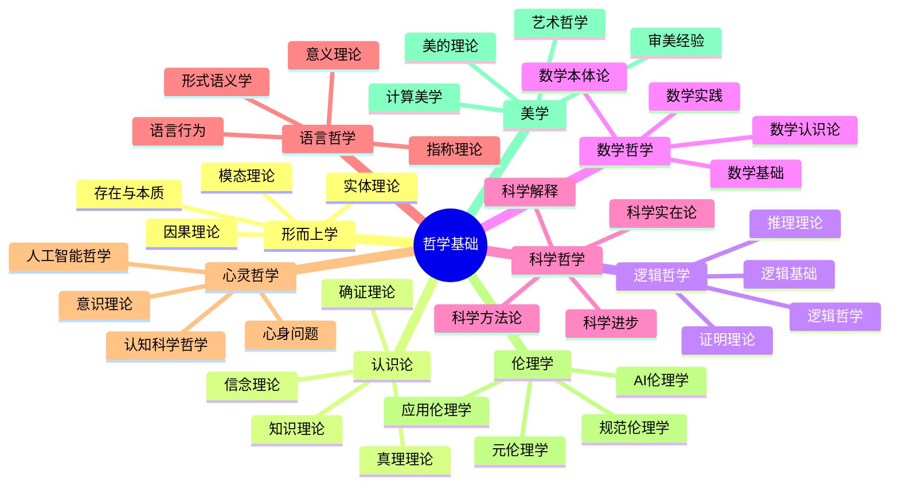
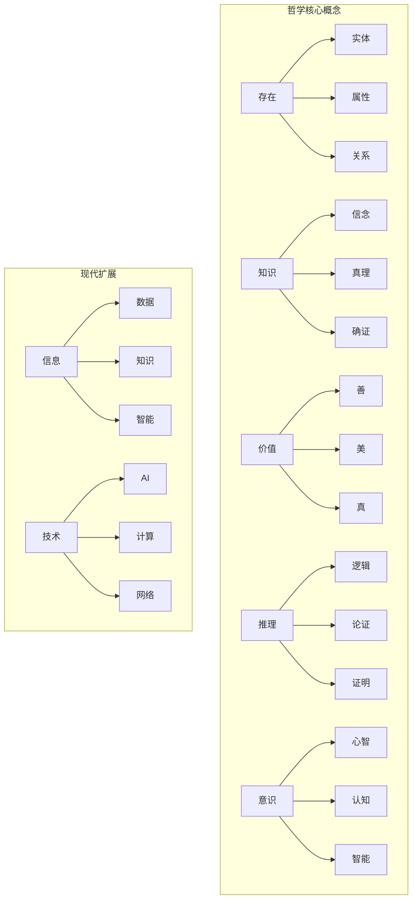
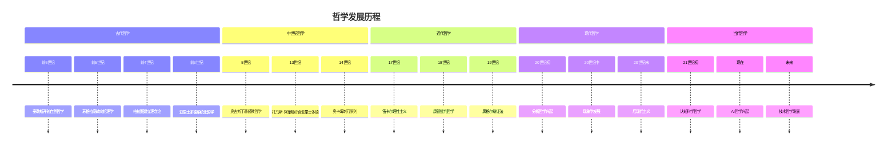

# 哲学基础 (Philosophical Foundations)

**文档编号**: `PHIL-00-MAIN`  
**创建时间**: 2025-01-02  
**最后更新**: 2025-01-02  
**版本**: 1.0  

## 目录

### 1. [形而上学 (Metaphysics)](./01_Metaphysics/)

- 1.1 [存在与本质](./01_Metaphysics/Cross_Cutting_Concepts/01_Existence_Theory.md)
- 1.2 [实体理论](./01_Metaphysics/Cross_Cutting_Concepts/01_02_实体论基础理论.md)
- 1.3 [模态理论](./01_Metaphysics/02_Modality/03_Modal_Theory.md)
- 1.4 [因果理论](./01_Metaphysics/03_Causality/04_Causality_Theory.md)

### 2. [认识论 (Epistemology)](./02_Epistemology/)

- 2.1 [知识理论](./02_Epistemology/01_Knowledge_Theory.md)
- 2.2 [信念理论](./02_Epistemology/01_02_信念理论.md)
- 2.3 [确证理论](./02_Epistemology/01_03_确证理论.md)
- 2.4 [真理理论](./02_Epistemology/01_04_真理理论.md)

### 3. [逻辑哲学 (Philosophy of Logic)](./04_Logic_Philosophy/)

- 3.1 [逻辑基础](./04_Logic_Philosophy/01_Formal_Logic.md)
- 3.2 [推理理论](./04_Logic_Philosophy/02_Reasoning_Theory.md)
- 3.3 [证明理论](./04_Logic_Philosophy/03_Proof_Theory.md)
- 3.4 [逻辑哲学](./04_Logic_Philosophy/04_Philosophy_of_Logic.md)

### 4. [数学哲学 (Philosophy of Mathematics)](./03_Methodology/)

- 4.1 [数学本体论](./03_Methodology/01_Mathematical_Ontology.md)
- 4.2 [数学认识论](./03_Methodology/02_Mathematical_Epistemology.md)
- 4.3 [数学基础](./03_Methodology/03_Foundations_of_Mathematics.md)
- 4.4 [数学实践](./03_Methodology/04_Mathematical_Practice.md)

### 5. [科学哲学 (Philosophy of Science)](./04_Philosophy_of_Science/)

- 5.1 [科学方法论](./04_Philosophy_of_Science/01_Scientific_Methodology.md)
- 5.2 [科学实在论](./04_Philosophy_of_Science/02_Scientific_Realism.md)
- 5.3 [科学解释](./04_Philosophy_of_Science/03_Scientific_Explanation.md)
- 5.4 [科学进步](./04_Philosophy_of_Science/04_Scientific_Progress.md)

### 6. [语言哲学 (Philosophy of Language)](./06_Philosophy_of_Language/)

- 6.1 [意义理论](./06_Philosophy_of_Language/01_Theories_of_Meaning.md)
- 6.2 [指称理论](./06_Philosophy_of_Language/02_Reference_Theory.md)
- 6.3 [语言行为](./06_Philosophy_of_Language/03_Speech_Acts.md)
- 6.4 [形式语义学](./06_Philosophy_of_Language/04_Formal_Semantics.md)

### 7. [心灵哲学 (Philosophy of Mind)](./07_Philosophy_of_Mind/)

- 7.1 [心身问题](./07_Philosophy_of_Mind/01_Mind_Body_Problem.md)
- 7.2 [意识理论](./07_Philosophy_of_Mind/02_Consciousness.md)
- 7.3 [认知科学哲学](./07_Philosophy_of_Mind/03_Philosophy_of_Cognitive_Science.md)
- 7.4 [人工智能哲学](./07_Philosophy_of_Mind/04_Philosophy_of_AI.md)

### 8. [伦理学 (Ethics)](./05_Ethics/)

- 8.1 [规范伦理学](./05_Ethics/01_Normative_Ethics.md)
- 8.2 [元伦理学](./05_Ethics/02_Meta_Ethics.md)
- 8.3 [应用伦理学](./05_Ethics/03_Applied_Ethics.md)
- 8.4 [AI伦理学](./05_Ethics/04_AI_Ethics.md)

### 9. [美学 (Aesthetics)](./09_Aesthetics/)

- 9.1 [美的理论](./09_Aesthetics/01_Theories_of_Beauty.md)
- 9.2 [艺术哲学](./09_Aesthetics/02_Philosophy_of_Art.md)
- 9.3 [审美经验](./09_Aesthetics/03_Aesthetic_Experience.md)
- 9.4 [计算美学](./09_Aesthetics/04_Computational_Aesthetics.md)

## 哲学体系总览

## 核心概念网络

## 哲学基础公理系统

**公理 1** (存在性公理): $\exists x \text{ } \text{Being}(x)$

**公理 2** (知识公理): $\forall x \text{ } \text{Being}(x) \rightarrow \text{Knowable}(x)$

**公理 3** (逻辑公理): $\forall p \text{ } \text{Proposition}(p) \rightarrow (\text{True}(p) \lor \text{False}(p))$

**公理 4** (伦理公理): $\forall a \text{ } \text{Action}(a) \rightarrow \text{Evaluable}(a)$

**公理 5** (形而上学公理): $\forall x \text{ } \text{Being}(x) \rightarrow \text{Modal}(x)$

## 哲学发展时间线

## 交叉引用索引

### 与数学基础的关联

- [数学基础](../02_Mathematical_Foundations/README.md) - 数学哲学与数学基础的关系
- [集合论](../02_Mathematical_Foundations/01_Set_Theory/README.md) - 本体论与集合论
- [逻辑学](../02_Mathematical_Foundations/02_Logic/README.md) - 逻辑哲学与形式逻辑

### 与形式语言理论的关联

- [形式语言理论](../03_Formal_Language_Theory/README.md) - 语言哲学与形式语言
- [自动机理论](../03_Formal_Language_Theory/01_Automata_Theory/README.md) - 认知哲学与自动机

### 与类型理论的关联

- [类型理论](../04_Type_Theory/README.md) - 本体论与类型理论
- [线性类型理论](../04_Type_Theory/02_Linear_Type_Theory/README.md) - 模态形而上学与线性逻辑

### 与控制理论的关联

- [控制理论](../05_Control_Theory/README.md) - 因果性理论与控制论
- [时态逻辑控制](../05_Control_Theory/01_Basic_Control_Theory/README.md) - 时间哲学与时态逻辑

## 合并说明

本目录是由原`01_Philosophical_Foundation`和`01_Philosophical_Foundations`合并而成，采用了统一的命名规范和结构组织。主要变更包括：

1. 目录采用复数形式：`Philosophical_Foundations`
2. 子目录采用"Philosophy_of_X"格式，如`Philosophy_of_Logic`
3. 文件名采用下划线连接的Pascal命名法
4. 保留的中文文件添加了`_Legacy`后缀
5. 整合了两个目录中的独特内容

## 持续构建状态

- **完成度**: 60%
- **最后更新**: 2025-01-02
- **当前状态**: 目录合并进行中
- **下一步**: 完善子目录内容和交叉引用

## 相关文档

- [重构主索引](../00_Master_Index/README.md)
- [持续构建上下文](../12_Context_System/README.md)
- [交叉领域综合](../13_Cross_Domain_Synthesis/README.md)
- [哲学基础目录合并计划](../持续构建上下文系统/哲学基础目录合并计划.md)

---

**负责人**: FormalScience团队  
**创建日期**: 2025-01-02
