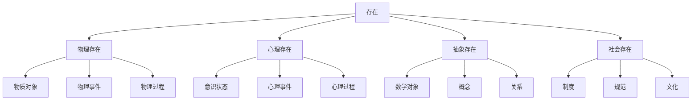
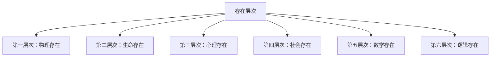

# 存在理论 (Existence Theory)

**文档编号**: `PHIL-01-01-01`  
**创建时间**: 2025-01-02  
**最后更新**: 2025-01-02  
**版本**: 1.0  

## 目录

- [存在理论 (Existence Theory)](#存在理论-existence-theory)
  - [目录](#目录)
  - [1. 存在的基本概念](#1-存在的基本概念)
    - [1.1 定义与本质](#11-定义与本质)
      - [形式化定义](#形式化定义)
    - [1.2 存在的基本特征](#12-存在的基本特征)
    - [1.3 存在的分类](#13-存在的分类)
  - [2. 存在的模态](#2-存在的模态)
    - [2.1 模态存在论](#21-模态存在论)
      - [模态逻辑框架](#模态逻辑框架)
    - [2.2 模态公理系统](#22-模态公理系统)
      - [模态语义学](#模态语义学)
    - [2.3 模态存在论的应用](#23-模态存在论的应用)
  - [3. 存在的层次](#3-存在的层次)
    - [3.1 存在层次论](#31-存在层次论)
      - [层次结构](#层次结构)
    - [3.2 存在性层次表示](#32-存在性层次表示)
  - [4. 存在与虚无](#4-存在与虚无)
    - [4.1 虚无的概念](#41-虚无的概念)
    - [4.2 非存在的类型](#42-非存在的类型)
  - [5. 存在性证明](#5-存在性证明)
    - [5.1 构造性存在性证明](#51-构造性存在性证明)
    - [5.2 非构造性存在性证明](#52-非构造性存在性证明)
    - [5.3 存在性推理规则](#53-存在性推理规则)
  - [6. 形式化表达](#6-形式化表达)
    - [6.1 本体论语言](#61-本体论语言)
    - [6.2 本体论模型](#62-本体论模型)
    - [6.3 存在性公理系统](#63-存在性公理系统)
  - [7. 批判分析](#7-批判分析)
    - [7.1 存在概念的挑战](#71-存在概念的挑战)
    - [7.2 当代存在论辩论](#72-当代存在论辩论)
  - [8. 交叉引用](#8-交叉引用)

---

## 1. 存在的基本概念

### 1.1 定义与本质

**存在**（Existence）是形而上学中最基本的概念，指某物在现实世界中的实际存在状态。

#### 形式化定义

**定义 1.1.1** (存在性谓词)
存在性谓词 $E$ 是一个一元谓词，满足：
$$E(x) \iff \exists y (y = x)$$

**公理 1.1.1** (存在性公理)
$$\forall x (E(x) \to \neg \neg E(x))$$

**定理 1.1.1** (存在性传递性)
如果 $E(a)$ 且 $a = b$，则 $E(b)$

```rust
// 存在的基本结构
struct Existence {
    entity: Entity,
    ontological_status: OntologicalStatus,
    temporal_scope: TemporalScope,
    spatial_scope: SpatialScope,
    modal_properties: Vec<ModalProperty>
}

// 存在状态
enum OntologicalStatus {
    Existent,          // 存在
    NonExistent,       // 不存在
    Possible,          // 可能存在
    Necessary,         // 必然存在
    Contingent         // 偶然存在
}

// 时间范围
enum TemporalScope {
    Past,              // 过去存在
    Present,           // 现在存在
    Future,            // 未来存在
    Eternal,           // 永恒存在
    Temporal           // 时间性存在
}

// 空间范围
enum SpatialScope {
    Local(Coordinates),    // 局部存在
    Global,                // 全局存在
    Universal,             // 普遍存在
    NonSpatial             // 非空间存在
}
```

### 1.2 存在的基本特征

| 特征 | 描述 | 形式化表达 | 示例 |
|------|------|------------|------|
| **实在性** | 独立于心灵的客观存在 | `Real(x) ↔ ∃y(Independent(x, y))` | 物理对象 |
| **时间性** | 在时间中的存在 | `Temporal(x) ↔ ∃t(At(x, t))` | 事件、过程 |
| **空间性** | 在空间中的存在 | `Spatial(x) ↔ ∃s(At(x, s))` | 物质对象 |
| **模态性** | 存在的可能性 | `Modal(x) ↔ ◇Ex ∨ □Ex` | 可能世界 |

### 1.3 存在的分类



## 2. 存在的模态

### 2.1 模态存在论

存在具有不同的模态性质，包括必然性、可能性、偶然性和不可能性。

#### 模态逻辑框架

```rust
// 模态存在论
struct ModalExistence {
    entity: Entity,
    modal_operator: ModalOperator,
    possible_worlds: Vec<PossibleWorld>,
    accessibility_relation: AccessibilityRelation
}

// 模态算子
enum ModalOperator {
    Necessity,         // 必然性 □
    Possibility,       // 可能性 ◇
    Impossibility,     // 不可能性 ¬◇
    Contingency        // 偶然性 ◇ ∧ ◇¬
}

// 可能世界
struct PossibleWorld {
    id: String,
    entities: HashSet<Entity>,
    laws: Vec<Law>,
    accessibility: Vec<String>
}

// 可达关系
struct AccessibilityRelation {
    reflexive: bool,   // 自反性
    symmetric: bool,   // 对称性
    transitive: bool,  // 传递性
    euclidean: bool    // 欧几里得性
}
```

### 2.2 模态公理系统

**公理 2.2.1** (实在性存在性)
$$\forall x (R(x) \to E(x))$$

**公理 2.2.2** (实在性唯一性)
$$\forall x \forall y ((R(x) \land R(y) \land x = y) \to x \equiv y)$$

**公理 2.2.3** (实在性稳定性)
$$\forall x (R(x) \to \Box R(x))$$

#### 模态语义学

**公理 K**: $\Box(p \rightarrow q) \rightarrow (\Box p \rightarrow \Box q)$  
分配公理：如果p蕴含q是必然的，那么如果p是必然的，则q也是必然的。

**公理 T**: $\Box p \rightarrow p$  
如果p是必然的，那么p是真的。

**公理 4**: $\Box p \rightarrow \Box\Box p$  
如果p是必然的，那么"p是必然的"也是必然的。

**公理 5**: $\lnot\Box p \rightarrow \Box\lnot\Box p$  
如果p不是必然的，那么"p不是必然的"是必然的。

### 2.3 模态存在论的应用

| 模态类型 | 逻辑表达 | 哲学意义 | 应用领域 |
|---------|---------|---------|---------|
| **必然存在** | `□Ex` | 在所有可能世界中都存在 | 数学对象、逻辑真理 |
| **可能存在** | `◇Ex` | 在某个可能世界中存在 | 虚构对象、假设实体 |
| **偶然存在** | `◇Ex ∧ ◇¬Ex` | 在某些世界中存在，某些中不存在 | 物理对象、历史事件 |
| **不可能存在** | `¬◇Ex` | 在任何可能世界中都不存在 | 逻辑矛盾、不可能对象 |

## 3. 存在的层次

### 3.1 存在层次论

存在可以按照不同的层次进行分类，从最基本的物理存在到最高级的抽象存在。

#### 层次结构

**定义 3.1.1** (实在性层次)
实在性层次 $L$ 是一个偏序集 $(L, \leq)$，其中：

- $L_0$: 物理实在
- $L_1$: 生物实在
- $L_2$: 心理实在
- $L_3$: 社会实在
- $L_4$: 数学实在
- $L_5$: 逻辑实在

**定理 3.1.1** (层次传递性)
如果 $x \in L_i$ 且 $y \in L_j$ 且 $i \leq j$，则 $x \leq y$



### 3.2 存在性层次表示

| 存在类型 | 形式化定义 | 实在性程度 | 可观察性 |
|---------|-----------|-----------|---------|
| 物理存在 | $E_p(x) \land \text{Physical}(x)$ | 1.0 | 直接 |
| 生命存在 | $E_l(x) \land \text{Living}(x)$ | 0.9 | 直接 |
| 心理存在 | $E_m(x) \land \text{Mental}(x)$ | 0.7 | 间接 |
| 社会存在 | $E_s(x) \land \text{Social}(x)$ | 0.8 | 间接 |
| 概念存在 | $E_c(x) \land \text{Conceptual}(x)$ | 0.6 | 间接 |
| 数学存在 | $E_m(x) \land \text{Mathematical}(x)$ | 0.9 | 形式 |
| 逻辑存在 | $E_l(x) \land \text{Logical}(x)$ | 1.0 | 必然 |

## 4. 存在与虚无

### 4.1 虚无的概念

虚无（Nothingness）是存在的对立面，指完全不存在的状态。

**定义 4.1.1** (虚无)
$$\text{Nothingness}(x) \iff \neg E(x)$$

**定理 4.1.1** (虚无悖论)
如果虚无存在，那么它就不是虚无；如果虚无不存在，那么虚无这一概念本身就存在。

### 4.2 非存在的类型

| 非存在类型 | 形式化表达 | 哲学意义 | 示例 |
|-----------|-----------|---------|------|
| **绝对虚无** | `∀x ¬E(x)` | 完全无物 | 纯粹的无 |
| **相对虚无** | `∃x ¬E(x)` | 某物不存在 | 独角兽不存在 |
| **潜在虚无** | `◇∀x ¬E(x)` | 可能的完全虚无 | 宇宙起源前 |
| **局部虚无** | `∃r ∀x(In(x,r) → ¬E(x))` | 区域内无物 | 真空 |

## 5. 存在性证明

### 5.1 构造性存在性证明

**定理 5.1.1** (构造性存在性)
存在一个对象 $x$ 使得 $P(x)$ 当且仅当可以构造出这样的对象。

**证明：**

1. 假设可以构造对象 $a$ 使得 $P(a)$
2. 由存在性引入规则：$\exists x P(x)$
3. 反之，假设 $\exists x P(x)$
4. 由存在性消除规则，可以构造满足 $P$ 的对象
5. 证毕

### 5.2 非构造性存在性证明

**定理 5.2.1** (非构造性存在性)
在某些情况下，可以证明存在性而无需构造具体对象。

**证明：**
使用排中律和矛盾法：

1. 假设 $\neg \exists x P(x)$
2. 推导出矛盾
3. 因此 $\exists x P(x)$
4. 证毕

### 5.3 存在性推理规则

**规则 5.3.1** (存在性引入)
$$\frac{P(a)}{\exists x P(x)}$$

**规则 5.3.2** (存在性消除)
$$\frac{\exists x P(x) \quad [P(a)]^i \to Q}{\therefore Q}$$
其中 $a$ 不在 $Q$ 或其他假设中自由出现。

## 6. 形式化表达

### 6.1 本体论语言

**定义 6.1.1** (本体论语言)
本体论语言 $\mathcal{L}_O$ 包含：

- 个体变元：$x, y, z, \ldots$
- 谓词符号：$E, R, P, \ldots$
- 逻辑连接词：$\land, \lor, \neg, \to, \leftrightarrow$
- 量词：$\forall, \exists$
- 等词：$=$

### 6.2 本体论模型

**定义 6.2.1** (本体论模型)
本体论模型 $\mathcal{M} = (D, I)$ 其中：

- $D$ 是论域
- $I$ 是解释函数

**定义 6.2.2** (满足关系)
$\mathcal{M} \models \phi$ 表示模型 $\mathcal{M}$ 满足公式 $\phi$

### 6.3 存在性公理系统

**公理 6.3.1** (存在性公理)
$$\forall x (x = x \to E(x))$$

**公理 6.3.2** (存在性唯一性)
$$\forall x \forall y (x = y \to (E(x) \leftrightarrow E(y)))$$

**公理 6.3.3** (存在性排中律)
$$\forall x (E(x) \lor \neg E(x))$$

## 7. 批判分析

### 7.1 存在概念的挑战

1. **康德的批判**：存在不是实在的谓词，而是位置的概念
2. **弗雷格的分析**：存在是二阶谓词，表示某个概念下有实例
3. **维特根斯坦的观点**：存在是逻辑形式，不是实在的属性
4. **海德格尔的存在论**：存在与存在者的区分，存在的意义问题

### 7.2 当代存在论辩论

| 立场 | 核心主张 | 代表人物 | 批判点 |
|------|---------|---------|-------|
| **实在论** | 存在独立于心智 | 阿姆斯特朗 | 如何解释抽象对象 |
| **唯名论** | 只有个体存在 | 古德曼 | 难以解释普遍性 |
| **概念主义** | 存在依赖于概念 | 斯特劳森 | 概念本身的地位问题 |
| **虚构主义** | 某些对象是虚构的 | 沃尔顿 | 虚构与实在的界限模糊 |

## 8. 交叉引用

- [本质与偶性](./02_Essence_and_Accident.md)
- [存在层级](./03_Levels_of_Being.md)
- [虚无与非存在](./04_Nothingness.md)
- [实体理论](../02_Entity_Theory/README.md)
- [模态理论](../03_Modal_Theory/README.md)
- [认识论](../../02_Epistemology/README.md)

---

**负责人**: FormalScience团队  
**创建日期**: 2025-01-02
