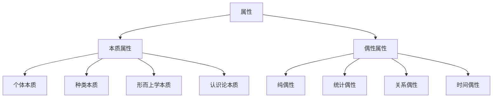

# 本质与偶性 (Essence and Accident)

**文档编号**: `PHIL-01-01-02`  
**创建时间**: 2025-01-02  
**最后更新**: 2025-01-02  
**版本**: 1.0  

## 目录

1. [本质的概念](#1-本质的概念)
2. [偶性的概念](#2-偶性的概念)
3. [本质与偶性的区分](#3-本质与偶性的区分)
4. [本质主义](#4-本质主义)
5. [反本质主义](#5-反本质主义)
6. [形式化表达](#6-形式化表达)
7. [应用案例](#7-应用案例)
8. [交叉引用](#8-交叉引用)

---

## 1. 本质的概念

### 1.1 本质的定义

**本质**（Essence）是指一个事物最根本的、不可或缺的属性，使其成为它自身而非其他事物的特性。

**定义 1.1.1** (本质)
对于实体 $x$，属性 $P$ 是 $x$ 的本质的，当且仅当：
$$\text{Essential}(P, x) \iff \square(E(x) \to P(x))$$

即，在任何 $x$ 存在的可能世界中，$x$ 都具有属性 $P$。

### 1.2 本质的类型

| 本质类型 | 形式化定义 | 哲学意义 | 示例 |
|---------|-----------|---------|------|
| **个体本质** | $\text{IndEss}(P, x) \iff \square(E(x) \to P(x))$ | 特定个体所必需的属性 | 苏格拉底的人性 |
| **种类本质** | $\text{KindEss}(P, K) \iff \square(\forall x(K(x) \to P(x)))$ | 属于某种类所必需的属性 | 人类的理性能力 |
| **形而上学本质** | $\text{MetEss}(P, x) \iff \square(I(x) \to P(x))$ | 决定事物同一性的属性 | 水的分子结构 |
| **认识论本质** | $\text{EpisEss}(P, x) \iff \text{Necessary}(\text{Know}(x) \to \text{Know}(P(x)))$ | 认识事物所必需的属性 | 三角形的三边性 |

### 1.3 本质的形式化结构

```rust
// 本质的形式化结构
struct Essence {
    entity: Entity,
    essential_properties: Vec<Property>,
    modal_status: ModalStatus,
    identity_conditions: Vec<Condition>
}

// 本质属性类型
enum EssentialPropertyType {
    Constitutive,       // 构成性的
    Definitional,       // 定义性的
    Explanatory,        // 解释性的
    Identity,           // 同一性的
    Sortal              // 分类性的
}

// 模态状态
enum ModalStatus {
    Necessary,          // 必然的
    AprioriNecessary,   // 先验必然的
    AposterioriNecessary // 后验必然的
}
```

## 2. 偶性的概念

### 2.1 偶性的定义

**偶性**（Accident）是指一个事物可有可无的、非必要的属性，即使没有这些属性，事物仍然是其自身。

**定义 2.1.1** (偶性)
对于实体 $x$，属性 $P$ 是 $x$ 的偶性的，当且仅当：
$$\text{Accidental}(P, x) \iff \diamond(E(x) \land P(x)) \land \diamond(E(x) \land \neg P(x))$$

即，存在 $x$ 具有属性 $P$ 的可能世界，也存在 $x$ 不具有属性 $P$ 的可能世界。

### 2.2 偶性的类型

| 偶性类型 | 形式化定义 | 哲学意义 | 示例 |
|---------|-----------|---------|------|
| **纯偶性** | $\text{PureAcc}(P, x) \iff \diamond(E(x) \land P(x)) \land \diamond(E(x) \land \neg P(x))$ | 完全偶然的属性 | 苏格拉底的秃头 |
| **统计偶性** | $\text{StatAcc}(P, K) \iff \text{Most}(x)(K(x) \to P(x)) \land \diamond(\exists y(K(y) \land \neg P(y)))$ | 通常但非必然的属性 | 人类的两条腿 |
| **关系偶性** | $\text{RelAcc}(R, x, y) \iff \diamond(R(x, y)) \land \diamond(\neg R(x, y))$ | 偶然的关系属性 | 苏格拉底是柏拉图的老师 |
| **时间偶性** | $\text{TempAcc}(P, x, t) \iff P(x, t) \land \exists t'(\neg P(x, t'))$ | 在某时具有但在其他时间不具有的属性 | 苏格拉底在40岁时的体重 |

### 2.3 偶性的形式化结构

```rust
// 偶性的形式化结构
struct Accident {
    entity: Entity,
    accidental_properties: Vec<Property>,
    modal_status: ModalStatus,
    change_conditions: Vec<Condition>
}

// 偶性属性类型
enum AccidentalPropertyType {
    Qualitative,        // 质的
    Quantitative,       // 量的
    Relational,         // 关系的
    Positional,         // 位置的
    Temporal            // 时间的
}

// 模态状态
enum ModalStatus {
    Contingent,         // 偶然的
    Temporary,          // 暂时的
    Variable,           // 可变的
    Context_Dependent   // 上下文依赖的
}
```

## 3. 本质与偶性的区分

### 3.1 区分标准

| 区分标准 | 本质 | 偶性 |
|---------|------|------|
| **模态性** | 必然属性 | 偶然属性 |
| **同一性** | 决定同一性 | 不决定同一性 |
| **定义性** | 构成定义 | 不构成定义 |
| **认识论** | 先验/后验必然 | 经验偶然 |
| **存在依赖** | 存在依赖于本质 | 存在不依赖于偶性 |

### 3.2 区分的形式化表达

**定理 3.2.1** (互斥性)
对于任何实体 $x$ 和属性 $P$，$P$ 不能同时是 $x$ 的本质的和偶性的：
$$\forall x \forall P \neg(\text{Essential}(P, x) \land \text{Accidental}(P, x))$$

**证明：**

1. 假设存在 $x$ 和 $P$ 使得 $\text{Essential}(P, x) \land \text{Accidental}(P, x)$
2. 由本质定义：$\square(E(x) \to P(x))$
3. 由偶性定义：$\diamond(E(x) \land \neg P(x))$
4. 2和3矛盾
5. 因此，原假设不成立
6. 证毕

### 3.3 本质与偶性的层次结构



## 4. 本质主义

### 4.1 本质主义的基本立场

**本质主义**（Essentialism）是认为事物具有本质属性，这些属性决定了事物的同一性和分类的哲学立场。

**公理 4.1.1** (本质主义公理)
$$\forall x \exists P \text{Essential}(P, x)$$

即，每个实体都至少有一个本质属性。

### 4.2 本质主义的主要类型

| 本质主义类型 | 核心主张 | 代表人物 | 形式化表达 |
|------------|---------|---------|----------|
| **亚里士多德本质主义** | 事物有内在本质 | 亚里士多德 | $\forall x \exists P(\text{Internal}(P) \land \text{Essential}(P, x))$ |
| **起源本质主义** | 事物的起源是其本质 | 克里普克 | $\forall x \exists y(\text{Origin}(y, x) \land \square(E(x) \to \text{Origin}(y, x)))$ |
| **科学本质主义** | 科学发现实在本质 | 普特南 | $\forall K \exists P(\text{Scientific}(P) \land \text{KindEss}(P, K))$ |
| **形式本质主义** | 形式结构是本质 | 侯赛尔 | $\forall x \exists F(\text{Form}(F) \land \text{Essential}(F, x))$ |

### 4.3 本质主义的论证

**论证 4.3.1** (模态论证)

1. 如果 $x$ 和 $y$ 在某些可能世界中具有不同的属性，则 $x \neq y$
2. 对于任何对象 $x$，存在属性 $P$ 使得 $\square(E(x) \to P(x))$
3. 这些属性 $P$ 构成了 $x$ 的本质
4. 因此，本质主义成立

## 5. 反本质主义

### 5.1 反本质主义的基本立场

**反本质主义**（Anti-essentialism）是否认事物具有本质属性的哲学立场，认为所谓的"本质"只是人类思维的产物。

**公理 5.1.1** (反本质主义公理)
$$\forall P \forall x \neg \text{Essential}(P, x)$$

即，不存在真正的本质属性。

### 5.2 反本质主义的主要类型

| 反本质主义类型 | 核心主张 | 代表人物 | 形式化表达 |
|--------------|---------|---------|----------|
| **唯名论** | 普遍性只是名称 | 奥卡姆 | $\forall P \forall K \neg \text{KindEss}(P, K)$ |
| **构造主义** | 本质是社会构造 | 福柯 | $\forall P \forall x(\text{Believed-Essential}(P, x) \to \text{Constructed}(P))$ |
| **实用主义** | 本质是实用工具 | 杜威 | $\forall P \forall x(\text{Called-Essential}(P, x) \to \text{Useful}(P))$ |
| **后现代主义** | 本质是权力话语 | 德里达 | $\forall P \forall x(\text{Claimed-Essential}(P, x) \to \text{Power-Discourse}(P))$ |

### 5.3 反本质主义的论证

**论证 5.3.1** (历史相对性论证)

1. 不同历史时期对同一事物的"本质"有不同理解
2. 如果本质是客观的，则对本质的理解不应随时间变化
3. 因此，所谓的"本质"不是客观的，而是历史建构的

## 6. 形式化表达

### 6.1 本质与偶性的形式语义学

**定义 6.1.1** (本质算子)
定义本质算子 $\mathcal{E}$ 如下：
$$\mathcal{E}_x \phi \iff \square(E(x) \to \phi(x))$$

**定义 6.1.2** (偶性算子)
定义偶性算子 $\mathcal{A}$ 如下：
$$\mathcal{A}_x \phi \iff \diamond(E(x) \land \phi(x)) \land \diamond(E(x) \land \neg \phi(x))$$

### 6.2 本质与偶性的逻辑系统

**公理 6.2.1** (本质必然性)
$$\vdash \mathcal{E}_x \phi \to \square(E(x) \to \phi(x))$$

**公理 6.2.2** (偶性偶然性)
$$\vdash \mathcal{A}_x \phi \to \diamond(E(x) \land \phi(x)) \land \diamond(E(x) \land \neg \phi(x))$$

**公理 6.2.3** (互斥性)
$$\vdash \neg(\mathcal{E}_x \phi \land \mathcal{A}_x \phi)$$

### 6.3 本质与偶性的形式化推理规则

**规则 6.3.1** (本质引入)
$$\frac{\square(E(x) \to \phi(x))}{\mathcal{E}_x \phi}$$

**规则 6.3.2** (本质消除)
$$\frac{\mathcal{E}_x \phi \quad E(x)}{\phi(x)}$$

**规则 6.3.3** (偶性引入)
$$\frac{\diamond(E(x) \land \phi(x)) \quad \diamond(E(x) \land \neg \phi(x))}{\mathcal{A}_x \phi}$$

## 7. 应用案例

### 7.1 数学对象的本质

| 数学对象 | 本质属性 | 偶性属性 | 形式化表达 |
|---------|---------|---------|----------|
| **自然数** | 离散序列性 | 十进制表示 | $\mathcal{E}_{\mathbb{N}}\text{Discrete-Ordered}$ |
| **圆** | 等距点集合 | 位置大小 | $\mathcal{E}_{\text{Circle}}\text{Equidistant-Points}$ |
| **三角形** | 三边封闭性 | 角度大小 | $\mathcal{E}_{\text{Triangle}}\text{Three-Sided-Closed}$ |
| **群** | 满足群公理 | 具体元素 | $\mathcal{E}_{\text{Group}}\text{Group-Axioms}$ |

### 7.2 自然种类的本质

| 自然种类 | 本质属性 | 偶性属性 | 形式化表达 |
|---------|---------|---------|----------|
| **水** | H₂O分子结构 | 状态、颜色 | $\mathcal{E}_{\text{Water}}\text{H₂O-Structure}$ |
| **金** | 原子序数79 | 形状、纯度 | $\mathcal{E}_{\text{Gold}}\text{Atomic-Number-79}$ |
| **人类** | 人类DNA | 身高、肤色 | $\mathcal{E}_{\text{Human}}\text{Human-DNA}$ |
| **老虎** | 老虎基因组 | 条纹数量 | $\mathcal{E}_{\text{Tiger}}\text{Tiger-Genome}$ |

### 7.3 人工制品的本质

| 人工制品 | 本质属性 | 偶性属性 | 形式化表达 |
|---------|---------|---------|----------|
| **椅子** | 供人坐的功能 | 材料、颜色 | $\mathcal{E}_{\text{Chair}}\text{Sitting-Function}$ |
| **时钟** | 显示时间的功能 | 形状、大小 | $\mathcal{E}_{\text{Clock}}\text{Time-Displaying-Function}$ |
| **计算机** | 计算功能 | 处理速度 | $\mathcal{E}_{\text{Computer}}\text{Computing-Function}$ |
| **书** | 承载文本的功能 | 页数、装帧 | $\mathcal{E}_{\text{Book}}\text{Text-Carrying-Function}$ |

## 8. 交叉引用

- [存在理论](./01_Existence_Theory.md)
- [存在层级](./03_Levels_of_Being.md)
- [虚无与非存在](./04_Nothingness.md)
- [实体本质](../02_Entity_Theory/01_Entity_Essence.md)
- [模态理论](../03_Modal_Theory/README.md)
- [本质主义](../03_Modal_Theory/03_Essentialism.md)

---

**负责人**: FormalScience团队  
**创建日期**: 2025-01-02
