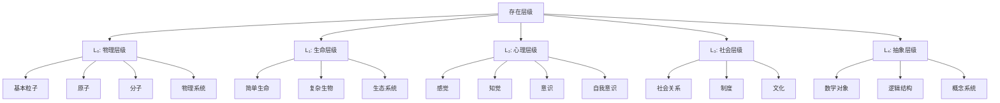
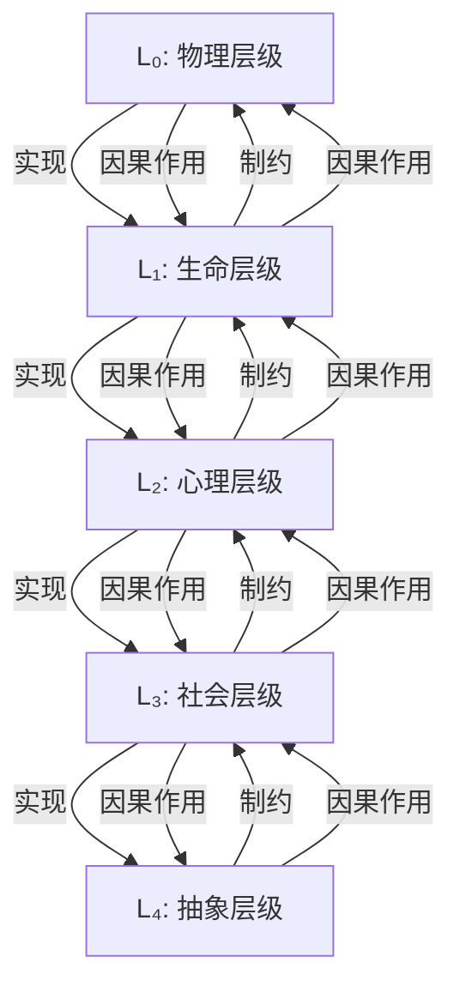

# 存在层级 (Levels of Being)

**文档编号**: `PHIL-01-01-03`  
**创建时间**: 2025-01-02  
**最后更新**: 2025-01-02  
**版本**: 1.0  

## 目录

1. [存在层级理论](#1-存在层级理论)
2. [物理层级](#2-物理层级)
3. [生命层级](#3-生命层级)
4. [心理层级](#4-心理层级)
5. [社会层级](#5-社会层级)
6. [抽象层级](#6-抽象层级)
7. [层级间关系](#7-层级间关系)
8. [形式化表达](#8-形式化表达)
9. [交叉引用](#9-交叉引用)

---

## 1. 存在层级理论

### 1.1 层级概念

**存在层级**（Levels of Being）是指不同类型的存在物按照其复杂性、依赖性和涌现性质组织成的层次结构。每个层级都有其独特的本体论地位和特性。

**定义 1.1.1** (存在层级)
存在层级是一个偏序集 $(L, \leq)$，其中 $L$ 是存在类型的集合，$\leq$ 是基于本体论依赖关系的偏序。

### 1.2 层级结构模型



### 1.3 层级理论的基本原则

| 原则 | 描述 | 形式化表达 |
|------|------|------------|
| **层级区分** | 每个层级有其独特的本体论特性 | $\forall i \neq j, \exists P(P(L_i) \land \neg P(L_j))$ |
| **层级依赖** | 高层级依赖于低层级 | $\forall i > j, \text{Depends}(L_i, L_j)$ |
| **涌现性** | 高层级具有低层级所没有的新性质 | $\forall i > j, \exists P(P(L_i) \land \forall x \in L_j, \neg P(x))$ |
| **不可还原性** | 高层级不完全可还原为低层级 | $\forall i > j, \neg \text{Reducible}(L_i, L_j)$ |
| **因果有效性** | 每个层级都有其独特的因果能力 | $\forall i, \exists C(C \in \text{Causes}(L_i) \land \forall j \neq i, C \notin \text{Causes}(L_j))$ |

## 2. 物理层级

### 2.1 物理层级的定义

**物理层级**（Physical Level）是最基础的存在层级，包括基本粒子、原子、分子、物理系统等物理实体。

**定义 2.1.1** (物理层级)
$$L_0 = \{x \mid \text{Physical}(x)\}$$

其中 $\text{Physical}(x)$ 表示 $x$ 是物理实体。

### 2.2 物理层级的特性

| 特性 | 描述 | 形式化表达 |
|------|------|------------|
| **空间性** | 在空间中占有位置 | $\forall x \in L_0, \text{Spatial}(x)$ |
| **时间性** | 在时间中持续存在 | $\forall x \in L_0, \text{Temporal}(x)$ |
| **因果封闭性** | 物理效应有物理原因 | $\forall e(\text{PhysicalEffect}(e) \rightarrow \exists c(\text{PhysicalCause}(c) \land \text{Causes}(c, e)))$ |
| **可测量性** | 可通过物理手段测量 | $\forall x \in L_0, \text{Measurable}(x)$ |
| **守恒性** | 遵循守恒定律 | $\forall x \in L_0, \text{Conservation}(x)$ |

### 2.3 物理层级的子层级

```rust
// 物理层级的结构
struct PhysicalLevel {
    elementary_particles: Vec<ElementaryParticle>,
    atoms: Vec<Atom>,
    molecules: Vec<Molecule>,
    physical_systems: Vec<PhysicalSystem>,
    fields: Vec<Field>
}

// 物理实体的基本属性
trait PhysicalEntity {
    fn position(&self) -> Vector3D;
    fn momentum(&self) -> Vector3D;
    fn energy(&self) -> f64;
    fn mass(&self) -> f64;
    fn interact_with(&self, other: &dyn PhysicalEntity) -> Interaction;
}
```

## 3. 生命层级

### 3.1 生命层级的定义

**生命层级**（Life Level）是建立在物理层级之上的存在层级，包括简单生命、复杂生物和生态系统等生命实体。

**定义 3.1.1** (生命层级)
$$L_1 = \{x \mid \text{Living}(x)\}$$

其中 $\text{Living}(x)$ 表示 $x$ 是生命实体。

### 3.2 生命层级的特性

| 特性 | 描述 | 形式化表达 |
|------|------|------------|
| **自我维持** | 维持自身结构和功能 | $\forall x \in L_1, \text{SelfMaintaining}(x)$ |
| **新陈代谢** | 物质和能量的转化 | $\forall x \in L_1, \text{Metabolic}(x)$ |
| **适应性** | 对环境变化的适应 | $\forall x \in L_1, \text{Adaptive}(x)$ |
| **繁殖能力** | 产生相似后代 | $\forall x \in L_1, \text{Reproductive}(x)$ |
| **进化能力** | 随时间演化 | $\forall x \in L_1, \text{Evolvable}(x)$ |

### 3.3 生命层级的子层级

```rust
// 生命层级的结构
struct LifeLevel {
    simple_organisms: Vec<SimpleOrganism>,
    complex_organisms: Vec<ComplexOrganism>,
    ecosystems: Vec<Ecosystem>
}

// 生命实体的基本属性
trait LivingEntity: PhysicalEntity {
    fn metabolism(&self) -> MetabolicRate;
    fn reproduce(&self) -> Option<Box<dyn LivingEntity>>;
    fn adapt(&self, environment: &Environment) -> AdaptationResult;
    fn lifespan(&self) -> Duration;
    fn genetic_information(&self) -> GeneticCode;
}
```

## 4. 心理层级

### 4.1 心理层级的定义

**心理层级**（Mental Level）是建立在生命层级之上的存在层级，包括感觉、知觉、意识和自我意识等心理现象。

**定义 4.1.1** (心理层级)
$$L_2 = \{x \mid \text{Mental}(x)\}$$

其中 $\text{Mental}(x)$ 表示 $x$ 是心理实体或现象。

### 4.2 心理层级的特性

| 特性 | 描述 | 形式化表达 |
|------|------|------------|
| **主观性** | 具有第一人称体验 | $\forall x \in L_2, \text{Subjective}(x)$ |
| **意向性** | 关于某物或指向某物 | $\forall x \in L_2, \exists y, \text{About}(x, y)$ |
| **质感** | 具有"感觉起来像什么" | $\forall x \in L_2, \text{Qualitative}(x)$ |
| **整体性** | 作为整体被体验 | $\forall x \in L_2, \text{Holistic}(x)$ |
| **私密性** | 只能被主体直接访问 | $\forall x \in L_2, \exists s, \text{AccessibleOnly}(x, s)$ |

### 4.3 心理层级的子层级

```rust
// 心理层级的结构
struct MentalLevel {
    sensations: Vec<Sensation>,
    perceptions: Vec<Perception>,
    consciousness: Vec<Consciousness>,
    self_awareness: Vec<SelfAwareness>
}

// 心理实体的基本属性
trait MentalEntity {
    fn subject(&self) -> Subject;
    fn content(&self) -> MentalContent;
    fn phenomenal_quality(&self) -> PhenomenalQuality;
    fn intentional_object(&self) -> Option<IntentionalObject>;
    fn accessibility(&self) -> AccessibilityLevel;
}
```

## 5. 社会层级

### 5.1 社会层级的定义

**社会层级**（Social Level）是建立在心理层级之上的存在层级，包括社会关系、制度和文化等社会现象。

**定义 5.1.1** (社会层级)
$$L_3 = \{x \mid \text{Social}(x)\}$$

其中 $\text{Social}(x)$ 表示 $x$ 是社会实体或现象。

### 5.2 社会层级的特性

| 特性 | 描述 | 形式化表达 |
|------|------|------------|
| **集体性** | 涉及多个个体 | $\forall x \in L_3, \exists S(S \subseteq \text{Persons} \land \|S\| > 1 \land \text{Involves}(x, S))$ |
| **规范性** | 包含规范和规则 | $\forall x \in L_3, \exists n, \text{HasNorm}(x, n)$ |
| **制度性** | 具有制度基础 | $\forall x \in L_3, \exists i, \text{Institutional}(x, i)$ |
| **历史性** | 具有历史维度 | $\forall x \in L_3, \text{Historical}(x)$ |
| **符号性** | 通过符号系统中介 | $\forall x \in L_3, \exists s, \text{SymbolicMediation}(x, s)$ |

### 5.3 社会层级的子层级

```rust
// 社会层级的结构
struct SocialLevel {
    social_relations: Vec<SocialRelation>,
    institutions: Vec<Institution>,
    cultures: Vec<Culture>
}

// 社会实体的基本属性
trait SocialEntity {
    fn participants(&self) -> Vec<Person>;
    fn norms(&self) -> Vec<Norm>;
    fn institutional_framework(&self) -> InstitutionalFramework;
    fn historical_context(&self) -> HistoricalContext;
    fn symbolic_systems(&self) -> Vec<SymbolicSystem>;
}
```

## 6. 抽象层级

### 6.1 抽象层级的定义

**抽象层级**（Abstract Level）是最高的存在层级，包括数学对象、逻辑结构和概念系统等抽象实体。

**定义 6.1.1** (抽象层级)
$$L_4 = \{x \mid \text{Abstract}(x)\}$$

其中 $\text{Abstract}(x)$ 表示 $x$ 是抽象实体。

### 6.2 抽象层级的特性

| 特性 | 描述 | 形式化表达 |
|------|------|------------|
| **非时空性** | 不在时空中 | $\forall x \in L_4, \neg \text{Spatiotemporal}(x)$ |
| **必然性** | 具有必然性质 | $\forall x \in L_4, \exists P, \square P(x)$ |
| **永恒性** | 不生不灭 | $\forall x \in L_4, \text{Eternal}(x)$ |
| **不变性** | 不随时间变化 | $\forall x \in L_4, \text{Immutable}(x)$ |
| **普遍性** | 普遍适用 | $\forall x \in L_4, \text{Universal}(x)$ |

### 6.3 抽象层级的子层级

```rust
// 抽象层级的结构
struct AbstractLevel {
    mathematical_objects: Vec<MathematicalObject>,
    logical_structures: Vec<LogicalStructure>,
    conceptual_systems: Vec<ConceptualSystem>
}

// 抽象实体的基本属性
trait AbstractEntity {
    fn ontological_status(&self) -> OntologicalStatus;
    fn necessity_degree(&self) -> NecessityDegree;
    fn universality_scope(&self) -> UniversalityScope;
    fn formal_representation(&self) -> FormalRepresentation;
    fn conceptual_relations(&self) -> Vec<ConceptualRelation>;
}
```

## 7. 层级间关系

### 7.1 基本关系类型

| 关系类型 | 描述 | 形式化表达 |
|---------|------|------------|
| **实现关系** | 低层级实现高层级 | $\text{Realizes}(L_i, L_j) \text{ where } i < j$ |
| **涌现关系** | 高层级从低层级涌现 | $\text{Emerges}(L_j, L_i) \text{ where } i < j$ |
| **依赖关系** | 高层级依赖低层级 | $\text{Depends}(L_j, L_i) \text{ where } i < j$ |
| **制约关系** | 高层级制约低层级 | $\text{Constrains}(L_j, L_i) \text{ where } i < j$ |
| **因果关系** | 层级间的因果作用 | $\text{Causes}(L_i, L_j) \text{ for some } i, j$ |

### 7.2 层级间关系模型



### 7.3 层级间关系的哲学立场

| 立场 | 核心主张 | 代表人物 |
|------|---------|---------|
| **还原主义** | 高层级可还原为低层级 | 卡尔纳普、奎因 |
| **涌现主义** | 高层级具有不可还原的涌现性质 | 摩根、布罗德 |
| **非还原物理主义** | 高层级依赖但不可还原为物理层级 | 普特南、戴维森 |
| **多重实现论** | 高层级可由不同的低层级实现 | 福多尔、金 |
| **整体论** | 整体大于部分之和 | 斯莫兰斯基、安德森 |

## 8. 形式化表达

### 8.1 层级本体论的形式化

**定义 8.1.1** (层级结构)
层级结构是一个五元组 $LS = (L, \leq, R, E, C)$，其中：

- $L = \{L_0, L_1, L_2, L_3, L_4\}$ 是层级集合
- $\leq$ 是 $L$ 上的偏序关系
- $R$ 是实现关系 $R \subseteq L \times L$
- $E$ 是涌现关系 $E \subseteq L \times L$
- $C$ 是因果关系 $C \subseteq L \times L$

### 8.2 层级间关系的公理系统

**公理 8.2.1** (层级序关系)
$$\forall i, j \in \{0, 1, 2, 3, 4\}, i < j \iff L_i < L_j$$

**公理 8.2.2** (实现关系)
$$\forall i, j \in \{0, 1, 2, 3, 4\}, i < j \iff (L_i, L_j) \in R$$

**公理 8.2.3** (涌现关系)
$$\forall i, j \in \{0, 1, 2, 3, 4\}, i < j \iff (L_j, L_i) \in E$$

**公理 8.2.4** (因果有效性)
$$\forall i \in \{0, 1, 2, 3, 4\}, \exists j, ((L_i, L_j) \in C \lor (L_j, L_i) \in C)$$

### 8.3 层级理论的定理

**定理 8.3.1** (不可还原性)
如果 $L_j$ 从 $L_i$ 涌现，则 $L_j$ 不完全可还原为 $L_i$。

**证明：**

1. 假设 $L_j$ 从 $L_i$ 涌现，即 $(L_j, L_i) \in E$
2. 根据涌现的定义，$L_j$ 具有 $L_i$ 所没有的新性质
3. 如果 $L_j$ 完全可还原为 $L_i$，则 $L_j$ 的所有性质都可由 $L_i$ 的性质导出
4. 这与步骤2矛盾
5. 因此，$L_j$ 不完全可还原为 $L_i$

**定理 8.3.2** (多重实现性)
存在 $L_j$ 的实例 $x$，可以由 $L_i$ 的不同实例集合实现。

**证明：**

1. 考虑 $L_2$ (心理层级) 中的疼痛状态 $p$
2. $p$ 可以由不同的神经状态 $n_1, n_2, \ldots, n_k$ 实现
3. 这些神经状态属于 $L_1$ (生命层级)
4. 因此，存在 $L_2$ 的实例 $p$，可以由 $L_1$ 的不同实例集合 $\{n_1, n_2, \ldots, n_k\}$ 实现
5. 这证明了多重实现性

## 9. 交叉引用

- [存在理论](./01_Existence_Theory.md)
- [本质与偶性](./02_Essence_and_Accident.md)
- [虚无与非存在](./04_Nothingness.md)
- [实体理论](../02_Entity_Theory/README.md)
- [模态理论](../03_Modal_Theory/README.md)
- [认识论](../../02_Epistemology/README.md)

---

**负责人**: FormalScience团队  
**创建日期**: 2025-01-02
