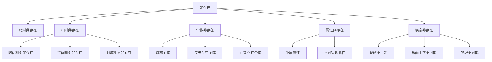

# 虚无与非存在 (Nothingness)

**文档编号**: `PHIL-01-01-04`  
**创建时间**: 2025-01-02  
**最后更新**: 2025-01-02  
**版本**: 1.0  

## 目录

- [虚无与非存在 (Nothingness)](#虚无与非存在-nothingness)
  - [目录](#目录)
  - [1. 虚无的概念](#1-虚无的概念)
    - [1.1 虚无的定义](#11-虚无的定义)
    - [1.2 虚无的哲学传统](#12-虚无的哲学传统)
    - [1.3 虚无的表征](#13-虚无的表征)
  - [2. 非存在的类型](#2-非存在的类型)
    - [2.1 非存在的分类](#21-非存在的分类)
    - [2.2 非存在的层次结构](#22-非存在的层次结构)
    - [2.3 非存在的语义表达](#23-非存在的语义表达)
  - [3. 虚无的悖论](#3-虚无的悖论)
    - [3.1 虚无悖论的表述](#31-虚无悖论的表述)
    - [3.2 主要悖论类型](#32-主要悖论类型)
    - [3.3 悖论的解决尝试](#33-悖论的解决尝试)
  - [4. 虚无的形而上学](#4-虚无的形而上学)
    - [4.1 虚无的本体论地位](#41-虚无的本体论地位)
    - [4.2 虚无的形而上学功能](#42-虚无的形而上学功能)
    - [4.3 虚无的形而上学模型](#43-虚无的形而上学模型)
  - [5. 虚无与存在的关系](#5-虚无与存在的关系)
    - [5.1 对立与互补](#51-对立与互补)
    - [5.2 辩证关系](#52-辩证关系)
    - [5.3 虚无的创生功能](#53-虚无的创生功能)
  - [6. 虚无的语义学](#6-虚无的语义学)
    - [6.1 虚无的指称问题](#61-虚无的指称问题)
    - [6.2 非存在陈述的真值](#62-非存在陈述的真值)
    - [6.3 空名称的语义理论](#63-空名称的语义理论)
  - [7. 形式化表达](#7-形式化表达)
    - [7.1 虚无的逻辑形式化](#71-虚无的逻辑形式化)
    - [7.2 非存在的形式系统](#72-非存在的形式系统)
    - [7.3 虚无的集合论表示](#73-虚无的集合论表示)
  - [8. 交叉引用](#8-交叉引用)

---

## 1. 虚无的概念

### 1.1 虚无的定义

**虚无**（Nothingness）是存在的对立面，指完全不存在的状态或缺乏任何存在物的状态。

**定义 1.1.1** (虚无)
$$\text{Nothingness} \iff \forall x \neg E(x)$$

其中 $E(x)$ 表示 $x$ 存在。

### 1.2 虚无的哲学传统

| 哲学传统 | 虚无概念 | 代表人物 | 核心观点 |
|---------|---------|---------|---------|
| **古希腊哲学** | 非存在 (to me on) | 巴门尼德 | 非存在不可思议，不可言说 |
| **东方哲学** | 空 (śūnyatā) | 龙树 | 一切皆空，无自性 |
| **存在主义** | 虚无 (néant) | 萨特 | 虚无是人类自由的基础 |
| **形而上学** | 无 (nihil) | 海德格尔 | 存在与虚无的对立统一 |
| **逻辑哲学** | 空集 (∅) | 罗素 | 虚无作为逻辑构造 |

### 1.3 虚无的表征

```rust
// 虚无的表征
enum Nothingness {
    AbsoluteNothingness,      // 绝对虚无
    RelativeNothingness(Domain), // 相对虚无（在特定领域）
    PotentialNothingness,     // 潜在虚无
    ConceptualNothingness     // 概念虚无
}

// 虚无的性质
trait NothingnessProperties {
    fn is_thinkable(&self) -> bool;
    fn is_expressible(&self) -> bool;
    fn relation_to_being(&self) -> RelationToBeing;
    fn logical_status(&self) -> LogicalStatus;
    fn modal_status(&self) -> ModalStatus;
}
```

## 2. 非存在的类型

### 2.1 非存在的分类

| 非存在类型 | 形式化定义 | 哲学意义 | 示例 |
|-----------|-----------|---------|------|
| **绝对非存在** | $\forall x \neg E(x)$ | 完全无物 | 纯粹的无 |
| **相对非存在** | $\exists D \forall x (x \in D \rightarrow \neg E(x))$ | 特定领域中无物 | 真空 |
| **个体非存在** | $\neg E(a)$ | 特定个体不存在 | 独角兽不存在 |
| **属性非存在** | $\forall x \neg P(x)$ | 特定属性不存在 | 方形圆 |
| **模态非存在** | $\square \neg E(x)$ | 必然不存在 | 逻辑矛盾 |

### 2.2 非存在的层次结构



### 2.3 非存在的语义表达

| 表达形式 | 语义解释 | 形式化表示 | 示例 |
|---------|---------|-----------|------|
| "X不存在" | X没有实例 | $\neg \exists x X(x)$ | "独角兽不存在" |
| "没有X" | X的外延为空 | $\forall x \neg X(x)$ | "没有方形圆" |
| "X是虚构的" | X仅在虚构世界中存在 | $\text{Fictional}(X)$ | "哈姆雷特是虚构的" |
| "X不再存在" | X过去存在但现在不存在 | $P(E(X)) \land \neg E(X)$ | "恐龙不再存在" |
| "X不可能存在" | 在任何可能世界中X都不存在 | $\square \neg E(X)$ | "自相矛盾不可能存在" |

## 3. 虚无的悖论

### 3.1 虚无悖论的表述

**虚无悖论**（Paradox of Nothingness）指涉及虚无概念的逻辑困境。

**定义 3.1.1** (虚无悖论)
如果虚无存在，那么它就不是虚无；如果虚无不存在，那么虚无这一概念本身就存在。

### 3.2 主要悖论类型

| 悖论类型 | 悖论表述 | 形式化表达 | 哲学意义 |
|---------|---------|-----------|---------|
| **存在悖论** | 虚无若存在则非虚无 | $E(\text{Nothingness}) \rightarrow \neg \text{Nothingness}$ | 虚无的存在自相矛盾 |
| **思考悖论** | 思考虚无使之成为思想对象 | $\text{Think}(\text{Nothingness}) \rightarrow E(\text{Nothingness as object})$ | 虚无不可思考 |
| **表达悖论** | 表达虚无使之成为语言对象 | $\text{Express}(\text{Nothingness}) \rightarrow E(\text{Nothingness as referent})$ | 虚无不可言说 |
| **区分悖论** | 区分虚无与存在使虚无成为区分对象 | $\text{Distinguish}(\text{Nothingness}, \text{Being}) \rightarrow E(\text{Nothingness as distinct})$ | 虚无不可区分 |
| **否定悖论** | 否定一切仍是一种肯定 | $\forall x \neg E(x) \rightarrow E(\text{Universal negation})$ | 完全否定的不可能性 |

### 3.3 悖论的解决尝试

| 解决方案 | 核心思想 | 代表人物 | 形式化表达 |
|---------|---------|---------|-----------|
| **语义区分** | 区分不同层次的语言 | 塔尔斯基 | $\text{Nothingness}_1 \neq \text{Nothingness}_2$ |
| **概念虚无** | 虚无仅作为概念存在 | 黑格尔 | $E(\text{Concept}(\text{Nothingness})) \land \neg E(\text{Nothingness})$ |
| **逻辑构造** | 虚无作为逻辑构造 | 罗素 | $\text{Nothingness} \iff \{x \mid x \neq x\}$ |
| **存在层次** | 虚无在不同存在层次有不同意义 | 海德格尔 | $\text{Nothingness}_{\text{ontic}} \neq \text{Nothingness}_{\text{ontological}}$ |
| **辩证解决** | 存在与虚无的辩证统一 | 黑格尔 | $\text{Being} \leftrightarrow \text{Nothingness} \rightarrow \text{Becoming}$ |

## 4. 虚无的形而上学

### 4.1 虚无的本体论地位

**问题 4.1.1** (虚无的本体论地位)
虚无是否具有某种形式的存在或实在性？

| 立场 | 核心主张 | 形式化表达 | 代表人物 |
|------|---------|-----------|---------|
| **实在论** | 虚无具有某种实在性 | $\exists x (x = \text{Nothingness} \land \text{Real}(x))$ | 海德格尔 |
| **反实在论** | 虚无仅是概念构造 | $\neg \exists x (x = \text{Nothingness} \land \text{Real}(x))$ | 卡尔纳普 |
| **中立立场** | 虚无超越实在与非实在 | $\text{Beyond}(\text{Nothingness}, \{\text{Real}, \neg \text{Real}\})$ | 龙树 |
| **悬置判断** | 关于虚无的实在性问题无法回答 | $\text{Undecidable}(\text{Real}(\text{Nothingness}))$ | 胡塞尔 |

### 4.2 虚无的形而上学功能

| 功能 | 描述 | 哲学意义 |
|------|------|---------|
| **存在的对立面** | 虚无作为存在的逻辑对立 | 通过对比理解存在 |
| **可能性的基础** | 虚无作为变化和可能性的前提 | 没有虚无就没有变化 |
| **自由的条件** | 虚无作为人类自由的条件 | 意识能够否定现实 |
| **创造的起点** | 虚无作为创造的起点 | 创造ex nihilo的可能性 |
| **终极归宿** | 虚无作为一切的终极归宿 | 存在的暂时性 |

### 4.3 虚无的形而上学模型

```rust
// 虚无的形而上学模型
struct MetaphysicsOfNothingness {
    ontological_status: OntologicalStatus,
    relation_to_being: RelationToBeing,
    metaphysical_functions: Vec<MetaphysicalFunction>,
    modal_properties: ModalProperties,
    dialectical_structure: DialecticalStructure
}

// 虚无与存在的关系
enum RelationToBeing {
    Opposition,           // 对立关系
    Complementary,        // 互补关系
    Dialectical,          // 辩证关系
    Foundational,         // 基础关系
    Derivative            // 派生关系
}

// 虚无的辩证结构
struct DialecticalStructure {
    thesis: Being,
    antithesis: Nothingness,
    synthesis: Becoming
}
```

## 5. 虚无与存在的关系

### 5.1 对立与互补

**定理 5.1.1** (对立性)
存在与虚无在逻辑上相互对立。
$$\forall x (E(x) \leftrightarrow \neg \text{Nothingness}(x))$$

**定理 5.1.2** (互补性)
存在与虚无在形而上学上相互互补。
$$\text{Being} \cup \text{Nothingness} = \text{Reality} \land \text{Being} \cap \text{Nothingness} = \emptyset$$

### 5.2 辩证关系

| 辩证模型 | 描述 | 形式化表达 | 代表人物 |
|---------|------|-----------|---------|
| **黑格尔辩证法** | 存在-虚无-变化 | $\text{Being} \rightarrow \text{Nothingness} \rightarrow \text{Becoming}$ | 黑格尔 |
| **海德格尔模型** | 存在与虚无的共属性 | $\text{Co-belonging}(\text{Being}, \text{Nothingness})$ | 海德格尔 |
| **萨特模型** | 虚无作为存在的裂隙 | $\text{Nothingness} = \text{Fissure-in-Being}$ | 萨特 |
| **东方辩证法** | 有无相生 | $\text{Being} \leftrightarrow \text{Nothingness}$ | 老子 |

### 5.3 虚无的创生功能

**定理 5.3.1** (虚无的创生功能)
虚无是变化和创造的必要条件。

**证明：**

1. 假设存在变化：$\exists x \exists t_1 \exists t_2 (P(x, t_1) \land \neg P(x, t_2))$
2. 在 $t_1$ 和 $t_2$ 之间，属性 $P$ 对于 $x$ 必须从存在转变为不存在
3. 这种转变需要属性 $P$ 对于 $x$ 的非存在状态
4. 因此，非存在（虚无的一种形式）是变化的必要条件
5. 创造是一种特殊的变化，从不存在到存在
6. 因此，虚无也是创造的必要条件

## 6. 虚无的语义学

### 6.1 虚无的指称问题

**问题 6.1.1** (指称悖论)
如何指称不存在的对象？

| 理论 | 核心主张 | 形式化表达 | 代表人物 |
|------|---------|-----------|---------|
| **描述论** | 通过描述指称 | $\text{Refer}(\text{"Pegasus"}) = \text{the winged horse}$ | 罗素 |
| **可能世界语义学** | 在可能世界中指称 | $\text{Refer}(\text{"Pegasus"}, w) \text{ where } w \in \text{PossibleWorlds}$ | 克里普克 |
| **迈农主义** | 非存在对象有存在之外的地位 | $\text{Subsists}(\text{Pegasus}) \land \neg E(\text{Pegasus})$ | 迈农 |
| **自由逻辑** | 允许空名称的逻辑 | $\neg E(\text{Pegasus}) \land \text{Meaningful}(\text{"Pegasus"})$ | 兰伯特 |

### 6.2 非存在陈述的真值

| 陈述类型 | 示例 | 真值条件 | 形式化表达 |
|---------|------|---------|-----------|
| **存在否定** | "独角兽不存在" | 世界中没有独角兽 | $\text{True}(\neg \exists x \text{Unicorn}(x)) \iff \forall x \neg \text{Unicorn}(x)$ |
| **属性归属** | "独角兽有角" | 在虚构语境中为真 | $\text{True}_{\text{fiction}}(\forall x (\text{Unicorn}(x) \rightarrow \text{Horned}(x)))$ |
| **同一性陈述** | "佩加索斯是会飞的马" | 在虚构语境中为真 | $\text{True}_{\text{fiction}}(\text{Pegasus} = \text{the flying horse})$ |
| **跨世界比较** | "独角兽比龙更不可能存在" | 基于可能世界的可能性度量 | $\text{Possibility}(\exists x \text{Unicorn}(x)) < \text{Possibility}(\exists x \text{Dragon}(x))$ |

### 6.3 空名称的语义理论

```rust
// 空名称的语义理论
enum EmptyNameSemantics {
    RussellianTheory,     // 罗素理论：空名称是描述
    MeinongianTheory,     // 迈农理论：空名称指称非存在对象
    FreeLogicTheory,      // 自由逻辑：空名称有意义但无指称
    FictionalismTheory,   // 虚构主义：空名称在虚构语境有指称
    PragmaticTheory       // 语用理论：空名称的使用依赖语境
}

// 空名称的语义值
struct EmptyNameSemantics {
    name: String,
    has_reference: bool,
    semantic_value: Option<SemanticValue>,
    truth_conditions: TruthConditions,
    contextual_factors: Vec<ContextualFactor>
}
```

## 7. 形式化表达

### 7.1 虚无的逻辑形式化

**定义 7.1.1** (虚无算子)
定义虚无算子 $\mathcal{N}$ 如下：
$$\mathcal{N}(D) \iff \forall x (x \in D \rightarrow \neg E(x))$$

其中 $D$ 是一个领域。

**定义 7.1.2** (绝对虚无)
$$\mathcal{N}(\text{Universe}) \iff \forall x \neg E(x)$$

**定义 7.1.3** (相对虚无)
$$\mathcal{N}(D) \land \exists x E(x) \iff \forall x (x \in D \rightarrow \neg E(x)) \land \exists x E(x)$$

### 7.2 非存在的形式系统

**公理 7.2.1** (非存在公理)
$$\exists x \neg E(x)$$

**公理 7.2.2** (虚无不可述公理)
$$\neg \exists x (x = \text{Nothingness})$$

**公理 7.2.3** (非存在的否定性)
$$\forall P \forall x (\neg E(x) \rightarrow \neg P(x))$$

**定理 7.2.1** (非存在的无属性性)
非存在的对象没有积极属性。
$$\forall x (\neg E(x) \rightarrow \forall P \neg P(x))$$

**证明：**

1. 假设 $\neg E(a)$ 且 $P(a)$ 对于某个积极属性 $P$
2. 根据公理7.2.3：$\neg E(a) \rightarrow \neg P(a)$
3. 由1和2，得到 $\neg P(a) \land P(a)$，矛盾
4. 因此，$\forall x (\neg E(x) \rightarrow \forall P \neg P(x))$

### 7.3 虚无的集合论表示

**定义 7.3.1** (空集)
$$\emptyset = \{x \mid x \neq x\}$$

**定理 7.3.1** (空集的唯一性)
存在唯一的空集。
$$\exists! X \forall y (y \notin X)$$

**定理 7.3.2** (空集与虚无)
空集是虚无在集合论中的表示。
$$\mathcal{N}(\emptyset) \iff \forall x (x \in \emptyset \rightarrow \neg E(x))$$

**定理 7.3.3** (空集的悖论性)
空集同时是"无物之集"和"某物"。
$$(\forall x (x \notin \emptyset)) \land E(\emptyset)$$

## 8. 交叉引用

- [存在理论](./01_Existence_Theory.md)
- [本质与偶性](./02_Essence_and_Accident.md)
- [存在层级](./03_Levels_of_Being.md)
- [模态理论](../03_Modal_Theory/README.md)
- [逻辑基础](../../03_Philosophy_of_Logic/01_Logic_Foundations/README.md)
- [认识论](../../02_Epistemology/README.md)

---

**负责人**: FormalScience团队  
**创建日期**: 2025-01-02
