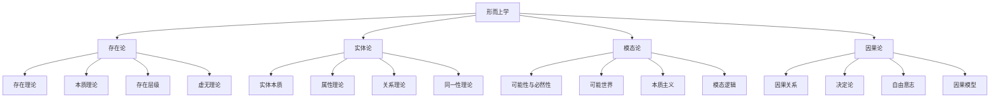

# 形而上学 (Metaphysics)

**文档编号**: `PHIL-01-META`  
**创建时间**: 2025-01-02  
**最后更新**: 2025-01-02  
**版本**: 1.0  

## 概述

形而上学是哲学的基础分支，研究存在的本质、实在的基本结构以及宇宙的根本性质。本目录包含形而上学的核心理论，包括存在论、实体理论、模态理论和因果理论等。

## 目录内容

### 1. [存在与本质](./01_Being_and_Existence/)

- 1.1 [存在理论](./01_Being_and_Existence/01_Existence_Theory.md)
- 1.2 [本质与偶性](./01_Being_and_Existence/02_Essence_and_Accident.md)
- 1.3 [存在层级](./01_Being_and_Existence/03_Levels_of_Being.md)
- 1.4 [虚无与非存在](./01_Being_and_Existence/04_Nothingness.md)

### 2. [实体理论](./02_Entity_Theory/)

- 2.1 [实体本质](./02_Entity_Theory/01_Entity_Essence.md)
- 2.2 [属性理论](./02_Entity_Theory/02_Property_Theory.md)
- 2.3 [关系理论](./02_Entity_Theory/03_Relation_Theory.md)
- 2.4 [同一性理论](./02_Entity_Theory/04_Identity_Theory.md)

### 3. [模态理论](./03_Modal_Theory/)

- 3.1 [可能性与必然性](./03_Modal_Theory/01_Possibility_and_Necessity.md)
- 3.2 [可能世界](./03_Modal_Theory/02_Possible_Worlds.md)
- 3.3 [本质主义](./03_Modal_Theory/03_Essentialism.md)
- 3.4 [模态逻辑](./03_Modal_Theory/04_Modal_Logic.md)

### 4. [因果理论](./04_Causality_Theory/)

- 4.1 [因果关系](./04_Causality_Theory/01_Causal_Relations.md)
- 4.2 [决定论](./04_Causality_Theory/02_Determinism.md)
- 4.3 [自由意志](./04_Causality_Theory/03_Free_Will.md)
- 4.4 [因果模型](./04_Causality_Theory/04_Causal_Models.md)

## 形而上学核心概念图

## 形而上学的形式化表达

### 存在公理

**公理 1**: $\exists x \text{ } \text{Being}(x)$  
存在至少一个存在物。

**公理 2**: $\forall x \text{ } \text{Being}(x) \rightarrow \exists p \text{ } \text{Property}(p, x)$  
每个存在物都具有至少一个属性。

**公理 3**: $\forall x,y \text{ } (x \neq y) \rightarrow \exists p \text{ } (\text{Property}(p, x) \land \lnot \text{Property}(p, y))$  
不同的存在物至少在一个属性上有区别（莱布尼茨同一性原则）。

### 模态逻辑公理

**公理 K**: $\Box(p \rightarrow q) \rightarrow (\Box p \rightarrow \Box q)$  
分配公理：如果p蕴含q是必然的，那么如果p是必然的，则q也是必然的。

**公理 T**: $\Box p \rightarrow p$  
如果p是必然的，那么p是真的。

**公理 4**: $\Box p \rightarrow \Box\Box p$  
如果p是必然的，那么"p是必然的"也是必然的。

**公理 5**: $\lnot\Box p \rightarrow \Box\lnot\Box p$  
如果p不是必然的，那么"p不是必然的"是必然的。

### 因果关系形式化

定义因果关系 $C(x, y)$ 表示 $x$ 是 $y$ 的原因。

**公理 1**: $\forall x,y \text{ } C(x, y) \rightarrow \text{Precedes}(x, y)$  
因果关系要求原因在时间上先于结果。

**公理 2**: $\forall x,y \text{ } C(x, y) \rightarrow \Box(\text{Exists}(x) \rightarrow \text{Exists}(y))$  
在所有可能世界中，如果原因存在，结果也必然存在。

## 主要形而上学立场

| 立场 | 核心主张 | 代表人物 |
|------|---------|---------|
| 实在论 | 外部世界独立于心智而存在 | 亚里士多德、洛克 |
| 唯心主义 | 实在的本质是精神或心智的 | 黑格尔、贝克莱 |
| 唯物主义 | 一切存在都是物质的 | 德谟克利特、霍布斯 |
| 二元论 | 心灵和物质是两种不同的实体 | 笛卡尔 |
| 一元论 | 只存在一种基本实体 | 斯宾诺莎 |
| 虚无主义 | 否认客观价值和意义的存在 | 尼采、萨特 |

## 与其他哲学分支的关系

- **与认识论的关系**：形而上学关注"是什么"，认识论关注"如何知道"
- **与逻辑的关系**：逻辑为形而上学提供推理工具和形式化方法
- **与科学哲学的关系**：科学理论往往蕴含形而上学假设和承诺
- **与心灵哲学的关系**：心身问题是形而上学和心灵哲学的交叉点

## 当代形而上学研究方向

1. **分析形而上学**：使用当代逻辑和语言分析方法研究形而上学问题
2. **科学形而上学**：基于现代科学理论构建形而上学体系
3. **过程形而上学**：强调变化、关系和过程而非静态实体
4. **计算形而上学**：探索计算、信息和虚拟现实的本体论地位

## 文件合并说明

本目录整合了原`01_Philosophical_Foundation/01_Metaphysics`和`01_Philosophical_Foundations/01_Ontology`目录中的内容，采用了更系统的组织方式和统一的命名规范。主要变更包括：

1. 将形而上学和本体论的内容整合为一个连贯的体系
2. 按主题重新组织文件结构，分为四个主要子目录
3. 统一了文件命名格式，采用下划线连接的Pascal命名法
4. 保留了原始中文文件并添加`_Legacy`后缀
5. 更新了所有交叉引用链接

## 相关文档

- [哲学基础主目录](../README.md)
- [认识论](../02_Epistemology/README.md)
- [逻辑哲学](../03_Philosophy_of_Logic/README.md)
- [数学本体论](../04_Philosophy_of_Mathematics/01_Mathematical_Ontology/README.md)

---

**负责人**: FormalScience团队  
**创建日期**: 2025-01-02
