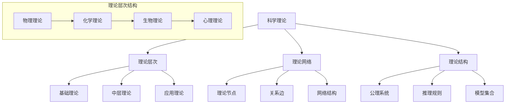

# 01.1.1 科学理论结构 (Scientific Theory Structure)

## 📋 理论概述

科学理论结构研究科学理论的组织方式、组成部分和逻辑关系。
本理论涵盖理论层次、理论网络、理论还原等核心概念，为理解科学知识的系统性和整体性提供理论支撑。

## 🔬 形式化语义

### 核心定义

**定义 1.1** (科学理论)
科学理论是一个形式化系统：$T = (L, A, R, M)$，其中：

- $L$ 是理论语言
- $A$ 是公理集合
- $R$ 是推理规则
- $M$ 是模型集合

**定义 1.2** (理论层次)
理论层次是理论结构的垂直组织：$H = \{T_1, T_2, ..., T_n\}$，其中：

- $T_i$ 是第i层理论
- $T_{i+1}$ 比 $T_i$ 更基础
- 存在还原关系：$T_i \rightarrow T_{i+1}$

**定义 1.3** (理论网络)
理论网络是理论间的水平关系：$N = (V, E)$，其中：

- $V$ 是理论节点集合
- $E$ 是理论间关系边集合

**定义 1.4** (理论一致性)
理论一致性是理论间逻辑相容性：$C(T_1, T_2) = \text{Consistent}(T_1 \cup T_2)$

### 核心定理

**定理 1.1** (理论层次性)
任意科学理论都可以分解为层次结构：$\forall T, \exists H : T \in H$

**定理 1.2** (理论网络连通性)
科学理论网络是连通的：$\forall T_i, T_j \in N, \exists \text{path}(T_i, T_j)$

**定理 1.3** (理论还原性)
高层理论可以还原为低层理论：$T_{high} \xrightarrow{reduce} T_{low}$

**定理 1.4** (理论涌现性)
理论组合可能产生新性质：$T_1 \oplus T_2 \rightarrow \text{Emergent}(T_1, T_2)$

## 🎯 多表征方式

### 1. 图形表征



### 2. 表格表征

| 理论类型 | 结构特征 | 层次位置 | 网络连接 | 一致性 |
|----------|----------|----------|----------|--------|
| 基础理论 | 公理化 | 底层 | 多连接 | 高 |
| 中层理论 | 模型化 | 中层 | 中等连接 | 中 |
| 应用理论 | 实用化 | 顶层 | 少连接 | 低 |

### 3. 数学表征

**理论结构**：
$T = (L, A, R, M)$

**层次关系**：
$H = \{T_1, T_2, ..., T_n\}$ 且 $T_i \subseteq T_{i+1}$

**网络结构**：
$N = (V, E)$ 其中 $V = \{T_1, T_2, ..., T_n\}$

**一致性度量**：
$C(T_1, T_2) = \frac{|\text{Consistent}(T_1 \cap T_2)|}{|T_1 \cup T_2|}$

### 4. 伪代码表征

```python
class ScientificTheory:
    def __init__(self, language, axioms, rules, models):
        self.language = language
        self.axioms = axioms
        self.rules = rules
        self.models = models
        
    def is_consistent(self, other_theory):
        """检查理论一致性"""
        intersection = self.axioms.intersection(other_theory.axioms)
        union = self.axioms.union(other_theory.axioms)
        return len(intersection) / len(union)
        
    def can_reduce_to(self, base_theory):
        """检查理论还原性"""
        return all(axiom in base_theory.axioms for axiom in self.axioms)
        
    def get_emergent_properties(self, other_theory):
        """获取涌现性质"""
        combined_axioms = self.axioms.union(other_theory.axioms)
        return self.analyze_emergence(combined_axioms)
```

## 💻 Rust实现

```rust
use std::collections::{HashMap, HashSet};

/// 科学理论
#[derive(Debug, Clone)]
pub struct ScientificTheory {
    pub name: String,
    pub language: TheoryLanguage,
    pub axioms: HashSet<String>,
    pub rules: Vec<InferenceRule>,
    pub models: Vec<TheoryModel>,
    pub level: TheoryLevel,
}

/// 理论语言
#[derive(Debug, Clone)]
pub struct TheoryLanguage {
    pub vocabulary: HashSet<String>,
    pub syntax_rules: Vec<String>,
    pub semantic_rules: Vec<String>,
}

/// 推理规则
#[derive(Debug, Clone)]
pub struct InferenceRule {
    pub name: String,
    pub premises: Vec<String>,
    pub conclusion: String,
    pub rule_type: RuleType,
}

/// 理论模型
#[derive(Debug, Clone)]
pub struct TheoryModel {
    pub name: String,
    pub domain: Vec<String>,
    pub interpretation: HashMap<String, String>,
    pub satisfaction: HashMap<String, bool>,
}

/// 理论层次
#[derive(Debug, Clone, PartialEq, Eq, PartialOrd, Ord)]
pub enum TheoryLevel {
    Foundation,  // 基础理论
    Middle,      // 中层理论
    Application, // 应用理论
}

/// 规则类型
#[derive(Debug, Clone)]
pub enum RuleType {
    Deductive,   // 演绎规则
    Inductive,   // 归纳规则
    Abductive,   // 溯因规则
}

impl ScientificTheory {
    /// 创建新的科学理论
    pub fn new(name: String, level: TheoryLevel) -> Self {
        Self {
            name,
            language: TheoryLanguage::new(),
            axioms: HashSet::new(),
            rules: Vec::new(),
            models: Vec::new(),
            level,
        }
    }
    
    /// 添加公理
    pub fn add_axiom(&mut self, axiom: String) {
        self.axioms.insert(axiom);
    }
    
    /// 添加推理规则
    pub fn add_rule(&mut self, rule: InferenceRule) {
        self.rules.push(rule);
    }
    
    /// 添加模型
    pub fn add_model(&mut self, model: TheoryModel) {
        self.models.push(model);
    }
    
    /// 检查理论一致性
    pub fn is_consistent_with(&self, other: &ScientificTheory) -> f64 {
        let intersection = self.axioms.intersection(&other.axioms).count();
        let union = self.axioms.union(&other.axioms).count();
        
        if union == 0 {
            1.0
        } else {
            intersection as f64 / union as f64
        }
    }
    
    /// 检查理论还原性
    pub fn can_reduce_to(&self, base_theory: &ScientificTheory) -> bool {
        self.axioms.is_subset(&base_theory.axioms)
    }
    
    /// 获取理论复杂度
    pub fn complexity(&self) -> usize {
        self.axioms.len() + self.rules.len() + self.models.len()
    }
    
    /// 获取理论层次
    pub fn get_level(&self) -> &TheoryLevel {
        &self.level
    }
    
    /// 检查理论完整性
    pub fn is_complete(&self) -> bool {
        !self.axioms.is_empty() && !self.rules.is_empty()
    }
}

impl TheoryLanguage {
    /// 创建新的理论语言
    pub fn new() -> Self {
        Self {
            vocabulary: HashSet::new(),
            syntax_rules: Vec::new(),
            semantic_rules: Vec::new(),
        }
    }
    
    /// 添加词汇
    pub fn add_vocabulary(&mut self, term: String) {
        self.vocabulary.insert(term);
    }
    
    /// 添加语法规则
    pub fn add_syntax_rule(&mut self, rule: String) {
        self.syntax_rules.push(rule);
    }
    
    /// 添加语义规则
    pub fn add_semantic_rule(&mut self, rule: String) {
        self.semantic_rules.push(rule);
    }
}

impl InferenceRule {
    /// 创建新的推理规则
    pub fn new(name: String, premises: Vec<String>, conclusion: String, rule_type: RuleType) -> Self {
        Self {
            name,
            premises,
            conclusion,
            rule_type,
        }
    }
    
    /// 应用推理规则
    pub fn apply(&self, premises: &[String]) -> Option<String> {
        if self.premises.len() == premises.len() {
            Some(self.conclusion.clone())
        } else {
            None
        }
    }
}

impl TheoryModel {
    /// 创建新的理论模型
    pub fn new(name: String) -> Self {
        Self {
            name,
            domain: Vec::new(),
            interpretation: HashMap::new(),
            satisfaction: HashMap::new(),
        }
    }
    
    /// 添加域元素
    pub fn add_domain_element(&mut self, element: String) {
        self.domain.push(element);
    }
    
    /// 添加解释
    pub fn add_interpretation(&mut self, symbol: String, value: String) {
        self.interpretation.insert(symbol, value);
    }
    
    /// 添加满足关系
    pub fn add_satisfaction(&mut self, formula: String, satisfied: bool) {
        self.satisfaction.insert(formula, satisfied);
    }
}

/// 理论网络
#[derive(Debug)]
pub struct TheoryNetwork {
    pub theories: HashMap<String, ScientificTheory>,
    pub connections: Vec<TheoryConnection>,
}

/// 理论连接
#[derive(Debug)]
pub struct TheoryConnection {
    pub from: String,
    pub to: String,
    pub connection_type: ConnectionType,
    pub strength: f64,
}

/// 连接类型
#[derive(Debug)]
pub enum ConnectionType {
    Reduction,    // 还原关系
    Emergence,    // 涌现关系
    Consistency,  // 一致性关系
    Conflict,     // 冲突关系
}

impl TheoryNetwork {
    /// 创建新的理论网络
    pub fn new() -> Self {
        Self {
            theories: HashMap::new(),
            connections: Vec::new(),
        }
    }
    
    /// 添加理论
    pub fn add_theory(&mut self, theory: ScientificTheory) {
        self.theories.insert(theory.name.clone(), theory);
    }
    
    /// 添加连接
    pub fn add_connection(&mut self, from: String, to: String, connection_type: ConnectionType, strength: f64) {
        self.connections.push(TheoryConnection {
            from,
            to,
            connection_type,
            strength,
        });
    }
    
    /// 获取理论层次结构
    pub fn get_hierarchy(&self) -> Vec<Vec<String>> {
        let mut hierarchy = vec![vec![], vec![], vec![]];
        
        for theory in self.theories.values() {
            match theory.get_level() {
                TheoryLevel::Foundation => hierarchy[0].push(theory.name.clone()),
                TheoryLevel::Middle => hierarchy[1].push(theory.name.clone()),
                TheoryLevel::Application => hierarchy[2].push(theory.name.clone()),
            }
        }
        
        hierarchy
    }
    
    /// 分析网络连通性
    pub fn analyze_connectivity(&self) -> f64 {
        let total_possible = self.theories.len() * (self.theories.len() - 1);
        let actual_connections = self.connections.len();
        
        if total_possible == 0 {
            0.0
        } else {
            actual_connections as f64 / total_possible as f64
        }
    }
}

// 示例使用
fn main() {
    // 创建基础理论
    let mut physics = ScientificTheory::new("物理学".to_string(), TheoryLevel::Foundation);
    physics.add_axiom("能量守恒".to_string());
    physics.add_axiom("动量守恒".to_string());
    
    // 创建中层理论
    let mut chemistry = ScientificTheory::new("化学".to_string(), TheoryLevel::Middle);
    chemistry.add_axiom("原子结构".to_string());
    chemistry.add_axiom("分子键合".to_string());
    
    // 创建应用理论
    let mut biology = ScientificTheory::new("生物学".to_string(), TheoryLevel::Application);
    biology.add_axiom("细胞结构".to_string());
    biology.add_axiom("遗传机制".to_string());
    
    // 创建理论网络
    let mut network = TheoryNetwork::new();
    network.add_theory(physics.clone());
    network.add_theory(chemistry.clone());
    network.add_theory(biology.clone());
    
    // 添加连接
    network.add_connection(
        "化学".to_string(),
        "物理学".to_string(),
        ConnectionType::Reduction,
        0.8,
    );
    network.add_connection(
        "生物学".to_string(),
        "化学".to_string(),
        ConnectionType::Reduction,
        0.6,
    );
    
    // 分析网络
    println!("网络连通性: {:.2}", network.analyze_connectivity());
    println!("理论层次: {:?}", network.get_hierarchy());
    
    // 检查理论一致性
    let consistency = physics.is_consistent_with(&chemistry);
    println!("物理-化学一致性: {:.2}", consistency);
}
```

## 🧠 哲学性批判与展望

### 本体论反思

**科学理论的哲学本质**：
科学理论不仅仅是知识组织方式，而是人类理解世界的基本框架。理论结构反映了我们对现实世界的认知模式和组织方式。

**理论层次的实在性**：
理论层次结构是否反映了现实的真实层次，还是仅仅是人类认知的构造？这个问题涉及科学实在论与反实在论的根本分歧。

**理论网络的统一性**：
科学理论网络的整体性暗示了世界的内在统一性，还是人类认知的整合倾向？这个问题涉及科学统一性的哲学基础。

### 认识论批判

**理论结构的认识论挑战**：
理论结构如何影响我们的认知过程？不同层次的理论如何相互作用？这些问题涉及科学知识的认识论基础。

**理论还原的认识论问题**：
高层理论能否真正还原为低层理论？还原过程中是否丢失了重要信息？这个问题涉及科学解释的本质。

**理论涌现的认识论意义**：
涌现性质是否具有认识论上的独立性？如何理解涌现与还原的关系？这个问题涉及复杂系统的认识论。

### 社会影响分析

**理论结构的社会价值**：
科学理论结构为社会问题解决提供了系统性的思维框架。它帮助人们理解复杂系统的组织方式。

**理论结构的社会责任**：
科学理论结构的发展需要考虑社会影响和伦理责任。理论结构应该服务于人类的福祉，而不是加剧社会不平等。

**理论结构的民主化**：
科学理论结构应该更加民主化，让更多人能够理解和应用科学理论。需要发展科学教育和普及工作。

### 终极哲学建议

**多元理论结构的融合**：
未来应该发展多元化的科学理论结构体系，融合不同学科和哲学传统的理论思想。需要建立跨学科的理论哲学框架。

**理论结构的生态化**：
科学理论结构应该更加关注生态系统的整体性，发展生态友好的科学理论。需要考虑理论结构的环境影响。

**理论结构的伦理化**：
科学理论结构的发展应该更加注重伦理考虑，确保理论发展符合人类的根本利益和价值观。

**理论结构的哲学化**：
科学理论结构应该与哲学思考相结合，发展具有哲学深度的科学理论体系。

## 📚 参考文献

1. Hempel, C. G. *Philosophy of Natural Science*. Prentice-Hall, 1966.
2. Kuhn, T. S. *The Structure of Scientific Revolutions*. University of Chicago Press, 1962.
3. Popper, K. R. *The Logic of Scientific Discovery*. Routledge, 1959.
4. Lakatos, I. *The Methodology of Scientific Research Programmes*. Cambridge University Press, 1978.
5. Feyerabend, P. *Against Method*. Verso, 1975.
6. Laudan, L. *Progress and Its Problems*. University of California Press, 1977.
7. Kitcher, P. *The Advancement of Science*. Oxford University Press, 1993.
8. van Fraassen, B. C. *The Scientific Image*. Oxford University Press, 1980.
