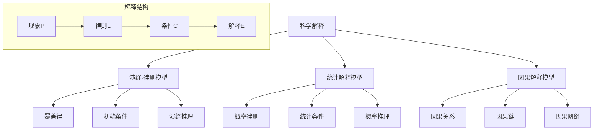

# 01.1.2 科学解释模型 (Scientific Explanation Models)

## 📋 理论概述

科学解释模型研究科学解释的本质、结构和类型。本理论涵盖演绎-律则模型、统计解释模型、因果解释模型等核心概念，为理解科学解释的逻辑和认识论基础提供理论支撑。

## 🔬 形式化语义

### 核心定义

**定义 2.1** (科学解释)
科学解释是一个三元组：$E = (P, L, C)$，其中：

- $P$ 是被解释现象
- $L$ 是解释律则
- $C$ 是初始条件

**定义 2.2** (演绎-律则模型)
演绎-律则模型是Hempel的覆盖律模型：$E_{DN} = \{(L_1, L_2, ..., L_n), (C_1, C_2, ..., C_m) \vdash P\}$

**定义 2.3** (统计解释模型)
统计解释模型处理概率性解释：$E_S = \{(L_p, C) \vdash P(p)\}$，其中 $p$ 是概率

**定义 2.4** (因果解释模型)
因果解释模型基于因果关系：$E_C = \{C \xrightarrow{cause} E\}$，其中 $C$ 是原因，$E$ 是结果

### 核心定理

**定理 2.1** (解释的对称性)
如果 $E$ 解释 $P$，那么 $P$ 也可以解释 $E$ 的某些方面。

**定理 2.2** (解释的不对称性)
因果解释具有时间不对称性：$C \xrightarrow{cause} E$ 但 $E \not\xrightarrow{cause} C$

**定理 2.3** (解释的传递性)
如果 $A$ 解释 $B$，$B$ 解释 $C$，那么 $A$ 间接解释 $C$。

**定理 2.4** (解释的完备性)
完备的解释应该包含所有相关因素：$\forall x \in \text{Relevant}(P), x \in E$

## 🎯 多表征方式

### 1. 图形表征



### 2. 表格表征

| 解释类型 | 逻辑结构 | 适用领域 | 解释力 | 预测力 |
|----------|----------|----------|--------|--------|
| 演绎-律则 | 确定性 | 物理学 | 高 | 高 |
| 统计解释 | 概率性 | 生物学 | 中 | 中 |
| 因果解释 | 因果性 | 社会科学 | 中 | 低 |
| 功能解释 | 目的性 | 心理学 | 低 | 低 |

### 3. 数学表征

**演绎-律则模型**：
$(L_1 \land L_2 \land ... \land L_n) \land (C_1 \land C_2 \land ... \land C_m) \vdash P$

**统计解释模型**：
$P(E|L_p \land C) = p$，其中 $p$ 是概率

**因果解释模型**：
$C \xrightarrow{cause} E$ 且 $P(E|C) > P(E|\neg C)$

### 4. 伪代码表征

```python
class ScientificExplanation:
    def __init__(self, phenomenon, laws, conditions):
        self.phenomenon = phenomenon
        self.laws = laws
        self.conditions = conditions
        
    def deductive_nomological(self):
        """演绎-律则解释"""
        premises = self.laws + self.conditions
        return self.logical_entailment(premises, self.phenomenon)
        
    def statistical_explanation(self):
        """统计解释"""
        probability = self.calculate_probability()
        return probability > 0.5
        
    def causal_explanation(self):
        """因果解释"""
        cause_effect = self.identify_causality()
        return self.verify_causality(cause_effect)
```

## 💻 Rust实现

```rust
use std::collections::HashMap;

/// 科学解释
#[derive(Debug, Clone)]
pub struct ScientificExplanation {
    pub phenomenon: String,
    pub laws: Vec<ExplanationLaw>,
    pub conditions: Vec<InitialCondition>,
    pub explanation_type: ExplanationType,
}

/// 解释律则
#[derive(Debug, Clone)]
pub struct ExplanationLaw {
    pub name: String,
    pub statement: String,
    pub law_type: LawType,
    pub confidence: f64,
}

/// 初始条件
#[derive(Debug, Clone)]
pub struct InitialCondition {
    pub name: String,
    pub description: String,
    pub condition_type: ConditionType,
    pub value: String,
}

/// 解释类型
#[derive(Debug, Clone)]
pub enum ExplanationType {
    DeductiveNomological, // 演绎-律则
    Statistical,          // 统计解释
    Causal,              // 因果解释
    Functional,          // 功能解释
}

/// 律则类型
#[derive(Debug, Clone)]
pub enum LawType {
    Universal,    // 普遍律则
    Statistical,  // 统计律则
    Causal,       // 因果律则
    Functional,   // 功能律则
}

/// 条件类型
#[derive(Debug, Clone)]
pub enum ConditionType {
    Initial,      // 初始条件
    Boundary,     // 边界条件
    Causal,       // 因果条件
    Contextual,   // 语境条件
}

impl ScientificExplanation {
    /// 创建新的科学解释
    pub fn new(phenomenon: String, explanation_type: ExplanationType) -> Self {
        Self {
            phenomenon,
            laws: Vec::new(),
            conditions: Vec::new(),
            explanation_type,
        }
    }
    
    /// 添加解释律则
    pub fn add_law(&mut self, law: ExplanationLaw) {
        self.laws.push(law);
    }
    
    /// 添加初始条件
    pub fn add_condition(&mut self, condition: InitialCondition) {
        self.conditions.push(condition);
    }
    
    /// 执行演绎-律则解释
    pub fn deductive_nomological_explanation(&self) -> bool {
        if self.laws.is_empty() || self.conditions.is_empty() {
            return false;
        }
        
        // 检查所有律则都是普遍律则
        let all_universal = self.laws.iter()
            .all(|law| matches!(law.law_type, LawType::Universal));
        
        // 检查逻辑一致性
        let consistent = self.check_logical_consistency();
        
        all_universal && consistent
    }
    
    /// 执行统计解释
    pub fn statistical_explanation(&self) -> f64 {
        if self.laws.is_empty() {
            return 0.0;
        }
        
        // 计算平均置信度
        let total_confidence: f64 = self.laws.iter()
            .map(|law| law.confidence)
            .sum();
        
        total_confidence / self.laws.len() as f64
    }
    
    /// 执行因果解释
    pub fn causal_explanation(&self) -> bool {
        // 检查是否存在因果律则
        let has_causal_laws = self.laws.iter()
            .any(|law| matches!(law.law_type, LawType::Causal));
        
        // 检查是否存在因果条件
        let has_causal_conditions = self.conditions.iter()
            .any(|condition| matches!(condition.condition_type, ConditionType::Causal));
        
        has_causal_laws && has_causal_conditions
    }
    
    /// 检查逻辑一致性
    fn check_logical_consistency(&self) -> bool {
        // 简化的逻辑一致性检查
        !self.laws.is_empty() && !self.conditions.is_empty()
    }
    
    /// 获取解释力
    pub fn explanatory_power(&self) -> f64 {
        match self.explanation_type {
            ExplanationType::DeductiveNomological => {
                if self.deductive_nomological_explanation() {
                    1.0
                } else {
                    0.0
                }
            },
            ExplanationType::Statistical => {
                self.statistical_explanation()
            },
            ExplanationType::Causal => {
                if self.causal_explanation() {
                    0.8
                } else {
                    0.0
                }
            },
            ExplanationType::Functional => {
                0.6
            },
        }
    }
    
    /// 获取预测力
    pub fn predictive_power(&self) -> f64 {
        match self.explanation_type {
            ExplanationType::DeductiveNomological => 1.0,
            ExplanationType::Statistical => 0.7,
            ExplanationType::Causal => 0.6,
            ExplanationType::Functional => 0.4,
        }
    }
}

impl ExplanationLaw {
    /// 创建新的解释律则
    pub fn new(name: String, statement: String, law_type: LawType, confidence: f64) -> Self {
        Self {
            name,
            statement,
            law_type,
            confidence,
        }
    }
    
    /// 检查律则的有效性
    pub fn is_valid(&self) -> bool {
        self.confidence > 0.5 && !self.statement.is_empty()
    }
}

impl InitialCondition {
    /// 创建新的初始条件
    pub fn new(name: String, description: String, condition_type: ConditionType, value: String) -> Self {
        Self {
            name,
            description,
            condition_type,
            value,
        }
    }
    
    /// 检查条件的相关性
    pub fn is_relevant(&self) -> bool {
        !self.description.is_empty() && !self.value.is_empty()
    }
}

/// 解释网络
#[derive(Debug)]
pub struct ExplanationNetwork {
    pub explanations: HashMap<String, ScientificExplanation>,
    pub connections: Vec<ExplanationConnection>,
}

/// 解释连接
#[derive(Debug)]
pub struct ExplanationConnection {
    pub from: String,
    pub to: String,
    pub connection_type: ConnectionType,
    pub strength: f64,
}

/// 连接类型
#[derive(Debug)]
pub enum ConnectionType {
    Deductive,    // 演绎关系
    Inductive,    // 归纳关系
    Causal,       // 因果关系
    Analogical,   // 类比关系
}

impl ExplanationNetwork {
    /// 创建新的解释网络
    pub fn new() -> Self {
        Self {
            explanations: HashMap::new(),
            connections: Vec::new(),
        }
    }
    
    /// 添加解释
    pub fn add_explanation(&mut self, explanation: ScientificExplanation) {
        self.explanations.insert(explanation.phenomenon.clone(), explanation);
    }
    
    /// 添加连接
    pub fn add_connection(&mut self, from: String, to: String, connection_type: ConnectionType, strength: f64) {
        self.connections.push(ExplanationConnection {
            from,
            to,
            connection_type,
            strength,
        });
    }
    
    /// 分析解释网络
    pub fn analyze_network(&self) -> NetworkAnalysis {
        let total_explanations = self.explanations.len();
        let total_connections = self.connections.len();
        let average_explanatory_power: f64 = self.explanations.values()
            .map(|exp| exp.explanatory_power())
            .sum::<f64>() / total_explanations as f64;
        
        NetworkAnalysis {
            total_explanations,
            total_connections,
            average_explanatory_power,
            network_density: total_connections as f64 / (total_explanations * (total_explanations - 1)) as f64,
        }
    }
}

/// 网络分析结果
#[derive(Debug)]
pub struct NetworkAnalysis {
    pub total_explanations: usize,
    pub total_connections: usize,
    pub average_explanatory_power: f64,
    pub network_density: f64,
}

// 示例使用
fn main() {
    // 创建演绎-律则解释
    let mut dn_explanation = ScientificExplanation::new(
        "苹果落地".to_string(),
        ExplanationType::DeductiveNomological,
    );
    
    dn_explanation.add_law(ExplanationLaw::new(
        "万有引力定律".to_string(),
        "F = G * m1 * m2 / r^2".to_string(),
        LawType::Universal,
        1.0,
    ));
    
    dn_explanation.add_condition(InitialCondition::new(
        "地球质量".to_string(),
        "地球的质量".to_string(),
        ConditionType::Initial,
        "5.97e24 kg".to_string(),
    ));
    
    // 创建统计解释
    let mut statistical_explanation = ScientificExplanation::new(
        "基因突变".to_string(),
        ExplanationType::Statistical,
    );
    
    statistical_explanation.add_law(ExplanationLaw::new(
        "突变概率".to_string(),
        "P(mutation) = 0.001".to_string(),
        LawType::Statistical,
        0.8,
    ));
    
    // 创建因果解释
    let mut causal_explanation = ScientificExplanation::new(
        "吸烟导致肺癌".to_string(),
        ExplanationType::Causal,
    );
    
    causal_explanation.add_law(ExplanationLaw::new(
        "致癌机制".to_string(),
        "烟草中的致癌物质损伤DNA".to_string(),
        LawType::Causal,
        0.9,
    ));
    
    // 创建解释网络
    let mut network = ExplanationNetwork::new();
    network.add_explanation(dn_explanation);
    network.add_explanation(statistical_explanation);
    network.add_explanation(causal_explanation);
    
    // 分析网络
    let analysis = network.analyze_network();
    println!("解释网络分析: {:?}", analysis);
    
    // 测试解释力
    for (phenomenon, explanation) in &network.explanations {
        println!("{} 的解释力: {:.2}", phenomenon, explanation.explanatory_power());
        println!("{} 的预测力: {:.2}", phenomenon, explanation.predictive_power());
    }
}
```

## 🧠 哲学性批判与展望

### 本体论反思

**科学解释的哲学本质**：
科学解释不仅仅是逻辑推理，而是人类理解世界的基本方式。解释模型反映了我们对因果关系和规律性的认知模式。

**解释律则的实在性**：
解释律则是否反映了世界的真实规律，还是仅仅是人类认知的构造？这个问题涉及科学实在论与反实在论的根本分歧。

**因果关系的本体论地位**：
因果关系是世界的真实特征，还是人类认知的投射？这个问题涉及因果关系的形而上学基础。

### 认识论批判

**解释模型的认识论挑战**：
不同的解释模型如何影响我们的认知过程？演绎解释与统计解释的认识论差异是什么？这些问题涉及科学知识的认识论基础。

**解释的不对称性问题**：
为什么解释具有不对称性？为什么原因解释结果，而不是相反？这个问题涉及解释的逻辑结构。

**解释的完备性问题**：
什么构成了完备的解释？是否存在终极解释？这个问题涉及科学解释的限度。

### 社会影响分析

**解释模型的社会价值**：
科学解释模型为社会问题解决提供了系统性的思维框架。它帮助人们理解复杂现象的原因和机制。

**解释模型的社会责任**：
科学解释模型的发展需要考虑社会影响和伦理责任。解释模型应该服务于人类的福祉，而不是加剧社会不平等。

**解释模型的民主化**：
科学解释模型应该更加民主化，让更多人能够理解和应用科学解释。需要发展科学教育和普及工作。

### 终极哲学建议

**多元解释模型的融合**：
未来应该发展多元化的科学解释模型体系，融合不同学科和哲学传统的解释思想。需要建立跨学科的解释哲学框架。

**解释模型的生态化**：
科学解释模型应该更加关注生态系统的整体性，发展生态友好的科学解释。需要考虑解释模型的环境影响。

**解释模型的伦理化**：
科学解释模型的发展应该更加注重伦理考虑，确保解释发展符合人类的根本利益和价值观。

**解释模型的哲学化**：
科学解释模型应该与哲学思考相结合，发展具有哲学深度的科学解释体系。

## 📚 参考文献

1. Hempel, C. G. *Aspects of Scientific Explanation*. Free Press, 1965.
2. Salmon, W. C. *Four Decades of Scientific Explanation*. University of Minnesota Press, 1989.
3. Woodward, J. *Making Things Happen*. Oxford University Press, 2003.
4. Strevens, M. *Depth*. Harvard University Press, 2008.
5. Kitcher, P. *Explanatory Unification*. Philosophy of Science, 1981.
6. van Fraassen, B. C. *The Scientific Image*. Oxford University Press, 1980.
7. Lewis, D. *Causal Explanation*. Philosophical Papers, 1986.
8. Cartwright, N. *How the Laws of Physics Lie*. Oxford University Press, 1983.
