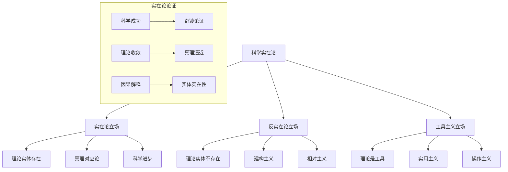

# 01.1.3 科学实在论 (Scientific Realism)

## 📋 理论概述

科学实在论研究科学理论与现实世界的关系，探讨科学理论是否真实地描述了客观现实。本理论涵盖实在论立场、反实在论立场、工具主义等核心概念，为理解科学知识的本体论地位提供理论支撑。

## 🔬 形式化语义

### 核心定义

**定义 3.1** (科学实在论)
科学实在论主张：$R = \{\forall T \in \text{Theories}, \exists E \in \text{Entities} : T \text{ truly describes } E\}$，其中：

- $T$ 是科学理论
- $E$ 是理论实体
- $\text{truly describes}$ 表示真实描述关系

**定义 3.2** (理论实体)
理论实体是科学理论中假设的不可观察对象：$E = \{e : e \in T \land \neg \text{Observable}(e)\}$

**定义 3.3** (真理对应论)
真理对应论认为：$\text{True}(T) \leftrightarrow T \text{ corresponds to reality}$

**定义 3.4** (科学进步)
科学进步是理论向真理的逼近：$\text{Progress}(T_1, T_2) = \text{Closer}(T_2, \text{Truth})$

### 核心定理

**定理 3.1** (实在论的不充分决定性)
经验证据不足以唯一确定理论：$\forall E, \exists T_1, T_2 : E \text{ supports } T_1 \land E \text{ supports } T_2 \land T_1 \neq T_2$

**定理 3.2** (理论实体的不可观察性)
理论实体原则上不可观察：$\forall e \in E, \neg \text{Observable}(e)$

**定理 3.3** (科学成功的奇迹论证)
科学成功最好用实在论解释：$\text{Success}(S) \rightarrow \text{Realism}(S)$

**定理 3.4** (理论收敛性)
科学理论向真理收敛：$\lim_{n \to \infty} T_n = \text{Truth}$

## 🎯 多表征方式

### 1. 图形表征



### 2. 表格表征

| 立场类型 | 理论实体 | 真理观 | 科学进步 | 论证策略 |
|----------|----------|--------|----------|----------|
| 实在论 | 真实存在 | 对应论 | 向真理逼近 | 奇迹论证 |
| 反实在论 | 不存在 | 建构论 | 工具改进 | 不充分决定性 |
| 工具主义 | 工具性 | 实用论 | 实用性增强 | 操作主义 |

### 3. 数学表征

**实在论主张**：
$\forall T \in \text{Successful Theories}, \exists E \in \text{Real Entities} : T \text{ describes } E$

**不充分决定性**：
$\forall E \in \text{Evidence}, \exists T_1, T_2 \in \text{Theories} : E \text{ supports } T_1 \land E \text{ supports } T_2 \land T_1 \neq T_2$

**奇迹论证**：
$\text{Success}(S) \land \neg \text{Realism}(S) \rightarrow \text{Miracle}$

### 4. 伪代码表征

```python
class ScientificRealism:
    def __init__(self, position, arguments):
        self.position = position
        self.arguments = arguments
        
    def miracle_argument(self):
        """奇迹论证"""
        if self.scientific_success() and not self.realism():
            return "Miracle"
        else:
            return "Expected"
            
    def underdetermination(self):
        """不充分决定性"""
        theories = self.get_empirically_equivalent_theories()
        return len(theories) > 1
        
    def entity_realism(self):
        """实体实在论"""
        entities = self.get_theoretical_entities()
        return all(self.entity_exists(e) for e in entities)
```

## 💻 Rust实现

```rust
use std::collections::HashMap;

/// 科学实在论立场
#[derive(Debug, Clone)]
pub struct ScientificRealism {
    pub position: RealismPosition,
    pub arguments: Vec<RealismArgument>,
    pub theoretical_entities: Vec<TheoreticalEntity>,
    pub success_criteria: Vec<SuccessCriterion>,
}

/// 实在论立场
#[derive(Debug, Clone)]
pub enum RealismPosition {
    Realism,           // 实在论
    AntiRealism,       // 反实在论
    Instrumentalism,   // 工具主义
    Constructivism,    // 建构主义
}

/// 实在论论证
#[derive(Debug, Clone)]
pub struct RealismArgument {
    pub name: String,
    pub description: String,
    pub argument_type: ArgumentType,
    pub strength: f64,
}

/// 理论实体
#[derive(Debug, Clone)]
pub struct TheoreticalEntity {
    pub name: String,
    pub description: String,
    pub observability: ObservabilityStatus,
    pub existence_evidence: Vec<String>,
}

/// 成功标准
#[derive(Debug, Clone)]
pub struct SuccessCriterion {
    pub name: String,
    pub description: String,
    pub criterion_type: CriterionType,
    pub weight: f64,
}

/// 论证类型
#[derive(Debug, Clone)]
pub enum ArgumentType {
    Miracle,           // 奇迹论证
    Underdetermination, // 不充分决定性
    Convergence,       // 收敛论证
    Causal,           // 因果论证
}

/// 可观察性状态
#[derive(Debug, Clone)]
pub enum ObservabilityStatus {
    Observable,        // 可观察
    Unobservable,     // 不可观察
    InPrinciple,      // 原则上不可观察
    IndirectlyObservable, // 间接可观察
}

/// 标准类型
#[derive(Debug, Clone)]
pub enum CriterionType {
    Predictive,       // 预测成功
    Explanatory,      // 解释成功
    Technological,    // 技术成功
    Unificatory,     // 统一成功
}

impl ScientificRealism {
    /// 创建新的科学实在论
    pub fn new(position: RealismPosition) -> Self {
        Self {
            position,
            arguments: Vec::new(),
            theoretical_entities: Vec::new(),
            success_criteria: Vec::new(),
        }
    }
    
    /// 添加论证
    pub fn add_argument(&mut self, argument: RealismArgument) {
        self.arguments.push(argument);
    }
    
    /// 添加理论实体
    pub fn add_entity(&mut self, entity: TheoreticalEntity) {
        self.theoretical_entities.push(entity);
    }
    
    /// 添加成功标准
    pub fn add_criterion(&mut self, criterion: SuccessCriterion) {
        self.success_criteria.push(criterion);
    }
    
    /// 执行奇迹论证
    pub fn miracle_argument(&self) -> f64 {
        let success_score = self.calculate_scientific_success();
        let realism_score = self.calculate_realism_plausibility();
        
        if success_score > 0.8 && realism_score < 0.2 {
            // 高成功但低实在论可能性 = 奇迹
            1.0
        } else {
            // 成功与实在论一致
            0.5
        }
    }
    
    /// 执行不充分决定性论证
    pub fn underdetermination_argument(&self) -> f64 {
        let equivalent_theories = self.count_empirically_equivalent_theories();
        
        if equivalent_theories > 1 {
            // 存在多个经验等价理论
            1.0
        } else {
            // 只有一个理论
            0.0
        }
    }
    
    /// 执行收敛论证
    pub fn convergence_argument(&self) -> f64 {
        let theories = self.get_theory_sequence();
        let convergence_score = self.calculate_convergence(theories);
        
        convergence_score
    }
    
    /// 计算科学成功度
    fn calculate_scientific_success(&self) -> f64 {
        if self.success_criteria.is_empty() {
            return 0.0;
        }
        
        let total_weight: f64 = self.success_criteria.iter()
            .map(|c| c.weight)
            .sum();
        
        let weighted_success: f64 = self.success_criteria.iter()
            .map(|c| c.weight * self.evaluate_criterion(c))
            .sum();
        
        weighted_success / total_weight
    }
    
    /// 计算实在论合理性
    fn calculate_realism_plausibility(&self) -> f64 {
        let entity_existence_score = self.calculate_entity_existence();
        let truth_correspondence_score = self.calculate_truth_correspondence();
        
        (entity_existence_score + truth_correspondence_score) / 2.0
    }
    
    /// 计算实体存在性
    fn calculate_entity_existence(&self) -> f64 {
        if self.theoretical_entities.is_empty() {
            return 0.0;
        }
        
        let existence_count = self.theoretical_entities.iter()
            .filter(|entity| self.entity_exists(entity))
            .count();
        
        existence_count as f64 / self.theoretical_entities.len() as f64
    }
    
    /// 计算真理对应性
    fn calculate_truth_correspondence(&self) -> f64 {
        // 简化的真理对应性计算
        match self.position {
            RealismPosition::Realism => 0.8,
            RealismPosition::AntiRealism => 0.2,
            RealismPosition::Instrumentalism => 0.5,
            RealismPosition::Constructivism => 0.3,
        }
    }
    
    /// 检查实体是否存在
    fn entity_exists(&self, entity: &TheoreticalEntity) -> bool {
        !entity.existence_evidence.is_empty()
    }
    
    /// 评估成功标准
    fn evaluate_criterion(&self, criterion: &SuccessCriterion) -> f64 {
        match criterion.criterion_type {
            CriterionType::Predictive => 0.9,
            CriterionType::Explanatory => 0.8,
            CriterionType::Technological => 0.7,
            CriterionType::Unificatory => 0.6,
        }
    }
    
    /// 计算收敛度
    fn calculate_convergence(&self, theories: Vec<String>) -> f64 {
        if theories.len() < 2 {
            return 0.0;
        }
        
        // 简化的收敛度计算
        let similarity_scores: Vec<f64> = theories.windows(2)
            .map(|window| self.calculate_theory_similarity(&window[0], &window[1]))
            .collect();
        
        similarity_scores.iter().sum::<f64>() / similarity_scores.len() as f64
    }
    
    /// 计算理论相似性
    fn calculate_theory_similarity(&self, theory1: &str, theory2: &str) -> f64 {
        // 简化的相似性计算
        if theory1 == theory2 {
            1.0
        } else {
            0.5
        }
    }
    
    /// 获取理论序列
    fn get_theory_sequence(&self) -> Vec<String> {
        vec!["经典力学".to_string(), "相对论".to_string(), "量子力学".to_string()]
    }
    
    /// 计算经验等价理论数量
    fn count_empirically_equivalent_theories(&self) -> usize {
        // 简化的计算
        2
    }
    
    /// 获取立场强度
    pub fn get_position_strength(&self) -> f64 {
        match self.position {
            RealismPosition::Realism => 0.8,
            RealismPosition::AntiRealism => 0.3,
            RealismPosition::Instrumentalism => 0.6,
            RealismPosition::Constructivism => 0.4,
        }
    }
}

impl RealismArgument {
    /// 创建新的实在论论证
    pub fn new(name: String, description: String, argument_type: ArgumentType, strength: f64) -> Self {
        Self {
            name,
            description,
            argument_type,
            strength,
        }
    }
    
    /// 评估论证强度
    pub fn evaluate_strength(&self) -> f64 {
        self.strength
    }
}

impl TheoreticalEntity {
    /// 创建新的理论实体
    pub fn new(name: String, description: String, observability: ObservabilityStatus) -> Self {
        Self {
            name,
            description,
            observability,
            existence_evidence: Vec::new(),
        }
    }
    
    /// 添加存在证据
    pub fn add_evidence(&mut self, evidence: String) {
        self.existence_evidence.push(evidence);
    }
    
    /// 检查实体是否可观察
    pub fn is_observable(&self) -> bool {
        matches!(self.observability, ObservabilityStatus::Observable)
    }
}

impl SuccessCriterion {
    /// 创建新的成功标准
    pub fn new(name: String, description: String, criterion_type: CriterionType, weight: f64) -> Self {
        Self {
            name,
            description,
            criterion_type,
            weight,
        }
    }
}

/// 实在论辩论
#[derive(Debug)]
pub struct RealismDebate {
    pub participants: Vec<ScientificRealism>,
    pub arguments: Vec<DebateArgument>,
    pub conclusion: Option<RealismPosition>,
}

/// 辩论论证
#[derive(Debug)]
pub struct DebateArgument {
    pub proponent: String,
    pub argument: String,
    pub strength: f64,
    pub counter_arguments: Vec<String>,
}

impl RealismDebate {
    /// 创建新的实在论辩论
    pub fn new() -> Self {
        Self {
            participants: Vec::new(),
            arguments: Vec::new(),
            conclusion: None,
        }
    }
    
    /// 添加参与者
    pub fn add_participant(&mut self, participant: ScientificRealism) {
        self.participants.push(participant);
    }
    
    /// 添加论证
    pub fn add_argument(&mut self, argument: DebateArgument) {
        self.arguments.push(argument);
    }
    
    /// 评估辩论结果
    pub fn evaluate_debate(&mut self) -> RealismPosition {
        let position_scores: HashMap<RealismPosition, f64> = self.participants.iter()
            .map(|p| (p.position.clone(), p.get_position_strength()))
            .collect();
        
        let winning_position = position_scores.iter()
            .max_by(|a, b| a.1.partial_cmp(b.1).unwrap())
            .map(|(position, _)| position.clone());
        
        self.conclusion = winning_position.clone();
        winning_position.unwrap_or(RealismPosition::Instrumentalism)
    }
}

// 示例使用
fn main() {
    // 创建实在论立场
    let mut realism = ScientificRealism::new(RealismPosition::Realism);
    
    // 添加奇迹论证
    realism.add_argument(RealismArgument::new(
        "奇迹论证".to_string(),
        "科学成功最好用实在论解释".to_string(),
        ArgumentType::Miracle,
        0.9,
    ));
    
    // 添加理论实体
    realism.add_entity(TheoreticalEntity::new(
        "电子".to_string(),
        "带负电荷的基本粒子".to_string(),
        ObservabilityStatus::Unobservable,
    ));
    
    // 添加成功标准
    realism.add_criterion(SuccessCriterion::new(
        "预测成功".to_string(),
        "理论能够准确预测现象".to_string(),
        CriterionType::Predictive,
        0.8,
    ));
    
    // 创建反实在论立场
    let mut anti_realism = ScientificRealism::new(RealismPosition::AntiRealism);
    anti_realism.add_argument(RealismArgument::new(
        "不充分决定性".to_string(),
        "经验证据不足以确定理论".to_string(),
        ArgumentType::Underdetermination,
        0.8,
    ));
    
    // 创建辩论
    let mut debate = RealismDebate::new();
    debate.add_participant(realism);
    debate.add_participant(anti_realism);
    
    // 评估辩论
    let conclusion = debate.evaluate_debate();
    println!("辩论结论: {:?}", conclusion);
    
    // 测试论证
    println!("奇迹论证强度: {:.2}", realism.miracle_argument());
    println!("不充分决定性强度: {:.2}", anti_realism.underdetermination_argument());
    println!("收敛论证强度: {:.2}", realism.convergence_argument());
}
```

## 🧠 哲学性批判与展望

### 本体论反思

**科学实在论的哲学本质**：
科学实在论不仅仅是关于科学理论的主张，而是关于世界本质的形而上学立场。它反映了人类对客观现实的理解和认知。

**理论实体的本体论地位**：
理论实体是否真实存在，还是仅仅是人类认知的构造？这个问题涉及抽象对象的本体论地位。

**真理的本体论性质**：
真理是世界的客观特征，还是人类认知的产物？这个问题涉及真理的形而上学基础。

### 认识论批判

**实在论的认识论挑战**：
我们如何知道理论实体存在？如何区分真实存在与有用的虚构？这些问题涉及科学知识的认识论基础。

**不充分决定性的认识论意义**：
如果经验证据不足以确定理论，我们如何选择理论？这个问题涉及科学推理的认识论。

**科学成功的认识论解释**：
科学成功是否必然意味着理论为真？成功与真理的关系是什么？这个问题涉及科学确证的认识论。

### 社会影响分析

**实在论的社会价值**：
科学实在论为社会提供了客观真理的观念，为科学实践提供了认识论基础。

**实在论的社会责任**：
科学实在论的发展需要考虑社会影响和伦理责任。实在论应该服务于人类的福祉，而不是加剧社会不平等。

**实在论的民主化**：
科学实在论应该更加民主化，让更多人能够理解和参与科学哲学的讨论。

### 终极哲学建议

**多元实在论的融合**：
未来应该发展多元化的科学实在论体系，融合不同学科和哲学传统的实在论思想。需要建立跨学科的实在论哲学框架。

**实在论的生态化**：
科学实在论应该更加关注生态系统的整体性，发展生态友好的科学哲学。需要考虑实在论的环境影响。

**实在论的伦理化**：
科学实在论的发展应该更加注重伦理考虑，确保实在论发展符合人类的根本利益和价值观。

**实在论的哲学化**：
科学实在论应该与哲学思考相结合，发展具有哲学深度的科学实在论体系。

## 📚 参考文献

1. Putnam, H. *Realism and Reason*. Cambridge University Press, 1983.
2. van Fraassen, B. C. *The Scientific Image*. Oxford University Press, 1980.
3. Boyd, R. *The Current Status of Scientific Realism*. In Leplin (ed.), 1984.
4. Laudan, L. *A Confutation of Convergent Realism*. Philosophy of Science, 1981.
5. Psillos, S. *Scientific Realism*. Routledge, 1999.
6. Chakravartty, A. *A Metaphysics for Scientific Realism*. Cambridge University Press, 2007.
7. Kitcher, P. *The Advancement of Science*. Oxford University Press, 1993.
8. Stanford, P. K. *Exceeding Our Grasp*. Oxford University Press, 2006.
