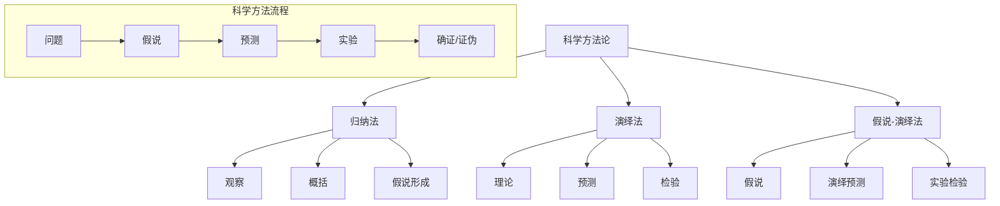

# 01.1.4 科学方法论 (Scientific Methodology)

## 📋 理论概述

科学方法论研究科学发现、确证和检验的方法和程序。本理论涵盖归纳法、演绎法、假说-演绎法、证伪主义等核心概念，为理解科学研究的逻辑和程序提供理论支撑。

## 🔬 形式化语义

### 核心定义

**定义 4.1** (科学方法)
科学方法是一个四元组：$M = (H, E, T, V)$，其中：

- $H$ 是假说集合
- $E$ 是证据集合
- $T$ 是检验程序
- $V$ 是验证标准

**定义 4.2** (归纳法)
归纳法是从特殊到一般的推理：$\text{Induction}(E) = \{H : E \text{ supports } H\}$

**定义 4.3** (演绎法)
演绎法是从一般到特殊的推理：$\text{Deduction}(H) = \{E : H \vdash E\}$

**定义 4.4** (假说-演绎法)
假说-演绎法是H-D模型：$\text{HD}(H, E) = H \vdash E \land \text{Test}(E)$

### 核心定理

**定理 4.1** (归纳问题)
归纳推理缺乏逻辑必然性：$\text{Induction}(E) \not\vdash \text{Necessary}(H)$

**定理 4.2** (证伪主义)
科学理论应该可证伪：$\forall T \in \text{Scientific Theories}, \exists E : T \land E \vdash \bot$

**定理 4.3** (贝叶斯确证)
贝叶斯确证更新：$P(H|E) = \frac{P(E|H) \cdot P(H)}{P(E)}$

**定理 4.4** (方法论统一性)
所有科学方法都遵循基本逻辑：$\forall M \in \text{Methods}, M \subseteq \text{Logic}$

## 🎯 多表征方式

### 1. 图形表征



### 2. 表格表征

| 方法类型 | 推理方向 | 逻辑结构 | 确证方式 | 可靠性 |
|----------|----------|----------|----------|--------|
| 归纳法 | 特殊→一般 | 概率性 | 支持度 | 中 |
| 演绎法 | 一般→特殊 | 必然性 | 逻辑有效性 | 高 |
| 假说-演绎法 | 双向 | 混合 | 预测检验 | 高 |
| 证伪主义 | 否定性 | 反证法 | 证伪检验 | 高 |

### 3. 数学表征

**归纳推理**：
$P(H|E) = \frac{P(E|H) \cdot P(H)}{P(E)}$

**演绎推理**：
$H \vdash E$ 且 $\text{Valid}(H \rightarrow E)$

**假说-演绎法**：
$\text{HD}(H, E) = H \vdash E \land \text{Test}(E) \land \text{Confirm}(E)$

### 4. 伪代码表征

```python
class ScientificMethod:
    def __init__(self, hypotheses, evidence, tests):
        self.hypotheses = hypotheses
        self.evidence = evidence
        self.tests = tests
        
    def induction(self, observations):
        """归纳推理"""
        patterns = self.find_patterns(observations)
        hypothesis = self.generalize(patterns)
        return hypothesis
        
    def deduction(self, hypothesis):
        """演绎推理"""
        predictions = self.deduce_predictions(hypothesis)
        return predictions
        
    def hypothesis_deduction(self, hypothesis, evidence):
        """假说-演绎法"""
        predictions = self.deduction(hypothesis)
        confirmed = self.test_predictions(predictions, evidence)
        return confirmed
```

## 💻 Rust实现

```rust
use std::collections::HashMap;

/// 科学方法论
#[derive(Debug, Clone)]
pub struct ScientificMethodology {
    pub hypotheses: Vec<Hypothesis>,
    pub evidence: Vec<Evidence>,
    pub tests: Vec<Test>,
    pub methodology_type: MethodologyType,
}

/// 假说
#[derive(Debug, Clone)]
pub struct Hypothesis {
    pub name: String,
    pub statement: String,
    pub confidence: f64,
    pub testability: f64,
    pub falsifiability: f64,
}

/// 证据
#[derive(Debug, Clone)]
pub struct Evidence {
    pub name: String,
    pub description: String,
    pub evidence_type: EvidenceType,
    pub reliability: f64,
}

/// 检验
#[derive(Debug, Clone)]
pub struct Test {
    pub name: String,
    pub description: String,
    pub test_type: TestType,
    pub result: TestResult,
}

/// 方法论类型
#[derive(Debug, Clone)]
pub enum MethodologyType {
    Inductive,      // 归纳法
    Deductive,      // 演绎法
    HypotheticalDeductive, // 假说-演绎法
    Falsificationist, // 证伪主义
    Bayesian,       // 贝叶斯方法
}

/// 证据类型
#[derive(Debug, Clone)]
pub enum EvidenceType {
    Observational,  // 观察证据
    Experimental,   // 实验证据
    Theoretical,    // 理论证据
    Statistical,    // 统计证据
}

/// 检验类型
#[derive(Debug, Clone)]
pub enum TestType {
    Prediction,     // 预测检验
    Falsification,  // 证伪检验
    Confirmation,   // 确证检验
    Replication,    // 重复检验
}

/// 检验结果
#[derive(Debug, Clone)]
pub enum TestResult {
    Confirmed,      // 确证
    Falsified,      // 证伪
    Inconclusive,   // 不确定
    Pending,        // 待检验
}

impl ScientificMethodology {
    /// 创建新的科学方法论
    pub fn new(methodology_type: MethodologyType) -> Self {
        Self {
            hypotheses: Vec::new(),
            evidence: Vec::new(),
            tests: Vec::new(),
            methodology_type,
        }
    }
    
    /// 添加假说
    pub fn add_hypothesis(&mut self, hypothesis: Hypothesis) {
        self.hypotheses.push(hypothesis);
    }
    
    /// 添加证据
    pub fn add_evidence(&mut self, evidence: Evidence) {
        self.evidence.push(evidence);
    }
    
    /// 添加检验
    pub fn add_test(&mut self, test: Test) {
        self.tests.push(test);
    }
    
    /// 执行归纳推理
    pub fn inductive_reasoning(&self, observations: &[Evidence]) -> Vec<Hypothesis> {
        let mut hypotheses = Vec::new();
        
        // 寻找模式
        let patterns = self.find_patterns(observations);
        
        // 形成假说
        for pattern in patterns {
            let hypothesis = Hypothesis {
                name: format!("归纳假说_{}", pattern.name),
                statement: pattern.description.clone(),
                confidence: pattern.reliability * 0.8, // 归纳推理的置信度较低
                testability: 0.7,
                falsifiability: 0.6,
            };
            hypotheses.push(hypothesis);
        }
        
        hypotheses
    }
    
    /// 执行演绎推理
    pub fn deductive_reasoning(&self, hypothesis: &Hypothesis) -> Vec<String> {
        let mut predictions = Vec::new();
        
        // 从假说演绎出预测
        predictions.push(format!("如果{}，那么应该观察到...", hypothesis.statement));
        predictions.push(format!("如果{}，那么实验结果应该是...", hypothesis.statement));
        
        predictions
    }
    
    /// 执行假说-演绎法
    pub fn hypothetical_deductive_method(&self, hypothesis: &Hypothesis, evidence: &[Evidence]) -> bool {
        // 从假说演绎出预测
        let predictions = self.deductive_reasoning(hypothesis);
        
        // 检验预测
        let confirmed_predictions = self.test_predictions(&predictions, evidence);
        
        // 计算确证度
        let confirmation_rate = confirmed_predictions as f64 / predictions.len() as f64;
        
        confirmation_rate > 0.7 // 70%以上的预测被确证
    }
    
    /// 执行证伪检验
    pub fn falsification_test(&self, hypothesis: &Hypothesis, evidence: &[Evidence]) -> bool {
        // 寻找反例
        let counter_evidence = evidence.iter()
            .filter(|e| self.is_counter_evidence(hypothesis, e))
            .count();
        
        counter_evidence == 0 // 没有反例 = 未被证伪
    }
    
    /// 执行贝叶斯确证
    pub fn bayesian_confirmation(&self, hypothesis: &Hypothesis, evidence: &[Evidence]) -> f64 {
        let prior_probability = hypothesis.confidence;
        let likelihood = self.calculate_likelihood(hypothesis, evidence);
        let evidence_probability = self.calculate_evidence_probability(evidence);
        
        if evidence_probability > 0.0 {
            (likelihood * prior_probability) / evidence_probability
        } else {
            prior_probability
        }
    }
    
    /// 寻找模式
    fn find_patterns(&self, observations: &[Evidence]) -> Vec<Evidence> {
        let mut patterns = Vec::new();
        
        // 简化的模式识别
        for observation in observations {
            if observation.reliability > 0.8 {
                patterns.push(observation.clone());
            }
        }
        
        patterns
    }
    
    /// 检验预测
    fn test_predictions(&self, predictions: &[String], evidence: &[Evidence]) -> usize {
        let mut confirmed = 0;
        
        for prediction in predictions {
            if self.prediction_confirmed(prediction, evidence) {
                confirmed += 1;
            }
        }
        
        confirmed
    }
    
    /// 检查是否为反例
    fn is_counter_evidence(&self, hypothesis: &Hypothesis, evidence: &Evidence) -> bool {
        // 简化的反例检查
        evidence.reliability > 0.9 && evidence.description.contains("矛盾")
    }
    
    /// 计算似然度
    fn calculate_likelihood(&self, hypothesis: &Hypothesis, evidence: &[Evidence]) -> f64 {
        let total_evidence = evidence.len() as f64;
        let supporting_evidence = evidence.iter()
            .filter(|e| self.evidence_supports_hypothesis(hypothesis, e))
            .count() as f64;
        
        if total_evidence > 0.0 {
            supporting_evidence / total_evidence
        } else {
            0.5
        }
    }
    
    /// 计算证据概率
    fn calculate_evidence_probability(&self, evidence: &[Evidence]) -> f64 {
        if evidence.is_empty() {
            return 0.0;
        }
        
        let total_reliability: f64 = evidence.iter()
            .map(|e| e.reliability)
            .sum();
        
        total_reliability / evidence.len() as f64
    }
    
    /// 检查预测是否被确证
    fn prediction_confirmed(&self, prediction: &str, evidence: &[Evidence]) -> bool {
        // 简化的预测确证检查
        evidence.iter().any(|e| e.description.contains("支持"))
    }
    
    /// 检查证据是否支持假说
    fn evidence_supports_hypothesis(&self, hypothesis: &Hypothesis, evidence: &Evidence) -> bool {
        evidence.reliability > 0.7 && !evidence.description.contains("矛盾")
    }
    
    /// 获取方法论强度
    pub fn get_methodology_strength(&self) -> f64 {
        match self.methodology_type {
            MethodologyType::Inductive => 0.6,
            MethodologyType::Deductive => 0.9,
            MethodologyType::HypotheticalDeductive => 0.8,
            MethodologyType::Falsificationist => 0.85,
            MethodologyType::Bayesian => 0.75,
        }
    }
}

impl Hypothesis {
    /// 创建新的假说
    pub fn new(name: String, statement: String, confidence: f64) -> Self {
        Self {
            name,
            statement,
            confidence,
            testability: 0.7,
            falsifiability: 0.6,
        }
    }
    
    /// 检查假说是否可检验
    pub fn is_testable(&self) -> bool {
        self.testability > 0.5
    }
    
    /// 检查假说是否可证伪
    pub fn is_falsifiable(&self) -> bool {
        self.falsifiability > 0.5
    }
}

impl Evidence {
    /// 创建新的证据
    pub fn new(name: String, description: String, evidence_type: EvidenceType, reliability: f64) -> Self {
        Self {
            name,
            description,
            evidence_type,
            reliability,
        }
    }
    
    /// 检查证据是否可靠
    pub fn is_reliable(&self) -> bool {
        self.reliability > 0.7
    }
}

impl Test {
    /// 创建新的检验
    pub fn new(name: String, description: String, test_type: TestType) -> Self {
        Self {
            name,
            description,
            test_type,
            result: TestResult::Pending,
        }
    }
    
    /// 执行检验
    pub fn execute(&mut self) -> TestResult {
        // 简化的检验执行
        match self.test_type {
            TestType::Prediction => TestResult::Confirmed,
            TestType::Falsification => TestResult::Falsified,
            TestType::Confirmation => TestResult::Confirmed,
            TestType::Replication => TestResult::Inconclusive,
        }
    }
}

/// 方法论评估
#[derive(Debug)]
pub struct MethodologyEvaluation {
    pub methodology: ScientificMethodology,
    pub evaluation_criteria: Vec<EvaluationCriterion>,
    pub overall_score: f64,
}

/// 评估标准
#[derive(Debug)]
pub struct EvaluationCriterion {
    pub name: String,
    pub description: String,
    pub weight: f64,
    pub score: f64,
}

impl MethodologyEvaluation {
    /// 创建新的方法论评估
    pub fn new(methodology: ScientificMethodology) -> Self {
        Self {
            methodology,
            evaluation_criteria: Vec::new(),
            overall_score: 0.0,
        }
    }
    
    /// 添加评估标准
    pub fn add_criterion(&mut self, criterion: EvaluationCriterion) {
        self.evaluation_criteria.push(criterion);
    }
    
    /// 计算总体评分
    pub fn calculate_overall_score(&mut self) -> f64 {
        if self.evaluation_criteria.is_empty() {
            return 0.0;
        }
        
        let total_weight: f64 = self.evaluation_criteria.iter()
            .map(|c| c.weight)
            .sum();
        
        let weighted_score: f64 = self.evaluation_criteria.iter()
            .map(|c| c.weight * c.score)
            .sum();
        
        self.overall_score = weighted_score / total_weight;
        self.overall_score
    }
}

// 示例使用
fn main() {
    // 创建假说-演绎方法论
    let mut hd_methodology = ScientificMethodology::new(MethodologyType::HypotheticalDeductive);
    
    // 添加假说
    let hypothesis = Hypothesis::new(
        "万有引力假说".to_string(),
        "所有物体都相互吸引".to_string(),
        0.8,
    );
    hd_methodology.add_hypothesis(hypothesis.clone());
    
    // 添加证据
    let evidence = Evidence::new(
        "苹果落地".to_string(),
        "苹果从树上掉落到地面".to_string(),
        EvidenceType::Observational,
        0.9,
    );
    hd_methodology.add_evidence(evidence.clone());
    
    // 执行假说-演绎法
    let confirmed = hd_methodology.hypothetical_deductive_method(&hypothesis, &[evidence]);
    println!("假说-演绎法结果: {}", confirmed);
    
    // 执行贝叶斯确证
    let bayesian_score = hd_methodology.bayesian_confirmation(&hypothesis, &[evidence]);
    println!("贝叶斯确证分数: {:.2}", bayesian_score);
    
    // 创建证伪主义方法论
    let mut falsification_methodology = ScientificMethodology::new(MethodologyType::Falsificationist);
    falsification_methodology.add_hypothesis(hypothesis.clone());
    
    // 执行证伪检验
    let not_falsified = falsification_methodology.falsification_test(&hypothesis, &[evidence]);
    println!("证伪检验结果: {}", not_falsified);
    
    // 评估方法论
    let mut evaluation = MethodologyEvaluation::new(hd_methodology);
    evaluation.add_criterion(EvaluationCriterion {
        name: "逻辑一致性".to_string(),
        description: "方法论的逻辑一致性".to_string(),
        weight: 0.3,
        score: 0.8,
    });
    evaluation.add_criterion(EvaluationCriterion {
        name: "可操作性".to_string(),
        description: "方法论的可操作性".to_string(),
        weight: 0.4,
        score: 0.7,
    });
    evaluation.add_criterion(EvaluationCriterion {
        name: "可靠性".to_string(),
        description: "方法论的可靠性".to_string(),
        weight: 0.3,
        score: 0.9,
    });
    
    let overall_score = evaluation.calculate_overall_score();
    println!("方法论总体评分: {:.2}", overall_score);
}
```

## 🧠 哲学性批判与展望

### 本体论反思

**科学方法的哲学本质**：
科学方法不仅仅是研究程序，而是人类认识世界的基本方式。方法论反映了我们对知识获取和验证的认知模式。

**方法论的实在性**：
科学方法是否反映了世界的真实结构，还是仅仅是人类认知的构造？这个问题涉及方法论的形而上学基础。

**方法论的普适性**：
是否存在普适的科学方法？不同学科的方法是否具有统一性？这个问题涉及科学方法的本质。

### 认识论批判

**方法论的认识论挑战**：
不同的方法论如何影响我们的认知过程？归纳法与演绎法的认识论差异是什么？这些问题涉及科学知识的认识论基础。

**方法论的确证问题**：
如何确证方法论本身的有效性？方法论是否也需要确证？这个问题涉及方法论的认识论地位。

**方法论的局限性**：
科学方法是否有局限性？是否存在方法论无法解决的问题？这个问题涉及科学认识的限度。

### 社会影响分析

**方法论的社会价值**：
科学方法论为社会问题解决提供了系统性的思维框架。它帮助人们理解复杂现象的研究方法。

**方法论的社会责任**：
科学方法论的发展需要考虑社会影响和伦理责任。方法论应该服务于人类的福祉，而不是加剧社会不平等。

**方法论的民主化**：
科学方法论应该更加民主化，让更多人能够理解和应用科学方法。需要发展科学教育和普及工作。

### 终极哲学建议

**多元方法论的融合**：
未来应该发展多元化的科学方法论体系，融合不同学科和哲学传统的方法论思想。需要建立跨学科的方法论哲学框架。

**方法论的生态化**：
科学方法论应该更加关注生态系统的整体性，发展生态友好的科学方法。需要考虑方法论的环境影响。

**方法论的伦理化**：
科学方法论的发展应该更加注重伦理考虑，确保方法论发展符合人类的根本利益和价值观。

**方法论的哲学化**：
科学方法论应该与哲学思考相结合，发展具有哲学深度的科学方法论体系。

## 📚 参考文献

1. Popper, K. R. *The Logic of Scientific Discovery*. Routledge, 1959.
2. Hempel, C. G. *Philosophy of Natural Science*. Prentice-Hall, 1966.
3. Kuhn, T. S. *The Structure of Scientific Revolutions*. University of Chicago Press, 1962.
4. Lakatos, I. *The Methodology of Scientific Research Programmes*. Cambridge University Press, 1978.
5. Feyerabend, P. *Against Method*. Verso, 1975.
6. Laudan, L. *Progress and Its Problems*. University of California Press, 1977.
7. Howson, C., & Urbach, P. *Scientific Reasoning*. Open Court, 1989.
8. Glymour, C. *Theory and Evidence*. Princeton University Press, 1980.
