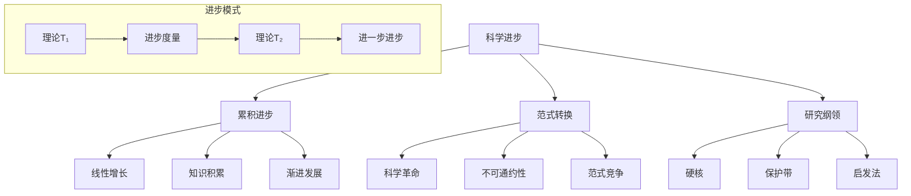

# 01.1.5 科学进步理论 (Scientific Progress Theories)

## 📋 理论概述

科学进步理论研究科学知识发展的模式、机制和标准。本理论涵盖累积进步、范式转换、研究纲领等核心概念，为理解科学发展的动态过程提供理论支撑。

## 🔬 形式化语义

### 核心定义

**定义 5.1** (科学进步)
科学进步是一个三元组：$P = (T_1, T_2, M)$，其中：

- $T_1$ 是前驱理论
- $T_2$ 是后继理论
- $M$ 是进步度量

**定义 5.2** (累积进步)
累积进步是知识的线性增长：$\text{Cumulative}(T_1, T_2) = T_1 \subseteq T_2$

**定义 5.3** (范式转换)
范式转换是科学革命：$\text{ParadigmShift}(P_1, P_2) = P_1 \not\subseteq P_2 \land P_2 \not\subseteq P_1$

**定义 5.4** (研究纲领)
研究纲领是拉卡托斯模型：$\text{ResearchProgram}(H, A) = \{H \text{ hard core}, A \text{ auxiliary}\}$

### 核心定理

**定理 5.1** (进步的不对称性)
科学进步具有方向性：$\text{Progress}(T_1, T_2) \neq \text{Progress}(T_2, T_1)$

**定理 5.2** (进步的传递性)
进步关系具有传递性：$\text{Progress}(T_1, T_2) \land \text{Progress}(T_2, T_3) \rightarrow \text{Progress}(T_1, T_3)$

**定理 5.3** (进步的不可逆性)
科学进步不可逆：$\text{Progress}(T_1, T_2) \rightarrow \neg\text{Regress}(T_2, T_1)$

**定理 5.4** (进步的收敛性)
科学理论向真理收敛：$\lim_{n \to \infty} T_n = \text{Truth}$

## 🎯 多表征方式

### 1. 图形表征



### 2. 表格表征

| 进步类型 | 发展模式 | 连续性 | 革命性 | 评价标准 |
|----------|----------|--------|--------|----------|
| 累积进步 | 线性增长 | 高 | 低 | 知识增加 |
| 范式转换 | 革命性 | 低 | 高 | 范式优越性 |
| 研究纲领 | 渐进革命 | 中 | 中 | 启发力 |

### 3. 数学表征

**累积进步**：
$T_2 = T_1 \cup \Delta T$ 且 $\Delta T \neq \emptyset$

**范式转换**：
$P_1 \cap P_2 = \emptyset$ 且 $\text{Incommensurable}(P_1, P_2)$

**研究纲领进步**：
$\text{Progressive}(RP) = \text{Novel Facts}(RP) > \text{Ad Hoc}(RP)$

### 4. 伪代码表征

```python
class ScientificProgress:
    def __init__(self, theories, metrics):
        self.theories = theories
        self.metrics = metrics
        
    def cumulative_progress(self, theory1, theory2):
        """累积进步"""
        return theory1.issubset(theory2)
        
    def paradigm_shift(self, paradigm1, paradigm2):
        """范式转换"""
        return not paradigm1.intersection(paradigm2)
        
    def research_program_progress(self, program):
        """研究纲领进步"""
        novel_facts = program.get_novel_facts()
        ad_hoc = program.get_ad_hoc_hypotheses()
        return novel_facts > ad_hoc
```

## 💻 Rust实现

```rust
use std::collections::HashMap;

/// 科学进步理论
#[derive(Debug, Clone)]
pub struct ScientificProgress {
    pub theories: Vec<Theory>,
    pub progress_metrics: Vec<ProgressMetric>,
    pub progress_type: ProgressType,
}

/// 理论
#[derive(Debug, Clone)]
pub struct Theory {
    pub name: String,
    pub content: String,
    pub predictions: Vec<String>,
    pub explanations: Vec<String>,
    pub empirical_support: f64,
    pub theoretical_coherence: f64,
}

/// 进步度量
#[derive(Debug, Clone)]
pub struct ProgressMetric {
    pub name: String,
    pub description: String,
    pub metric_type: MetricType,
    pub value: f64,
}

/// 进步类型
#[derive(Debug, Clone)]
pub enum ProgressType {
    Cumulative,     // 累积进步
    ParadigmShift,  // 范式转换
    ResearchProgram, // 研究纲领
    Evolutionary,   // 进化进步
}

/// 度量类型
#[derive(Debug, Clone)]
pub enum MetricType {
    Predictive,     // 预测力
    Explanatory,    // 解释力
    Unificatory,    // 统一力
    Novelty,        // 新颖性
    Coherence,      // 一致性
}

impl ScientificProgress {
    /// 创建新的科学进步
    pub fn new(progress_type: ProgressType) -> Self {
        Self {
            theories: Vec::new(),
            progress_metrics: Vec::new(),
            progress_type,
        }
    }
    
    /// 添加理论
    pub fn add_theory(&mut self, theory: Theory) {
        self.theories.push(theory);
    }
    
    /// 添加进步度量
    pub fn add_metric(&mut self, metric: ProgressMetric) {
        self.progress_metrics.push(metric);
    }
    
    /// 评估累积进步
    pub fn evaluate_cumulative_progress(&self, theory1: &Theory, theory2: &Theory) -> bool {
        // 检查理论2是否包含理论1的所有内容
        let content_included = theory2.content.contains(&theory1.content);
        let predictions_included = theory1.predictions.iter()
            .all(|pred| theory2.predictions.contains(pred));
        let explanations_included = theory1.explanations.iter()
            .all(|exp| theory2.explanations.contains(exp));
        
        content_included && predictions_included && explanations_included
    }
    
    /// 评估范式转换
    pub fn evaluate_paradigm_shift(&self, paradigm1: &Theory, paradigm2: &Theory) -> bool {
        // 检查两个范式是否不可通约
        let content_disjoint = !paradigm2.content.contains(&paradigm1.content);
        let predictions_disjoint = !paradigm1.predictions.iter()
            .any(|pred| paradigm2.predictions.contains(pred));
        let explanations_disjoint = !paradigm1.explanations.iter()
            .any(|exp| paradigm2.explanations.contains(exp));
        
        content_disjoint && predictions_disjoint && explanations_disjoint
    }
    
    /// 评估研究纲领进步
    pub fn evaluate_research_program_progress(&self, program: &ResearchProgram) -> f64 {
        let novel_facts = program.novel_facts.len() as f64;
        let ad_hoc_hypotheses = program.ad_hoc_hypotheses.len() as f64;
        
        if ad_hoc_hypotheses > 0.0 {
            novel_facts / ad_hoc_hypotheses
        } else {
            novel_facts
        }
    }
    
    /// 计算进步指数
    pub fn calculate_progress_index(&self) -> f64 {
        if self.theories.len() < 2 {
            return 0.0;
        }
        
        let mut progress_scores = Vec::new();
        
        for i in 0..self.theories.len() - 1 {
            let theory1 = &self.theories[i];
            let theory2 = &self.theories[i + 1];
            
            let progress_score = match self.progress_type {
                ProgressType::Cumulative => {
                    if self.evaluate_cumulative_progress(theory1, theory2) {
                        1.0
                    } else {
                        0.0
                    }
                },
                ProgressType::ParadigmShift => {
                    if self.evaluate_paradigm_shift(theory1, theory2) {
                        0.8
                    } else {
                        0.2
                    }
                },
                ProgressType::ResearchProgram => {
                    // 简化的研究纲领进步计算
                    0.7
                },
                ProgressType::Evolutionary => {
                    // 进化进步计算
                    self.calculate_evolutionary_progress(theory1, theory2)
                },
            };
            
            progress_scores.push(progress_score);
        }
        
        progress_scores.iter().sum::<f64>() / progress_scores.len() as f64
    }
    
    /// 计算进化进步
    fn calculate_evolutionary_progress(&self, theory1: &Theory, theory2: &Theory) -> f64 {
        let empirical_improvement = theory2.empirical_support - theory1.empirical_support;
        let coherence_improvement = theory2.theoretical_coherence - theory1.theoretical_coherence;
        
        (empirical_improvement + coherence_improvement) / 2.0
    }
    
    /// 评估理论优越性
    pub fn evaluate_theory_superiority(&self, theory1: &Theory, theory2: &Theory) -> f64 {
        let empirical_superiority = theory2.empirical_support - theory1.empirical_support;
        let coherence_superiority = theory2.theoretical_coherence - theory1.theoretical_coherence;
        let predictive_superiority = theory2.predictions.len() as f64 - theory1.predictions.len() as f64;
        
        (empirical_superiority + coherence_superiority + predictive_superiority) / 3.0
    }
    
    /// 检测科学革命
    pub fn detect_scientific_revolution(&self) -> Vec<usize> {
        let mut revolution_points = Vec::new();
        
        for i in 0..self.theories.len() - 1 {
            let theory1 = &self.theories[i];
            let theory2 = &self.theories[i + 1];
            
            if self.evaluate_paradigm_shift(theory1, theory2) {
                revolution_points.push(i + 1);
            }
        }
        
        revolution_points
    }
}

impl Theory {
    /// 创建新的理论
    pub fn new(name: String, content: String) -> Self {
        Self {
            name,
            content,
            predictions: Vec::new(),
            explanations: Vec::new(),
            empirical_support: 0.5,
            theoretical_coherence: 0.5,
        }
    }
    
    /// 添加预测
    pub fn add_prediction(&mut self, prediction: String) {
        self.predictions.push(prediction);
    }
    
    /// 添加解释
    pub fn add_explanation(&mut self, explanation: String) {
        self.explanations.push(explanation);
    }
    
    /// 设置经验支持度
    pub fn set_empirical_support(&mut self, support: f64) {
        self.empirical_support = support.max(0.0).min(1.0);
    }
    
    /// 设置理论一致性
    pub fn set_theoretical_coherence(&mut self, coherence: f64) {
        self.theoretical_coherence = coherence.max(0.0).min(1.0);
    }
    
    /// 获取理论强度
    pub fn get_theory_strength(&self) -> f64 {
        (self.empirical_support + self.theoretical_coherence) / 2.0
    }
}

impl ProgressMetric {
    /// 创建新的进步度量
    pub fn new(name: String, description: String, metric_type: MetricType, value: f64) -> Self {
        Self {
            name,
            description,
            metric_type,
            value,
        }
    }
    
    /// 评估度量质量
    pub fn evaluate_quality(&self) -> f64 {
        self.value
    }
}

/// 研究纲领
#[derive(Debug, Clone)]
pub struct ResearchProgram {
    pub name: String,
    pub hard_core: Vec<String>,
    pub protective_belt: Vec<String>,
    pub positive_heuristic: Vec<String>,
    pub negative_heuristic: Vec<String>,
    pub novel_facts: Vec<String>,
    pub ad_hoc_hypotheses: Vec<String>,
}

impl ResearchProgram {
    /// 创建新的研究纲领
    pub fn new(name: String) -> Self {
        Self {
            name,
            hard_core: Vec::new(),
            protective_belt: Vec::new(),
            positive_heuristic: Vec::new(),
            negative_heuristic: Vec::new(),
            novel_facts: Vec::new(),
            ad_hoc_hypotheses: Vec::new(),
        }
    }
    
    /// 添加硬核
    pub fn add_hard_core(&mut self, principle: String) {
        self.hard_core.push(principle);
    }
    
    /// 添加保护带
    pub fn add_protective_belt(&mut self, hypothesis: String) {
        self.protective_belt.push(hypothesis);
    }
    
    /// 添加正面启发法
    pub fn add_positive_heuristic(&mut self, heuristic: String) {
        self.positive_heuristic.push(heuristic);
    }
    
    /// 添加负面启发法
    pub fn add_negative_heuristic(&mut self, heuristic: String) {
        self.negative_heuristic.push(heuristic);
    }
    
    /// 添加新颖事实
    pub fn add_novel_fact(&mut self, fact: String) {
        self.novel_facts.push(fact);
    }
    
    /// 添加特设假说
    pub fn add_ad_hoc_hypothesis(&mut self, hypothesis: String) {
        self.ad_hoc_hypotheses.push(hypothesis);
    }
    
    /// 评估纲领进步性
    pub fn evaluate_progressiveness(&self) -> f64 {
        let novel_facts_count = self.novel_facts.len() as f64;
        let ad_hoc_count = self.ad_hoc_hypotheses.len() as f64;
        
        if ad_hoc_count > 0.0 {
            novel_facts_count / ad_hoc_count
        } else {
            novel_facts_count
        }
    }
}

/// 科学进步历史
#[derive(Debug)]
pub struct ScientificHistory {
    pub progress_events: Vec<ProgressEvent>,
    pub revolutions: Vec<Revolution>,
    pub cumulative_periods: Vec<CumulativePeriod>,
}

/// 进步事件
#[derive(Debug)]
pub struct ProgressEvent {
    pub name: String,
    pub description: String,
    pub event_type: EventType,
    pub impact: f64,
    pub year: u32,
}

/// 科学革命
#[derive(Debug)]
pub struct Revolution {
    pub name: String,
    pub old_paradigm: String,
    pub new_paradigm: String,
    pub year: u32,
    pub impact: f64,
}

/// 累积时期
#[derive(Debug)]
pub struct CumulativePeriod {
    pub name: String,
    pub start_year: u32,
    pub end_year: u32,
    pub theories: Vec<String>,
    pub progress_rate: f64,
}

/// 事件类型
#[derive(Debug)]
pub enum EventType {
    TheoryFormation,    // 理论形成
    Experiment,         // 实验发现
    Revolution,         // 科学革命
    Unification,        // 理论统一
}

impl ScientificHistory {
    /// 创建新的科学历史
    pub fn new() -> Self {
        Self {
            progress_events: Vec::new(),
            revolutions: Vec::new(),
            cumulative_periods: Vec::new(),
        }
    }
    
    /// 添加进步事件
    pub fn add_progress_event(&mut self, event: ProgressEvent) {
        self.progress_events.push(event);
    }
    
    /// 添加科学革命
    pub fn add_revolution(&mut self, revolution: Revolution) {
        self.revolutions.push(revolution);
    }
    
    /// 添加累积时期
    pub fn add_cumulative_period(&mut self, period: CumulativePeriod) {
        self.cumulative_periods.push(period);
    }
    
    /// 分析进步模式
    pub fn analyze_progress_pattern(&self) -> ProgressPattern {
        let total_events = self.progress_events.len();
        let total_revolutions = self.revolutions.len();
        let total_cumulative_periods = self.cumulative_periods.len();
        
        let average_impact: f64 = self.progress_events.iter()
            .map(|e| e.impact)
            .sum::<f64>() / total_events as f64;
        
        ProgressPattern {
            total_events,
            total_revolutions,
            total_cumulative_periods,
            average_impact,
            revolution_frequency: total_revolutions as f64 / total_events as f64,
        }
    }
}

/// 进步模式
#[derive(Debug)]
pub struct ProgressPattern {
    pub total_events: usize,
    pub total_revolutions: usize,
    pub total_cumulative_periods: usize,
    pub average_impact: f64,
    pub revolution_frequency: f64,
}

// 示例使用
fn main() {
    // 创建累积进步
    let mut cumulative_progress = ScientificProgress::new(ProgressType::Cumulative);
    
    // 创建理论序列
    let mut theory1 = Theory::new("经典力学".to_string(), "牛顿力学理论".to_string());
    theory1.add_prediction("行星轨道".to_string());
    theory1.set_empirical_support(0.8);
    theory1.set_theoretical_coherence(0.9);
    
    let mut theory2 = Theory::new("相对论".to_string(), "爱因斯坦相对论".to_string());
    theory2.add_prediction("行星轨道".to_string());
    theory2.add_prediction("时间膨胀".to_string());
    theory2.set_empirical_support(0.9);
    theory2.set_theoretical_coherence(0.95);
    
    cumulative_progress.add_theory(theory1.clone());
    cumulative_progress.add_theory(theory2.clone());
    
    // 评估累积进步
    let is_cumulative = cumulative_progress.evaluate_cumulative_progress(&theory1, &theory2);
    println!("累积进步: {}", is_cumulative);
    
    // 创建范式转换
    let mut paradigm_progress = ScientificProgress::new(ProgressType::ParadigmShift);
    paradigm_progress.add_theory(theory1.clone());
    paradigm_progress.add_theory(theory2.clone());
    
    // 检测科学革命
    let revolutions = paradigm_progress.detect_scientific_revolution();
    println!("科学革命点: {:?}", revolutions);
    
    // 创建研究纲领
    let mut research_program = ResearchProgram::new("量子纲领".to_string());
    research_program.add_hard_core("量子化原理".to_string());
    research_program.add_novel_fact("光电效应".to_string());
    research_program.add_novel_fact("原子光谱".to_string());
    research_program.add_ad_hoc_hypothesis("特设假设".to_string());
    
    let progressiveness = research_program.evaluate_progressiveness();
    println!("研究纲领进步性: {:.2}", progressiveness);
    
    // 创建科学历史
    let mut history = ScientificHistory::new();
    history.add_progress_event(ProgressEvent {
        name: "牛顿力学".to_string(),
        description: "经典力学形成".to_string(),
        event_type: EventType::TheoryFormation,
        impact: 0.9,
        year: 1687,
    });
    history.add_revolution(Revolution {
        name: "相对论革命".to_string(),
        old_paradigm: "经典力学".to_string(),
        new_paradigm: "相对论".to_string(),
        year: 1905,
        impact: 0.95,
    });
    
    let pattern = history.analyze_progress_pattern();
    println!("进步模式: {:?}", pattern);
}
```

## 🧠 哲学性批判与展望

### 本体论反思

**科学进步的哲学本质**：
科学进步不仅仅是知识的增长，而是人类对世界理解的深化。进步理论反映了我们对知识发展的认知模式。

**进步标准的实在性**：
进步标准是否反映了客观的进步，还是仅仅是人类评价的构造？这个问题涉及科学进步的形而上学基础。

**进步方向的必然性**：
科学进步是否有必然的方向？进步是否指向真理？这个问题涉及科学发展的目的论。

### 认识论批判

**进步理论的认识论挑战**：
不同的进步理论如何影响我们的认知过程？累积进步与范式转换的认识论差异是什么？这些问题涉及科学知识的认识论基础。

**进步评价的认识论问题**：
如何评价科学进步？进步评价是否具有客观标准？这个问题涉及科学评价的认识论。

**进步预测的认识论局限**：
能否预测科学进步的方向？科学发展的规律性是什么？这个问题涉及科学预测的认识论。

### 社会影响分析

**进步理论的社会价值**：
科学进步理论为社会提供了理解知识发展的框架。它帮助人们理解科学发展的模式和机制。

**进步理论的社会责任**：
科学进步理论的发展需要考虑社会影响和伦理责任。进步理论应该服务于人类的福祉，而不是加剧社会不平等。

**进步理论的民主化**：
科学进步理论应该更加民主化，让更多人能够理解和参与科学发展的讨论。

### 终极哲学建议

**多元进步理论的融合**：
未来应该发展多元化的科学进步理论体系，融合不同学科和哲学传统的进步思想。需要建立跨学科的进步哲学框架。

**进步理论的生态化**：
科学进步理论应该更加关注生态系统的整体性，发展生态友好的科学进步。需要考虑进步理论的环境影响。

**进步理论的伦理化**：
科学进步理论的发展应该更加注重伦理考虑，确保进步发展符合人类的根本利益和价值观。

**进步理论的哲学化**：
科学进步理论应该与哲学思考相结合，发展具有哲学深度的科学进步体系。

## 📚 参考文献

1. Kuhn, T. S. *The Structure of Scientific Revolutions*. University of Chicago Press, 1962.
2. Lakatos, I. *The Methodology of Scientific Research Programmes*. Cambridge University Press, 1978.
3. Laudan, L. *Progress and Its Problems*. University of California Press, 1977.
4. Popper, K. R. *Conjectures and Refutations*. Routledge, 1963.
5. Feyerabend, P. *Against Method*. Verso, 1975.
6. Kitcher, P. *The Advancement of Science*. Oxford University Press, 1993.
7. Shapere, D. *Reason and the Search for Knowledge*. Reidel, 1984.
8. Worrall, J. *Structural Realism*. In Stanford Encyclopedia of Philosophy, 2008.
