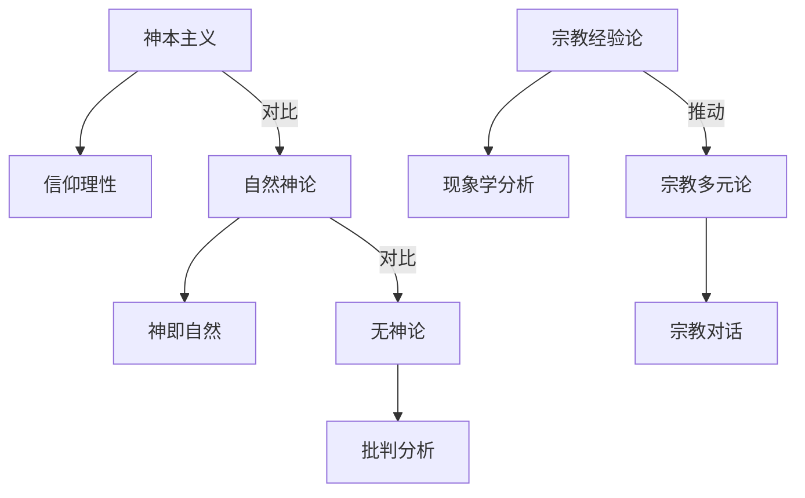

# 07.2.x 宗教哲学流派与理论对比

## 📋 目录

- [1 x5 宗教哲学流派与理论对比及结构图 072x5-宗教哲学流派与理论对比及结构图](#1-x5-宗教哲学流派与理论对比及结构图-072x5-宗教哲学流派与理论对比及结构图)
  - [1.1 主要宗教哲学流派与理论对比表](#11-主要宗教哲学流派与理论对比表)
  - [1.2 Mermaid结构图：宗教哲学流派关系](#12-mermaid结构图宗教哲学流派关系)

---

## 1 x5 宗教哲学流派与理论对比及结构图 072x5-宗教哲学流派与理论对比及结构图

### 1.1 主要宗教哲学流派与理论对比表

| 流派         | 代表人物         | 核心观点         | 方法论特征         | 主要贡献         |
|--------------|------------------|------------------|--------------------|------------------|
| 神本主义     | 奥古斯丁、阿奎那 | 神为终极实在     | 信仰理性结合、神学推理 | 基督教哲学奠基   |
| 自然神论     | 斯宾诺莎、莱布尼茨 | 神即自然、理性神 | 理性分析、泛神论   | 现代自然观       |
| 无神论       | 尼采、罗素       | 神不存在         | 批判分析、存在主义 | 现代世俗哲学     |
| 宗教经验论   | 詹姆斯、奥尔特   | 宗教体验为核心   | 现象学、经验分析   | 宗教心理学发展   |
| 宗教多元论   | 希克、潘尼卡     | 多元宗教平等     | 比较宗教、对话理论 | 宗教宽容理论     |

### 1.2 Mermaid结构图：宗教哲学流派关系

---
> 交叉引用：[07.2.4 现象学哲学分析](./现象学哲学分析.md)｜[07.2.6 规范伦理学分析](./规范伦理学分析.md)｜[07.2.1 信息本体论分析](./信息本体论分析.md)
